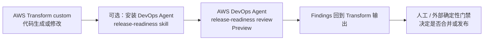
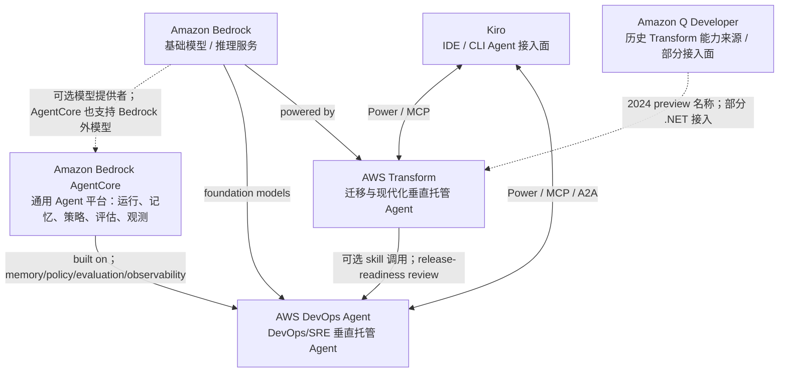

# Amazon Bedrock AgentCore、AWS Transform 与 AWS DevOps Agent：产品层级关系核验

## 提纲

1. 判定口径与产品状态
2. 三个产品的层级和已证实依赖
3. Transform 与 DevOps Agent 的集成方向
4. 与 Bedrock、Amazon Q Developer、Kiro 的关系
5. 可安全绘制与禁止绘制的架构关系
6. 来源登记、事实审计与证据缺口

## 结论先行

1. **AgentCore 是通用 Agent 平台 / 基础设施层，不是某个垂直业务 Agent。**AWS 定义它为可用任意 framework、model 或 protocol 来构建、部署和运行 Agent 的平台；其模块包含 Runtime、Memory、Gateway、Identity、Observability、Evaluations、Policy 等。[AgentCore 概述](https://docs.aws.amazon.com/bedrock-agentcore/latest/devguide/)；[GA 公告](https://aws.amazon.com/about-aws/whats-new/2025/10/amazon-bedrock-agentcore-available/)
2. **DevOps Agent 明确构建于 AgentCore。**AWS 官方博客在 2026-03-31 明言：“DevOps Agent … is built on Amazon Bedrock AgentCore”，并限定它使用 AgentCore 的 memory、policies、evaluations、observability 专用基础设施。这个证据支持画出 `DevOps Agent → AgentCore` 的“构建于 / 使用平台能力”关系；它**不**公开 DevOps Agent 的全部内部组件、Runtime 部署拓扑、具体模型或每个调用链。[AWS 官方博客](https://aws.amazon.com/blogs/devops/leverage-agentic-ai-for-autonomous-incident-response-with-aws-devops-agent/)
3. **Transform 构建于 AgentCore：未证实。**AWS 文档明确说 AWS Transform 由 Amazon Bedrock 驱动；但截至本次核验，在 AWS Transform 产品页、User Guide、FAQ、变更记录和 AWS 官方公告中，未找到 “AWS Transform is built on Amazon Bedrock AgentCore” 或等价的明确架构表述。因此不得画 `Transform → AgentCore` 为产品内部依赖。与 AgentCore 在某篇博客的分类标签同现，也不能替代该证据。[Transform 跨区域处理](https://docs.aws.amazon.com/transform/latest/userguide/cross-region-processing.html)
4. **Transform 与 DevOps Agent 是不同业务域的独立托管 Agent 服务，且存在明确、可选的集成，不是上下游产品。**Transform custom 可安装 DevOps Agent release-readiness skill；Transform 生成或修改代码时，该 skill 调用 DevOps Agent review，结果回到 Transform 输出，Transform 可在最终定稿前处理问题。这是 `Transform custom → DevOps Agent release-readiness review` 的可配置工作流，不证明 Transform 是 DevOps Agent 的子服务、也不证明二者共用全部控制面。[集成文档](https://docs.aws.amazon.com/devopsagent/latest/userguide/release-management-release-readiness-code-review.html)
5. **Bedrock 是两者已证实的模型 / 推理底座；Kiro 与 Amazon Q Developer 是开发者接入面或历史迁移关系，不是三项服务的父子层级。**Transform 明确由 Bedrock 驱动；DevOps Agent 明确使用 Bedrock foundation models。Transform 的前身是 re:Invent 2024 的 Amazon Q Developer transformation capabilities；目前可经 Kiro Power/MCP 接入。DevOps Agent 也可由 Kiro Power 从 IDE 调用。Amazon Q Developer IDE plugins 和付费订阅计划于 2027-04-30 结束支持，但 Amazon Q Developer 本身并未整体停止；不得把此公告外推为 Amazon Q 全面下线。[Transform](https://docs.aws.amazon.com/transform/latest/userguide/cross-region-processing.html)；[DevOps Agent FAQ](https://aws.amazon.com/devops-agent/faqs/)；[Q Developer 公告](https://aws.amazon.com/blogs/devops/amazon-q-developer-end-of-support-announcement/)

## 1. 判定口径与截至日状态

### 1.1 本文如何使用“构建于”

只有 AWS 官方材料出现下列任一类表达，才将产品标为“构建于”另一项服务：

- 直接的 `built on / powered by / runs on` 架构陈述；或
- 产品文档明确将后者列为前者的运行时、控制面或必需服务依赖。

“支持连接”“可作为 remote agent”“可从 IDE 调用”“同一篇文章被打上标签”只证明互操作或共现，**不**证明内部构建依赖。

### 1.2 产品状态

| 产品 / 面 | 截至 2026-08-03 的状态 | 事实依据与边界 |
|---|---|---|
| Amazon Bedrock AgentCore | **GA**，2025-10-13 公告。 | 公告称 AgentCore 已 GA；后续新增能力各自可能有不同状态，不能把所有未来或新增模块一概写成 GA。[GA 公告](https://aws.amazon.com/about-aws/whats-new/2025/10/amazon-bedrock-agentcore-available/) |
| AWS DevOps Agent — production operations | **GA**，2026-03-31。 | AWS 把 production operations 宣布为 GA；产品覆盖生产运维与 release management 两个领域。[GA 公告](https://aws.amazon.com/blogs/mt/announcing-general-availability-of-aws-devops-agent/)；[产品概述](https://docs.aws.amazon.com/devopsagent/latest/userguide/about-aws-devops-agent.html) |
| AWS DevOps Agent — release management | **Preview**；截至访问日官方文档仍标注 preview，且产品文档称其可与 pipeline/version-control 集成。 | 不得用 production-operations 的 GA 宣称 release management 已 GA。[FAQ](https://aws.amazon.com/devops-agent/faqs/) |
| AWS Transform | **服务能力为混合状态：主要 Transform agents / Transform custom 已 GA；continuous modernization 仍为 Public Preview。** | .NET、VMware、mainframe 在 2025-05-15 进入 GA；Transform custom 在 2025-12-01 GA；定价页将 continuous modernization 标为 Public Preview。不得将整个 Transform 所有功能画成同一成熟度。[Transform custom GA](https://aws.amazon.com/about-aws/whats-new/2025/12/transform-custom-organization-wide-modernization/)；[定价页](https://aws.amazon.com/transform/pricing/) |

## 2. 三者的产品层级与已证实关系

### 2.1 层级判定

| 对象 | 官方定位（事实） | 本文的层级结论 | 不应外推 |
|---|---|---|---|
| Amazon Bedrock | AWS 托管的 foundation-model 服务，用于构建和扩展生成式 AI 应用。 | **模型访问 / 推理服务层。** | 不能仅因某产品属于 AWS AI 产品就断定它必须使用 Bedrock。 |
| Amazon Bedrock AgentCore | 构建、部署、运行、连接、治理与观测 Agent 的模块化平台；可配合任意模型，包含 Bedrock 外模型。 | **通用 Agent 平台 / 运行与治理基础设施层。** | “Amazon Bedrock”在名称中不表示它只能运行 Bedrock 模型；官方明确允许 Bedrock 内外模型。 |
| AWS DevOps Agent | 跨 release management 与 production operations 的 always-available AI Agent；围绕 Agent Space、环境拓扑、遥测、代码、部署和运维工具工作。 | **垂直的 DevOps / SRE 托管 Agent 服务层。** | 不是 CI runner、单纯 observability 产品，亦非 AgentCore 的同名功能模块。 |
| AWS Transform | 用专门 Agent、agentic workflow 与持续学习进行迁移、应用现代化和技术债治理的工作台 / 服务。 | **垂直的迁移与现代化托管 Agent 服务层。** | “agentic AI”不等于对 AgentCore 有已证实依赖。 |

### 2.2 DevOps Agent 是否、在什么意义上构建于 AgentCore

**事实（结论为“是”）：**AWS 的 2026-03-31 官方博客写明 DevOps Agent “is built on Amazon Bedrock AgentCore with dedicated infrastructure for memory, policies, evaluations, and observability”。因此可安全理解为：

- DevOps Agent 是面向 SRE / DevOps 场景的 AWS 托管产品；
- 它在 AgentCore 平台能力上获得 memory、policy、evaluation 与 observability 的专用基础设施；
- AgentCore 不是 DevOps Agent 的用户界面，也不等同于 DevOps Agent 的 Agent Space、拓扑或业务集成层。

**补强事实：**DevOps Agent 的官方文档允许把一个实现 A2A 的远端 Agent 注册进 Agent Space；SigV4 配置示例明确把 `bedrock-agentcore` 列为可填写的 AWS service name。这证明 DevOps Agent **还可以**在客户配置下调用部署于 AgentCore 的远端 Agent；它是可选 A2A 互操作，不能代替上述“内建于 AgentCore”的直接证据，也不能反向推导 AgentCore 上的任何 Agent 都属于 DevOps Agent。[远端 A2A Agent 文档](https://docs.aws.amazon.com/devopsagent/latest/userguide/configuring-integrations-and-knowledge-connecting-remote-a2a-agents.html)

**边界：**AWS 未在这些公开资料中给出 DevOps Agent 的完整内部服务拓扑、AgentCore Runtime 是否承载每个内建 Agent、具体模型、prompt/planner，或具体模块调用序列。图中应将此画成“平台能力依赖”，不要画成未经公开的 Runtime 容器部署图。

### 2.3 AWS Transform 是否明确构建于 AgentCore

**事实（结论为“未证实”）：**AWS Transform User Guide 明确写的是 “AWS Transform is powered by Amazon Bedrock”，并说明用 cross-region inference 承载 LLM 推理；它没有在该正式技术说明中表述 AgentCore 依赖。[Transform 跨区域处理](https://docs.aws.amazon.com/transform/latest/userguide/cross-region-processing.html)

**检索结果（事实）：**本次仅在 AWS 官方范围检索了 Transform 产品页、FAQ、User Guide、developer tools、change log、pricing、相关 GA/发布公告及 `Transform + AgentCore` 组合查询。没有找到将 Transform 本身明确描述为“built on AgentCore”的一手陈述或构造性依赖文档。

**结论：**

- 必须写作：`AWS Transform → Amazon Bedrock`（官方明确的 powered-by / inference 关系）。
- 必须写作：`AWS Transform → AgentCore：未证实`。
- 不得以 AWS 博客的产品标签、双方都支持 MCP/A2A、或某个示例工作负载使用 AgentCore，画出 Transform 的内部 AgentCore 依赖。

## 3. Transform 与 DevOps Agent：并列、集成还是上下游

### 3.1 已证实的产品关系

| 判断 | 分类 | AWS 官方证据 | 可用表述 |
|---|---|---|---|
| 二者是不同垂直领域的独立产品 | **事实** | Transform 的目标是迁移 / 现代化；DevOps Agent 的目标是 production operations 与 release management。 | “并列的垂直托管 Agent 服务。” |
| Transform custom 可集成 DevOps Agent 的 release-readiness review | **事实** | 安装 DevOps Agent 的 skill 后，Transform 生成/修改代码时，skill 调用 review；发现回到 Transform 输出，Transform 可处理问题。 | “可选、定向的 Transform custom → DevOps Agent release-review 集成。” |
| 二者有通用的产品级上下游依赖 | **未证实** | 已公开文档只描述上述安装 skill 后的工作流。 | 不得称“Transform 是 DevOps Agent 的上游”或反过来。 |
| 集成自动取得发布批准或自动合并 | **未证实 / 禁止外推** | 文档只称 findings surface，并称 Transform *can* address issues；release management 本身仍 Preview。 | 不得画“review = merge/deploy authorization”。 |

### 3.2 可安全的工作流图

图中箭头表示官方文档给出的**已配置时的调用 / 结果回传**，不是服务所有权、内建 Runtime 依赖或自动授权。来源：[集成文档](https://docs.aws.amazon.com/devopsagent/latest/userguide/release-management-release-readiness-code-review.html)。

## 4. 与 Bedrock、Amazon Q Developer、Kiro 的关系

### 4.1 Bedrock

| 关系 | 结论 | 证据与边界 |
|---|---|---|
| Bedrock → AgentCore | **同一 AWS AI 产品组合中的不同层；AgentCore 可使用 Bedrock 也可使用其外部模型。** | AgentCore 的官方概述明确支持 Bedrock 内外模型。因此可画 Bedrock 为“可选模型提供者 / 已集成模型平台”，不应画它为 AgentCore 唯一模型来源。[AgentCore 概述](https://docs.aws.amazon.com/bedrock-agentcore/latest/devguide/) |
| Bedrock → DevOps Agent | **已证实的推理关系。** | DevOps Agent FAQ 明说使用 Amazon Bedrock foundation models；安全文档还说明其 Bedrock cross-region inference 行为。不得据此补全具体 FM 名称或版本。[FAQ](https://aws.amazon.com/devops-agent/faqs/)；[安全文档](https://docs.aws.amazon.com/devopsagent/latest/userguide/aws-devops-agent-security.html) |
| Bedrock → Transform | **已证实的推理关系。** | Transform 文档明说由 Bedrock 驱动，并借 cross-region inference 提升 LLM 性能和可靠性。不得因此推导其使用 AgentCore。[Transform 跨区域处理](https://docs.aws.amazon.com/transform/latest/userguide/cross-region-processing.html) |

### 4.2 Amazon Q Developer

- **事实：历史产品关系。**AWS Transform 在 re:Invent 2024 预览时名为 Amazon Q Developer transformation capabilities；Transform for .NET、mainframe、VMware 随后以 AWS Transform 名称 GA。[Transform GA 介绍](https://aws.amazon.com/blogs/migration-and-modernization/aws-transform-generally-available/)
- **事实：当前接入面仍有重叠。**Transform 定价页仍说明 .NET modernization agent 也可在 Amazon Q Developer 中使用；这表示一项 Transform capability 可经 Q Developer 提供，不表示 AWS Transform 是 Amazon Q 的子层。[Transform 定价](https://aws.amazon.com/transform/pricing/)
- **事实：EoS 边界。**AWS 公告称 Q Developer IDE plugins 和 paid subscriptions 计划于 2027-04-30 结束支持；Amazon Q Developer in AWS Management Console 及若干 first-party experience 不受该公告影响。不得将它缩写为“Amazon Q 已关闭”。[EoS 公告](https://aws.amazon.com/blogs/devops/amazon-q-developer-end-of-support-announcement/)
- **缺口：**本次没有官方证据证明 AgentCore、Transform 或 DevOps Agent 是“Amazon Q 的下层产品”或“由 Amazon Q 构建”。禁止画此类父子关系。

### 4.3 Kiro

- **Transform ↔ Kiro（事实）：**AWS Transform Kiro Power 在 Kiro IDE 中提供对 Transform agents 的完整访问；Transform 也提供 MCP server。Kiro Power / plugins 是访问面，MCP 则是互操作接口。[Developer tools](https://docs.aws.amazon.com/transform/latest/userguide/developer-tools.html)
- **DevOps Agent ↔ Kiro（事实）：**DevOps Agent 可经 Kiro Power 在 IDE 内调用；release-readiness review findings 可直接出现在 IDE 中，Kiro 可以提出修复建议。[DevOps Agent release review](https://docs.aws.amazon.com/devopsagent/latest/userguide/release-management-release-readiness-code-review.html)
- **Transform → Kiro（事实，特定 mainframe workflow）：**Transform 生成的开发就绪要求 / artifacts 可经 MCP 进入 Kiro 和其他 IDE，用于后续编程；这是 handoff/integration，不是 Kiro 是 Transform 的运行时。[Transform FAQ](https://aws.amazon.com/transform/faq/)
- **缺口：**在本研究范围内，没有 AWS 官方证据可证明 Kiro 本身构建于 AgentCore，或 Transform / DevOps Agent 构建于 Kiro。禁止以“有 Power/MCP 集成”把它们画成内部依赖。

## 5. 架构图准则

### 5.1 可安全画出的关系

该图中的实线是 AWS 已公开说明的关系；虚线是接入面、历史迁移或“可选模型提供者”关系。`Transform → DevOps Agent` 仅限图例标出的可选 review workflow，不表达平台从属。

### 5.2 禁止画出的错误关系

| 禁止画法 | 为什么错误 / 未证实 |
|---|---|
| `AWS Transform → AgentCore`（built on / runs on） | 当前 AWS 官方资料仅明确 Transform 由 Bedrock 驱动；没有 AgentCore 构建证据。 |
| `AgentCore → Transform`（Transform 是 AgentCore 原生模块） | Transform 是独立迁移与现代化服务，不在 AgentCore 核心服务列表中。 |
| `Transform ⇄ DevOps Agent`（无条件双向集成） | 公开文档只证明安装 skill 后的 Transform custom → DevOps Agent review 方向。 |
| `Transform → DevOps Agent → production deploy` | review 结果、Transform 修复与最终 merge/deploy 之间仍需人和外部确定性门禁；不存在公开的自动授权链。 |
| `Amazon Q → AgentCore / DevOps Agent / Transform`（统一父层） | Q Developer 是历史来源或产品接入面之一，没有公开的运行时所有权 / 构建依赖。 |
| `Kiro → Transform / DevOps Agent`（运行时托管） | Kiro Power、MCP、A2A 证明 IDE/agent 调用能力，不证明托管或内部实现。 |
| `Amazon Bedrock → AgentCore`（唯一、强制模型依赖） | AgentCore 官方支持 Bedrock 内外的模型；应画为可选模型服务而非唯一依赖。 |

## 6. 事实审计、推断与证据缺口

| 主张 | 分类 | 审计结论 |
|---|---|---|
| AgentCore 是通用 Agent 平台层 | **事实** | 官方定义、核心服务列表及多框架 / 多模型支持直接证明。 |
| DevOps Agent 构建于 AgentCore | **事实** | AWS 官方博客有直接 `built on AgentCore` 表述，并点名 memory、policies、evaluations、observability。 |
| DevOps Agent 的全部内部执行均运行在 AgentCore Runtime | **证据缺口** | 未找到完整内部实现 / Runtime 拓扑；不得补写。 |
| Transform 构建于 AgentCore | **未证实** | 未找到明确一手表述；不能以产品标签或协议互操作替代。 |
| Transform 与 DevOps Agent 是跨垂直服务的可选集成 | **事实 + 分析归类** | 调用与结果回传是事实；“跨垂直”是根据各自公开产品目标作出的分类，不代表 AWS 给出的正式 taxonomy。 |
| Bedrock 是 DevOps Agent 与 Transform 的模型 / 推理底座 | **事实** | 两者各有直接官方表述。 |
| Kiro / Q Developer 是它们的唯一或底层运行时 | **证据缺口 / 不成立** | 已证实的是 Power、MCP、IDE 或历史接入关系。 |

## 7. 关键来源登记

| 来源 | 类型 | 发布 / 状态日期 | 访问日 | 本研究使用范围 |
|---|---|---|---|---|
| [Amazon Bedrock AgentCore is now generally available](https://aws.amazon.com/about-aws/whats-new/2025/10/amazon-bedrock-agentcore-available/) | AWS What's New | 2025-10-13；GA | 2026-08-03 | AgentCore GA 与平台定位 |
| [Amazon Bedrock AgentCore Developer Guide](https://docs.aws.amazon.com/bedrock-agentcore/latest/devguide/) | AWS User Guide | 页面未给统一发布日期 | 2026-08-03 | 模块化平台、核心服务、任意模型 / framework 边界 |
| [Leverage Agentic AI for Autonomous Incident Response with AWS DevOps Agent](https://aws.amazon.com/blogs/devops/leverage-agentic-ai-for-autonomous-incident-response-with-aws-devops-agent/) | AWS 官方博客 | 2026-03-31 | 2026-08-03 | **DevOps Agent built on AgentCore 的直接证据** |
| [About AWS DevOps Agent](https://docs.aws.amazon.com/devopsagent/latest/userguide/about-aws-devops-agent.html) | AWS User Guide | 页面未给统一发布日期 | 2026-08-03 | DevOps Agent 产品边界 |
| [AWS DevOps Agent FAQ](https://aws.amazon.com/devops-agent/faqs/) | AWS 产品 FAQ | 页面未给统一发布日期；release management 标为 preview | 2026-08-03 | Bedrock FM、Kiro/MCP/A2A 接入、release 状态 |
| [Connecting Remote A2A Agents](https://docs.aws.amazon.com/devopsagent/latest/userguide/configuring-integrations-and-knowledge-connecting-remote-a2a-agents.html) | AWS User Guide | 页面未给统一发布日期 | 2026-08-03 | 可选连接 AgentCore remote agent 的边界 |
| [Release readiness code reviews](https://docs.aws.amazon.com/devopsagent/latest/userguide/release-management-release-readiness-code-review.html) | AWS User Guide | 页面未给统一发布日期 | 2026-08-03 | Transform custom → DevOps Agent review；Kiro Power |
| [Cross-region processing in AWS Transform](https://docs.aws.amazon.com/transform/latest/userguide/cross-region-processing.html) | AWS User Guide | 页面未给统一发布日期 | 2026-08-03 | Transform 由 Bedrock 驱动；AgentCore 依赖未获证实 |
| [AWS Transform Developer tools](https://docs.aws.amazon.com/transform/latest/userguide/developer-tools.html) | AWS User Guide | 页面未给统一发布日期 | 2026-08-03 | Transform Kiro Power / MCP 接入 |
| [AWS Transform custom GA](https://aws.amazon.com/about-aws/whats-new/2025/12/transform-custom-organization-wide-modernization/) | AWS What's New | 2025-12-01；GA | 2026-08-03 | Transform custom 状态 |
| [AWS Transform pricing](https://aws.amazon.com/transform/pricing/) | AWS 产品页 | 当前页；continuous modernization Public Preview | 2026-08-03 | Transform 状态差异、Q Developer .NET 接入 |
| [Amazon Q Developer end-of-support announcement](https://aws.amazon.com/blogs/devops/amazon-q-developer-end-of-support-announcement/) | AWS 官方博客 | 2026-04-30；EoS 2027-04-30 | 2026-08-03 | Q Developer 生命周期边界与 Transform 建议路径 |

## 8. 核验结语

截至 2026-08-03，最稳妥的产品图是：**Bedrock 提供模型推理，AgentCore 提供通用 Agent 平台能力，DevOps Agent 是已明确构建于 AgentCore 的 SRE / DevOps 垂直服务，Transform 是已明确由 Bedrock 驱动但尚未获证实构建于 AgentCore 的迁移 / 现代化垂直服务。**Transform custom 与 DevOps Agent 存在一条可选、定向的 release-review 集成；Kiro 与 Amazon Q Developer主要是接入面或历史演化关系，而非应被画成共同的运行时父层。
