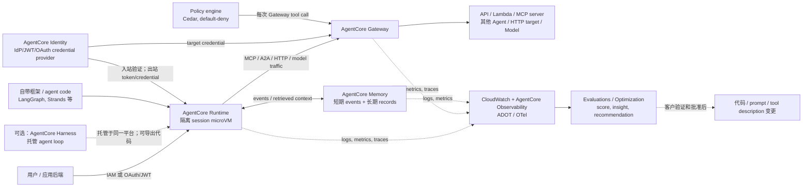

# Amazon Bedrock AgentCore：产品边界、架构与运行约束

## 提纲

1. 结论与状态口径
2. 发布时间线与当前服务组成
3. 各模块职责、边界及可组合关系
4. 运行时与控制面架构
5. 身份、网关、记忆、观测、评估的交互
6. 框架、模型、协议与网络边界
7. 区域及代表性配额/限制
8. 证据缺口与可安全复用的表述

## 结论先行

1. **AgentCore 是面向任意框架和任意模型的模块化 Agent 平台，不是 Amazon Bedrock Agents 的改名，也不要求使用 Bedrock 模型。**AWS 明确把它定义为用于构建、部署和运营 Agent 的平台；其 Runtime 可与 CrewAI、LangGraph、LlamaIndex、Google ADK、OpenAI Agents SDK、Strands 等框架，以及 Bedrock 内外模型和 MCP/A2A 协议配合。[AgentCore 概述（当前文档；访问于 2026-08-03）](https://docs.aws.amazon.com/bedrock-agentcore/latest/devguide/)
2. **产品级 GA 与能力级状态必须分开写。**平台在 2025-10-13 GA；Policy、Evaluations 先于 2025-12-02 Preview、后分别于 2026-03-03 和 2026-03-31 GA；Harness 在 2026-06-17 GA。但 Payments、Agent Registry 和 Optimization Insights 等截至本报告日仍含 Preview 子能力。因此“AgentCore 已 GA”不能推出“每一模块、每一地区、每一子能力已 GA”。[GA 公告（2025-10-13；访问于 2026-08-03）](https://aws.amazon.com/about-aws/whats-new/2025/10/amazon-bedrock-agentcore-available/)；[Policy GA（2026-03-03；访问于 2026-08-03）](https://aws.amazon.com/about-aws/whats-new/2026/03/policy-amazon-bedrock-agentcore-generally-available/)；[Evaluations GA（2026-03-31；访问于 2026-08-03）](https://aws.amazon.com/about-aws/whats-new/2026/03/agentcore-evaluations-generally-available/)
3. **运行架构的核心分层是“编排 / 执行隔离 / 持久状态 / 受治理工具访问 / 可观测与质量闭环”，而不是一个单体 Agent server。**开发者可以自带编排框架并部署到 Runtime，也可以用 Harness 托管 Agent loop；Gateway 是工具、其他 Agent 与模型流量的受控入口，Policy 只在 Gateway 边界上作确定性授权，Identity 管理来回身份和委托凭证，Memory 负责跨运行会话的状态，Observability/Evaluations 则消费遥测并形成质量信号。[Runtime 工作原理（当前文档；访问于 2026-08-03）](https://docs.aws.amazon.com/bedrock-agentcore/latest/devguide/runtime-how-it-works.html)；[Gateway（当前文档；访问于 2026-08-03）](https://docs.aws.amazon.com/bedrock-agentcore/latest/devguide/gateway.html)；[Policy（当前文档；访问于 2026-08-03）](https://docs.aws.amazon.com/bedrock-agentcore/latest/devguide/policy.html)
4. **Policy 不等于全平台代理，也不等于模型安全或发布审批。**它拦截经 AgentCore Gateway 的工具请求，并以 Cedar policy engine 决定 allow/deny；未经过 Gateway 的调用不在此执行路径中。它可以约束工具和参数，不能替代 IAM、IdP、Guardrails、测试、签名、人工审批或业务侧确定性门禁。[Policy 核心概念（当前文档；访问于 2026-08-03）](https://docs.aws.amazon.com/bedrock-agentcore/latest/devguide/policy-core-concepts.html)
5. **Runtime session 与 Memory 是两种不同持久性。**Runtime 以每用户会话独立 microVM 隔离，默认 session compute 的内存/文件系统是临时的；session 停止后要跨会话保存结构化上下文，应显式使用 Memory（或配置 Runtime session storage 保存文件）。AWS 也明确不替客户维护 user-to-session 映射。[Runtime sessions（当前文档；访问于 2026-08-03）](https://docs.aws.amazon.com/bedrock-agentcore/latest/devguide/runtime-sessions.html)

## 1. 产品状态和发布时间线

### 1.1 状态口径

下表中 **GA / Preview 仅指 AWS 在所引公告中明确宣布的范围**；当前文档未显式给出某独立模块状态时，不能用“在开发者指南中出现”推断为 GA。

| 日期 | 事件 | 当时 / 当前可安全表述 | 一手来源（发布日期；访问日） |
|---|---|---|---|
| 2025-07-16 | AgentCore 首次 Public Preview。 | 初始公开面为 Runtime、Memory、Gateway、Browser Tool、Code Interpreter、Observability、Identity；仅 `us-east-1`、`us-west-2`、`ap-southeast-2`、`eu-central-1`。 | [Preview 公告](https://aws.amazon.com/about-aws/whats-new/2025/07/amazon-bedrock-agentcore-preview/)（2025-07-16；2026-08-03） |
| 2025-10-13 | AgentCore 平台 GA。 | Runtime、Memory、Gateway、Identity、Observability 等既有 AgentCore services 进入平台 GA；公告同时说明服务支持 VPC、PrivateLink、CloudFormation 与 tagging。该公告给出九个区域，不能替代后续的 feature-by-region 矩阵。 | [GA 公告](https://aws.amazon.com/about-aws/whats-new/2025/10/amazon-bedrock-agentcore-available/)（2025-10-13；2026-08-03） |
| 2025-12-02 | Policy、Evaluations 作为新 offering 以 Preview 推出。 | Policy 是 Gateway 工具调用的 Cedar 授权层；Evaluations 是基于 trace 的 agent/tool 质量评估。 | [Policy/Evaluations Preview](https://aws.amazon.com/about-aws/whats-new/2025/12/amazon-bedrock-agentcore-policy-evaluations-preview/)（2025-12-02；2026-08-03） |
| 2026-03-03 / 2026-03-31 | Policy、Evaluations 分别 GA。 | Policy 在 13 区域 GA；Evaluations 在 9 区域 GA。后续区域扩展以当前 feature-by-region 矩阵为准。 | [Policy GA](https://aws.amazon.com/about-aws/whats-new/2026/03/policy-amazon-bedrock-agentcore-generally-available/)（2026-03-03；2026-08-03）；[Evaluations GA](https://aws.amazon.com/about-aws/whats-new/2026/03/agentcore-evaluations-generally-available/)（2026-03-31；2026-08-03） |
| 2026-04-09 | AWS Agent Registry Preview。 | 组织内 agent、tool、skill、MCP server 和自定义资源的私有目录/发现与审批层；不是 Runtime 或 Gateway 的必经路径。 | [Agent Registry Preview](https://aws.amazon.com/about-aws/whats-new/2026/04/aws-agent-registry-in-agentcore-preview/)（2026-04-09；2026-08-03） |
| 2026-04-22 | Managed Harness Preview。 | 以 model、system prompt、tools 定义 Agent；托管 reasoning/tool loop 和每 session microVM。 | [Harness Preview](https://aws.amazon.com/about-aws/whats-new/2026/04/agentcore-new-features-to-build-agents-faster/)（2026-04-22；2026-08-03） |
| 2026-04-30 / 2026-06-17 | Optimization Preview，后续一部分优化能力 GA。 | 2026-06-17 时 batch evaluations、recommendations、A/B tests 为 GA；failure/intent/trajectory insights 仍为 Preview。每项 recommendation 必须经客户批准才可推广。 | [Optimization Preview](https://aws.amazon.com/about-aws/whats-new/2026/05/bedrock-agentcore-optimization-preview/)（2026-04-30；2026-08-03）；[Optimization 更新](https://aws.amazon.com/about-aws/whats-new/2026/06/amazon-bedrock-agentcore-new-optimization-capabilities/)（2026-06-17；2026-08-03） |
| 2026-05-07 | Payments Preview。 | 为 x402 HTTP 402 付费资源处理钱包认证、支付与 spending limits；该 Preview 不可外推为一般工具调用、费用治理或自动采购能力。 | [Payments Preview](https://aws.amazon.com/about-aws/whats-new/2026/04/amazon-bedrock-agentcore-payments-preview/)（2026-05-07；2026-08-03） |
| 2026-06-17 | Managed Harness GA；Web Search GA。 | Harness 在所有 AgentCore commercial regions GA；Web Search 当日仅 `us-east-1` GA，且实现为 Gateway 的 built-in connector target。 | [Harness GA](https://aws.amazon.com/about-aws/whats-new/2026/06/amazon-bedrock-agentcore-harness-generally-available/)（2026-06-17；2026-08-03）；[Web Search GA](https://aws.amazon.com/blogs/aws/announcing-web-search-on-amazon-bedrock-agentcore-ground-your-ai-agents-in-current-accurate-web-knowledge/)（2026-06-17，2026-06-18 修订；2026-08-03） |
| 2026-07-01 | 新增四区域。 | `ap-southeast-1`、`ap-southeast-5`、`eu-south-1`、`eu-south-2` 扩展；最终仍应按组件查区域矩阵。 | [四区域公告](https://aws.amazon.com/about-aws/whats-new/2026/06/amazon-bedrock-agentcore-four-additional-regions/)（2026-07-01；2026-08-03） |

### 1.2 “八个服务”应如何修正

“八个服务”是一个容易随发布时间过期的说法。2025-07 Preview 公告列出 **7 项**（Runtime、Memory、Gateway、Browser、Code Interpreter、Observability、Identity）；2025-12 又加入 Policy、Evaluations。到 2026-08-03，当前开发者指南还列入 Harness、Payments，配额页列出 Optimization、AWS Agent Registry 等资源类别。因此本研究不使用固定数字，而是按下面的 **当前可见能力域** 描述。[Preview 公告](https://aws.amazon.com/about-aws/whats-new/2025/07/amazon-bedrock-agentcore-preview/)；[当前概述](https://docs.aws.amazon.com/bedrock-agentcore/latest/devguide/)；[配额页](https://docs.aws.amazon.com/bedrock-agentcore/latest/devguide/bedrock-agentcore-limits.html)（均访问于 2026-08-03）

## 2. 当前能力域、职责与边界

| 能力域 / 当前组件 | 主要职责 | 关键边界与不应外推 | 截至日状态证据 |
|---|---|---|---|
| **Harness** | 以单一 API 和声明式 model/prompt/tools 定义并运行托管 Agent loop，处理编排、工具执行、memory 与 response generation；session 在隔离 microVM 中运行，可导出 Strands-based code。 | 它是可选的托管编排面；使用自带 LangGraph/Strands 等编排并部署到 Runtime 时，并不需要 Harness。 | 2026-06-17 **GA**。[Harness GA](https://aws.amazon.com/about-aws/whats-new/2026/06/amazon-bedrock-agentcore-harness-generally-available/) |
| **Runtime** | 托管 agent 或 tool code 的 serverless execution environment，负责扩缩容、session 生命周期、身份认证入口和 session 隔离；承载同步、streaming、异步/长任务。 | Runtime 不是 planner、memory 或 policy engine；session 也不是永久用户身份绑定。客户端须维护 user/session 映射。 | 平台 2025-10-13 **GA**；当前文档定义运行模型。[GA 公告](https://aws.amazon.com/about-aws/whats-new/2025/10/amazon-bedrock-agentcore-available/)；[Runtime 工作原理](https://docs.aws.amazon.com/bedrock-agentcore/latest/devguide/runtime-how-it-works.html) |
| **Memory** | 托管短期 event history 及跨 session 的长时记忆；memory strategy 从 events 提炼 facts/preferences/summaries。 | 不是 Runtime filesystem，也不是任意数据库/RAG 的替代物；长期提炼需要 strategy，短期 raw event retention 要显式设置。 | 平台 GA；当前 Memory 文档说明双层 memory 语义。[Memory](https://docs.aws.amazon.com/bedrock-agentcore/latest/devguide/memory.html) |
| **Gateway** | 单一受控入口：把 OpenAPI、Smithy、Lambda 转为 MCP tools；连接既有 MCP；还可 passthrough 到 HTTP service/agents（包括 A2A）及作 model routing。管理 ingress 与 egress authentication。 | Gateway 并不自动包住 agent 的所有直连 HTTP/tool 调用；要获得它的授权、审计与 interceptor 边界，调用必须被设计为经 Gateway。 | 平台 GA；当前 Gateway 文档说明 tool/agent/model 三类 traffic。[Gateway](https://docs.aws.amazon.com/bedrock-agentcore/latest/devguide/gateway.html) |
| **Identity** | Agent workload identity、inbound JWT 验证、OAuth credential provider 与 token/credential 管理，使 agent/tool 能代表用户或自身访问 AWS/第三方服务。 | 不是企业 IdP 的替换，也不是全部 authorization 的唯一来源；Runtime/Gateway 仍要配置 IAM、resource policies 和 target-side permissions。 | 平台 GA；当前文档说明 Runtime/Gateway 集成。[Identity](https://docs.aws.amazon.com/bedrock-agentcore/latest/devguide/identity.html) |
| **Policy** | policy engine 存储并评估 Cedar；关联 Gateway 后，对每次 Gateway tool invocation 按 principal、tool、input context 作 allow/deny。默认拒绝，forbid 优先。 | 只覆盖经关联 Gateway 的 tool traffic；不是模型输出过滤、IdP、IAM、审批流或业务正确性证明。 | 2026-03-03 **GA**。[Policy GA](https://aws.amazon.com/about-aws/whats-new/2026/03/policy-amazon-bedrock-agentcore-generally-available/)；[核心概念](https://docs.aws.amazon.com/bedrock-agentcore/latest/devguide/policy-core-concepts.html) |
| **Built-in Tools：Browser、Code Interpreter、Web Search** | Browser 提供托管 browser session；Code Interpreter 在隔离 container 中执行代码；Web Search 是 Gateway built-in connector，返回检索片段、URL、标题和发布日期。 | 工具调用不因“内建”而自动获得业务授权；VPC/网络模式、execution role、目标服务权限仍决定实际可访问性。Web Search 仅 `us-east-1` 的 GA 证据。 | Browser/Code Interpreter 属 2025 Preview/GA 平台工具；Web Search 2026-06-17 **GA（us-east-1）**。[Code Interpreter](https://docs.aws.amazon.com/bedrock-agentcore/latest/devguide/code-interpreter-tool.html)；[Web Search GA](https://aws.amazon.com/blogs/aws/announcing-web-search-on-amazon-bedrock-agentcore-ground-your-ai-agents-in-current-accurate-web-knowledge/) |
| **Observability** | 将 Runtime、Memory、Gateway、built-in tools、Identity 等服务日志/指标与 Agent trace 接入 CloudWatch；自定义 metrics/完整 trace 需 ADOT/OpenTelemetry instrumentation。 | “开启 service logs”不等于捕获所有业务 span；Memory/Gateway/built-in tools 的 log destination 不会自动配置。 | 平台 GA；当前配置说明明确区分自动和客户配置的 log destination。[Observability 配置](https://docs.aws.amazon.com/bedrock-agentcore/latest/devguide/observability-configure.html) |
| **Evaluations / Optimization** | Evaluations 把 OTel/OpenInference instrumented agent traces 转统一格式，并以 LLM-as-a-judge 的 built-in/custom evaluators 打分；Optimization 用 traces/evaluation outputs 产生 insights、recommendations、batch eval 和 A/B test。 | Evaluation score 是质量信号，非生产变更批准；recommendation 要客户批准，且部分 insights 仍 Preview。Evaluations 可评估外部 runtime，并不要求 Agent 跑在 Runtime。 | Evaluations 2026-03-31 **GA**；2026-06 的 batch eval/recommendations/A/B tests **GA**，insights **Preview**。[Evaluations GA](https://aws.amazon.com/about-aws/whats-new/2026/03/agentcore-evaluations-generally-available/)；[Optimization 更新](https://aws.amazon.com/about-aws/whats-new/2026/06/amazon-bedrock-agentcore-new-optimization-capabilities/) |
| **Payments / Agent Registry** | Payments 为 x402 自动支付提供 wallet、spending limit、审计；Registry 为 agent/tool/skill/MCP endpoint 提供目录、发现与审批。 | Payments 不授权任意财务动作；Registry 不托管 agent execution 或强制所有调用经它。 | Payments **Preview**（2026-05-07）；Registry **Preview**（2026-04-09）。[Payments](https://aws.amazon.com/about-aws/whats-new/2026/04/amazon-bedrock-agentcore-payments-preview/)；[Registry](https://aws.amazon.com/about-aws/whats-new/2026/04/aws-agent-registry-in-agentcore-preview/) |

## 3. 可证实的运行架构

下面是对 AWS 分散文档的**架构归纳**，箭头只表达可配置的数据/控制路径，非每一 Agent 的强制拓扑。

### 3.1 编排与执行：Harness 和 Runtime 不应混为一层

* **自带编排路线：**应用使用任意兼容框架写 agent/tool 代码，Runtime 把该 containerized application 作为托管执行单元。每个 user session 使用独立 microVM；停止后 microVM 终止并清理内存。运行时默认 15 分钟 idle timeout、最高 8 小时生命周期；同一 `runtimeSessionId` 在停止后会获取新 compute，而非恢复内存状态。[Runtime 工作原理](https://docs.aws.amazon.com/bedrock-agentcore/latest/devguide/runtime-how-it-works.html)；[Runtime sessions](https://docs.aws.amazon.com/bedrock-agentcore/latest/devguide/runtime-sessions.html)
* **Harness 路线：**开发者把 model、instructions、tools、skills 作为配置交给 Harness；Harness 执行 reasoning/tool/action/response loop，且可以在需要细粒度控制时导出 Strands-based code。AWS 描述 Harness 会通过相同 Gateway 获得工具，并使用同平台的 identity、memory、observability；这说明它是组合这些服务的受管体验，不证明所有 Runtime agent 都使用 Harness。[Harness GA](https://aws.amazon.com/about-aws/whats-new/2026/06/amazon-bedrock-agentcore-harness-generally-available/)

### 3.2 会话状态、文件持久性与长期记忆

| 状态类别 | 所在位置 / 存续 | 设计含义 |
|---|---|---|
| Agent process、RAM、临时文件、对话中的工作上下文 | Runtime session 的 microVM；默认随 session compute 停止而消失。 | 不可把它当 durable memory；跨用户隔离的前提是调用方不复用 session ID。 |
| 文件系统 session storage（可选） | 可配置为 session stop/resume 后仍保留指定 mount path。 | 只解决文件状态；不自动提炼用户偏好或提供 semantic retrieval。 |
| Memory raw events（短期） | Memory resource；retention 由每个 event 写入时的 expiry 设置，最多 365 天。 | 保存可回放的会话事件；修改 expiry 不会追溯延长已写入 event。 |
| Memory records（长期） | Memory strategy 从 events 生成的 facts/preferences/summaries，可跨 sessions / agents 使用。 | 必须针对 privacy、保留期、actor/session namespace 和 strategy 做产品设计，不能把“模型看过”误称成已持久化记忆。 |

以上时间与持久性边界均由 AWS 文档明确说明。[Runtime sessions](https://docs.aws.amazon.com/bedrock-agentcore/latest/devguide/runtime-sessions.html)；[创建 Memory](https://docs.aws.amazon.com/bedrock-agentcore/latest/devguide/memory-create-a-memory-store.html)（均访问于 2026-08-03）

### 3.3 工具调用的身份、网关与策略路径

1. **入站：**Runtime 可以用 IAM 或 OAuth 2.0 保护调用，Identity 可验证来自 IdP 的 bearer JWT；这是“谁能调用 agent”的入口问题。[Runtime 工作原理](https://docs.aws.amazon.com/bedrock-agentcore/latest/devguide/runtime-how-it-works.html)；[Identity](https://docs.aws.amazon.com/bedrock-agentcore/latest/devguide/identity.html)
2. **获得目标凭证：**Identity 将 agent/workload identity 与 credential provider 连接，以便 Agent/Tool 代表用户或自身访问第三方目标；这解决 OAuth token/credential 的受控使用，不能越过目标服务本身的 authorization。[Identity](https://docs.aws.amazon.com/bedrock-agentcore/latest/devguide/identity.html)
3. **工具接入：**Gateway 把 OpenAPI、Smithy、Lambda 转成 MCP tools，或连接 MCP/HTTP/A2A target；它能统一 ingress authentication 和 egress authentication。故在平台设计上，工具访问应有意收敛到 Gateway，而非让每个 agent 直连并自行保管 secret。[Gateway](https://docs.aws.amazon.com/bedrock-agentcore/latest/devguide/gateway.html)
4. **确定性工具授权：**关联 policy engine 后，Gateway 对每个 tool invocation 用 Cedar schema / policy 执行 default-deny、forbid-wins 的 allow/deny。schema 从 Gateway tool definitions 自动生成，policy 可以引用 user identity 和 tool input parameters。[Policy 核心概念](https://docs.aws.amazon.com/bedrock-agentcore/latest/devguide/policy-core-concepts.html)
5. **仍存的外部边界：**Gateway execution role 还要拥有 target invocation、secret access、CloudWatch/X-Ray 等 IAM permission；resource policy、identity-based IAM policy 与目标系统自身权限仍共同决定成功与否。[Gateway + Policy IAM 权限](https://docs.aws.amazon.com/bedrock-agentcore/latest/devguide/policy-permissions.html)；[AgentCore resource-based policies](https://docs.aws.amazon.com/bedrock-agentcore/latest/devguide/resource-based-policies.html)

**对 CI/CD / production action 的边界：**即使请求经 Identity、Gateway、Cedar Policy 成功放行，它也只说明符合配置的访问规则，不说明变更正确、测试通过、SLO 满足、制品可信或发布获批。上述事实支持把 AgentCore 设计为受控编排和证据采集层；最终 delivery gate 仍需外部确定性 oracle 与授权流程。

### 3.4 观测—评估—优化闭环

* Runtime 创建时默认会创建 CloudWatch log group；但 Memory、Gateway 和 built-in tools 需要客户配置 CloudWatch Logs、S3 或 Firehose log destination。要在 CloudWatch 看完整 observability data 或输出 custom runtime metrics，客户需以 ADOT SDK instrument 代码。[Observability 配置](https://docs.aws.amazon.com/bedrock-agentcore/latest/devguide/observability-configure.html)
* Evaluations 接收由 Strands/LangGraph + OpenTelemetry/OpenInference instrumentation 产生的 sessions/traces/spans，转成统一格式，以 LLM-as-a-Judge 运行 built-in 或 custom evaluator；其输出整合到 AgentCore Observability / CloudWatch。它评测的是观测到的行为，**不是** Runtime 的执行调度器，也不自动阻断一次 invocation。[Evaluations](https://docs.aws.amazon.com/bedrock-agentcore/latest/devguide/evaluations.html)；[AgentCore 概述](https://docs.aws.amazon.com/bedrock-agentcore/latest/devguide/)
* Optimization 的 recommendations 分析 production traces 与 evaluation outputs，给出 system prompt/tool description 的建议；batch eval 与 A/B test 是验证手段，AWS 明确要求客户批准 recommendation 后才推广。这是“观察—度量—提出候选—验证—人工批准”的闭环，不是自动 self-modifying agent。[Optimization 更新](https://aws.amazon.com/about-aws/whats-new/2026/06/amazon-bedrock-agentcore-new-optimization-capabilities/)

## 4. 框架、模型、协议及网络边界

### 4.1 明确支持的兼容面

| 类别 | AWS 直接列出的例子 | 可安全结论 |
|---|---|---|
| Agent framework | CrewAI、LangGraph、LlamaIndex、Google ADK、OpenAI Agents SDK、Strands Agents；Memory 还直接列 LangChain。 | AgentCore 不是单一 framework SDK；“支持”表示可集成/部署，不保证每个 framework feature 均由 AWS 托管。 |
| 模型 | Bedrock 内外模型；当前概述例举 OpenAI、Google Gemini、Anthropic Claude、Amazon Nova、Meta Llama、Mistral。 | AgentCore 名称中含 Bedrock，但其 Runtime/Harness 的定位并非只可调用 Bedrock model。目标模型的区域、商业条款、上下文与安全特性仍各自适用。 |
| Agent/tool 协议 | MCP、A2A；Gateway 可将 API/Lambda 转为 MCP，或 front HTTP/agent passthrough target；Browser 使用 Chrome DevTools Protocol 的 WebSocket。 | MCP/A2A 是互操作协议，不自动定义 cross-agent trust、业务授权或部署拓扑。 |
| Telemetry | OpenTelemetry、OpenInference；ADOT。 | Agent trace 能被 Evaluations/Observability 使用的前提是对应 instrumentation 与 log/trace 配置。 |

来源：[AgentCore 概述](https://docs.aws.amazon.com/bedrock-agentcore/latest/devguide/)；[Gateway](https://docs.aws.amazon.com/bedrock-agentcore/latest/devguide/gateway.html)；[Payments Browser 集成](https://docs.aws.amazon.com/bedrock-agentcore/latest/devguide/payments-browser.html)（均访问于 2026-08-03）。

### 4.2 私网与网络边界

AgentCore Runtime、Code Interpreter、Browser 可配置访问客户 VPC；Runtime/Gateway API 也可通过 VPC endpoint/PrivateLink 由客户 VPC 私下调用。AWS 会在客户账户创建带私有 IP 的 ENI；把它放在 public subnet 不等于能访问互联网，Browser 等需要 internet access 的工具在 VPC 模式需 private subnet 通过 NAT Gateway 出网。[VPC 配置](https://docs.aws.amazon.com/bedrock-agentcore/latest/devguide/agentcore-vpc.html)（当前文档；访问于 2026-08-03）

这意味着“AgentCore 是托管服务”也不等于“所有工具默认拥有网络到达性”；网络、security group、VPC endpoint、NAT 与 execution role 是 agent tool 能否实际调用目标的独立控制面。

## 5. 区域与代表性配额 / 限制

### 5.1 区域：必须按 capability 查询

截至 2026-08-03，AWS 的当前矩阵列出 20 个 Region 列：`us-east-1`、`us-east-2`、`us-west-2`、`eu-central-1`、`eu-west-1`、`eu-west-2`、`eu-south-1`、`eu-west-3`、`eu-south-2`、`eu-north-1`、`ap-southeast-5`、`ap-south-1`、`ap-southeast-1`、`ap-southeast-2`、`ap-southeast-7`、`ap-northeast-1`、`ap-northeast-2`、`ca-central-1`、`sa-east-1` 和 `us-gov-west-1`。Runtime、Gateway、Identity、Built-in Tools、Observability、Policy 在该当前表中均有覆盖；Harness、Memory、Evaluations 与 Optimization 的覆盖较少，Agent Registry 更少；Payments Preview 仅列 `us-east-1`、`us-west-2`、`eu-central-1`、`ap-southeast-2`。因此任何实施结论都必须使用目标功能所在行，而不能说“AgentCore 在某区可用”就假定所有模块可用。[Supported Regions（当前矩阵；访问于 2026-08-03）](https://docs.aws.amazon.com/bedrock-agentcore/latest/devguide/agentcore-regions.html)；[Payments Preview](https://aws.amazon.com/about-aws/whats-new/2026/04/amazon-bedrock-agentcore-payments-preview/)

### 5.2 代表性硬限制（region/account 维度，使用前仍需在 Service Quotas 核验）

| 面 | 默认值 / 硬限制 | 设计影响 |
|---|---:|---|
| Runtime 活跃 session workloads | `us-east-1`/`us-west-2` 每账户 5,000；其他 Region 2,500；可申请提高。 | 并发设计必须以 account + region 规划，不能只看 container 横向扩展。 |
| Runtime artifacts/compute | 每账户 1,000 agents、每 agent 1,000 versions、10 aliases（均可调）；Docker image 最大 2 GB、direct code ZIP 250 MB（解压 750 MB）、每 session 最多 2 vCPU / 8 GB（均不可调）。 | 大依赖/模型不适合塞入 Runtime image；高 CPU/内存工作应拆到外部受控计算。 |
| Runtime invocation | sync request 15 min；streaming 最长 60 min；async job 最长 8 h；payload 最大 100 MB；WebSocket frame 64 KB。 | “8 小时 Runtime”不等于一个同步 HTTP 调用可运行 8 小时；调用协议和任务编排必须匹配。 |
| Runtime throttling | `InvokeAgentRuntime` 等每 agent、每账户 200 TPS（可调）。 | 流量控制/tenant multiplexing 需要考虑 per-agent throttle。 |
| Memory | 每 Region/account 最多 150 memory resources（可调）、每 resource 最多 6 strategies（不可调）、最多 900 strategies/account（可调）；Create/Get/Delete/List API 分别 3/5/3/5 RPS（可调）。 | Memory 不应当作高频 message broker；大规模 write/read 要用缓存、批处理或配额申请规划。 |
| Evaluations | 默认每 Region/account 最多 1,000 evaluation configurations、其中 100 active；large region 每账户最多 1M input+output tokens/min。 | 质量评估要与模型 token quota、telemetry sampling 和成本一起规划。 |

上表数据来自 AWS 当前配额页；配额除特别标记外按 Region，AWS 指明某些可申请提高且值会变动。[AgentCore Service Quotas（当前文档；访问于 2026-08-03）](https://docs.aws.amazon.com/bedrock-agentcore/latest/devguide/bedrock-agentcore-limits.html)；[Evaluations](https://docs.aws.amazon.com/bedrock-agentcore/latest/devguide/evaluations.html)

## 6. 事实审计、证据缺口与可安全表述

| 问题 | 可得结论 | 分类 / 写作边界 |
|---|---|---|
| AgentCore 是否只能跑 Bedrock 模型？ | 否；AWS 明确列 Bedrock 内外模型和多个第三方/开源 framework。 | **事实**；不替各模型厂商承诺可用区域或 SLA。 |
| Runtime 是否自动将每个 user 映射为安全 session？ | 否；microVM 隔离是事实，但 user/session 映射与 per-user session 生命周期由客户后端维护。 | **事实**；把随机/共享 session ID 当 user identity 是错误设计。 |
| Gateway + Policy 是否已覆盖所有 agent action？ | 只覆盖经关联 Gateway 的 tool invocation；Policy 不能覆盖 direct calls 或证明业务正确性。 | **事实**；不得写成“AgentCore 阻止所有越权行为”。 |
| Identity 是否是企业 IdP / IAM 的替代？ | 否；它复用 IdP、JWT、OAuth credential providers，与 IAM/resource/target policy 共存。 | **事实**；不得写成单一 SSO / authorization source。 |
| Evaluation / Optimization 是否能自动修改上线 agent？ | AWS 说 recommendation 必须客户批准，batch eval/A-B test 用于验证。 | **事实**；不得称 self-improving 为自动生产变更。 |
| Policy、Evaluations 的最终状态？ | Policy 于 2026-03-03、Evaluations 于 2026-03-31 均有独立 GA 公告；但具体功能（例如 Evaluation Insights）和区域仍有不同状态。 | **事实**；正式页面仍须将平台、子能力和 Region 三层状态分开。 |
| AWS 内部 planner、模型路由、Memory extraction 的完整算法？ | 未在本研究所用资料中公开。 | **未公开**；不能将示例框架、LLM-as-a-judge 或控制面外推成内部实现拓扑。 |

### 可安全复用的摘要

> Amazon Bedrock AgentCore 是一个可组合的 Agent 平台：Runtime 或 Harness 执行 Agent，Memory 保存跨会话状态，Identity 管理调用和委托凭证，Gateway 把工具/Agent/模型流量收敛到受控入口，Policy 在 Gateway 工具调用边界以 Cedar 进行确定性授权，Observability 与 Evaluations 将运行遥测转为可度量的质量信号。该组合能缩小 agent 的运行和工具访问边界，但不替代目标系统权限、网络配置、确定性测试、制品证明或发布审批。平台已 GA，但 2026 年新增的 Registry、Payments、部分 Optimization insight 等能力仍含 Preview 状态，实施与汇报均须按功能、区域和发布日期逐项核对。

## 7. 关键来源登记

| 来源 | 类型 | 发布 / 状态 | 访问日 | 本文用途 |
|---|---|---|---|---|
| [AgentCore Preview](https://aws.amazon.com/about-aws/whats-new/2025/07/amazon-bedrock-agentcore-preview/) | AWS What's New | 2025-07-16；Preview | 2026-08-03 | 初始组成与四区域 |
| [AgentCore GA](https://aws.amazon.com/about-aws/whats-new/2025/10/amazon-bedrock-agentcore-available/) | AWS What's New | 2025-10-13；GA | 2026-08-03 | 平台 GA、企业网络/IaC 能力、九区域当时范围 |
| [Policy GA](https://aws.amazon.com/about-aws/whats-new/2026/03/policy-amazon-bedrock-agentcore-generally-available/) | AWS What's New | 2026-03-03；GA | 2026-08-03 | Policy 最终状态与初始 GA 区域 |
| [Evaluations GA](https://aws.amazon.com/about-aws/whats-new/2026/03/agentcore-evaluations-generally-available/) | AWS What's New | 2026-03-31；GA | 2026-08-03 | Evaluations 最终状态、online/on-demand evaluation |
| [AgentCore Overview](https://docs.aws.amazon.com/bedrock-agentcore/latest/devguide/) | AWS Developer Guide | 当前文档 | 2026-08-03 | 当前服务定义、framework/model/protocol compatibility |
| [Runtime sessions](https://docs.aws.amazon.com/bedrock-agentcore/latest/devguide/runtime-sessions.html) | AWS Developer Guide | 当前文档 | 2026-08-03 | microVM、session 生命周期、持久性边界 |
| [Gateway](https://docs.aws.amazon.com/bedrock-agentcore/latest/devguide/gateway.html) | AWS Developer Guide | 当前文档 | 2026-08-03 | tool/agent/model traffic、认证边界 |
| [Identity](https://docs.aws.amazon.com/bedrock-agentcore/latest/devguide/identity.html) | AWS Developer Guide | 当前文档 | 2026-08-03 | workload identity、JWT/OAuth、Runtime/Gateway 集成 |
| [Memory](https://docs.aws.amazon.com/bedrock-agentcore/latest/devguide/memory.html) | AWS Developer Guide | 当前文档 | 2026-08-03 | short/long-term memory 语义 |
| [Policy](https://docs.aws.amazon.com/bedrock-agentcore/latest/devguide/policy.html) | AWS Developer Guide | 当前文档 | 2026-08-03 | Gateway interception、Cedar、监控 |
| [Observability configuration](https://docs.aws.amazon.com/bedrock-agentcore/latest/devguide/observability-configure.html) | AWS Developer Guide | 当前文档 | 2026-08-03 | CloudWatch、ADOT、log destination 边界 |
| [Evaluations](https://docs.aws.amazon.com/bedrock-agentcore/latest/devguide/evaluations.html) | AWS Developer Guide | 当前文档 | 2026-08-03 | trace-to-score、framework instrumentation、配额 |
| [Supported Regions](https://docs.aws.amazon.com/bedrock-agentcore/latest/devguide/agentcore-regions.html) | AWS Developer Guide | 当前矩阵 | 2026-08-03 | feature-by-region 约束 |
| [Service Quotas](https://docs.aws.amazon.com/bedrock-agentcore/latest/devguide/bedrock-agentcore-limits.html) | AWS Developer Guide | 当前文档 | 2026-08-03 | Runtime/Memory/Evaluation 限制 |
| [Harness GA](https://aws.amazon.com/about-aws/whats-new/2026/06/amazon-bedrock-agentcore-harness-generally-available/) | AWS What's New | 2026-06-17；GA | 2026-08-03 | Harness 运行语义与状态 |
| [Optimization update](https://aws.amazon.com/about-aws/whats-new/2026/06/amazon-bedrock-agentcore-new-optimization-capabilities/) | AWS What's New | 2026-06-17；GA + Preview 混合 | 2026-08-03 | quality-improvement status / approval boundary |
| [Payments Preview](https://aws.amazon.com/about-aws/whats-new/2026/04/amazon-bedrock-agentcore-payments-preview/) | AWS What's New | 2026-05-07；Preview | 2026-08-03 | Payments 边界与区域 |
| [Agent Registry Preview](https://aws.amazon.com/about-aws/whats-new/2026/04/aws-agent-registry-in-agentcore-preview/) | AWS What's New | 2026-04-09；Preview | 2026-08-03 | Registry 边界与状态 |
