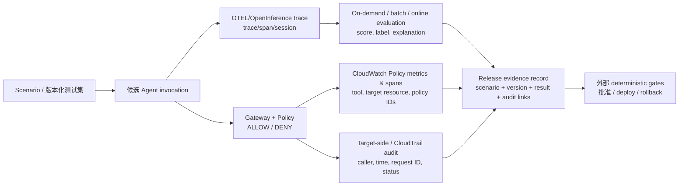

# Amazon Bedrock AgentCore Evaluations：从 Agent 评测到 CI/CD 发布门禁的证据边界

## 提纲

1. 可直接复用的结论与能力状态
2. 三种 evaluation 运行面与 CI/CD 的真实映射
3. Ground Truth 能测什么、不能测什么
4. 从 trace、Policy 到审计的证据链
5. Optimization、batch 与 A/B 的推广边界
6. Agent scenario contract：事实基础与组织设计
7. PPT 主张、反例与不可越过的边界

## 结论先行

1. **AgentCore Evaluations 是 Agent 行为质量的评测层，不是 CI/CD 编排器或通用发布门禁。**它可以在 trace、span 或 session 层评测任务完成、回答、工具使用和自定义指标；AWS 明确写明 on-demand evaluation 可由程序调用、支持 CI/CD pipeline 中的 regression testing。该能力在 **2026-03-31 GA**。[GA 公告（2026-03-31；访问于 2026-08-03）](https://aws.amazon.com/about-aws/whats-new/2026/03/agentcore-evaluations-generally-available/)；[Evaluate API（当前文档；访问于 2026-08-03）](https://docs.aws.amazon.com/bedrock-agentcore/latest/APIReference/API_Evaluate.html)
2. **三种 evaluation 是“build / pre-release / production”的推荐对应，而非强制一一映射。**on-demand 是同步、调用方提供 spans 的单次检查，AWS 表格列为 dev-time spot check 与 CI/CD；batch 是异步、多 session 的 pre/post comparison 与 curated regression；online 是从部署后生产流量中持续抽样。batch 也可定期审计历史生产窗口，因此不能把它写成“仅 pre-release”。[Evaluation types（当前文档；访问于 2026-08-03）](https://docs.aws.amazon.com/bedrock-agentcore/latest/devguide/evaluations-types.html)；[Batch evaluation（当前文档；访问于 2026-08-03）](https://docs.aws.amazon.com/bedrock-agentcore/latest/devguide/batch-evaluations.html)
3. **Ground Truth 让回归从泛化质量分数转向“该场景的已知期望”，但三种字段的确定性不同。**`expectedResponse` 的 Correctness 与 session assertions 的 GoalSuccessRate 都由 LLM-as-a-judge 打分；`expectedTrajectory` 只比较工具名称的顺序/集合，三种 trajectory evaluator 是无 LLM 调用的程序化评分。它不证明工具参数、工具返回结果、外部副作用或业务后果正确。[Ground truth evaluations（当前文档；访问于 2026-08-03）](https://docs.aws.amazon.com/bedrock-agentcore/latest/devguide/ground-truth-evaluations.html)
4. **“trace → evaluation → Policy telemetry / audit”可以构成可调查的执行证据链，不能构成业务正确性证明。**Policy 可给出 allow/deny、决定规则、目标 Gateway 与工具维度；启用 Gateway trace 后还会输出结构化 Policy span。Evaluations 对 trace 打分。把同一场景/trace 与 CloudWatch、CloudTrail 记录关联，是企业可设计的审计链；AWS 没有声明它自动证明目标系统已成功执行、更没有声明其可替代 SLO、制品签名或人工放行。[Policy observability data（当前文档；访问于 2026-08-03）](https://docs.aws.amazon.com/bedrock-agentcore/latest/devguide/observability-policy-metrics.html)；[Runtime security best practices（当前文档；访问于 2026-08-03）](https://docs.aws.amazon.com/bedrock-agentcore/latest/devguide/runtime-security-best-practices.html)
5. **Optimization 是“建议—验证—人工发起推广”的质量闭环，不是自动修改生产 Agent。**Recommendation 本身由 LLM 生成，AWS 要求 review and test before applying；AWS 公告明确每条 recommendation 在 shipping 前需要客户批准。batch evaluation、recommendations 与 A/B testing 于 **2026-06-17 GA**；failure / intent / trajectory insights 同日仍为 Preview。A/B 的 CLI `promote` 也只是把获胜 variant 写入配置并要求随后 `deploy`，不是产品替客户完成生产授权。[Recommendations（当前文档；访问于 2026-08-03）](https://docs.aws.amazon.com/bedrock-agentcore/latest/devguide/optimization-recommendations.html)；[Optimization 公告（2026-06-17；访问于 2026-08-03）](https://aws.amazon.com/about-aws/whats-new/2026/06/amazon-bedrock-agentcore-new-optimization-capabilities/)；[A/B test 管理（当前文档；访问于 2026-08-03）](https://docs.aws.amazon.com/bedrock-agentcore/latest/devguide/ab-testing-manage.html)

## 1. 状态与可安全表述

| 能力 | 截至 2026-08-03 的状态 | AWS 明确支持的表述 | 不能推出 |
|---|---|---|---|
| AgentCore Evaluations | **GA，2026-03-31**；公告称当时覆盖 9 个区域 | 连续监测生产 trace；程序化 on-demand testing，支持 CI/CD regression；Ground Truth 与 custom evaluator | 已形成通用 CI/CD quality gate，或所有 regions/features 同状态 |
| Batch evaluation | **GA，2026-06-17**（Optimization 能力的一部分） | 多 session baseline、pre/post 比较、curated regression、生产时间窗口质量审计 | 纯本地、无需 telemetry 的单元测试 runner；自动批准发布 |
| Recommendations / A/B tests | **GA，2026-06-17** | 从 traces/evaluation output 给出 prompt/tool description 建议；受控流量比较和统计显著性 | 推荐正确、显著性等于安全，或可无人批准地全量推广 |
| Failure / intent / trajectory insights | **Preview，2026-06-17 公告口径** | 从大量生产 session 中发现模式 / outlier 的辅助洞察 | GA 的 release gate 或根因事实证明 |

来源：[Evaluations GA 公告（2026-03-31）](https://aws.amazon.com/about-aws/whats-new/2026/03/agentcore-evaluations-generally-available/)；[Optimization 更新（2026-06-17）](https://aws.amazon.com/about-aws/whats-new/2026/06/amazon-bedrock-agentcore-new-optimization-capabilities/)。区域、配额和 preview 子能力必须在实际部署时再次按 region/feature 核验。

## 2. 三种 evaluation 运行面：对 CI/CD 的直接证据与正确定位

| 运行面 | AWS 的机制与直接用途 | 最适合放在发布流程的哪里 | 关键前提 / 反例 |
|---|---|---|---|
| **On-demand** | 调用方指定 trace/span，`Evaluate` 同步返回分数、解释、label 与 token usage；AWS 直接列为 “Dev-time spot checks, CI/CD”。 | **build / PR 验证**：在受控场景跑完 Agent、拿到 OTEL-compatible trace 后，用 API 对单一高风险场景或修复回归做 fail/pass 判定。 | 不是对源代码或镜像本身评分；输入是 agent trace。分数由所选 evaluator 产生，因此 pipeline 必须自行定义阈值、超时、失败策略与谁能越过门禁。[Evaluate API](https://docs.aws.amazon.com/bedrock-agentcore/latest/APIReference/API_Evaluate.html)；[Batch evaluation comparison](https://docs.aws.amazon.com/bedrock-agentcore/latest/devguide/batch-evaluations.html) |
| **Batch** | 服务端从 CloudWatch Logs 发现 session、异步评分，输出 evaluator averages 和 session detail；AWS 指定 baseline、prompt/model 更新的 pre/post 比较、curated regression 与生产窗口 audit。 | **pre-release / staging**：以版本化 scenario set 调用候选 endpoint，再用 batch 比较 candidate 与 baseline；也适合每周审计生产窗口。 | 不是仅 pre-release；它依赖可发现的 CloudWatch session 和异步 job。平均分会掩盖严重少数回归，故必须同时审查门槛、分位数或关键 scenario（后两项是组织设计，不是 AWS 默认语义）。[Batch evaluation](https://docs.aws.amazon.com/bedrock-agentcore/latest/devguide/batch-evaluations.html)；[Start batch evaluation](https://docs.aws.amazon.com/bedrock-agentcore/latest/devguide/batch-evaluations-start.html) |
| **Online** | 对 live production traffic 做持续采样/过滤，进入 dashboards、趋势和低分 session 调查；AWS 指定为 production monitoring。 | **production**：部署后的 monitor / rollback signal，而不是 pre-deploy test。 | live traffic 没有为每次 interaction 提供 Ground Truth；使用 Ground Truth placeholder 的 custom evaluator 不能配置到 online evaluation。因此不能声称 online 自动验证了业务真值。[Evaluation types](https://docs.aws.amazon.com/bedrock-agentcore/latest/devguide/evaluations-types.html)；[Ground truth 限制](https://docs.aws.amazon.com/bedrock-agentcore/latest/devguide/ground-truth-evaluations.html) |

**可用于 PPT 的精确表述：**“AWS 把 on-demand 明确接入 CI/CD regression；batch 把回归从单场景扩展到版本化 session 集；online 把已上线行为变成持续质量信号。”这是一条 **AWS 能力 → CI/CD 设计映射**，不是 AWS 宣布的 end-to-end autonomous release pipeline。

## 3. Ground Truth：三类契约字段各自验证的对象

| 字段与内建 evaluator | 作用域 / 评分方式 | 可以验证 | 不能验证 |
|---|---|---|---|
| `expectedResponse` + `Builtin.Correctness` | trace-level；LLM-as-a-judge | 单轮 response 是否与 reference answer 相符 | 文本完全一致、事实在外部系统真实、API 是否真正写入、对所有表述的确定性正确 |
| `assertions` + `Builtin.GoalSuccessRate` | session-level；LLM-as-a-judge | 整个多轮 session 是否满足自然语言行为目标 | assertion 本身无歧义；每个步骤/工具参数满足硬约束；高风险行动已获授权 |
| `expectedTrajectory` + Exact/InOrder/AnyOrderMatch | session-level；仅**工具名称**；程序化、无 LLM token usage | 是否调用了期望工具，以及 exact / ordered / unordered 三种轨迹规则 | 工具参数、调用返回、目标系统状态、幂等性、补偿、外部副作用和业务结果 |

AWS 说明：Exact 要求工具、顺序、无额外调用全部相同；InOrder 允许中间额外工具；AnyOrder 只要求期望工具出现。Ground Truth 是 optional，未提供时 evaluator 可退回无 reference 模式；API 会标记未被 evaluator 使用的 reference 字段。故“带 Ground Truth”不等于每条字段都被当前 evaluator 使用。[Ground truth evaluations](https://docs.aws.amazon.com/bedrock-agentcore/latest/devguide/ground-truth-evaluations.html)；[Evaluate API](https://docs.aws.amazon.com/bedrock-agentcore/latest/APIReference/API_Evaluate.html)

### 3.1 Deterministic checker 的位置

AWS 支持用 Lambda 写 code-based evaluator，可执行确定性逻辑、regex、external API、custom metric 或组织业务规则；这应承接必须严格的检查，例如 schema、禁止参数、测试 fixture 的预期状态。**这是 AgentCore 给出的扩展点，不是 AWS 宣布已经替客户实现 unit/integration/deployment test。**Lambda evaluator 的自身权限、测试隔离、mock/fixture、失败处理与审计仍是客户责任。[Evaluators（当前文档；访问于 2026-08-03）](https://docs.aws.amazon.com/bedrock-agentcore/latest/devguide/evaluators.html)

## 4. Policy、trace 与 target audit：可设计的 Evidence Chain

上图是**基于 AWS 元数据能力的企业架构推断**，不是 AWS 预置的一键 release workflow。其可核验事实是：

- Policy/Policy Engine 默认发 CloudWatch invocation metrics，包括 `AllowDecisions`、`DenyDecisions`、latency、mismatch；维度覆盖 Policy Engine、Policy、`TargetResource`、`ToolName` 和 `LOG_ONLY`/`ENFORCE` mode。
- 为 attached Gateway 开启 tracing 后，`aws/spans` 有 decision、reason、determining/mismatched policy IDs、target resource ID、allowed/denied tools 等结构化 Policy span 属性。
- `Evaluate` 可以指定 trace、span 或 session 作为 evaluation target，并返回分数与 explanation。
- Runtime 的 CloudTrail 记录调用者、时间、source IP 与 response status；CloudWatch logs 可记录 command/request ID，AWS 建议用 request ID 做关联。

来源：[Policy observability data](https://docs.aws.amazon.com/bedrock-agentcore/latest/devguide/observability-policy-metrics.html)；[Evaluate API](https://docs.aws.amazon.com/bedrock-agentcore/latest/APIReference/API_Evaluate.html)；[Runtime security best practices](https://docs.aws.amazon.com/bedrock-agentcore/latest/devguide/runtime-security-best-practices.html)。

### 4.1 这条链证明什么，不能证明什么

| 可作为证据 | 仍不能由该证据单独证明 |
|---|---|
| 一个被标识的 Agent execution 被 evaluator 以某规则评分；Gateway 上某 tool 请求被某 Policy 允许/拒绝；可查到相应调用审计。 | Agent 的业务判断正确；被允许的 action 已成功改变外部系统；调用未绕过 Gateway；产物可信且已部署；生产 SLO 达标；风险可由自动系统自行接受。 |

尤其是 Policy 的确定性边界只覆盖**经 AgentCore Gateway 的 traffic**。AWS 的 Runtime 安全文档明确：若 caller 能直接到 Runtime，就会绕开 Gateway 的 Policy、Guardrails 与 interceptors；因此 Evidence Chain 必须把“runtime 仅接受 gateway 来源”的部署控制作为前置条件，而非事后假设。[Runtime security best practices](https://docs.aws.amazon.com/bedrock-agentcore/latest/devguide/runtime-security-best-practices.html)

## 5. Optimization、batch、A/B：验证和推广不是同一授权

AWS 的 performance loop 可按下列方式准确理解：

1. **Observe/evaluate：**从 CloudWatch trace 与 evaluation output 识别目标 evaluator 的失败模式。
2. **Recommend：**LLM 生成 system prompt 或 tool description 的候选改动；configuration bundle 可把系统提示、model ID、tool description 做成 versioned immutable snapshot，或使用独立 runtime endpoint。
3. **Pre-release 验证：**以 batch evaluation 在定义的 test dataset 上比较候选与基线，查看 aggregate 与 per-session result。
4. **Production experiment：**A/B 通过 Gateway 对 control/treatment 分流，且需要 online evaluation configuration；online evaluation 的数值 evaluator 结果用于统计显著性。
5. **Promote：**结果显著后，操作者显式执行 promote/停止试验并部署。CLI 的 `promote` 写入 `agentcore.json`，之后还需 `agentcore deploy`；SDK 没有单一 promote API，客户自己更新 control configuration bundle 或 gateway target。

事实来源：[Optimization overview](https://docs.aws.amazon.com/bedrock-agentcore/latest/devguide/optimization.html)；[A/B prerequisites](https://docs.aws.amazon.com/bedrock-agentcore/latest/devguide/ab-testing-prereqs.html)；[Manage A/B test](https://docs.aws.amazon.com/bedrock-agentcore/latest/devguide/ab-testing-manage.html)。

**批准边界：**AWS 2026-04-30 公告明确“Every recommendation requires your approval before it ships”；AWS 文档也提醒 recommendations 是 LLM 生成、应 review and test before applying。因而，batch pass、A/B statistical significance、或 recommendation completed 都只应成为“满足某项质量规则”的证据；production rollout 仍应由外部 change policy、artifact / configuration approval 和部署 gate 决定。[Optimization Preview 公告（2026-04-30）](https://aws.amazon.com/about-aws/whats-new/2026/05/bedrock-agentcore-optimization-preview/)；[Recommendations](https://docs.aws.amazon.com/bedrock-agentcore/latest/devguide/optimization-recommendations.html)

## 6. Agent Scenario Contract：事实基础与分析推断

### 6.1 AWS 已提供的事实基础

| Contract 字段 | AWS 对应事实 | 适合保存为 |
|---|---|---|
| `scenario_id`、`session_id`、`trace_id` | Evaluate 可定位 span / trace / session；batch 支持按 session 来源发现和输出 per-session 结果。 | 可复现的 case identity 与 evidence link |
| `expected_response` | Ground Truth trace-level `expectedResponse` 可被 Correctness / custom trace evaluator 消费。 | 参考答案 / 允许语义范围 |
| `assertions[]` | Ground Truth session-level natural-language assertions 由 GoalSuccessRate / custom session evaluator 使用。 | 完成条件与安全性意图 |
| `expected_tool_trajectory[]` | Ground Truth 只保存 tool names，可选 exact / ordered / any-order 程序化比对。 | 允许或必经的工具路径 |
| `evaluation_result` | API / batch 可返回 score、label、explanation、unused reference fields；batch 有 aggregate 与 per-session detail。 | 阈值、结果、evaluator version/ARN |
| `policy_evidence` | Policy metrics/spans 有 decision、tool、target resource、policy identifiers / mode。 | 可审核的授权决策链接 |

来源：[Ground truth evaluations](https://docs.aws.amazon.com/bedrock-agentcore/latest/devguide/ground-truth-evaluations.html)；[Evaluate API](https://docs.aws.amazon.com/bedrock-agentcore/latest/APIReference/API_Evaluate.html)；[Batch evaluation](https://docs.aws.amazon.com/bedrock-agentcore/latest/devguide/batch-evaluations.html)；[Policy observability data](https://docs.aws.amazon.com/bedrock-agentcore/latest/devguide/observability-policy-metrics.html)。

### 6.2 建议的组织契约（分析，不是 AWS 内置 schema）

将上表扩展为一个版本化 **Agent Scenario Contract**，随 prompt、model、tool schema、Policy、endpoint mapping 一起评审：

| 区块 | 建议字段 | 为什么不能省略 |
|---|---|---|
| Identity | `scenario_id`、risk tier、owner、数据分级、版本/commit、candidate endpoint | 没有版本和环境，分数无法成为 release evidence。 |
| Given | 输入、用户/tenant 权限、Memory/fixture、可调用 tool set、外部依赖模拟或隔离状态 | 同一 prompt 在不同身份、memory 或 tool schema 下可能走不同路径。 |
| Expected behavior | response reference、assertions、trajectory strictness、明确禁止的 tool / parameter | trajectory 只比较名称；禁止参数和业务不变量须另以 Policy 或 code evaluator 表达。 |
| Deterministic oracle | unit/integration tests、schema/contract tests、target-side test fixture、code-based evaluator | LLM judge 适合语义评分，不应独占硬约束。 |
| Evidence | trace/session IDs、evaluator ARN/config、raw scores、Policy spans、target audit IDs、test dataset version | 可让 release review 重建“什么被评、按什么规则、发生了什么”。 |
| Gate | critical scenario 必须全过、质量阈值、回归预算、policy denial / mismatch 条件、人工审批角色、rollback rule | AWS 交付 score 与 telemetry；门槛、风险接受和 release authority 必须由组织明确设定。 |

这项设计推断的核心不是“把 Agent 判为正确”，而是把不确定性拆分：**语义表现由 evaluator 衡量；路径与授权由 trajectory / Policy 核验；外部状态由确定性测试与目标系统审计核验；发布权仍在外部 Gate。**

## 7. 可支撑的洞察主张、反例与 PPT 红线

### 可支撑的主张

1. **“AgentCore Evaluations 把 Agent regression 从一次性演示，变为可进入 CI/CD 的 trace-based quality evidence。”**证据：AWS 直接写 on-demand 支持 CI/CD regression；batch 支持 curated session 回归与变更前后比较。
2. **“Agent release 的核心对象不是只有 response，而是 response、行为目标、tool trajectory 和 Policy decision 的组合。”**证据：Ground Truth 三类字段、Policy target/tool/decision telemetry；“组合成为 release unit”是分析推断。
3. **“生产 A/B 解决的是在真实流量中验证候选改善；它不授予全量推广权限。”**证据：A/B traffic split + online evaluator + significance；AWS 明确 recommendation 需客户批准，promote 后仍需 deploy。
4. **“最稳健的 Agent gate 是双层：LLM/行为评测发现语义回归，确定性 oracle 拦截硬约束和外部状态错误。”**前半句为 AWS evaluator 能力，双层架构为分析推断；AWS 的 Lambda code evaluator 给出了确定性扩展点。

### 反例 / 需要在汇报中保留的限制

- online evaluation 从生产流量采样，但 Ground Truth placeholder 在 online config 中不可用；因此“线上监控分数”不等于“线上任务真值已验证”。
- Exact trajectory 通过也只表示工具名称、顺序和无额外工具匹配；`deploy` tool 被调用不表示部署成功、正确或达到 SLO。
- Policy allow 只说明已关联 Gateway 上的授权规则允许；它不等于目标服务成功、业务规则正确，且 direct Runtime path 会绕过 Gateway controls。
- batch 的 per-evaluator average 可以改善，同时关键边缘场景恶化；将平均分直接变为放行线是错误的门禁设计。
- A/B 的统计显著性只针对所选 evaluator / 流量和观察窗口；它不自动覆盖稀有高风险任务、合规要求或长期副作用。

### PPT 不可越过的表述边界

| 不可写成 | 可安全改写为 |
|---|---|
| “AgentCore 自动完成 CI/CD 发布审批。” | “AgentCore Evaluations 可为外部 CI/CD gate 提供 regression 与 production-quality evidence。” |
| “Ground Truth 保证 Agent 正确。” | “Ground Truth 将选定场景的回答、行为断言与工具轨迹变为可评测的期望；其中 response/assertion 仍可能使用 LLM judge。” |
| “Policy + evaluation 确保 Agent 的所有行动合规。” | “对经 Gateway 的工具请求，Policy 提供确定性授权；trace/evaluation 提供可调查质量信号。直连和目标侧仍须单独治理。” |
| “A/B 显著就可自动全量。” | “A/B 为候选改动提供在真实流量下的比较证据；推广仍由客户批准、部署与外部风险门禁决定。” |
| “Evaluations 替代 unit/integration test、artifact signature、deployment validation、SLO 或人工审批。” | “Evaluations 补足 Agent 行为质量层；上述确定性工程与治理控制没有被 AWS 文档声明为其替代范围。” |

## 8. 一手来源登记

| 来源 | 发布日期 / 状态 | 本文使用范围 | 访问日 |
|---|---|---|---|
| [AgentCore Evaluations GA](https://aws.amazon.com/about-aws/whats-new/2026/03/agentcore-evaluations-generally-available/) | 2026-03-31；GA 公告 | on-demand CI/CD regression、online production、13 built-in evaluator、Ground Truth | 2026-08-03 |
| [Optimization Preview](https://aws.amazon.com/about-aws/whats-new/2026/05/bedrock-agentcore-optimization-preview/) | 2026-04-30；Preview 公告 | recommendation approval before shipping、batch/A-B 验证链 | 2026-08-03 |
| [Optimization capabilities](https://aws.amazon.com/about-aws/whats-new/2026/06/amazon-bedrock-agentcore-new-optimization-capabilities/) | 2026-06-17；GA/Preview 分项公告 | batch/recommendation/A-B GA；insights Preview；production split 的产品口径 | 2026-08-03 |
| [Evaluation types](https://docs.aws.amazon.com/bedrock-agentcore/latest/devguide/evaluations-types.html) 与 [Batch evaluation](https://docs.aws.amazon.com/bedrock-agentcore/latest/devguide/batch-evaluations.html) | 当前 Developer Guide；页面未披露独立发布日期 | 三种 evaluation 的 trigger/source/ground-truth/use-case；batch outputs | 2026-08-03 |
| [Ground truth evaluations](https://docs.aws.amazon.com/bedrock-agentcore/latest/devguide/ground-truth-evaluations.html) 与 [Evaluate API](https://docs.aws.amazon.com/bedrock-agentcore/latest/APIReference/API_Evaluate.html) | 当前 Developer Guide/API Reference；页面未披露独立发布日期 | reference 字段、评分方式、online 限制、target 与结果 | 2026-08-03 |
| [Policy observability data](https://docs.aws.amazon.com/bedrock-agentcore/latest/devguide/observability-policy-metrics.html) 与 [Runtime security best practices](https://docs.aws.amazon.com/bedrock-agentcore/latest/devguide/runtime-security-best-practices.html) | 当前 Developer Guide；页面未披露独立发布日期 | Policy metrics/span、Gateway bypass、CloudTrail/CloudWatch correlation | 2026-08-03 |
| [Recommendations](https://docs.aws.amazon.com/bedrock-agentcore/latest/devguide/optimization-recommendations.html)、[A/B prerequisites](https://docs.aws.amazon.com/bedrock-agentcore/latest/devguide/ab-testing-prereqs.html) 与 [Manage A/B test](https://docs.aws.amazon.com/bedrock-agentcore/latest/devguide/ab-testing-manage.html) | 当前 Developer Guide；页面未披露独立发布日期 | LLM recommendation review/test、online evaluator prerequisite、promote/deploy semantics | 2026-08-03 |

## 9. 证据缺口

- AWS 一手资料未给出 AgentCore Evaluations 在实际 CI pipeline 中的标准 gate schema、默认 pass threshold、硬性 promotion policy 或端到端 rollback contract。
- 未发现 AWS 一手资料证明 evaluation score / A-B significance 可以替代制品签名、SBOM/provenance、基础设施 policy、integration/deployment test 或 SLO。
- 未发现独立客户对照数据可证明采用 AgentCore Evaluations 会普遍降低 defect escape、change failure rate、上线周期或成本。
- trace、Policy span、CloudTrail 与目标系统 audit 可关联的最小 join key、保留期、跨账户/跨目标覆盖率，需要按具体 runtime、Gateway 和目标系统做验证；不能从各项 telemetry 存在推出“自动完整证据链”。
