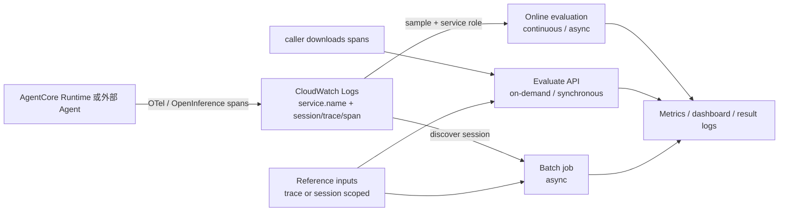

# Amazon Bedrock AgentCore Evaluations：机制、数据合同与生产边界

## 提纲

1. 结论先行与生命周期
2. 三种执行面：数据从哪里来、何时运行、结果到哪里去
3. Built-in / custom evaluator 的评分机制
4. Ground Truth 数据合同
5. 遥测、框架与非 AgentCore Runtime 接入
6. 区域、配额、价格与数据/日志边界
7. 可用于 PPT 的洞察、易误写点和证据缺口

## 结论先行

1. **AgentCore Evaluations 是基于 agent telemetry 的评测服务，而不是一个同步的生产授权器。**Online evaluation 从 CloudWatch Logs 的 live traces 抽样并持续计算质量信号；on-demand 由调用方把选定 session 的 OTel spans 送入同步 `Evaluate`；batch 则从指定 Logs 中发现多 session 并异步汇总。因此一次 evaluation pass 并不拦截工具调用、更不构成业务正确性或发布批准。[Evaluation types（当前文档；访问于 2026-08-03）](https://docs.aws.amazon.com/bedrock-agentcore/latest/devguide/evaluations-types.html)；[Evaluate API（当前文档；访问于 2026-08-03）](https://docs.aws.amazon.com/bedrock-agentcore/latest/APIReference/API_Evaluate.html)
2. **评测有两种完全不同的证据强度。**大部分内置及 LLM custom evaluator 是带固定/自定义 rubric 的 LLM-as-a-judge；它们产生标签、数值与解释，适合趋势、回归比较和人工复核。Trajectory 三个内置 evaluator 与 code-based Lambda evaluator 才可对被明确表达的序列或规则作程序化判定；后者仍只证明其实现的规则，而非未编码的业务真相。[Ground truth（当前文档；访问于 2026-08-03）](https://docs.aws.amazon.com/bedrock-agentcore/latest/devguide/ground-truth-evaluations.html)；[Code-based evaluator（当前文档；访问于 2026-08-03）](https://docs.aws.amazon.com/bedrock-agentcore/latest/devguide/code-based-evaluators.html)
3. **Ground Truth 不是通用 dataset 上传接口，而是一份和 trace / session 绑定的参考输入合同。**`expectedResponse` 是 trace 级字符串，`assertions` 是 session 级自然语言断言列表，`expectedTrajectory` 是 session 级 tool-name 列表。它们可进入 on-demand 和 batch，不能用于 online；服务会对 evaluator 未消费的字段返回 `ignoredReferenceInputFields`，不会报错。[Ground truth](https://docs.aws.amazon.com/bedrock-agentcore/latest/devguide/ground-truth-evaluations.html)；[EvaluationReferenceInput API](https://docs.aws.amazon.com/bedrock-agentcore/latest/APIReference/API_EvaluationReferenceInput.html)（均访问于 2026-08-03）
4. **“支持外部 Runtime”准确说是支持符合遥测合同的外部 Agent。**AWS 当前明确写出的路径是 Strands，或 LangGraph + `opentelemetry-instrumentation-langchain` / `openinference-instrumentation-langchain`，把数据写入 CloudWatch Logs；不要求 Agent 部署在 AgentCore Runtime。它不是“任意框架零配置接入”的证据。[How it works](https://docs.aws.amazon.com/bedrock-agentcore/latest/devguide/how-it-works-evaluations.html)；[Batch prerequisites](https://docs.aws.amazon.com/bedrock-agentcore/latest/devguide/batch-evaluations-prereqs.html)（均访问于 2026-08-03）

## 1. 生命周期与状态

| 日期 | AWS 明确事件 | 截至 2026-08-03 可安全表述 | 来源（发布日期；访问日） |
|---|---|---|---|
| 2025-12-02 | Evaluations Public Preview | 首次把 trace-based continuous monitoring、13 个 built-in evaluator 和 custom model-based scoring 公开为 Preview；当时仅四区。 | [Preview 公告](https://aws.amazon.com/about-aws/whats-new/2025/12/amazon-bedrock-agentcore-policy-evaluations-preview/)（2025-12-02；2026-08-03） |
| 2026-03-31 | Evaluations GA | 服务 GA；AWS 公告称支持 production traffic continuous evaluation、testing workflows、Ground Truth、LLM / Lambda custom evaluator，并列九区。 | [GA 公告](https://aws.amazon.com/about-aws/whats-new/2026/03/agentcore-evaluations-generally-available/)（2026-03-31；2026-08-03） |
| 2026-04-30 | Optimization Preview | recommendations、batch evaluation、A/B test 作为 performance loop 的能力公开 Preview；不能把该公告误写为 Evaluations 本体再次 GA。 | [Optimization Preview](https://aws.amazon.com/about-aws/whats-new/2026/05/bedrock-agentcore-optimization-preview/)（2026-04-30；2026-08-03） |
| 2026-06-17 | Optimization 能力更新 | AWS 公告称 batch evaluations、recommendations 与 A/B testing GA；failure / intent / trajectory insights 仍 Preview。 | [Optimization 更新](https://aws.amazon.com/about-aws/whats-new/2026/06/amazon-bedrock-agentcore-new-optimization-capabilities/)（2026-06-17；2026-08-03） |

**状态结论（事实）：**Evaluations 服务本体截至观察日是 **GA**。这不推出每个相关能力都同一成熟度：Optimization insights 仍有 Preview 范围，也不推出每个 Region、模型或数据路径一致可用。

## 2. 三种 evaluation type：精确执行语义

| 维度 | Online | On-demand | Batch |
|---|---|---|---|
| 触发 / 运行 | 连续、event-driven；配置启用后处理到来的 trace | 调用方发起 `Evaluate`，**同步**返回 | 调用方 `StartBatchEvaluation`，**异步** job；轮询状态 |
| 数据选择 | 一个 Agent endpoint，或最多 5 个 CloudWatch log groups + `serviceNames`；按 sampling percentage / filter 选择 | 调用方 inline 提交 `sessionSpans`（OTel JSON）；可再用 trace IDs 或 span IDs target | 服务端从指定 CloudWatch Logs 发现 session；可按 time range、session IDs 或全 log group 选择 |
| 必需身份 / 权限 | 配置需 evaluation execution IAM role；自定义 evaluator 被 active config 使用时锁定 | 调用方须能调用 `Evaluate`；LLM / Lambda custom 还需相应 Bedrock / Lambda 权限 | **调用方凭证**读取 source Logs、写 result Logs；不使用独立 service role |
| Ground Truth | 不支持（live production traffic 没有其参考值） | `evaluationReferenceInputs`；按 session / trace context 绑定 | `sessionMetadata` 内联 ground truth |
| 输出 | CloudWatch metrics、dashboard、低分 session / complete flow 分析 | API immediate detailed results；单 session 含多 trace/tool 时可有多个 result | API aggregate：per-evaluator average、session counts、token usage；per-session/per-turn detail 写 CloudWatch Logs |
| 延迟 / 聚合 | 连续监测，**不是**用户请求路径的同步 Gate；AWS 未给承诺 SLO | 同步 API，但须先获得完整 spans；AWS 文档提示 trace 写入 CloudWatch 约需数分钟，过早读取会空或不完整 | 状态 `PENDING → IN_PROGRESS → COMPLETED / FAILED`（API 也列 `COMPLETED_WITH_ERRORS` / `STOPPED`）；不是 CI 单请求的即时结果 |
| 典型用途 | production quality trend、alert / drill-down | issue investigation、custom evaluator trial、dev-time / CI spot check | baseline、前后版本比较、curated session regression、periodic audit |

表中事实来自 [Evaluation types](https://docs.aws.amazon.com/bedrock-agentcore/latest/devguide/evaluations-types.html)、[Batch evaluation](https://docs.aws.amazon.com/bedrock-agentcore/latest/devguide/batch-evaluations.html)、[Create online evaluation](https://docs.aws.amazon.com/bedrock-agentcore/latest/devguide/create-online-evaluations.html)、[On-demand getting started](https://docs.aws.amazon.com/bedrock-agentcore/latest/devguide/getting-started-on-demand.html)、[Batch prerequisites](https://docs.aws.amazon.com/bedrock-agentcore/latest/devguide/batch-evaluations-prereqs.html)（均为当前文档；访问于 2026-08-03）。

### 2.1 Online：看生产样本，不是“每笔流量审计”

- Online config 指定 data source、至多 10 个 built-in/custom evaluators 和 execution role；`enableOnCreate` 决定是否立即开始。`ENABLED` 才处理到来的 traces，`DISABLED` 则不处理。[Create online evaluation](https://docs.aws.amazon.com/bedrock-agentcore/latest/devguide/create-online-evaluations.html)
- 采样率的 API 语义是 percentage；Starter Toolkit 示例中的 `1.0` = 1%，不是 100%。若只抽样，未被抽中的 session 没有 evaluator score，不能把 dashboard 平均分说成全量质量。[同上](https://docs.aws.amazon.com/bedrock-agentcore/latest/devguide/create-online-evaluations.html)
- 当前文档的 console 路径允许 endpoint 或 CloudWatch logs；外部 Runtime 要用 `OTEL_RESOURCE_ATTRIBUTES` 设置 service name。数据源是 traces 的观测面，不是 AgentCore Runtime 的内部黑箱。[同上](https://docs.aws.amazon.com/bedrock-agentcore/latest/devguide/create-online-evaluations.html)

### 2.2 On-demand：调用方提供 spans，`Evaluate` 同步返回

- `Evaluate` URL 以一个 evaluator ID 为中心；`evaluationInput.sessionSpans` 是 1–1,000 个 OTel JSON span，`evaluationTarget` 可选 trace IDs 或 span IDs（每种上限 10）。`evaluationReferenceInputs` 至多 1,000 项。[Evaluate API](https://docs.aws.amazon.com/bedrock-agentcore/latest/APIReference/API_Evaluate.html)；[EvaluationInput API](https://docs.aws.amazon.com/bedrock-agentcore/latest/APIReference/API_EvaluationInput.html)；[EvaluationTarget API](https://docs.aws.amazon.com/bedrock-agentcore/latest/APIReference/API_EvaluationTarget.html)
- 它**不自动**从 Runtime 抓取 trace。AgentCore CLI / Starter Toolkit 可以替用户从 CloudWatch 下载 session spans；直接 SDK 路线则要先按 session 读取 Logs 后再调用 API。AWS 提示 Logs 写入通常需数分钟，因此“同步 API”不等于“刚完成一次 agent response 就能获得完整评测”。[On-demand getting started](https://docs.aws.amazon.com/bedrock-agentcore/latest/devguide/getting-started-on-demand.html)
- 一个 session 内多个 trace / tool call 可以形成多个结果；文档示例称单 API 回应最多返回 10 个 evaluation results，默认是最后 10 个。后续 PPT 不应把一次 API response 等同为“会话唯一分数”。[同上](https://docs.aws.amazon.com/bedrock-agentcore/latest/devguide/getting-started-on-demand.html)

### 2.3 Batch：server-side session discovery + aggregate，适合回归但非无上限数据湖

1. 提交 session source、evaluators 与可选 reference metadata。
2. 服务从指定 CloudWatch Logs 发现匹配 session，收集 spans。
3. 每个 evaluator 独立评每个 session。
4. job 异步结束后，API 给 aggregate 和 token usage；session 明细作为 OTel events 写入 `outputConfig` 指定的 CloudWatch log stream。

这四步由 AWS 明确描述。[Batch evaluation](https://docs.aws.amazon.com/bedrock-agentcore/latest/devguide/batch-evaluations.html)；[Batch results](https://docs.aws.amazon.com/bedrock-agentcore/latest/devguide/batch-evaluations-results.html)（当前文档；访问于 2026-08-03）

**关键限制（事实）：**每 job 最多 500 sessions、最多 10 evaluators；超过发现上限时服务选择最近 500 个 sessions，`numberOfSessionsIgnored` 会显示被忽略数。它是一个有 sampling / selection semantics 的 measurement job，不是完整历史回放证明。[Quotas](https://docs.aws.amazon.com/bedrock-agentcore/latest/devguide/bedrock-agentcore-limits.html)；[Get batch results](https://docs.aws.amazon.com/bedrock-agentcore/latest/devguide/batch-evaluations-get.html)（当前文档；访问于 2026-08-03）

## 3. Evaluator：当前文档可证实的 roster 与评分语义

### 3.1 Built-in evaluator 的两个集合

AWS 的 GA / Preview 公告都写“13 built-in evaluators”，但截至访问日的 **Prompt templates** 页面列出 14 个 LLM judge template，而 **Ground truth** 页面另列 3 个 trajectory evaluator。因此不能把公告中的“13”直接当作截至日完整、稳定的 ID roster。以下按当前文档拆分，保留这个证据差异。

#### A. Prompt templates 明列的 LLM-as-a-judge evaluator（14 个）

| 级别 | 当前文档显示名 / 通常 ID 表达 | 评分对象与语义 | 评分方式 |
|---|---|---|---|
| Session | `Builtin.GoalSuccessRate` | 整个会话中用户目标是否都完成；ground truth 版本以 assertions 判断 | LLM judge；Yes/No 或 SUCCESS/FAILURE |
| Trace | Coherence | 回答是否自洽、无逻辑矛盾 / gap | LLM judge；5 档 |
| Trace | Conciseness | 是否用最少必要文字完成请求 | LLM judge；3 档 |
| Trace | Context relevance | 给定 context / retrieved passages 是否足够相关 | LLM judge；3 档 |
| Trace | `Builtin.Correctness` | 回答的内容 / 解法准确性；可对 expected response 比较 | LLM judge；3 档或 CORRECT/INCORRECT |
| Trace | Faithfulness | 最后回答是否与同一会话历史冲突 | LLM judge；5 档 |
| Trace | Harmfulness | 回答是否包含攻击、仇恨、暴力、性内容、刻板印象等 | LLM judge；Harmful / Not Harmful |
| Trace | `Builtin.Helpfulness` | 是否让用户向目标推进（不是 factual correctness） | LLM judge；7 档 |
| Trace | Instruction following | 是否遵循显式输入指令（不评价事实正确性） | LLM judge；Yes/No |
| Trace | Refusal | 是否拒绝处理请求 | LLM judge；Yes/No |
| Trace | Response relevance | 回答是否聚焦当前问题（与正确性、faithfulness 分开） | LLM judge；5 档 |
| Trace | Stereotyping | 是否有针对人群的偏见 / 刻板内容 | LLM judge；Stereotyping / Not Stereotyping |
| Tool call | Tool parameter accuracy | 参数是否来自前序上下文 / 结果且符合 schema；不评价是否选对 tool | LLM judge；Yes/No |
| Tool call | Tool selection accuracy | 当前点选择该 action 是否合理；不评价参数忠实性 | LLM judge；Yes/No |

来源：[Prompt templates](https://docs.aws.amazon.com/bedrock-agentcore/latest/devguide/prompt-templates-builtin.html)（当前文档；访问于 2026-08-03）。明确出现在 API / 示例中的 ID 只有 `Builtin.GoalSuccessRate`、`Builtin.Correctness`、`Builtin.Helpfulness`；其余显示名与具体 `Builtin.*` ID 的一一对应，官方该页没有一张可审计的 ID table，故不把推导出的 CamelCase 名称写成正式 ID 事实。

#### B. Ground Truth 明列的 programmatic trajectory evaluator（3 个）

| ID | 级别 | 精确匹配语义 | 是否 LLM judge |
|---|---|---|---|
| `Builtin.TrajectoryExactOrderMatch` | Session | 实际 tool names 必须与 expected 完全一致：同工具、同顺序、无额外调用 | 否；程序化、零 judge token |
| `Builtin.TrajectoryInOrderMatch` | Session | expected tools 都按顺序出现；允许其间有额外 tools | 否；程序化、零 judge token |
| `Builtin.TrajectoryAnyOrderMatch` | Session | expected tools 都出现；顺序无关、允许额外 tools | 否；程序化、零 judge token |

来源：[Ground truth](https://docs.aws.amazon.com/bedrock-agentcore/latest/devguide/ground-truth-evaluations.html)（当前文档；访问于 2026-08-03）。

### 3.2 分数不能跨 evaluator 直接平均

**事实：**结果包含 numeric `value`、categorical `label` 与 `explanation`；batch aggregate 以 per-evaluator average score 展示，且 AWS 仅称“多数”built-ins 的 value 为 0–1、高者更好。不同 rubric 明确有 2 / 3 / 5 / 7 档，安全 / refusal 还带方向性不同的标签。[Batch results](https://docs.aws.amazon.com/bedrock-agentcore/latest/devguide/batch-evaluations-results.html)；[Prompt templates](https://docs.aws.amazon.com/bedrock-agentcore/latest/devguide/prompt-templates-builtin.html)

**分析：**PPT 或 CI 门槛应以「同 evaluator、同 dataset、同版本、同 target level」的前后比较为基本单位；不要把 Helpful=0.8、Harmful=0.8、trajectory=1.0 直接平均成“agent quality 86%”。AWS 未公开完整 label → numeric mapping、judge-model/模板变更的 versioning 合同，也没有跨 evaluator 的校准证据。

## 4. Custom evaluator：模型边界与 Lambda 边界

| 类型 | 可配置内容 | 运行位置 / 权限 | 适用边界 |
|---|---|---|---|
| LLM-as-a-judge | Bedrock evaluator model、inference params、instructions、rating scale（最多 20 definitions）；instructions 至少含一个允许的 placeholder | 由 Bedrock foundation model 执行；可用 symmetric CMK 加密 instructions / rating scale | 有业务 rubric 的软判断；依旧是模型判断，不是确定性 oracle |
| Code-based | Lambda ARN、timeout（默认 60s，1–300s）与自写业务逻辑 | 同 Region Lambda；执行 role 必须 `lambda:InvokeFunction` / `lambda:GetFunction`；Lambda payload 最大 6 MB、最多 5 分钟 | JSON/schema、regex、policy invariant、外部 API / business rule 等确定性或自控逻辑 |

事实来源：[Create evaluator](https://docs.aws.amazon.com/bedrock-agentcore/latest/devguide/create-evaluator.html)；[Code-based evaluator](https://docs.aws.amazon.com/bedrock-agentcore/latest/devguide/code-based-evaluators.html)（当前文档；访问于 2026-08-03）。

- 三级 scope 是 `SESSION`、`TRACE`、`TOOL_CALL`。LLM custom 每个 level 只允许固定 placeholders：session 可见整段 context / available tools；trace 可见 context / assistant turn；tool 还可见 current tool turn。不能因为 Lambda 能调用外部 API，就推断系统自动具有业务系统的授权或真相数据。[Create evaluator](https://docs.aws.amazon.com/bedrock-agentcore/latest/devguide/create-evaluator.html)
- Code Lambda success response 至少有 `label`；可选 `value` 和 `explanation`；也可回 error object。Lambda 会收到 input spans、reference inputs 与 target；原始 input 超 6 MB 时 spans **可能被截断**。因此 code evaluator 是可编程检查，不保证拿到完整会话历史。[Code-based evaluator](https://docs.aws.amazon.com/bedrock-agentcore/latest/devguide/code-based-evaluators.html)
- 正在被 enabled online config 使用的 custom evaluator 被锁定，不能修改或删除；需要变更时 clone 新 evaluator。这为 evaluator 版本冻结提供局部机制，但不自动关联 agent code / prompt / dataset / endpoint 版本。[Create online evaluation](https://docs.aws.amazon.com/bedrock-agentcore/latest/devguide/create-online-evaluations.html)

## 5. Ground Truth：一个可测试的数据合同

| 字段 | 类型 / 绑定层级 | 能驱动的内置 evaluator | 语义边界 |
|---|---|---|---|
| `expectedResponse` | String；trace 级；context 内以 `traceId` 定位 | `Builtin.Correctness` | 参考答案是比较基准；不是自动事实发现 |
| `assertions` | 1–100 个自然语言 statements；session 级 | `Builtin.GoalSuccessRate` | 由 LLM 判断 assertion intent 是否满足；不是 deterministic invariant |
| `expectedTrajectory.toolNames` | tool-name list；session 级 | 三个 `Trajectory*Match` | 只验证工具名称 / 顺序 / extras 规则，不比较工具参数、副作用或下游状态 |

来源：[Ground truth](https://docs.aws.amazon.com/bedrock-agentcore/latest/devguide/ground-truth-evaluations.html)；[EvaluationReferenceInput API](https://docs.aws.amazon.com/bedrock-agentcore/latest/APIReference/API_EvaluationReferenceInput.html)（当前文档；访问于 2026-08-03）。

1. Reference input 必有 `context`（session 或 trace span context），再附可选 ground truth 字段；没有关联 context 的“全局期望答案”不是该 API 合同。
2. 同一 request 可以传全部字段。服务只让相关 evaluator 消费，并把未使用字段列入 `ignoredReferenceInputFields`；此反馈应纳入 dataset contract check，避免以为 Ground Truth 已被实际采用。
3. 省略 GT 时，部分 built-ins 仍走 ground-truth-free variant（例如 Correctness），这不是同一强度的 reference-based correctness。
4. 使用 `{assertions}`、`{expected_response}` 或 `{expected_tool_trajectory}` 的 custom LLM evaluator **不能**放进 online config；原因是 production live traffic 没有 GT。这个限制同样说明 online telemetry 不能充当预先标注的 benchmark dataset。

## 6. Telemetry、CloudWatch 与外部 Runtime

**事实：**Evaluation input 是 OTel-format session spans；AWS 明确列出的受支持路径是 Strands 与 LangGraph（后者使用 `opentelemetry-instrumentation-langchain` 或 `openinference-instrumentation-langchain`）。Agent 可在 AgentCore Runtime，也可在外部环境；外部接入依然要将符合合同的 telemetry 写入 CloudWatch，并配置正确 `service.name`。交易搜索（Transaction Search）是 CloudWatch as session source 的前置条件。[Evaluation overview](https://docs.aws.amazon.com/bedrock-agentcore/latest/devguide/evaluations.html)；[How it works](https://docs.aws.amazon.com/bedrock-agentcore/latest/devguide/how-it-works-evaluations.html)；[Batch prerequisites](https://docs.aws.amazon.com/bedrock-agentcore/latest/devguide/batch-evaluations-prereqs.html)

**日志边界（事实）：**Runtime 会默认创建 service-provided CloudWatch log group；Memory、Gateway 和 built-in tools 不会自动配置日志 destination。Memory/Gateway 可选 CloudWatch、S3 或 Firehose；这不等于 Evaluations 自动取得全部工具或业务系统日志。[Observability configuration](https://docs.aws.amazon.com/bedrock-agentcore/latest/devguide/observability-configure.html)（当前文档；访问于 2026-08-03）

## 7. 区域、配额、价格与数据保留

### 7.1 区域：把发布日期与当前矩阵分开

- **GA 公告（2026-03-31）的九区：**N. Virginia、Ohio、Oregon、Mumbai、Singapore、Sydney、Tokyo、Frankfurt、Ireland。[GA 公告](https://aws.amazon.com/about-aws/whats-new/2026/03/agentcore-evaluations-generally-available/)
- **截至访问日的当前 feature matrix：**Evaluations 行显示 **16 区**：`us-east-1`、`us-east-2`、`us-west-2`；`eu-central-1`、`eu-west-1`、`eu-west-2`、`eu-west-3`、`eu-north-1`；`ap-south-1`、`ap-southeast-1`、`ap-southeast-2`、`ap-northeast-1`、`ap-northeast-2`；`ca-central-1`、`sa-east-1`、`us-gov-west-1`。矩阵没有发布日期，且是会变化的 current-state 页面；部署前必须再按 Region / feature 核对，不能用 3 月公告或平台 GA 代替。[Supported Regions](https://docs.aws.amazon.com/bedrock-agentcore/latest/devguide/agentcore-regions.html)（当前文档；访问于 2026-08-03）

### 7.2 有约束的评测吞吐

| 配额（每 account、每 Region，除非 AWS 另注） | 默认值 | 是否可调 |
|---|---:|---|
| built-in evaluator input tokens / min | 200,000 | 否 |
| built-in evaluations / min | 100 | 否 |
| on-demand spans / request；payload | 1,000；15 MB | 否；否 |
| input tokens / evaluation | 200,000 | 否 |
| sampled online session spans；所有 spans size | 1,000；15 MB | 否；否 |
| online configurations / account；evaluators / config | 1,000；10 | 否；否 |
| concurrent batch jobs；sessions / job；evaluators / job | 5；500；10 | 否；否 |

来源：[AgentCore quotas](https://docs.aws.amazon.com/bedrock-agentcore/latest/devguide/bedrock-agentcore-limits.html)（当前文档；访问于 2026-08-03）。这意味着长 session、full-fidelity trace 或高频 evaluation 的成本与覆盖率都需要预先设计；“持续评测”不等于无损全量评测。

### 7.3 价格与数据 / 日志边界

- **事实（AWS 定价页）：**built-in evaluator（含 Batch）为 **$0.0024 / 1,000 input tokens**、**$0.012 / 1,000 output tokens**，其 judge model usage 已包含；custom evaluator 为 **$1.50 / 1,000 evaluations**，另按客户账户为所选模型推理计费。custom code-based evaluator 同时带来 Lambda 及相关 AWS 服务成本。CloudWatch Logs、模型调用、S3 / Firehose、网络和下游工具均是独立计费面。一次 interaction 配多个 evaluator 时成本按 interaction × evaluator 数乘增，不能按 session 数估算。[AgentCore Pricing](https://aws.amazon.com/bedrock/agentcore/pricing/)（当前页面；访问于 2026-08-03）
- **配额冲突（事实，待 AWS 澄清）：**Evaluation overview 说 large Regions 每 account 最多 1 million input and output tokens/min；Quota 表对 built-in evaluator input 写 200,000 tokens/min。两页未说明是否是不同 evaluator / token 口径。规划时应采用表格中更保守的 200,000 built-in input tokens/min，不能把二者合并成一个确定额度。[Evaluation overview](https://docs.aws.amazon.com/bedrock-agentcore/latest/devguide/evaluations.html)；[Quotas](https://docs.aws.amazon.com/bedrock-agentcore/latest/devguide/bedrock-agentcore-limits.html)（均访问于 2026-08-03）
- **事实：**Online 会创建专属 CloudWatch Logs group（`/aws/bedrock-agentcore/evaluations/results/<online-evaluation-config-id>`）；batch per-session detail 同样写 Logs。它们都可与原 trace / session ID 关联，因而不是仅聚合、匿名指标。telemetry retention、KMS、Logs read/query 和 output log-group 权限是评测设计的一部分。[Online results and output](https://docs.aws.amazon.com/bedrock-agentcore/latest/devguide/results-and-output.html)；[Batch results](https://docs.aws.amazon.com/bedrock-agentcore/latest/devguide/batch-evaluations-results.html)（均访问于 2026-08-03）
- **跨区推理边界（事实）：**Evaluation 支持 cross-Region inference。文档称数据存储在 primary Region，但 prompt input / output 可在同一地理范围的其他 Region 处理；来自 Seoul 的 Evaluation 请求可走 global commercial compute，且 CloudWatch / CloudTrail 不会标出实际 inference Region。因此“评测 resource 在某 Region”不必然等于“judge inference 只在该 Region”。[Cross-Region inference](https://docs.aws.amazon.com/bedrock-agentcore/latest/devguide/cross-region-inference.html)（当前文档；访问于 2026-08-03）
- **未知 / 不应编造：**在已核验页面中，AWS 没有给出 Evaluations 对 customer trace、judge prompt / response、score explanation 的统一独立保留天数、跨区复制行为、训练使用条款或“评测历史一键完整导出”合同。涉及敏感数据、数据驻留或删除请求时，这些不能凭本研究推断为已解决；必须按 CloudWatch Logs / KMS / IAM / account-specific data policy 另行核验。

## 8. 面向后续洞察 PPT 的可用主张

### 主张 A：Agent evaluation 的关键分界不是“离线 / 在线”，而是“观测样本”与“发布证据”

**证据：**Online 是 CloudWatch trace 的 continuous sampled monitoring，不能传 GT；On-demand 可选择 target spans / traces，但输入取决于日志可用性；Batch 可用 curated session + GT 并输出 aggregate / detail。

**分析：**可将 Online 用作 drift / silent failure 的雷达；把 Batch / On-demand 用作变更前证据；确定性 invariants 用 trajectory 或 code evaluator；最终发布仍由外部 test、scan、approval、SLO 与 rollback gate 裁决。

**不能说：**“Online Evaluation 自动阻止不安全变更”或“LLM judge 的 pass 就是 release approval”。

### 主张 B：Agent 的可测性是一份 telemetry + ground-truth 的数据产品合同

**证据：**Evaluator 只接收 OTel session spans；GT 必须绑定 trace/session context；在线没有 GT；batch 只取最近 500 discovered sessions。

**分析：**CI/CD Agent 的 benchmark 需要版本化：`scenario/sessionId → trace schema + expected response/assertions/trajectory → evaluator version → score threshold`。没有这个合同，评测面板更接近可见性，而非可复现回归测试。

**不能说：**“接上 CloudWatch 就天然具备 regression dataset”。

### 主张 C：工具正确性必须拆开测——“选对工具”“参数忠实”“执行路径合规”“真实副作用正确”不是同一件事

**证据：**Built-in Tool selection 和 Tool parameter accuracy 是分别的 LLM evaluators；trajectory evaluator 只匹配 tool names / order；Policy 作用于 Gateway tool path；Ground Truth 无一项直接验证下游业务状态。

**分析：**对高风险动作，至少并置 tool selection、parameter validation（code evaluator / schema）、expected trajectory、Gateway Policy/IAM 与下游 read-after-write / approval oracle。

**不能说：**“Trajectory match 证明变更已正确部署”。

## 9. 易误写点与证据缺口

| 容易误写 | 为什么不成立 | 正确写法 |
|---|---|---|
| “Evaluations 只有 online 和 on-demand” | 2026-04 后有 batch execution type，且当前 docs 明列三种 | 服务 GA 后的当前 docs 有 online、on-demand、batch；batch 的功能发布另有时间线 |
| “Online 是实时每请求 quality gate” | 是 sampling / filtering 的 continuous monitoring，结果经 CloudWatch telemetry 路径产生 | Online 是异步生产质量监测；不能替代同步 allow/deny / release gate |
| “所有 built-ins 都是 LLM judge” | 三个 Trajectory evaluator 明确 programmatic、无 LLM token | 多数 response / safety / tool rubric 是 LLM judge；trajectory 是确定性 sequence matching |
| “Correctness 有 expected response 就是 deterministic” | `Builtin.Correctness` 明确仍是 LLM-as-a-judge 比较 | reference-based LLM correctness，须与 rubric / baseline 同看 |
| “Ground Truth 能用于 production online monitoring” | online 无 GT；含 GT placeholders 的 custom evaluator 被禁止配置到 online | GT 用 on-demand / batch benchmark；online 另行监测 |
| “AgentCore Runtime 是评测前提” | AWS 明确可评外部托管 Agent | 前提是支持的 framework / instrumentation 与 CloudWatch telemetry 合同，而非 Runtime 本身 |
| “AWS 当前完整内置列表就是 13 个” | 公告称 13；current Prompt templates 名列 14 LLM templates，另有 3 trajectory IDs | 引用发布日期时可说 13；写截至日 roster 时保留文档差异并用 `ListEvaluators` 账户实测核对 |
| “分数可以跨 evaluator 合并成一个 QA 分” | labels、刻度和方向不同，未有公开 calibration contract | 只作同 evaluator / 同数据集 / 同版本的趋势或阈值比较 |

### 仍需外部核验的缺口

1. AWS 没公开一份有发布日期、同时列明所有 built-in evaluator **ID、当前数量、模型、label→number mapping、模板版本**的静态清单；正式 PPT 若必须写精确总数，应在目标账户/Region 调用 `ListEvaluators` 并保留 timestamped output，或仅复述有日期的 13-item 发布公告。
2. 当前一手资料没有独立第三方 benchmark，无法证明 judge 与人工标注的一致度、漂移率、线上 latency SLO、成本 / ROI 或跨框架准确等价。
3. 没有统一 retention / export / deletion 文档可证明 trace、evaluation result、reasoning、dataset metadata 的端到端生命周期；不要把 CloudWatch 可查询误写为完整可迁移审计档案。
4. AWS 资料没有将 Evaluation result 连接到 code commit、prompt / tool / policy schema、model pin 与 endpoint 的原子 release bundle；这一关联必须由企业 CI/CD manifest / evidence store 建立。
