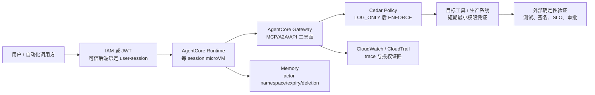

# Amazon Bedrock AgentCore：企业治理与落地边界

## 提纲

1. 定位与结论先行
2. 责任模型、身份与工具授权
3. Runtime、网络、镜像和会话的真实隔离边界
4. Memory、日志和数据控制
5. Observability、Policy、Evaluations 的“可证明”边界
6. 成本、区域、配额与产品限制
7. 与 Bedrock Agents、Strands、LangGraph、MCP、A2A 的关系
8. 企业落地的控制面设计与证据缺口

## 结论先行

1. **AgentCore 是可拆用的 Agent 运行与治理平台，而不是一个替客户做业务授权的自治 Agent。**它支持任意框架和基础模型；Runtime、Gateway、Identity、Memory、Observability、Evaluations 与 Policy 可独立组合。[官方概述](https://docs.aws.amazon.com/bedrock-agentcore/latest/devguide/)
2. **最可靠的工具授权边界是“经 AgentCore Gateway 的调用 + Policy in AgentCore 的 ENFORCE”。**Policy 用 Cedar 决定 Gateway 转发的每个工具请求；可按调用者身份和工具参数授权，且默认拒绝/显式 forbid 优先。但绕过 Gateway 的直连工具、Runtime 内任意代码、外部系统自身权限，并不会自动受该 Gateway Policy 约束。[Policy 概述](https://docs.aws.amazon.com/bedrock-agentcore/latest/devguide/policy.html)；[LOG_ONLY/ENFORCE 语义](https://docs.aws.amazon.com/bedrock-agentcore/latest/devguide/policy-test-a-policy.html)
3. **Runtime 的隔离单位是 session microVM，而不是“应用用户”或“业务租户”。**AWS 提供 CPU、内存和文件系统隔离、结束后清理内存；但不强制 `sessionId → user` 绑定，客户端后端必须维护这个映射。微虚机内的代码/命令可访问该 VM 中的执行角色凭证，因此“Agent 能运行”绝不等于可以授予它高权限角色。[Runtime session](https://docs.aws.amazon.com/bedrock-agentcore/latest/devguide/runtime-sessions.html)；[Runtime 安全最佳实践](https://docs.aws.amazon.com/bedrock-agentcore/latest/devguide/runtime-security-best-practices.html)
4. **Identity 是非人工作负载身份与凭证编排，不是业务策略本身。**它给 Agent 稳定的 workload identity ARN，管理 OAuth 2.0、API key、SigV4 等凭证路径，可代表用户或机器取 token；实际对下游资源的授权仍由 OAuth provider、IAM、Gateway Policy 和目标系统共同决定。已发出的 token 可能在联邦提供方被撤销而 AgentCore 不会主动发现。[Identity](https://docs.aws.amazon.com/bedrock-agentcore/latest/devguide/identity.html)；[workload identity](https://docs.aws.amazon.com/bedrock-agentcore/latest/devguide/understanding-agent-identities.html)；[token 边界](https://docs.aws.amazon.com/bedrock-agentcore/latest/devguide/identity-authentication.html)
5. **Memory、日志和 traces 都是数据面，而不是“无状态的模型辅助功能”。**Memory 将短期事件和可抽取的长期事实保存；须以可信 `actorId`/namespace/IAM 划分数据。AgentCore 的 telemetry 落入 CloudWatch；默认有部分指标，而 spans/logs 需要显式开启。评估与 trace 可以提供质量、轨迹及策略决策证据，却不能独立证明业务事实、合规许可或发布可批准。[Memory 概述](https://docs.aws.amazon.com/bedrock-agentcore/latest/devguide/memory.html)；[Observability](https://docs.aws.amazon.com/bedrock-agentcore/latest/devguide/observability.html)；[Evaluations](https://docs.aws.amazon.com/bedrock-agentcore/latest/devguide/evaluations.html)
6. **部署成本的主导项往往不只 Runtime。**除了按活跃 vCPU/GB-hour 计费，还应计入 Gateway 调用/索引、Memory 事件/存储/检索、CloudWatch trace/log、模型推理、ECR/S3、网络传输，以及 VPC egress。区域是按能力矩阵而非“AgentCore 一体化全球可用”来判断；配额也大多按 Region 和模块独立生效。[定价页](https://aws.amazon.com/bedrock/agentcore/pricing/)；[区域矩阵](https://docs.aws.amazon.com/bedrock-agentcore/latest/devguide/agentcore-regions.html)；[配额](https://docs.aws.amazon.com/bedrock-agentcore/latest/devguide/bedrock-agentcore-limits.html)

## 1. 定位、状态与责任模型

### 1.1 已核验事实

| 主题 | 事实 | 状态/证据 |
|---|---|---|
| 产品定位 | AgentCore 用于以任意 framework 与 foundation model 构建、部署、运行和运营 Agent；服务可一起或独立使用。 | 当前 Developer Guide；[概述](https://docs.aws.amazon.com/bedrock-agentcore/latest/devguide/) |
| 产品状态 | AWS 于 2025-10-13 宣布 AgentCore GA；此结论不自动覆盖之后单独标为 Preview 的功能。 | GA；[What's New](https://aws.amazon.com/about-aws/whats-new/2025/10/amazon-bedrock-agentcore-available/) |
| 安全责任 | AWS 负责云基础设施；客户对自己托管的 content 与所用服务的安全配置/管理负责。Runtime 更具体地把 code、依赖、IAM、命令、session-user mapping、镜像、网络和 prompt/input 安全列为客户责任。 | [数据保护](https://docs.aws.amazon.com/bedrock-agentcore/latest/devguide/data-protection.html)；[Runtime 责任模型](https://docs.aws.amazon.com/bedrock-agentcore/latest/devguide/runtime-security-best-practices.html) |
| 不是自动批准器 | AgentCore 文档描述的是身份验证、策略判定、工具调用、指标、trace 和评估；未声称它替代企业的签名、测试、SLO、变更审批或人工授权。 | **证据边界**：不应把任意 AgentCore action 写成发布批准。 |

### 1.2 责任划分（事实 + 落地含义）

| 层 | AWS 已明示承担 | 客户仍承担 | 对交付/生产环境的含义 |
|---|---|---|---|
| Runtime 基础设施 | 硬件层 microVM isolation、OS kernel patch、网络基础设施、服务可用性；direct-code 的语言运行时在支持期内更新。 | code/dependency、容器镜像、执行命令、execution role、输入校验与 prompt injection 防护。 | container 部署需要自行重建安全基镜像；已 EoS 的 direct-code 语言运行时按原样提供，可能含未修漏洞。 |
| 访问控制 | 提供 IAM/JWT、Identity、Gateway、Policy 机制。 | 授权模型、最小权限角色、session mapping、目标系统权限、跨账户资源策略、审计留存。 | 机制可用不等于权限已收敛；把调用者、agent workload、工具、资源、审批 gate 分开配置和审计。 |
| 数据保护 | TLS 1.2+；静态数据默认由 AWS KMS owned keys 加密；Memory/Gateway 可使用 customer-managed KMS key（详见对应资源限制）。 | 分类、最小化输入、KMS policy、CloudWatch 日志保留/访问、敏感内容脱敏和删除流程。 | tag/Name/free-form 字段不得放机密；AWS 明说这些字段可能进入计费或诊断日志。 |

前两列是 AWS Runtime 安全文档明确列出的责任；第三列是据此得出的**分析推断**，不是 AWS 对 CI/CD 结果的承诺。[Runtime 安全最佳实践](https://docs.aws.amazon.com/bedrock-agentcore/latest/devguide/runtime-security-best-practices.html)；[加密](https://docs.aws.amazon.com/bedrock-agentcore/latest/devguide/data-encryption.html)

## 2. Identity、Gateway 与工具授权

### 2.1 Identity 的语义：稳定的“工作负载主体”，不等于最终业务授权

**事实：**AgentCore Identity 把 Agent identity 实现为带专属属性的 workload identity。该 identity 跨 IAM role、OAuth 2.0 token 和 API key 等部署/认证方式保持稳定，带有可用于 IAM policy 与访问控制的 ARN。Runtime 与 Gateway 可自动创建，非 AgentCore-hosted/hybrid Agent 可调用 `CreateWorkloadIdentity` 手工创建。[Identity](https://docs.aws.amazon.com/bedrock-agentcore/latest/devguide/identity.html)；[workload identity 创建](https://docs.aws.amazon.com/bedrock-agentcore/latest/devguide/understanding-agent-identities.html)

**事实：**Identity 支持 OAuth 2.0 authorization-code（用户委托）和 client-credentials（machine-to-machine）流程，储存 refresh token（若 provider 返回）并可为授权 Agent 取 token；也可管理 API keys 和 SigV4 路径。用户委托的“代表谁”来自授权流程与 token claim，而非仅从 workload ARN 推出；AgentCore 返回的 access token 仍可能已被上游 provider 撤销。[功能说明](https://docs.aws.amazon.com/bedrock-agentcore/latest/devguide/key-features-and-benefits.html)；[OAuth token 行为](https://docs.aws.amazon.com/bedrock-agentcore/latest/devguide/identity-authentication.html)

**分析推断：**应将 `workload identity`（哪个软件 Agent）与 `end-user identity/delegated grant`（代表谁）、`Gateway Policy principal`（本次调用能否用某工具）和 `target-system authorization`（下游实际允许什么）作为四个不同的审计字段。只记录“AgentCore identity 成功”不能证明某用户被授权改动生产资源。

### 2.2 Gateway：暴露、认证、凭证注入与授权并非同一件事

| 控制点 | 可核验能力 | 不能据此外推 |
|---|---|---|
| 工具暴露 | Gateway 可将 OpenAPI、Smithy、Lambda 目标转换为 MCP-compatible tools，也可 front HTTP/A2A passthrough 目标；其工具目录可由 semantic search 检索。 | “工具被发现/列出”不等于所有调用者都有权执行。 |
| 入站认证 | Gateway 可做 inbound authentication；Runtime 支持 IAM SigV4 或 JWT bearer token。 | 验证 caller 身份不等于下游业务授权已经被验证。 |
| 出站身份 | Gateway/Identity 可处理 OAuth、刷新 token、凭证安全存储和每个工具的 credential injection。 | 注入凭证仍以该凭证在目标系统的实际权限为上限；也不能取代目标侧审计。 |
| 细粒度工具许可 | Policy engine 关联到 Gateway 时，对经过 Gateway 的工具请求逐项 Cedar 求值；可依据 user identity 与 tool input parameters。`PartiallyAuthorizeActions` 还用于只列出可调用工具。 | 不是全局 egress firewall；未经过该 Gateway 的直连路径不在这个拦截点内。 |
| 试运行与强制 | Gateway engine 有 `LOG_ONLY` 与 `ENFORCE`；policy 本身也有 `ACTIVE`/`LOG_ONLY`。在 engine `LOG_ONLY` 时即使 policy active，调用也不会被 Gateway 拒绝。 | 不可把 shadow mode 的日志说成“已实施控制”。 |

来源：[Gateway 概述](https://docs.aws.amazon.com/bedrock-agentcore/latest/devguide/gateway.html)；[Policy](https://docs.aws.amazon.com/bedrock-agentcore/latest/devguide/policy.html)；[Policy enforcement](https://docs.aws.amazon.com/bedrock-agentcore/latest/devguide/policy-test-a-policy.html)；[Policy IAM roles](https://docs.aws.amazon.com/bedrock-agentcore/latest/devguide/policy-permissions.html)。

**重要事实：**tool listing 是 meta-action：对某 principal，Gateway 只会显示“存在某种允许条件”的工具；list 阶段不掌握真实 tool-call 的全部参数，所以**被列出不等于后续实际调用一定获准**。真实 call 会带完整上下文再做一次授权。Gateway execution role 与管理员的 resource-management role 也是两类角色：前者在运行时调用 target、评估 Cedar、写 CloudWatch/X-Ray、读取认证 secrets；CLI 生成的 execution role 没有自动包含 Policy 权限，target 所需的额外权限也必须按 target 配置。[Gateway 与 Policy](https://docs.aws.amazon.com/bedrock-agentcore/latest/devguide/use-gateway-with-policy.html)；[Policy IAM roles](https://docs.aws.amazon.com/bedrock-agentcore/latest/devguide/policy-permissions.html)

**落地边界（分析推断）：**高风险工具应采用 `deny by default → LOG_ONLY 观测 → 固定测试样本 → ENFORCE`，并把“最终写入/发布”保留在目标系统的短期凭证、确定性验证和独立审批之后。Gateway 能证明/记录的是它收到的授权决策，不能单独证明目标系统完成了正确、可逆或符合变更窗口的操作。

## 3. Runtime：隔离、会话、网络、镜像与命令

### 3.1 隔离与 session

**事实：**每个 Runtime user session 得到专用 microVM，CPU、memory 与 filesystem 隔离；会话结束后 microVM 被终止、内存被清理。相同 `runtimeSessionId` 的多次调用粘附于同一 microVM；默认 idle timeout 是 15 分钟，max lifetime 是 8 小时（两者可在 60–28,800 秒范围内配置）。会话本身可在一个实例重建后持续，但默认运行计算与磁盘内容是 ephemeral；需要跨 stop/resume 的文件必须配置 session storage，跨会话的结构化数据应使用 Memory。[会话](https://docs.aws.amazon.com/bedrock-agentcore/latest/devguide/runtime-sessions.html)；[生命周期](https://docs.aws.amazon.com/bedrock-agentcore/latest/devguide/runtime-lifecycle-settings.html)

**关键边界（事实）：**AgentCore **不**执行 session-to-user mapping；后端必须维护。配置 persistent filesystem 时文件权限会被记录但不会在该 session 内强制执行（Agent 是 microVM 内唯一用户）。所有在同一 VM 中运行的 code/actor 都能从 metadata endpoint 获取 execution-role credentials。[Runtime 安全](https://docs.aws.amazon.com/bedrock-agentcore/latest/devguide/runtime-security-best-practices.html)

**分析推断：**将 session ID 当作登录态或租户授权载体是错误设计。应由可信后端生成/绑定 session，拒绝客户端任意复用；并在 session 内把不可信 tool/plugin 当作可读取该 VM 文件和凭证的代码来治理。

### 3.2 镜像、代码与命令执行

| 项目 | 事实 | 企业边界 |
|---|---|---|
| 部署方式 | 可 direct code zip 或 container；Runtime 运行在 ARM64 (Graviton)。 | 容器兼容性、SBOM、依赖扫描与镜像更新由客户负责。 |
| 非可调上限 | Docker image 2 GB；direct code compressed 250 MB、uncompressed 750 MB；每 session 最多 2 vCPU/8 GB。 | 不适合作为任意大型 build farm；需按任务分片或用专门执行系统。 |
| 直接命令 | `InvokeAgentRuntimeCommand` 与 interactive `...CommandShell` 在同一 microVM；命令能完整访问 container filesystem 及该 VM credentials。 | 只有受信主体应具备 command API；它是可运行 tests/git/build 的确定性通道，不应被普通 agent-invoker 隐式获得。 |
| 镜像/补丁 | direct-code 的 OS 自动打 patch；客户 container 需自行重建。已停止支持的 direct-code language runtime 可能未补漏洞。 | 运行时托管不能替代镜像供应链治理。 |

来源：[CLI 与支持 framework/model/protocol](https://docs.aws.amazon.com/bedrock-agentcore/latest/devguide/runtime-get-started-cli.html)；[配额](https://docs.aws.amazon.com/bedrock-agentcore/latest/devguide/bedrock-agentcore-limits.html)；[Runtime 安全](https://docs.aws.amazon.com/bedrock-agentcore/latest/devguide/runtime-security-best-practices.html)。

### 3.3 网络边界

**事实：**Runtime 和 Browser/Code Interpreter 可配置 VPC access。AWS 在客户 VPC 建 ENI，客户指定 subnet/security group 决定可通信资源；private subnet 要访问互联网需要 NAT Gateway，public subnet 不会自动带来 Internet access。客户也可用 PrivateLink 使到 Runtime/Gateway API 的入站调用不经公网。Gateway 的 private targets 通过 VPC Lattice 到私有 MCP/OpenAPI 等资源；其 managed 与 self-managed Lattice 模式的可见性/撤销粒度不同。[Runtime VPC](https://docs.aws.amazon.com/bedrock-agentcore/latest/devguide/agentcore-vpc.html)；[VPC/PrivateLink](https://docs.aws.amazon.com/bedrock-agentcore/latest/devguide/vpc.html)；[Gateway VPC egress](https://docs.aws.amazon.com/bedrock-agentcore/latest/devguide/gateway-vpc-egress.html)

**边界：**VPC 连接不是“默认无外网”；它是否能访问 Internet 由 NAT、route table、security group、endpoint 和目标配置决定。AgentCore 提供的私有连接不能替代数据分类、DNS/egress allowlist、VPC Flow Logs 和目标端 auth。

## 4. Memory、内容、加密与日志

### 4.1 Memory 控制面

**事实：**短期 memory event 是与 `actorId` 和 `sessionId` 关联、不可变且带时间戳的交互单元；long-term strategies 从事件提取 records。namespace 可包含 `actorId`、`sessionId`、`memoryStrategyId`，用于组织、检索与访问控制；`DeleteMemoryRecord` 可选择性删除长期 record。Harness managed memory 默认使用 semantic/summarization strategy 且默认 event expiry 30 日。创建 Memory 时 raw-event expiry 可设为 7–365 天；改动 expiry 只影响之后新建 event，已过期 event 不可恢复。[术语](https://docs.aws.amazon.com/bedrock-agentcore/latest/devguide/memory-terminology.html)；[namespace](https://docs.aws.amazon.com/bedrock-agentcore/latest/devguide/specify-long-term-memory-organization.html)；[创建 Memory](https://docs.aws.amazon.com/bedrock-agentcore/latest/devguide/memory-create-a-memory-store.html)；[Harness memory](https://docs.aws.amazon.com/bedrock-agentcore/latest/devguide/harness-memory.html)

**重要删除边界（事实）：**删除一个 short-term `Event` **不会**删除由它提取出的 long-term record；遗忘敏感内容必须分别调用 `DeleteEvent` 和 `DeleteMemoryRecord`（在实际存在两类数据时）。[删除 Event](https://docs.aws.amazon.com/bedrock-agentcore/latest/devguide/short-term-delete-event.html)；[删除 long-term record](https://docs.aws.amazon.com/bedrock-agentcore/latest/devguide/long-term-delete-memory-records.html)

**数据治理边界（分析推断）：**`actorId` 是客户提交给 Memory 的 logical partition key，不是由 AgentCore 自动校验的企业用户目录真相；因此必须由认证后的后端赋值，结合 namespace 与 IAM resource policy，并为 event expiry、long-term extraction、检索范围、删除请求和 legal hold 建立独立制度。否则“每用户 memory”只是命名约定，不能证明多租户隔离。

### 4.2 加密、内容使用和日志

- **事实：**AgentCore 静态数据使用 DynamoDB/S3，并默认用 AWS KMS owned keys；Memory 与 Gateway 支持 customer-managed KMS keys。TLS 1.2+ 保护客户到 AgentCore 及 AgentCore 到下游依赖的通信。Gateway names、targets names、tool names 与 Gateway CloudWatch logs 并非默认加密项；文档要求对其 KMS 和日志治理逐项配置/确认。[加密](https://docs.aws.amazon.com/bedrock-agentcore/latest/devguide/data-encryption.html)
- **事实：**通用概述称 AgentCore *may use and store content* 以改善客户自己的服务体验或性能，不用于其他客户；Gateway 数据保护页则在 Gateway 范围内称 customer content 不用于提供和维护 Gateway 服务。二者语义范围不同，不能任选一句泛化到所有模块或合同承诺。[概述](https://docs.aws.amazon.com/bedrock-agentcore/latest/devguide/)；[Gateway 数据保护](https://docs.aws.amazon.com/bedrock-agentcore/latest/devguide/data-protection.html)
- **事实：**AgentCore metrics/spans/logs 存入 CloudWatch。默认提供部分 metrics；Memory/Gateway/工具及 runtime 的 spans/logs 有显式 enablement 条件。CloudTrail 可记录 API 调用。Gateway 文档还明确 metrics/logs 在 CloudWatch。[Observability](https://docs.aws.amazon.com/bedrock-agentcore/latest/devguide/observability.html)；[service telemetry](https://docs.aws.amazon.com/bedrock-agentcore/latest/devguide/observability-service-provided.html)；[数据保护](https://docs.aws.amazon.com/bedrock-agentcore/latest/devguide/data-protection.html)

**证据缺口：**本研究未找到一份覆盖所有 AgentCore 模块、同时精确定义 prompt/tool payload、trace content、Memory、备份和 CloudWatch 日志的默认保存期限、物理删除 SLA、跨区域复制与“是否用于训练”的统一文档。因此这些应按所用模块、Region、CloudWatch 配置和适用服务条款逐项核验，不能以“已加密”替代数据保留与可删除性结论。

## 5. Observability、Policy、Evaluations：可证明什么，不能证明什么

| 能力 | AWS 已提供的可证明信号 | 不可证明/仍需外部 oracle |
|---|---|---|
| Observability | CloudWatch dashboard、session/latency/duration/token/error metrics，OTEL-compatible telemetry；可查看执行路径和 intermediate output。 | trace 是记录而非业务事实真值；默认指标不代表已开启全量 payload trace。 |
| Policy | 对通过 Gateway 的请求，记录 ALLOW/DENY、policy/tool/target/mode 等 metrics 和 span attributes；`LOG_ONLY` 可在真实流量 shadow-test。 | 不能证明未绕过 Gateway，也不能取代下游系统 authorization、审批或变更结果验证。 |
| Evaluations | on-demand、online sampling/filtering 与 batch；对 Strands/LangGraph 等的 OTEL/OpenInference traces 统一后，使用 LLM-as-a-Judge built-in/custom evaluators 评分。 | 质量分数、reference-answer/behavior assertion 或预期工具序列的通过，不等于生产变更安全、合规、无幻觉或已获得人类批准。 |

来源：[Observability](https://docs.aws.amazon.com/bedrock-agentcore/latest/devguide/observability.html)；[Policy 指标](https://docs.aws.amazon.com/bedrock-agentcore/latest/devguide/observability-policy-metrics.html)；[Evaluations](https://docs.aws.amazon.com/bedrock-agentcore/latest/devguide/evaluations.html)；[evaluation types](https://docs.aws.amazon.com/bedrock-agentcore/latest/devguide/evaluations-types.html)。

**分析推断：**可将上述能力组合为可审计的“行为证据链”——`caller identity → Gateway policy decision → tool invocation trace → target-side audit log → deterministic test/SLO/approval record`。其中 AgentCore 覆盖前半段的一部分；最后三个环节必须由客户系统提供。对 CI/CD 而言，Evaluation 应用作质量监测或上线前实验门槛，不应成为唯一 release gate。

## 6. 成本、区域、配额与已知限制

### 6.1 价格口径（访问日的公开 USD 价格）

| 模块 | 公开计费口径 | 主要治理含义 |
|---|---|---|
| Runtime / Browser / Code Interpreter | 活跃消耗：$0.0895/vCPU-hour、$0.00945/GB-hour；network transfer 按标准 EC2 另计。 | CPU 的无活跃 I/O wait 不收费，但内存按峰值/秒计算，且含系统开销；不能只按模型 token 预算。 |
| Gateway | $0.005/1,000 API invocations；search $0.025/1,000；tool indexing $0.02/100 tools/月。 | 大工具目录与调用频次均是成本变量。 |
| Identity | 非经 Runtime/Gateway 的 OAuth token 或 API key request：$0.010/1,000；经 Runtime/Gateway 使用无额外 Identity 费。 | token 刷新策略和代理模式影响成本/审计。 |
| Memory | short-term new event $0.25/1,000；long-term storage $0.75/1,000 record/月（built-in）或 $0.25（override/self-managed）；retrieval $0.50/1,000。 | retain/extract/retrieve 策略是数据治理，也是 FinOps 控制。 |
| Observability | CloudWatch 按其价格计费。 | 打开输入/输出 event logging 前应先设采样、PII policy、保留期和预算告警。 |
| Evaluations | built-in：$0.0024/1k input tokens、$0.012/1k output tokens；custom $1.50/1,000 evaluations，模型另计；batch token 价另列。 | LLM judge 并非免费质量门禁。 |

价格页还明确 VPC egress 到 customer-owned VPC 在 commercial Regions 为 $0.006/GB；ECR container storage、direct-code 的 S3 storage、底层模型、KMS、NAT/Lattice/CloudWatch 等可能为独立账单项。[AgentCore pricing](https://aws.amazon.com/bedrock/agentcore/pricing/)

### 6.2 区域与 Preview 边界

**事实：**AWS 的 [支持区域矩阵](https://docs.aws.amazon.com/bedrock-agentcore/latest/devguide/agentcore-regions.html)按 capability 给出 Runtime、Memory、Gateway、Identity、Observability、Policy、Evaluations、Optimization 等的勾选，不是一个统一的“AgentCore 已在某 Region 全功能可用”开关。payments 在矩阵中明确标为 preview；Agent Registry 的 pricing 页也写明 preview 期间无费用。部署前必须用该矩阵复核所需模块的共同交集以及 GovCloud/数据驻留要求。[区域矩阵](https://docs.aws.amazon.com/bedrock-agentcore/latest/devguide/agentcore-regions.html)；[pricing](https://aws.amazon.com/bedrock/agentcore/pricing/)

### 6.3 关键硬限制（截至日）

- **Runtime：**default active session workload 为 us-east-1/us-west-2 每账户 5,000、其他 Region 2,500（可申请提升）；同步 request 15 分钟、async 最长 8 小时、单 session 2vCPU/8GB、payload 100MB、session storage 1GB；`InvokeAgentRuntime` 每 agent/account 200 TPS（可调）。
- **Gateway：**每账户 1,000 gateways、每 gateway 100 targets、每 target 1,000 tools；gateway/account tool-call/list 各 1,000 concurrent connections，tool request/list/search payload 最大 6MB。
- **Memory：**每 Region/account 150 memories、每 memory 6 strategies；CreateMemory 3 TPS，DeleteMemory 3 TPS；event 最多 100 messages、单 message 100KB、单 event 10MB；raw-event expiry 7–365 天。
- **Evaluations：**built-in evaluator 200,000 input tokens/min、100 evaluations/min；online evaluation 单账户最多 100 active；batch 同时 5 个 job、每 job 最多 500 sessions；这些条目多为不可调。

完整的可调/不可调列应以 [AgentCore quotas](https://docs.aws.amazon.com/bedrock-agentcore/latest/devguide/bedrock-agentcore-limits.html) 为准。**分析推断：**这些上限使 AgentCore 更接近“受治理的 agent execution/control plane”，而不是无限并发的通用批处理平台；大规模回放、全量 trace evaluation 和大工件 build 都需要容量及成本压测。

## 7. 与相邻产品、framework 与协议的关系

| 对象 | 已核验关系 | 不应画成 |
|---|---|---|
| Amazon Bedrock Agents | Bedrock Agents 是 Bedrock 内的托管 agent 编排产品：可配置 action groups/Knowledge Bases，Bedrock 管理其 prompt engineering、memory、monitoring、encryption、user permissions/API invocation。AgentCore 则是可带入任意 agent loop/framework/model 的模块化运行/治理平台。 | 不能把 AgentCore 称为 Bedrock Agents 的“唯一 Runtime”，或把两者 API/控制面混为同一产品。 |
| Strands Agents | AgentCore 可与 Strands 配合；CLI 能 scaffold Strands，Harness 由 Strands Agents 驱动。Strands 是 AWS 开源 agent framework，AgentCore 是可运行/治理其工作负载的平台。 | “使用 AgentCore = 必须使用 Strands”不成立；也不可把 Harness 的 Strands 实现泛化为所有 AgentCore Runtime workload。 |
| LangGraph | 官方 CLI 支持 LangChain/LangGraph，Gateway 官方列为兼容框架；Evaluations 可消费 instrumented Strands/LangGraph trace。 | LangGraph 的 state/agent policy 不会自动成为 AgentCore Policy。 |
| MCP | Runtime 可部署 MCP server，Gateway 可将 API/Lambda 转为 MCP tools；MCP 是 tool/context protocol。 | MCP tool schema、`list_tools` 或 server discovery 本身不等于 policy-approved side effect。 |
| A2A | Runtime 可透明代理 A2A server（JSON-RPC、Agent Card discovery），增加 SigV4/OAuth2、session isolation 与扩缩；Gateway 可 front A2A passthrough target。 | A2A agent card 是能力/endpoint 描述，不是跨组织信任、授权或执行担保。 |

来源：[Bedrock Agents](https://docs.aws.amazon.com/bedrock/latest/userguide/agents.html)；[AgentCore CLI](https://docs.aws.amazon.com/bedrock-agentcore/latest/devguide/runtime-get-started-cli.html)；[A2A Runtime](https://docs.aws.amazon.com/bedrock-agentcore/latest/devguide/runtime-a2a.html)；[Gateway](https://docs.aws.amazon.com/bedrock-agentcore/latest/devguide/gateway.html)；[AgentCore 更新说明](https://docs.aws.amazon.com/bedrock-agentcore/latest/devguide/release-notes.html)。

## 8. 企业落地判断与证据缺口

### 8.1 可安全采用的控制结构（分析推断）

该图不是 AWS 内部架构图，而是从已公开能力得出的企业控制**设计建议**：Runtime isolation 管执行环境，Gateway/Policy 管被治理入口，Identity 管 non-human/delegated credential，Memory/CloudWatch 管数据和证据；目标系统与独立门禁仍掌握最终副作用和批准权。

### 8.2 当前不能写进正式承诺的事项

| 事项 | 当前结论 |
|---|---|
| AgentCore 自动将 Runtime session 强绑定到最终用户/租户 | **否。**AWS 明确要求客户后端维护。 |
| Gateway Policy 控制 Agent 的所有网络/工具/命令副作用 | **未证实且不成立为默认假设。**它拦截的是经关联 Gateway 的 traffic；Runtime 内命令和绕行目标路径须单独限制。 |
| Identity workload ARN 等同于人类用户、业务实体或生产变更授权 | **否。**它是 Agent/自动化工作负载身份；还需 user delegation、policy 和 target authorization。 |
| Memory namespace/actorId 自动提供合规的租户隔离和删除 SLA | **未证实。**其公开作用是组织、检索、访问控制辅助；可信赋值、IAM、保留/删除治理仍由客户承担。 |
| trace / evaluation pass 能证明发布安全或业务正确 | **否。**它们是行为/质量证据，须接外部 tests、policy、签名、SLO 和审批。 |
| 任何 Region 都可获得同样模块、配额、Preview 状态及数据路径 | **否。**按功能矩阵、quota 和所选模型/网络路径复核。 |
| 所有 AgentCore 内容处理、日志/备份保留和删除行为可用一条泛化说法描述 | **证据不足。**已识别不同模块文档的范围差异，需按使用模块和合同条款逐项确认。 |

## 9. 关键来源登记

| 来源 | 类型 | 发布/状态 | 访问日 | 使用范围 |
|---|---|---|---|---|
| [Amazon Bedrock AgentCore Developer Guide](https://docs.aws.amazon.com/bedrock-agentcore/latest/devguide/) | AWS 文档 | 当前文档 | 2026-08-03 | 平台定位、模块化、内容使用的总览表述 |
| [AgentCore GA announcement](https://aws.amazon.com/about-aws/whats-new/2025/10/amazon-bedrock-agentcore-available/) | AWS What's New | 2025-10-13；GA | 2026-08-03 | GA 起点 |
| [Runtime security best practices](https://docs.aws.amazon.com/bedrock-agentcore/latest/devguide/runtime-security-best-practices.html) | AWS 文档 | 当前文档 | 2026-08-03 | microVM、凭证、命令、责任边界 |
| [Runtime sessions](https://docs.aws.amazon.com/bedrock-agentcore/latest/devguide/runtime-sessions.html) | AWS 文档 | 当前文档 | 2026-08-03 | session isolation、ephemeral/persistent context |
| [Identity / workload identity](https://docs.aws.amazon.com/bedrock-agentcore/latest/devguide/identity.html) | AWS 文档 | 当前文档 | 2026-08-03 | agent identity、OAuth/credential 主张 |
| [Gateway](https://docs.aws.amazon.com/bedrock-agentcore/latest/devguide/gateway.html) 与 [Policy](https://docs.aws.amazon.com/bedrock-agentcore/latest/devguide/policy.html) | AWS 文档 / What's New | Policy 于 2026-03-03 GA；其余为当前文档 | 2026-08-03 | 工具暴露、认证、Cedar enforcement |
| [Memory namespaces](https://docs.aws.amazon.com/bedrock-agentcore/latest/devguide/specify-long-term-memory-organization.html) 与 [deletion](https://docs.aws.amazon.com/bedrock-agentcore/latest/devguide/long-term-delete-memory-records.html) | AWS 文档 | 当前文档 | 2026-08-03 | actor/namespace、选择性删除 |
| [Data protection](https://docs.aws.amazon.com/bedrock-agentcore/latest/devguide/data-protection.html) 与 [encryption](https://docs.aws.amazon.com/bedrock-agentcore/latest/devguide/data-encryption.html) | AWS 文档 | 当前文档 | 2026-08-03 | shared responsibility、数据与加密边界 |
| [Observability](https://docs.aws.amazon.com/bedrock-agentcore/latest/devguide/observability.html) 与 [Evaluations](https://docs.aws.amazon.com/bedrock-agentcore/latest/devguide/evaluations.html) | AWS 文档 | 当前文档；Evaluations 2026-03 GA 条目见 release notes | 2026-08-03 | telemetry、LLM-as-a-Judge、评估边界 |
| [Pricing](https://aws.amazon.com/bedrock/agentcore/pricing/)、[Regions](https://docs.aws.amazon.com/bedrock-agentcore/latest/devguide/agentcore-regions.html)、[Quotas](https://docs.aws.amazon.com/bedrock-agentcore/latest/devguide/bedrock-agentcore-limits.html) | AWS 官方页 | 当前页 | 2026-08-03 | 成本、功能区域矩阵、硬限制 |
