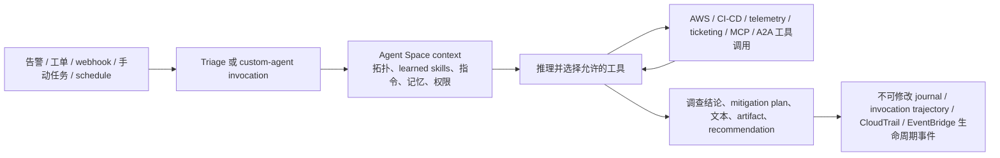

# AWS DevOps Agent 核心产品与运行机制

## 提纲

1. 生命周期、区域和产品边界
2. Agent Space 与环境知识如何形成
3. 触发、推理—工具—执行循环与运行边界
4. 现有 AWS / 第三方 / Agent 协议集成
5. 对 CI/CD 专家的技术启发、未公开项和时间线

## 结论先行

1. **事实：核心生产运维能力已 GA；产品并非整体无条件 GA。** AWS 于 2025-12-02 以 production operations public preview 发布，于 2026-03-31 宣布该核心能力 GA。截至 2026-08-03，Release management 仍是仅 `us-east-1` 的 Preview；它不改变生产运维、按需任务和 custom agents 在全部支持区域可用的事实，也不能被混写为整个产品都已 GA。[GA 公告](https://aws.amazon.com/about-aws/whats-new/2026/03/aws-devops-agent-generally-available/)；[区域表](https://docs.aws.amazon.com/devopsagent/latest/userguide/about-aws-devops-agent-supported-regions.html)
2. **事实：Agent Space 是隔离的最小控制面，不只是项目容器。** 它同时定义 AWS 账户/资源范围、第三方连接、权限、区域内数据落点和 Agent 可用工具；服务从其中跨账户、跨区域汇集运行数据，并自动构建应用拓扑与结构化 learned skills。[安全文档](https://docs.aws.amazon.com/devopsagent/latest/userguide/aws-devops-agent-security.html)；[拓扑文档](https://docs.aws.amazon.com/devopsagent/latest/userguide/about-aws-devops-agent-what-is-a-devops-agent-topology.html)
3. **事实：公开的“循环”是可审计的 tool-using agent，而不是公开了模型内部算法。** 以 custom agent 的规范化流程为例：加载 prompt/被授权 tools/skills → 连接 Agent Space MCP toolbox → 按任务推理并调用工具 → 输出文本、artifact 或 recommendation → 记录 reasoning、tool calls 和 results 的 trajectory。内建事件调查同样记录不可修改的 journal；AWS 没有公开所用具体基础模型、提示编排、规划器或重试策略。[Custom Agents](https://docs.aws.amazon.com/devopsagent/latest/userguide/working-with-devops-agent-custom-agents-index.html)；[安全文档](https://docs.aws.amazon.com/devopsagent/latest/userguide/aws-devops-agent-security.html)
4. **分析推断：真正的新机制是“持续生成、受控加载的环境模型”，而不是把聊天接到告警。** AWS 将资源、代码、部署、遥测、依赖和 pipeline 阶段编译成 topology + learned skills，并让每次调查/任务以这些受 IAM 约束的上下文和最小工具集运行。对 CI/CD 而言，这提供了从 commit / deployment 到生产因果证据的共同语义层；但公开证据不足以证明它能替代现有 CI 编排器、变更审批或 SLO gate。

## 1. 产品定位、生命周期与区域

### 1.1 定位和边界

| 项目 | 已核验的一手事实 | 结论边界 |
|---|---|---|
| 产品定位 | AWS 将其定义为跨 AWS、多云和本地环境的 AI-powered、always-available agent，覆盖 production operations 与 release management。生产运维包括 incident investigation、recommendations、prevention 和按需 SRE task。[产品概述](https://docs.aws.amazon.com/devopsagent/latest/userguide/about-aws-devops-agent.html) | 它是面向运行和交付上下文的 AWS 托管 Agent 服务；不是单一的 CI runner、监控产品或代码助手。 |
| 核心 GA 面 | Production operations 在 2026-03-31 GA；发布公告称其调查事件、预防事件、处理按需 SRE 任务，并新增 Azure/on-prem investigation、custom skills 和 charts/reports 等企业能力。[GA 公告](https://aws.amazon.com/about-aws/whats-new/2026/03/aws-devops-agent-generally-available/) | 可安全称“production operations GA”。不可由此宣称每一个后来加入的能力均 GA。 |
| Preview 面（仅作范围标记） | Release management 在 2026-06-17 发布为 Preview；官方区域表截至访问日仍标为 `us-east-1` only。[公告](https://aws.amazon.com/about-aws/whats-new/2026/06/aws-devops-agent-release-management/)；[区域表](https://docs.aws.amazon.com/devopsagent/latest/userguide/about-aws-devops-agent-supported-regions.html) | 本研究不展开其 review/testing 细节；此处只防止“全产品 GA”的错误表述。 |
| 服务区域 | 产品支持 11 个区域：`us-east-1`、`us-west-2`、`ca-central-1`、`sa-east-1`、`ap-south-1`、`ap-southeast-1`、`ap-southeast-2`、`ap-northeast-1`、`eu-central-1`、`eu-west-1`、`eu-west-2`。Production operations、on-demand tasks 和 custom agents 在全部支持区域可用。[区域表](https://docs.aws.amazon.com/devopsagent/latest/userguide/about-aws-devops-agent-supported-regions.html) | Agent Space 不必与被观测 workload 同区；支持区域和 inference/data-residency 边界仍须分别评估。 |

### 1.2 运行与数据区域边界

- **事实：**Agent Space、investigations、topology 与 recommendations 存在创建它的区域；关联账户中的资源可跨任意 AWS Region 被发现和调查。[区域表](https://docs.aws.amazon.com/devopsagent/latest/userguide/about-aws-devops-agent-supported-regions.html)
- **事实：**AWS 使用 Amazon Bedrock 进行推理，会在请求所属地理范围内择优路由；`ap-south-1`、`ap-southeast-1` 与 `sa-east-1` 是公开列出的全球跨区推理例外。数据仍存于 Agent Space 所在区域，prompt 和 output 可在上述范围内处理。[安全文档](https://docs.aws.amazon.com/devopsagent/latest/userguide/aws-devops-agent-security.html)
- **分析推断：**因此“将 Agent Space 放在某区域”同时是数据主存储、访问治理和 inference routing 设计选择；不能仅按被部署服务位置选址。

## 2. 技术机制 / 架构

### 2.1 Agent Space：隔离、权限与运行上下文的交点

**事实：**Agent Space 是首要安全边界；每个 Space 独立配置和权限，定义 Agent 可访问的 AWS accounts/resources，并建立第三方平台连接。管理员在 AWS Management Console 创建/配置它；操作者在 DevOps Agent web app 调查、看 topology 与 preventive improvements。[产品概述](https://docs.aws.amazon.com/devopsagent/latest/userguide/about-aws-devops-agent.html)；[安全文档](https://docs.aws.amazon.com/devopsagent/latest/userguide/aws-devops-agent-security.html)

**事实：**IAM primary role 覆盖创建 Space 的账户，secondary roles 覆盖追加的账户；AWS 建议仅授予调查所需的 read-only 权限。即使角色拥有更宽权限，服务也声称有内部访问控制来限制 action scope。[安全文档](https://docs.aws.amazon.com/devopsagent/latest/userguide/aws-devops-agent-security.html)

**分析推断：**它把传统“环境账号 + integration secret + bot role + runbook”从分散配置收束为一个可隔离、可审计的 Agent operating context。Space 应按 blast radius / 组织边界划分，而非单纯按团队聊天频道划分。

### 2.2 从原始连接到可用环境模型

| 层 | 官方事实 | CI/CD 含义（分析推断） |
|---|---|---|
| 原始资源和关系 | 自动扫描账户资源；关系来自 configuration、CloudFormation stacks 和 resource tags。CloudFormation 路径支持使用 CloudFormation 部署的 IaC（含 CDK）；非 CloudFormation 的 tagged resources 通过 Resource Explorer 发现。[拓扑文档](https://docs.aws.amazon.com/devopsagent/latest/userguide/about-aws-devops-agent-what-is-a-devops-agent-topology.html) | 静态资源清单被转换为带关系的图，减少将 deployment、服务和数据面孤立处理的风险。Resource Explorer/tag 质量成为非 CFN 环境的证据上限。 |
| 代码、部署、行为 | 接上 CI/CD 后，Agent 将 infra resources 关联到 deployment process、application/IaC changed code；CloudWatch Application Signals、Dynatrace 等观测行为可补充资源关系。[拓扑文档](https://docs.aws.amazon.com/devopsagent/latest/userguide/about-aws-devops-agent-what-is-a-devops-agent-topology.html) | 从 change 到运行症状有了可查询的关联路径；这不是自动证明因果关系，仍需在调查中以实际证据验证。 |
| Learned skills | 服务会从 Agent Space data 自动生成四类结构化 knowledge：Agent Space Understanding、Code Dependencies、Pipeline Topology、Tool Use Best Practices。前者写出服务/路径/部署环境/仓库映射和 observability coverage；后者分别覆盖服务/包依赖、pipeline stages/promotions/deployments，以及历史成功工具用法、错误和输出管理。[Learned Skills](https://docs.aws.amazon.com/devopsagent/latest/userguide/about-aws-devops-agent-learned-skills.html) | 这是一种“可加载的运行知识层”：不让每次 agent run 从零检索。它同时把 pipeline topology 变成生产调查可用输入。 |
| 更新和校验 | Agent Space Understanding 在增加、更新、删除 capability/integration 时生成；活跃 Space（近 30 天有至少一次 investigation）每三天刷新；Tool Use Best Practices 每 30 次调查更新。Summary report 是 versioned、read-only 的已知环境视图，支持回看版本。[Learned Skills](https://docs.aws.amazon.com/devopsagent/latest/userguide/about-aws-devops-agent-learned-skills.html) | CI/CD 平台团队应把 Summary report 当作“agent 所见系统”的可审查物，而不是假定环境上下文必然新鲜、完整或正确。 |

### 2.3 数据源、工具与扩展面

- **内建 / 已集成事实：**AWS 文档列出 CloudWatch、Datadog、Dynatrace、New Relic、Splunk、Grafana、GitHub、GitLab、Azure DevOps、ServiceNow、PagerDuty、Slack、Microsoft Teams；Azure subscription + Azure DevOps、EKS、multi-account AWS、CI/CD pipeline 和 telemetry/ticket/chat 可独立配置。[产品概述](https://docs.aws.amazon.com/devopsagent/latest/userguide/about-aws-devops-agent.html)；[集成文档](https://docs.aws.amazon.com/devopsagent/latest/userguide/configuring-integrations-and-knowledge.html)
- **MCP / A2A 事实：**可连 private/remote MCP servers；其 remote-server 面支持 MCP、ACP 和 A2A，且自带/外部 Agent 可在 Agent Space 中以 A2A 被调用为工具。custom agent 只能获得显式分配的 MCP tools。[产品概述](https://docs.aws.amazon.com/devopsagent/latest/userguide/about-aws-devops-agent.html)；[AWS 公告](https://aws.amazon.com/about-aws/whats-new/2026/06/aws-devops-agent-custom-agents/)
- **Knowledge 事实：**客户可上传 `AGENTS.md`、skills、attachments；Asset API 可用 CLI/SDK 管理。技能可指定 enable_tools；每个 Space 至多 200 个客户创建 skills。官方还支持从 GitHub repository 导入/同步 skill。[Assets 文档](https://docs.aws.amazon.com/devopsagent/latest/userguide/about-aws-devops-agent-managing-assets.html)
- **边界事实：**native tools 不会 mutate infrastructure/application，例外是创建 ticket/support case；custom MCP tools 可产生写操作，AWS 明确要求客户审查、测试，并建议 read-only / least privilege。[安全文档](https://docs.aws.amazon.com/devopsagent/latest/userguide/aws-devops-agent-security.html)

### 2.4 触发、推理与执行循环

图中是**基于官方分散描述的架构归纳**；其中 custom-agent 运行序列、事件调查触发和日志化是事实，具体模型规划算法未公开。

1. **触发与 triage（事实）。**生产调查可由 ServiceNow 等内建 integration、来自 PagerDuty/Grafana 等的 webhook 或手动启动。外部事件先在约 20 分钟回看窗口内与活跃调查做关联，产生 `Linked`、`Skipped` 或 `Proceed`；后两类以外的推理细节未公开。[Autonomous incident response](https://docs.aws.amazon.com/devopsagent/latest/userguide/production-operations-autonomous-incident-response.html)
2. **custom agent 的显式循环（事实）。**它加载 system prompt、已分配 tools 和 skills，接入 Agent Space MCP toolbox，只访问获配工具，按 skill 指示推理/调用工具，输出 text/artifact/recommendation，并记录完整 invocation trajectory。单次运行工具失败时，文档称 agent *may* retry、改走其他路径或报告失败，未承诺重试策略。[Custom Agents](https://docs.aws.amazon.com/devopsagent/latest/userguide/working-with-devops-agent-custom-agents-index.html)；[Executing custom agents](https://docs.aws.amazon.com/devopsagent/latest/userguide/custom-agents-executing-custom-agents.html)
3. **自动运行（事实）。**custom agent 支持按需或 schedule trigger；当前自动 trigger 是 EventBridge-compatible cron/rate schedule，而非任意事件直接调用 custom agent。自定义 Agent 一次只允许一个 invocation。[Executing custom agents](https://docs.aws.amazon.com/devopsagent/latest/userguide/custom-agents-executing-custom-agents.html)
4. **事件输出（事实）。**DevOps Agent 将 investigation/mitigation lifecycle 事件发送到 EventBridge default bus，源为 `aws.aidevops`；客户可通过 rule 将其接到 Lambda、SNS、ticketing 或 Step Functions。[EventBridge 集成](https://docs.aws.amazon.com/devopsagent/latest/userguide/configuring-integrations-and-knowledge-integrating-devops-agent-into-event-driven-applications-using-amazon-eventbridge-index.html)
5. **可审计性与安全（事实）。**incident/prevention journal 记录每个 reasoning step 和 action 且 Agent 不能改写；CloudTrail 记录 API calls。prompt-injection 保护包括 ASL-3 模型安全措施、Bedrock Guardrails filter、账户边界和不可修改的日志，但客户仍负责连接数据源与 BYO MCP 的可信和授权设计。[安全文档](https://docs.aws.amazon.com/devopsagent/latest/userguide/aws-devops-agent-security.html)

## 3. 对 CI/CD 专家的技术启发

以下均为**分析推断**，不应写成 AWS 已承诺的产品效果。

1. **核心资产从 pipeline definition 升级为可演化的“交付—运行知识图”。**传统 CI/CD 将 stages、artifacts、approvals 留在编排器内；这里的 Pipeline Topology 和 Code Dependencies 被生成成可在事件调查中加载的技能。一个成熟平台的评价重点因而是：变更、部署、资源、遥测与依赖是否能形成可验证的 traceability chain，而不只是流水线是否自动化。
2. **把验证分成“确定性证据”和“Agent 编排”两层。**AWS 在产品描述中同时强调 AI-driven correlation 和 deterministic proofs。可推导出较稳妥的 gate 设计：Agent 用于找上下文、缩小假设和编排读工具；权限、policy、测试断言、签名、审批与 SLO 仍应由可复现的外部 oracle 判定。不能因 Agent 能给 mitigation plan 或调用 MCP，就把它当成获得发布授权。
3. **runtime context 应具备版本、刷新和失效语义。**Learned skills 定期/随 integration change 更新，Summary report 版本化只读。这说明 Agent 的“记忆”是需要运维的派生配置：CI/CD 负责人要为 freshness、coverage、错误标签、依赖缺失和环境漂移建立验收，而非仅给模型更多 token。
4. **最小工具集是可操作的自治边界。**custom agent 在同一 Space 内仍只能调用授权工具，且 MCP 的外部写操作被视为额外风险。这比按“AI 能否执行”二分更有用：每种自动化应由 `Agent Space × role × assigned tools × trigger × external approval` 的组合界定。该组合能被审计和收缩。
5. **将 incident 生命周期反向接入 delivery，但保持异步。**EventBridge 可以把 investigation completed/failed 等状态送往 Lambda、SNS、ticket 或 Step Functions；因而适合形成“生产证据 → 人/规则复核 → backlog / pipeline 改进”的闭环。公开资料没有证明 AWS DevOps Agent 会自动修改 pipeline 或把 incident 结论直接变成 merge/deploy decision，设计上应保留独立的 verification gate。

## 4. 明确的公开边界与证据缺口

| 主题 | 结论 | 分类 |
|---|---|---|
| 模型和 agent planner | AWS 确认使用 Amazon Bedrock 与安全/Guardrails，但未公开具体 foundation model、prompt、token/context 管理、planner、tool-selection policy、ranking 或 retry algorithm。 | **未公开** |
| 内建生产运维执行权限 | 文档明确 native tools 不 mutate resources/application，例外为 tickets/support cases；同时 EventBridge 有 mitigation lifecycle events。公开材料不足以解释每种 mitigation 的精确定义、是否由何种客户工具执行、或其审批链。 | **事实 + 未公开** |
| 可用性/效果 | AWS 宣称 MTTR 可从 hours 到 minutes；这是厂商自述，当前材料没有提供可独立外推的客户样本、基线、成功率、误报率或跨环境 benchmark。 | **厂商自述 / 未公开** |
| 自定义扩展 | MCP/A2A/custom agents 是已公开扩展点，但 AWS 明确把 BYO MCP 的安全、数据源可信性和 least privilege 置于客户责任。 | **事实** |
| Release Management | 截至访问日 Preview、仅 `us-east-1`；本报告刻意不将其 feature set 用作核心 GA 产品能力证据。 | **事实 / 研究范围排除** |

## 5. 时间线

| 日期 | 事件 | 状态与本研究解读 | 原始来源（发布日期；访问日） |
|---|---|---|---|
| 2025-12-02 | AWS 宣布 DevOps Agent production operations public preview。 | Preview 起点；聚焦事故响应、RCA 与预防，不等同于后来 release-management capability 已发布。 | [AWS News Blog](https://aws.amazon.com/blogs/aws/aws-devops-agent-helps-you-accelerate-incident-response-and-improve-system-reliability-preview/)（2025-12-02；2026-08-03） |
| 2026-03-31 | AWS 宣布 DevOps Agent GA。 | **Production operations GA**；加入跨 Azure/on-prem 调查、custom skills、charts/reports 等。 | [AWS What's New](https://aws.amazon.com/about-aws/whats-new/2026/03/aws-devops-agent-generally-available/)（2026-03-31；2026-08-03） |
| 2026-03-28 至 2026-03-30 | 文档历史记录 EventBridge integration 与 GA 文档基线。 | 证明事件驱动外接面已被正式文档化；不单独证明任意外部 action 获授。 | [Document history](https://docs.aws.amazon.com/devopsagent/latest/userguide/document-history.html)（页面无统一发布日期；2026-08-03） |
| 2026-06-11 / 2026-06-12 | 文档记录 Code Dependencies、Pipeline Topology learned skills、custom agents、remote MCP/A2A、5 个新区域等。 | 环境知识、可扩展 agent 和多区域面在 GA 后继续扩展。 | [What's new](https://docs.aws.amazon.com/devopsagent/latest/userguide/whats-new.html)（页面无统一发布日期；2026-08-03） |
| 2026-06-15 | AWS 发布 custom SRE agents 与 MCP/A2A 公告。 | 公开确认 custom agents 可调度，第三方/BYOB sub-agent 可通过 A2A 加入。 | [AWS What's New](https://aws.amazon.com/about-aws/whats-new/2026/06/aws-devops-agent-custom-agents/)（2026-06-15；2026-08-03） |
| 2026-06-17 | AWS 发布 Release Management Preview。 | **产品存在 Preview 子能力**；在本报告中仅作产品生命周期边界。 | [AWS What's New](https://aws.amazon.com/about-aws/whats-new/2026/06/aws-devops-agent-release-management/)（2026-06-17；2026-08-03） |
| 2026-07-09 | 官方文档更新 feature-by-region 表。 | 截至 2026-08-03，Production operations/on-demand/custom agents 覆盖所有支持区域；Release management 仍仅 `us-east-1` Preview。 | [What's new](https://docs.aws.amazon.com/devopsagent/latest/userguide/whats-new.html)（2026-07-09 条目；2026-08-03） |

## 6. 关键来源登记

| 来源 | 类型 | 发布/更新状态 | 访问日 | 在本研究中的用途 |
|---|---|---|---|---|
| [About AWS DevOps Agent](https://docs.aws.amazon.com/devopsagent/latest/userguide/about-aws-devops-agent.html) | AWS 官方用户指南 | 未给单页发布日期；当前文档 | 2026-08-03 | 产品定位、双能力面、Agent Space、拓扑、集成清单、远程协议 |
| [Supported Regions](https://docs.aws.amazon.com/devopsagent/latest/userguide/about-aws-devops-agent-supported-regions.html) | AWS 官方用户指南 | 2026-07-09 功能区域表更新；当前文档 | 2026-08-03 | 支持区域、跨区 resource monitoring、Preview 限制、数据落点 |
| [AWS DevOps Agent is now generally available](https://aws.amazon.com/about-aws/whats-new/2026/03/aws-devops-agent-generally-available/) | AWS 官方公告 | 2026-03-31；GA 公告 | 2026-08-03 | production operations GA 时间点与范围 |
| [Preview launch blog](https://aws.amazon.com/blogs/aws/aws-devops-agent-helps-you-accelerate-incident-response-and-improve-system-reliability-preview/) | AWS 官方博客 | 2025-12-02；2026-03-31 标注 GA | 2026-08-03 | public preview 时间点 |
| [Topology](https://docs.aws.amazon.com/devopsagent/latest/userguide/about-aws-devops-agent-what-is-a-devops-agent-topology.html) | AWS 官方用户指南 | 未给单页发布日期；当前文档 | 2026-08-03 | 资源发现、关系来源、code/deployment mapping、技能输入 |
| [Learned Skills](https://docs.aws.amazon.com/devopsagent/latest/userguide/about-aws-devops-agent-learned-skills.html) | AWS 官方用户指南 | 未给单页发布日期；当前文档 | 2026-08-03 | 四类 generated knowledge、刷新周期、versioned summary report |
| [Custom Agents](https://docs.aws.amazon.com/devopsagent/latest/userguide/working-with-devops-agent-custom-agents-index.html) | AWS 官方用户指南 | 2026-06-12 文档引入；当前文档 | 2026-08-03 | prompt/tools/skills、逐次 invocation 机制、trajectory |
| [Executing custom agents](https://docs.aws.amazon.com/devopsagent/latest/userguide/custom-agents-executing-custom-agents.html) | AWS 官方用户指南 | 未给单页发布日期；当前文档 | 2026-08-03 | schedule triggers、单并发、tool result 语义 |
| [Autonomous incident response](https://docs.aws.amazon.com/devopsagent/latest/userguide/production-operations-autonomous-incident-response.html) | AWS 官方用户指南 | 未给单页发布日期；当前文档 | 2026-08-03 | 调查触发、triage、mitigation plan 的人机边界 |
| [Security](https://docs.aws.amazon.com/devopsagent/latest/userguide/aws-devops-agent-security.html) | AWS 官方用户指南 | 未给单页发布日期；当前文档 | 2026-08-03 | Agent Space 安全边界、IAM、Bedrock routing、journal、write 限制与 BYO MCP 风险 |
| [EventBridge integration](https://docs.aws.amazon.com/devopsagent/latest/userguide/configuring-integrations-and-knowledge-integrating-devops-agent-into-event-driven-applications-using-amazon-eventbridge-index.html) | AWS 官方用户指南 | 2026-03-28 文档历史记录；当前文档 | 2026-08-03 | investigation/mitigation lifecycle event 及可外接自动化 |
| [Custom agents / MCP / A2A announcement](https://aws.amazon.com/about-aws/whats-new/2026/06/aws-devops-agent-custom-agents/) | AWS 官方公告 | 2026-06-15；功能发布 | 2026-08-03 | custom SRE agents、headless access、bring-your-own sub-agents |
| [Release management preview announcement](https://aws.amazon.com/about-aws/whats-new/2026/06/aws-devops-agent-release-management/) | AWS 官方公告 | 2026-06-17；Preview | 2026-08-03 | 仅用于区分产品中仍为 Preview 的能力 |

## 可安全复用的表述

> AWS DevOps Agent 的 production-operations core 已 GA，但其 release-management capability 截至 2026-08-03 仍为 `us-east-1` Preview。其架构中心是 Agent Space：在这个隔离的权限与集成边界内，服务把资源、代码、部署和遥测关系生成 topology 与 learned skills，再由可审计的工具调用循环执行调查或自定义任务。该机制能把 CI/CD 与运行时证据连接起来，但不取代独立的确定性验证、权限和审批门禁。
