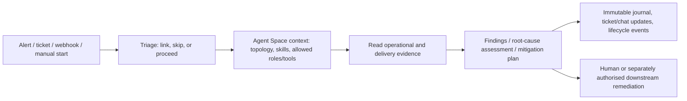

# AWS DevOps Agent：从运行时调查延伸到发布验证，但控制边界仍由 IAM、CI/CD 门禁和人承担

## 提纲

1. 生命周期、定位和可用范围
2. Runtime incident investigation / response 的数据、动作与人机边界
3. Release Management Preview 的验证机制和集成
4. 身份、跨账户、网络、加密与模型数据边界
5. onboarding、定价、配额、案例和证据缺口
6. 与传统 AIOps / runbook / release orchestration 的机制差异

## 结论先行

1. **生产运维与发布管理必须分开定性。**Production operations（investigation、recommendation、prevention）已于 2026-03-31 GA；Release management 于 2026-06-17 发布为 Preview，且截至截点仅在 `us-east-1`。因此不能写成“AWS DevOps Agent 全部能力 GA”。[GA 公告](https://aws.amazon.com/about-aws/whats-new/2026/03/aws-devops-agent-generally-available/)；[Release Preview 公告](https://aws.amazon.com/about-aws/whats-new/2026/06/aws-devops-agent-release-management/)；[区域表](https://docs.aws.amazon.com/devopsagent/latest/userguide/about-aws-devops-agent-supported-regions.html)
2. **它的新增机制不是单点告警摘要，而是把 topology、代码/部署关系、telemetry 和工具使用经验放进受权限约束的 Agent Space。**这个上下文可服务于运行时调查，也可服务于变更评审；但它并不替代确定性测试、分支保护、人工审批或有权限的变更执行器。[产品概述](https://docs.aws.amazon.com/devopsagent/latest/userguide/about-aws-devops-agent.html)；[Topology](https://docs.aws.amazon.com/devopsagent/latest/userguide/about-aws-devops-agent-what-is-a-devops-agent-topology.html)；[Learned skills](https://docs.aws.amazon.com/devopsagent/latest/userguide/about-aws-devops-agent-learned-skills.html)
3. **默认生产调查的工具面以读为主。**AWS 明确称 native tools 不会 mutate infrastructure/application，例外是创建 ticket 或 Support case；调查可给出 mitigation plan，但 remediation 的执行仍在 Agent 之外。客户接入的 MCP tool、webhook 下游自动化、或 Release Testing 对目标应用的 HTTP 测试才可能带来写入/副作用，须作为独立风险面治理。[Security](https://docs.aws.amazon.com/devopsagent/latest/userguide/aws-devops-agent-security.html)；[Autonomous incident response](https://docs.aws.amazon.com/devopsagent/latest/userguide/production-operations-autonomous-incident-response.html)；[Release testing](https://docs.aws.amazon.com/devopsagent/latest/userguide/release-management-release-testing.html)
4. **Release Management 的“自动”有两类不同执行面。**Review 可在 GitHub PR / GitLab MR 中自动触发，客户可将 blocking finding 配为 required status check / MR approval rule；automated verification testing 在 AWS-managed verification environment 中 build/run/test，而 release testing 则对 customer-provisioned deployed application 执行测试请求（包括 POST/PUT/DELETE）。前者不能修改 AWS infrastructure，后者可能修改应用测试数据。[Release readiness code reviews](https://docs.aws.amazon.com/devopsagent/latest/userguide/release-management-release-readiness-code-review.html)；[Release testing](https://docs.aws.amazon.com/devopsagent/latest/userguide/release-management-release-testing.html)

## 1. 产品定位、状态与时间线

| 时间 | 一手事实 | 状态 / 支持边界 |
|---|---|---|
| 2025-12-02 | AWS News Blog 宣布 public preview；文章描述从 metrics、logs、recent deployments、代码仓和 incident channel 中开展调查。 | **Public Preview**；原文当时只写 `us-east-1`。页面在 2026-03-31 注明已 GA。 [公告](https://aws.amazon.com/blogs/aws/aws-devops-agent-helps-you-accelerate-incident-response-and-improve-system-reliability-preview/) |
| 2026-03-31 | AWS 宣布 production operations GA：incident investigation、prevention、on-demand SRE task；发布材料还称新增 Azure/on-prem investigation、custom skills 和 charts/reports。 | **GA 只覆盖 production operations**，不自动延及随后推出的 release-management feature。 [GA 公告](https://aws.amazon.com/about-aws/whats-new/2026/03/aws-devops-agent-generally-available/) |
| 2026-06-11 | 文档历史记录 release management、自动 GitHub PR / GitLab MR review、Pipeline Topology / Code Dependencies learned skills。 | 文档功能时间线；不等价于所有功能 GA。 [What's New](https://docs.aws.amazon.com/devopsagent/latest/userguide/whats-new.html) |
| 2026-06-15 | AWS 宣布 custom SRE agents、MCP/A2A 和 headless access。 | 发布后运维的可扩展 automation 面；自定义工具仍由客户授权与审查。 [公告](https://aws.amazon.com/about-aws/whats-new/2026/06/aws-devops-agent-custom-agents/) |
| 2026-06-17 | AWS 宣布 Release management capability。 | **Preview，`us-east-1` only，preview 不额外收费。** [公告](https://aws.amazon.com/about-aws/whats-new/2026/06/aws-devops-agent-release-management/) |
| 2026-07-09 | AWS 在区域表中明确按 feature 列 availability，并增加 GitHub Enterprise Cloud data-residency instance 支持说明。 | 截至 2026-08-03，release management 仍为 Preview / `us-east-1` only。 [What's New](https://docs.aws.amazon.com/devopsagent/latest/userguide/whats-new.html)；[区域表](https://docs.aws.amazon.com/devopsagent/latest/userguide/about-aws-devops-agent-supported-regions.html) |

**定位（事实）：**AWS 将服务定位为覆盖 AWS、多云与本地环境的 DevOps Agent；生产运维面包含 incident investigation、recommendations、prevention 和 on-demand SRE task，发布管理面包含 readiness review 与 release testing。[产品概述](https://docs.aws.amazon.com/devopsagent/latest/userguide/about-aws-devops-agent.html)

**分析边界：**这说明它连接 delivery 与 operations 的上下文；不证明它是 CI runner、部署执行器、监控系统或完整 change-management system 的替代品。

## 2. Runtime incident investigation / response

### 2.1 可被调查的数据源和环境模型

| 层 | 官方明确的输入 / 机制 | 支持边界 |
|---|---|---|
| AWS resource / IaC | Agent 自动扫描关联账户资源；关系可来自 configuration、CloudFormation stacks、resource tags。CloudFormation 包含以 CloudFormation 部署的 IaC（包括 CDK）；non-CloudFormation tagged resources 通过 Resource Explorer 发现。 | topology 不是 IAM access inventory；标签 / CloudFormation / 集成质量限制其完整性。 [Topology](https://docs.aws.amazon.com/devopsagent/latest/userguide/about-aws-devops-agent-what-is-a-devops-agent-topology.html)；[IAM boundary](https://docs.aws.amazon.com/devopsagent/latest/userguide/aws-devops-agent-security-limiting-agent-access-in-an-aws-account.html) |
| 代码、部署和依赖 | 接入 CI/CD 后，Agent 关联 resources、deployment process、application/IaC changed code；Code Dependencies 与 Pipeline Topology learned skills 记录服务/包依赖、pipeline stage、environment promotion 和 deployment。 | 这是一套可检索关联，**不是**对某次变更已造成故障的自动因果证明。 [Topology](https://docs.aws.amazon.com/devopsagent/latest/userguide/about-aws-devops-agent-what-is-a-devops-agent-topology.html)；[Learned skills](https://docs.aws.amazon.com/devopsagent/latest/userguide/about-aws-devops-agent-learned-skills.html) |
| 运行 telemetry / operations | AWS 文档列出 CloudWatch、S3、Datadog、Grafana、New Relic、Splunk；Dynatrace 是双向 integration。启动博客演示了 CloudWatch metrics/logs、GitHub change、X-Ray trace 的关联。 | 对一向 telemetry source，AWS 建议 read-only token，称其仅用于 telemetry introspection；但对每种第三方数据的保留期、查询范围和根因准确率未量化。 [Telemetry sources](https://docs.aws.amazon.com/devopsagent/latest/userguide/configuring-integrations-and-knowledge-connecting-telemetry-sources-index.html)；[启动博客](https://aws.amazon.com/blogs/aws/aws-devops-agent-helps-you-accelerate-incident-response-and-improve-system-reliability-preview/) |
| Ticket / chat / 扩展工具 | ServiceNow、PagerDuty webhook、Slack / Teams，以及 private/remote MCP、ACP / A2A 可作为整合或行动面。 | 第三方工具权限和数据质量仍由客户的连接配置决定；BYO MCP 不自动继承 native-tool 防护。 [产品概述](https://docs.aws.amazon.com/devopsagent/latest/userguide/about-aws-devops-agent.html)；[Security](https://docs.aws.amazon.com/devopsagent/latest/userguide/aws-devops-agent-security.html) |

**环境知识的刷新（事实）：**Agent Space Understanding 会随 capability / integration 的添加、更新或删除生成；活跃空间（近 30 日至少一次 investigation）每三日刷新；Tool Use Best Practices 每 30 次 investigation 更新。Summary report 是 versioned、read-only 的环境知识视图。[Learned skills](https://docs.aws.amazon.com/devopsagent/latest/userguide/about-aws-devops-agent-learned-skills.html)

**使用含义（分析）：**这是可审查的“agent 所见系统”而非实时真相；将其作为 production evidence 时应核对时间戳、缺失 account / integration 和变化窗口。

### 2.2 触发、调查工作流和输出

图为下列官方描述的**流程归纳**，并非 AWS 公布的内部模型架构。

- **启动和 triage（事实）：**investigation 可从 ServiceNow 等集成、PagerDuty/Grafana webhook 或人工启动；外部事件会在约 20 分钟回看窗口中与 active investigation 关联，结果为 `Linked`、`Skipped` 或 `Proceed`。这称为 autonomous incident response，但文档未公开其模型的完整分类规则或置信度阈值。[Autonomous incident response](https://docs.aws.amazon.com/devopsagent/latest/userguide/production-operations-autonomous-incident-response.html)
- **调查 / 协作（事实）：**启动博客展示 Agent 关联 CloudWatch telemetry、external logs、recent GitHub changes 与 X-Ray，输出 timeline、investigation summary，并可在 Slack / ticket 中更新；operator 可在 web app 中查看、提问和 steer investigation。[启动博客](https://aws.amazon.com/blogs/aws/aws-devops-agent-helps-you-accelerate-incident-response-and-improve-system-reliability-preview/)
- **审计（事实）：**security 文档说 journal 记录每一步 reasoning 和 action 且不能由 agent 修改；release-review 文档也给每次 review execution journal。AWS 同时有 CloudTrail / EventBridge 集成文档可用于外围审计和事件驱动编排，但不等于 agent 自身会执行 remediation。[Security](https://docs.aws.amazon.com/devopsagent/latest/userguide/aws-devops-agent-security.html)；[EventBridge integration](https://docs.aws.amazon.com/devopsagent/latest/userguide/configuring-integrations-and-knowledge-integrating-devops-agent-into-event-driven-applications-using-amazon-eventbridge-index.html)

### 2.3 写动作、审批与自治边界

| 动作面 | 可核验结论 | 人 / 控制边界 |
|---|---|---|
| Native production-operations tools | AWS 说 native tools 不能 mutate infrastructure / application；例外是 opening ticket / support case。IAM guardrail 明确不含 `s3:PutObject`、`ec2:TerminateInstances`、`dynamodb:DeleteItem` 等写操作，即使 role 更宽也不能执行。 | 不能据此宣称会自动恢复生产；plan / recommendation 要由 operator 或独立执行器消费。 [Security](https://docs.aws.amazon.com/devopsagent/latest/userguide/aws-devops-agent-security.html)；[IAM limiting guide](https://docs.aws.amazon.com/devopsagent/latest/userguide/aws-devops-agent-security-limiting-agent-access-in-an-aws-account.html) |
| Mitigation | Agent 输出 mitigation plan / implementation guidance；官方示例明确是帮助 restore service 的规格。Support case 的升级需要用户选择 human support、审阅将共享的摘要、选择 severity 并提交。 | 文档没有将 plan 变成“自动执行 AWS remediation”的承诺；Support case 也是 human-confirmed 的外部写入。 [启动博客](https://aws.amazon.com/blogs/aws/aws-devops-agent-helps-you-accelerate-incident-response-and-improve-system-reliability-preview/)；[Autonomous incident response](https://docs.aws.amazon.com/devopsagent/latest/userguide/production-operations-autonomous-incident-response.html) |
| Custom MCP / A2A | custom tools 可能有写操作；AWS 要求客户 review / test，并建议 read-only、least privilege。 | MCP server、它使用的 credentials 和下游工具引入独立行动风险，不被 native tool 的“不变更资源”表述覆盖。 [Security](https://docs.aws.amazon.com/devopsagent/latest/userguide/aws-devops-agent-security.html) |
| 下游自动化 | Investigation / mitigation lifecycle 可以向 EventBridge 发事件，客户可再接 Lambda、pipeline 或其他 executor。 | EventBridge 只是集成面；是否执行、权限、审批、rollback 和 SLO gate 必须在下游明确实现与审核。 [EventBridge integration](https://docs.aws.amazon.com/devopsagent/latest/userguide/configuring-integrations-and-knowledge-integrating-devops-agent-into-event-driven-applications-using-amazon-eventbridge-index.html) |

## 3. Release Management（Preview）：机制、测试与 CI/CD 集成

### 3.1 两类验证面及其差异

| 能力 | 已核验机制 | 强制与副作用边界 |
|---|---|---|
| Release readiness code review | 检查 internal standards（natural-language Skills）、cross-repository dependency、access-control；对 CloudFormation change 还验证 IAM/resource policy/network configuration 是否符合 Well-Architected practice。输出 `BLOCK` / `Proceed with Caution` / `Safe to Release` 和 findings。 | 推荐动作不是合并本身；GitHub 可配置 required status check、GitLab 可配置 MR approval rule，是否真正 gate 由仓库设置决定。 [Release management](https://docs.aws.amazon.com/devopsagent/latest/userguide/working-with-devops-agent-release-management-index.html)；[Code review](https://docs.aws.amazon.com/devopsagent/latest/userguide/release-management-release-readiness-code-review.html) |
| Automated verification testing | 在 AWS-managed verification environment clone code，按 project file 确定 build/dependency，build/run/test；结果并入 review report。 | 文档称会阻断 mutative AWS API calls，允许 read-only API；不可将此表述外推到目标应用或外部 CI job。 [Code review](https://docs.aws.amazon.com/devopsagent/latest/userguide/release-management-release-readiness-code-review.html) |
| Release testing | 对 customer-provisioned、已部署的 web application / REST API 生成并运行 change-specific plan；覆盖 UI、API contract、integration、edge case。 | **会对 target application 发送 POST / PUT / DELETE，可能创建、修改、删除数据。**应使用测试账户、幂等 test data 和环境隔离；它不是无副作用的 gate。 [Release testing](https://docs.aws.amazon.com/devopsagent/latest/userguide/release-management-release-testing.html) |

### 3.2 触发点和 GitHub / GitLab / IDE 集成

- **PR / MR（事实）：**为 connected GitHub repository / GitLab project 启用 per-repository capability 后，PR/MR open 或 update 自动触发 review，finding 成为 inline comment。GitHub 可将 blocking finding 设成 required status check；GitLab 可设 MR approval rule。两个 capability（auto trigger review、automated verification testing）可独立启用。[Code review](https://docs.aws.amazon.com/devopsagent/latest/userguide/release-management-release-readiness-code-review.html)
- **GitHub source-control permission（事实）：**官方 GitHub integration 文档将 default 设为 Read & Write，可评论、propose fixes、trigger workflows；read-only 无这些能力。这个 repository permission 不等于自动 merge 或 production deployment permission，且实际 blocking 仍取决于 branch protection / required check 配置。[Connecting GitHub](https://docs.aws.amazon.com/devopsagent/latest/userguide/connecting-to-cicd-pipelines-connecting-github.html)
- **Pipeline（事实）：**release testing 可在 GitHub Actions 或 GitLab CI stage 调用。AWS 文档明确 `aws-actions/devops-agent-release-testing@v1` 由部署后触发并回报 GitHub Check Run；所需 webhook URL / signing secret 作为 GitHub repository secrets。文档示例在另处使用 `aws-actions/devops-agent-qa@v1`，两处 action 名不一致，实施前必须以 [官方 action 仓库](https://github.com/aws-actions) 与当前文档复核，不能在本研究中断言唯一 action identifier。[Release testing](https://docs.aws.amazon.com/devopsagent/latest/userguide/release-management-release-testing.html)
- **IDE / chat（事实）：**Kiro Power、Claude Code plugin、AWS Transform custom skill 和 DevOps Agent chat 均可发起 review / testing；coding agent 可据结果提出或生成 fix，但这不等于已有人工 review、commit 或 deploy 被自动批准。[Code review](https://docs.aws.amazon.com/devopsagent/latest/userguide/release-management-release-readiness-code-review.html)；[Release testing](https://docs.aws.amazon.com/devopsagent/latest/userguide/release-management-release-testing.html)
- **私网 build 依赖（事实）：**verification environment 默认不能访问 internal systems；若 build 需要 private registry / artifact store，需要给 GitHub / GitLab provider 关联 private connection 和 optional runtime IAM role。环境会在客户 VPC 建立 ENI，网络流量按客户网络路由 / firewall 规则行进。[Code review](https://docs.aws.amazon.com/devopsagent/latest/userguide/release-management-release-readiness-code-review.html)

**产品状态与可用范围：**release management 截止 2026-08-03 是 `us-east-1` only Preview；preview 免费。因此任何“正式生产 release gate 已规模验证”判断保持阻塞。[区域表](https://docs.aws.amazon.com/devopsagent/latest/userguide/about-aws-devops-agent-supported-regions.html)；[Preview 公告](https://aws.amazon.com/about-aws/whats-new/2026/06/aws-devops-agent-release-management/)

## 4. Security、IAM、跨账户、网络与数据 / 模型边界

### 4.1 身份与跨账户

- **Agent Space 是首要 security boundary（事实）：**每个 space 独立配置 / permissions，限定 AWS accounts/resources 与 third-party connection；Agent Space data（investigation、topology、recommendation）存于创建区域。[Security](https://docs.aws.amazon.com/devopsagent/latest/userguide/aws-devops-agent-security.html)；[区域表](https://docs.aws.amazon.com/devopsagent/latest/userguide/about-aws-devops-agent-supported-regions.html)
- **IAM role 不是装饰（事实）：**primary account role 覆盖创建 Space 的账户，secondary account role 覆盖外加账户；topology 不决定可访问资源，IAM policies 才是限制 service API / resource 的真正边界。每个 session 还带 permission guardrail，effective permission 是 IAM role policy 与 guardrail 的交集。[IAM limiting guide](https://docs.aws.amazon.com/devopsagent/latest/userguide/aws-devops-agent-security-limiting-agent-access-in-an-aws-account.html)
- **跨账户（事实）：**secondary role 由 `aidevops.amazonaws.com` 直接 assume，trust policy 使用 confused-deputy prevention，且只允许指定 primary-account Agent Space；AWS managed `AIDevOpsAgentAccessPolicy` 提供 core read-only permission，另有 agent-space-specific inline policy。客户仍需 secondary-account admin / create-role 权限完成 onboarding。[Multiple accounts](https://docs.aws.amazon.com/devopsagent/latest/userguide/configuring-integrations-and-knowledge-connecting-multiple-aws-accounts.html)

### 4.2 数据处理、Bedrock 与加密

| 主题 | 一手事实 | 设计边界 |
|---|---|---|
| 推理路由 | AWS 使用 Amazon Bedrock；Agent Space data 留在 Space Region，而 prompt / output 可在相同 geography 内处理。`ap-south-1`、`ap-southeast-1`、`sa-east-1` 是公开列出的 global cross-region inference 例外；文档还指出 SCP / Control Tower content-region policy 不影响 DevOps Agent / Bedrock 的该路由。 | data residency 要同时评估 storage region 和 inference-processing geography，不能只看 workload region。 [Security](https://docs.aws.amazon.com/devopsagent/latest/userguide/aws-devops-agent-security.html) |
| 跨区观测 | 在支持 Region 创建的 Space 能 discovery / investigate associated account 的任意 AWS Region resources。 | 能跨区查资源不表示 investigation / topology data 随 workload 地区存放。 [区域表](https://docs.aws.amazon.com/devopsagent/latest/userguide/about-aws-devops-agent-supported-regions.html) |
| at-rest encryption | 默认 AWS owned key 加密；可配 symmetric customer-managed KMS key。CMK 可加密 Agent Space details / investigations / skills / chat，以及 third-party credentials；multi-region/asymmetric KMS key 不支持。 | 使用 CMK 有标准 KMS 费用；key policy 须同时给 caller 和 `aidevops.amazonaws.com` async background operation 权限。 [Encryption at rest](https://docs.aws.amazon.com/devopsagent/latest/userguide/aws-devops-agent-security-encryption-at-rest-for-devops-agent.html) |
| 模型改进使用 | Security guide 说明 AWS 不使用 customer content 改进服务；用户可提交 in-product feedback 改进 agent response / investigation，但 AWS 不用该反馈改善服务本身。 | 此为 AWS 厂商自述，未在本研究中以独立审计报告交叉验证。 [Security](https://docs.aws.amazon.com/devopsagent/latest/userguide/aws-devops-agent-security.html) |

**敏感内容边界（事实）：**AWS 文档没有称会从 investigation summary 中自动过滤 PII。将 logs、tickets、tags 或 repository content 接入前，客户仍要按 data classification 与 source permission 确定可让 Agent 读取的内容。[Security](https://docs.aws.amazon.com/devopsagent/latest/userguide/aws-devops-agent-security.html)

### 4.3 网络、prompt injection 与扩展面

- **Private connection（事实）：**AWS DevOps Agent 用 VPC Lattice 建 secure path；service-managed resource gateway 在指定 VPC subnet 建 ENI，客户用 security group 控制流量，目标工具不必公开到 internet。private connection 必须与 Agent Space 同 Region；跨区域目标需要 self-managed VPC Lattice + peering / Transit Gateway 方案。[Private connections](https://docs.aws.amazon.com/devopsagent/latest/userguide/configuring-integrations-and-knowledge-connecting-to-privately-hosted-tools.html)
- **Public endpoint（事实）：**若第三方 / MCP 为 public 且靠 IP allowlist，客户需按 Security 页给出的 region-specific source IP 配 firewall；该 IP **不适用于** private connection，私网流量来自 Resource Gateway ENI。[Security](https://docs.aws.amazon.com/devopsagent/latest/userguide/aws-devops-agent-security.html)；[Private connections](https://docs.aws.amazon.com/devopsagent/latest/userguide/configuring-integrations-and-knowledge-connecting-to-privately-hosted-tools.html)
- **Prompt injection（事实与边界）：**AWS 说 agent 消费 logs、tags 等非可信 operational input，采用 account boundary、limited native write、journal、ASL-3 protections 与 Bedrock Guardrails filter；同时明确 BYO MCP 与能写这些 data sources 的 authorized users 提高风险。故“有 Guardrail”不是“安全授权可放宽”的证据。[Security](https://docs.aws.amazon.com/devopsagent/latest/userguide/aws-devops-agent-security.html)

## 5. Onboarding、区域、定价和配额

### 5.1 最小上线清单（基于官方 setup 的归纳）

1. 在支持 Region 创建 Agent Space，并选择 data / inference residency 可接受的 Region；production operations 已覆盖 11 个 listed Regions，release Preview 只在 `us-east-1`。[区域表](https://docs.aws.amazon.com/devopsagent/latest/userguide/about-aws-devops-agent-supported-regions.html)
2. 以 least privilege 配 primary role；按 application boundary 追加 secondary accounts，并验证 trust condition、managed policy 和 space-specific inline policy。[Multiple accounts](https://docs.aws.amazon.com/devopsagent/latest/userguide/configuring-integrations-and-knowledge-connecting-multiple-aws-accounts.html)
3. 连接 telemetry、ticket/chat、GitHub/GitLab 和必要的 private tools；先审查 topology / versioned Summary report 是否覆盖关键变更和运行证据。[Topology](https://docs.aws.amazon.com/devopsagent/latest/userguide/about-aws-devops-agent-what-is-a-devops-agent-topology.html)；[Learned skills](https://docs.aws.amazon.com/devopsagent/latest/userguide/about-aws-devops-agent-learned-skills.html)
4. 若启用 release preview，为每个 repository 独立选择 auto-review / verification testing，显式配置 branch-protection / approval rule；私网依赖才给予必要 VPC path 和 runtime role。[Code review](https://docs.aws.amazon.com/devopsagent/latest/userguide/release-management-release-readiness-code-review.html)
5. 为 release testing 单独使用 sandbox / non-production target、最小权限 test credential 和可清理测试数据，因为 HTTP method 可写入目标系统。[Release testing](https://docs.aws.amazon.com/devopsagent/latest/userguide/release-management-release-testing.html)

### 5.2 定价与可扩展上限

- **生产运维价格（AWS 当前公开页，访问日 2026-08-03）：**按 agent actively working 的累计时间、per-second billing；investigation、site-reliability evaluation、on-demand SRE task 的 pay-as-you-go 标价均为 **US$0.0083 / agent-second**。Release management 在 Preview 期间不额外收费。新客户 GA 后从 first operational task 起有 2-month trial，每月上限为 10 spaces、20 investigation hours、15 evaluation hours、20 on-demand SRE-task hours；超出或试用结束后按价计费。[Pricing](https://aws.amazon.com/devops-agent/pricing/)
- **Support credit（AWS 当前公开页）：**付费 Support 客户按上月 Support charge 获 monthly DevOps Agent credit：Unified Operations 100%、Enterprise Support 75%、Business Support+ 30%，当月过期。这是价格抵扣机制，不是服务能力或效果证据。[Pricing](https://aws.amazon.com/devops-agent/pricing/)
- **默认 quotas（区域级，除非另注）：**100 Agent Spaces/account/Region；3 concurrent investigations/space（可调）；1 concurrent prevention evaluation（不可调）；10 concurrent on-demand invocations（可调）；4 concurrent release-readiness reviews（可调）；4 concurrent automated release tests（可调）；500 MCP tools/space（不可调）；200 custom agents/space、5 concurrent custom-agent invocations/space、同一 custom agent 仅 1 concurrent invocation、1-hour invocation timeout（均不可调）。Service Quotas 可请求部分提高，AWS 不承诺立即批准。[Quotas](https://docs.aws.amazon.com/devopsagent/latest/userguide/quotas.html)

## 6. 与传统机制的差异：事实与分析必须分开

| 对比对象 | 可核验机制差异 | 不应外推的结论 |
|---|---|---|
| 传统 AIOps / observability alert | DevOps Agent 将 resource topology、code/deployment mapping、telemetry、learned tool-use knowledge 放入同一个 Agent Space 后再调查，而不仅接收一个 alert payload。 | 不能因此声称其 root-cause accuracy / MTTR 优于某 AIOps 产品；AWS 未在所检一手资料提供可横比的独立实验。 |
| Runbook automation | Custom agent 可 schedule、可拿被分配 MCP tools；native production tool 则以读和 plan 为主。 | Runbook 的确定性 action、rollbacks、change authorization 和 approval 仍需在独立 automation / policy 中实现；MCP action 也不能自动获得批准。 |
| CI/CD release orchestration | Release review 从 architecture / dependency / natural-language skills 推理风险，并有 managed verification testing；release testing 则按 change 生成在真实 target 上的测试。 | 其 `BLOCK` recommendation 并非 pipeline enforcement；合并 / 部署 gate 仍取决于 GitHub/GitLab policy、CI job exit/status 和人为授权。 |

**综合分析（有证据支撑的推断）：**产品的核心变化是将发布前和生产后的 evidence graph 共用，而不只是把 LLM 接入告警或 pipeline。实际企业控制面仍至少有四条独立线：IAM / network access、可重复验证、merge / deploy enforcement、change approval。任一条缺失都不能由 Agent Space、journal 或 recommendation 自动补足。

## 7. 可验证案例与证据缺口

### 7.1 可验证材料

- **官方演示，不是客户案例：**2025-12-02 AWS News Blog 用故意抛错的 Lambda + CloudFormation + CloudWatch Alarm 演示手动调查、logs / changes / X-Ray correlation 和 mitigation plan。它可验证 AWS 当时展示的产品流程，**不能**验证客户 MTTR、准确率、覆盖率或生产效果。[启动博客](https://aws.amazon.com/blogs/aws/aws-devops-agent-helps-you-accelerate-incident-response-and-improve-system-reliability-preview/)
- **官方价格示例，不是实际案例：**pricing page 给出 10 次、每次平均 8 分钟 investigation 的月费 US$39.84 示例；这是定价计算，不是成本或使用量基准。[Pricing](https://aws.amazon.com/devops-agent/pricing/)

### 7.2 本研究的证据缺口（截至 2026-08-03）

1. 在此次 AWS 官方产品页、文档、公告、博客与官方 GitHub action 入口的检索范围内，**未识别到可审计的具名客户 case study**，能够报告 incident diagnosis accuracy、false positive、MTTR、change failure rate 或 release-test defect catch rate 的前后对照。该表述仅是本次搜索范围的负结果，**不等于业界不存在案例**。
2. AWS 没有公开所用基础模型名称、prompt / planner、评估集、置信度计算或 incident triage / root-cause 的失败率；不能把“ASL-3 / Guardrails”写成独立的安全或准确性证明。
3. Release management 仍 Preview；尽管文档描述 GitHub/GitLab/IDE/CI integration，缺少 GA SLA、全区域支持日程、长期 pricing 及实际 production gate 成效证据。
4. Release-testing documentation 明确 target side effect，但没有公开 test-data isolation、rollback、credential scoping 或 destructive endpoint protection 的完整 reference implementation；试点应先补这些控制证据。

## 8. 关键来源登记

| 来源 | 类型 | 发布 / 更新信息 | 访问日 | 本研究使用范围 |
|---|---|---|---|---|
| [AWS DevOps Agent is now generally available](https://aws.amazon.com/about-aws/whats-new/2026/03/aws-devops-agent-generally-available/) | AWS What’s New | 2026-03-31；GA announcement | 2026-08-03 | production operations GA 范围 |
| [Preview launch blog](https://aws.amazon.com/blogs/aws/aws-devops-agent-helps-you-accelerate-incident-response-and-improve-system-reliability-preview/) | AWS News Blog | 2025-12-02；2026-03-31 标注 GA | 2026-08-03 | 预览时间、官方 walkthrough、调查 inputs / 输出 |
| [Release management preview](https://aws.amazon.com/about-aws/whats-new/2026/06/aws-devops-agent-release-management/) | AWS What’s New | 2026-06-17；Preview | 2026-08-03 | Preview、`us-east-1`、免费期 |
| [Supported Regions](https://docs.aws.amazon.com/devopsagent/latest/userguide/about-aws-devops-agent-supported-regions.html) | AWS User Guide | 文档功能表 2026-07-09 更新 | 2026-08-03 | 11 regions、跨区监控、feature availability、data storage |
| [Autonomous incident response](https://docs.aws.amazon.com/devopsagent/latest/userguide/production-operations-autonomous-incident-response.html) | AWS User Guide | 单页未给发布日期 | 2026-08-03 | 触发、triage、investigation / mitigation lifecycle |
| [Release management](https://docs.aws.amazon.com/devopsagent/latest/userguide/working-with-devops-agent-release-management-index.html) | AWS User Guide | 文档 2026-06-11 引入 | 2026-08-03 | capability / workflow / entry points |
| [Release readiness code reviews](https://docs.aws.amazon.com/devopsagent/latest/userguide/release-management-release-readiness-code-review.html) | AWS User Guide | 单页未给发布日期 | 2026-08-03 | GitHub/GitLab, verification environment, safety guardrails, merge configuration |
| [Release testing](https://docs.aws.amazon.com/devopsagent/latest/userguide/release-management-release-testing.html) | AWS User Guide | 单页未给发布日期 | 2026-08-03 | target types、HTTP side effects、GitHub Actions / CI integration |
| [Telemetry sources](https://docs.aws.amazon.com/devopsagent/latest/userguide/configuring-integrations-and-knowledge-connecting-telemetry-sources-index.html) | AWS User Guide | 单页未给发布日期 | 2026-08-03 | telemetry source、token 与读写边界 |
| [Connecting GitHub](https://docs.aws.amazon.com/devopsagent/latest/userguide/connecting-to-cicd-pipelines-connecting-github.html) | AWS User Guide | 单页未给发布日期 | 2026-08-03 | repository read / write integration boundary |
| [Security](https://docs.aws.amazon.com/devopsagent/latest/userguide/aws-devops-agent-security.html) | AWS User Guide | 单页未给发布日期 | 2026-08-03 | native write limit、journal、Bedrock routing、prompt injection、shared responsibility |
| [Limiting agent access](https://docs.aws.amazon.com/devopsagent/latest/userguide/aws-devops-agent-security-limiting-agent-access-in-an-aws-account.html) | AWS User Guide | 单页未给发布日期 | 2026-08-03 | role, guardrail, resource/service/region restriction |
| [Connecting multiple AWS accounts](https://docs.aws.amazon.com/devopsagent/latest/userguide/configuring-integrations-and-knowledge-connecting-multiple-aws-accounts.html) | AWS User Guide | 单页未给发布日期 | 2026-08-03 | direct service-principal trust、managed/inline policies |
| [Private connections](https://docs.aws.amazon.com/devopsagent/latest/userguide/configuring-integrations-and-knowledge-connecting-to-privately-hosted-tools.html) | AWS User Guide | 单页未给发布日期 | 2026-08-03 | VPC Lattice、ENI、private endpoint、cross-region constraint |
| [Encryption at rest](https://docs.aws.amazon.com/devopsagent/latest/userguide/aws-devops-agent-security-encryption-at-rest-for-devops-agent.html) | AWS User Guide | 单页未给发布日期 | 2026-08-03 | KMS scope、key constraints、service principal |
| [Quotas](https://docs.aws.amazon.com/devopsagent/latest/userguide/quotas.html) | AWS User Guide | 单页未给发布日期 | 2026-08-03 | default / adjustable limits |
| [Pricing](https://aws.amazon.com/devops-agent/pricing/) | AWS product pricing | 页面未显式发布日期；当前价格页 | 2026-08-03 | per-second price、trial、credit、preview cost |

## 可安全复用的结论

> 截至 2026-08-03，AWS DevOps Agent 已将 GA 的 production operations 与仍处 Preview 的 release-management capability 置于同一 Agent Space 语义层：它可把资源、代码、部署、遥测和组织知识关联起来，做调查、风险评审与变化相关测试。但其自治不是免控制的部署自治：默认生产工具读多写少，Release Testing 会对目标应用产生真实请求副作用，而合并、部署、恢复和权限升级仍必须由 IAM、测试隔离、CI/CD 强制门禁和人类审批分别控制。
