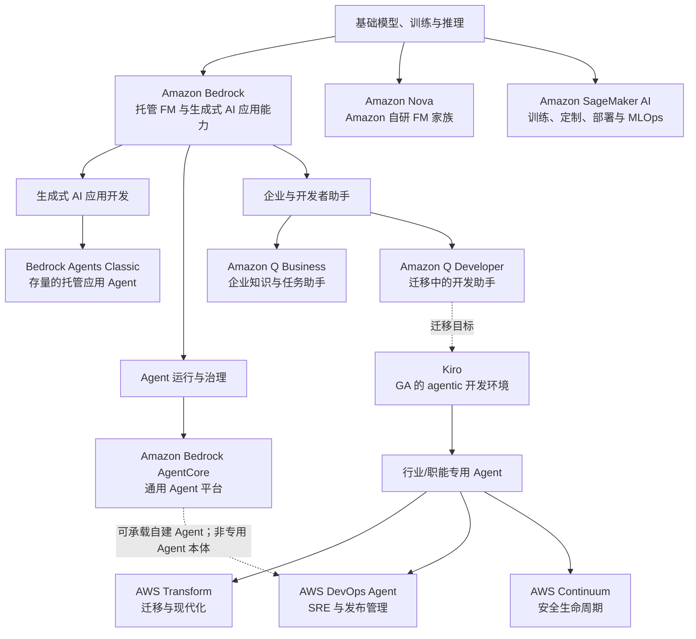

# AWS 主要 LLM 与生成式 AI 产品全景（截至 2026-08-03）

## 提纲

1. 研究范围与分层原则
2. 全景结论与产品关系
3. 产品卡片：定位、用户、生命周期、边界
4. 状态与命名的关键分界
5. 官方来源登记

## 1. 范围与分层原则

### 1.1 本研究回答什么

本文件建立 AWS 的**主要产品层级**，不是罗列所有带 AI 的 AWS 服务。纳入对象必须至少承担下列一种明确角色：

- 提供或训练/托管基础模型；
- 让开发者构建、检索、编排或评估生成式 AI 应用；
- 承担 Agent 的运行、身份、工具授权、可观测或治理；
- 直接面向企业员工、开发者、运维或安全团队提供助手/专用 Agent。

不纳入单一模型版本、单点 Bedrock 工具、Amazon Q 在 Quick/Connect/Supply Chain 等既有业务产品内的嵌入式体验，或与上述层级没有直接产品关系的一般 AI 服务。它们是能力或嵌入点，不是本全景的独立主产品层。

### 1.2 层级图

图中实线表示公开的产品/使用关系；虚线表示官方资料支持的相邻关系或架构定位，**不**表示一个产品必然建立在另一个产品之上。

## 2. 全景结论

1. **AWS 把“模型访问/应用构建”和“自建 Agent 生产运行”拆成两个产品层。**Amazon Bedrock 是托管基础模型与生成式 AI 应用能力的入口；Amazon Bedrock AgentCore 是可选、可组合的通用 Agent 平台，支持 Bedrock 内外的模型和多种开源框架。[S1][S6]
2. **Bedrock Agents 已不是新项目的默认落点。**原 `Agents for Amazon Bedrock` 已命名为 **Amazon Bedrock Agents Classic**；截至观察日，既有客户仍可用，但该服务自 2026-07-30 起不再向新客户开放，AWS 明确指向 AgentCore 作为相近能力的去向。[S5]
3. **AWS 的“开箱即用 Agent”分成不同职能边界。**Q Business 面向权限感知的企业知识与任务；Kiro 面向从规格到代码/测试的开发；Transform 面向大规模现代化；DevOps Agent 面向运维与发布；Continuum 面向软件生命周期安全。它们不能被简化为同一个“Bedrock Agent”产品。[S8][S10][S12][S14][S17]
4. **产品 GA 不等于全部子能力 GA。**截至观察日，DevOps Agent 的 production operations 已 GA，但 Release Management 仅 `us-east-1` Preview；Continuum 的 code vulnerabilities 是 gated preview，penetration testing、code scanning 和 threat modeling 也都是 Preview。[S14][S15][S17]

## 3. 产品卡片

### 3.1 基础模型与训练/推理

| 产品 | 是什么 / 服务领域 | 主要用户 | 生命周期状态（截至观察日） | 与相邻产品关系 | 事实边界 | 证据 |
|---|---|---|---|---|---|---|
| **Amazon Bedrock** | 托管服务，提供来自 AWS 与第三方的高性能基础模型，以及构建和扩展生成式 AI 应用的能力。 | 应用开发团队、平台团队、需要受管模型访问的企业。 | **GA**；AWS 于 2023-09-28 宣布 Bedrock GA。 | 是 Nova 的 API 访问层，也是 Q Business 所使用的基础平台；可与 AgentCore 结合，但 AgentCore 不要求只用 Bedrock 模型。 | Bedrock 是模型访问与生成式 AI 应用平台，不等同于某一个基础模型、完整的 Agent 运行时，或某个职能 Agent。具体模型和功能的区域/Preview 状态须逐项核验。 | [S1][S2] |
| **Amazon Nova** | Amazon 自研基础模型家族，覆盖理解、创作与语音；可用于文本、图像、视频、语音、API 调用与 agentic AI。 | 需要 Amazon 自研多模态 FM 的应用/模型开发团队。 | **可用的 FM 家族**；官方当前文档同时列出 Nova 2，并说明本页是 Version 1 文档。不能将“Nova”整体写成单一版本或单一状态。 | 通过 **Amazon Bedrock API** 使用；是 Bedrock 模型目录中的一个模型提供方/家族，不是 Bedrock 的替代服务。 | 不把 Nova 的模型能力外推为已交付的应用工作流、训练平台或 Agent 治理能力；模型、区域和版本必须逐项确认。 | [S3][S4] |
| **Amazon SageMaker AI** | 完全托管 ML 服务，用于构建、训练、部署 ML 和基础模型，并提供相关基础设施、工具与工作流。 | 数据科学家、ML 工程师、需要自定义/训练/部署模型的团队。 | **持续可用的托管服务**；2024-12-03 由 Amazon SageMaker 更名为 SageMaker AI。官方另明确部分旧功能自 2026-07-30 起不再向新客户开放，不能把该限制扩大到整个服务。 | 与 Bedrock 同属 AWS 的 AI 构建面：Bedrock 偏托管 FM/生成式 AI 应用，SageMaker AI 覆盖训练、定制与部署；二者可并存。 | 不是 Bedrock 的 Agent 运行/治理替代品；名称更新不改变既有 `sagemaker` API、端点和 CloudFormation 命名空间。 | [S4][S20] |

### 3.2 生成式 AI 应用开发

| 产品 | 是什么 / 服务领域 | 主要用户 | 生命周期状态（截至观察日） | 与相邻产品关系 | 事实边界 | 证据 |
|---|---|---|---|---|---|---|
| **Amazon Bedrock Agents Classic**（原 *Agents for Amazon Bedrock*） | 托管应用 Agent：以 FM、指令、action groups 和知识库完成多步任务；可调用 API/Lambda 并检索企业数据。 | 已采用 Bedrock 托管 Agent 的应用团队。 | **维护/存量使用**：既有客户可继续使用；自 2026-07-30 起不再向新客户开放。 | 是早期 Bedrock 内的托管 Agent 构建能力；AWS 明确建议寻找相近能力的新项目转向 AgentCore。 | 不应把它称为仍在扩张的新客户 GA 产品，也不应把它与 AgentCore 合并命名。Classic 的 API 仍存在不代表新项目可以新开通。 | [S5][S7] |
| **Amazon Bedrock AgentCore** | 模块化的 Agent 平台，用于安全构建、部署、运行和运营 Agent；核心能力包括 Harness、Runtime、Memory、Gateway、Identity、Evaluations、Optimization、Policy、Registry 等。 | 自建 Agent 的应用、平台、安全与运维团队。 | **平台 GA**，AWS 于 2025-10-13 宣布 GA；各模块/区域仍有独立发布节奏。Managed Harness 于 2026-06-17 GA。 | 承接自建 Agent 的运行与治理；可用 Bedrock、OpenAI、Gemini 等模型和多种框架。与 Classic 的关系是“相近能力的新平台”，不是对 Classic 的透明同名升级。 | AgentCore 提供运行、工具、身份、策略和观测原语；它本身不等于 Q、Transform、DevOps Agent 或 Continuum 等职能产品，也不自动替代业务审批与确定性验证。 | [S6][S7][S21] |

### 3.3 企业与开发者助手

| 产品 | 是什么 / 服务领域 | 主要用户 | 生命周期状态（截至观察日） | 与相邻产品关系 | 事实边界 | 证据 |
|---|---|---|---|---|---|---|
| **Amazon Q Business** | 完全托管的企业生成式 AI 助手：基于企业数据回答、总结、生成内容和完成任务，提供权限感知的带引用响应；可连接数据源与第三方应用。 | 全体企业员工，以及 IT、HR、福利等内部服务团队。 | **维护/存量使用**：官方文档称自 2026-07-31 起不再向新客户开放，并建议相近需求探索 Amazon Quick；公开材料未在该页宣布现有客户的终止日期。 | 建立在 Bedrock 之上；与 Q Developer、Kiro 不同，核心对象是企业知识/业务任务而不是软件工程。 | 权限感知回答不代表它能越过源系统权限；连接器、插件和任务动作仍需逐项授权与配置。不能将“停止新客”误写为已完全下线。 | [S8] |
| **Amazon Q Developer** | 面向开发与 IT 的生成式 AI 助手；官方列出的适用任务含 coding、testing、deploying、troubleshooting、安全扫描/修复、现代化、AWS 资源优化与数据工程。 | 已有订阅的开发者、IT 专业人员与 AWS 用户。 | **迁移/退役窗口**：新 Free Tier 账户和新订阅自 2026-05-15 起被阻止；IDE 插件与付费订阅计划于 2027-04-30 结束支持。AWS Console 与若干 AWS 第一方体验、Slack/Teams chat apps 不受该 IDE/订阅 sunset 影响。 | Kiro 是 IDE/CLI 路线的迁移目标；Transform 承接 Java/.NET 等现代化场景。 | 不能笼统宣布“Q Developer 已不可用”，也不能把未受影响的 Console/chat experience 当成 IDE 插件仍可新购。 | [S9][S10] |
| **Kiro** | AWS 运营的 agentic 开发环境，含 IDE、CLI 和 Web；以 specs、steering、hooks、MCP 等支持从需求到代码、文档与测试的开发工作。 | 个体开发者、软件团队、企业工程组织。 | **GA**：2025-11-17 GA；此前于同年 7 月 Preview。 | 是 Q Developer IDE/CLI 路线的后继/迁移目标；可接入 DevOps Agent 和 Continuum 的开发环境扩展。 | Kiro 是开发者工作台，不是 Bedrock 的通用托管 Agent Runtime；其 agent 的动作仍受本地/云端工具权限、Git 评审及部署门禁约束。 | [S10][S11][S18][S22] |

### 3.4 行业/职能专用 Agent

| 产品 | 是什么 / 服务领域 | 主要用户 | 生命周期状态（截至观察日） | 与相邻产品关系 | 事实边界 | 证据 |
|---|---|---|---|---|---|---|
| **AWS Transform** | 用 agentic AI 简化基础设施、应用和代码的迁移与现代化；覆盖 Windows、mainframe、VMware 与 custom transformations 等。 | 迁移团队、架构师、现代化项目负责人和开发团队。 | **服务与能力混合状态**：AWS Transform for VMware 自 2025-05-15 GA；AWS Transform custom 自 2025-12-01 GA；个别托管 transformation 仍可处于 early access，需按转换定义核验。 | 从 Q Developer 的 Java/.NET code transformation 迁移到专门的现代化产品；可使用 CLI/网页界面，custom transformation 可嵌入现有源控/部署流程。 | 不等于通用编程助手或通用 Agent 平台；“AWS 验证的托管 transformation”也不等于目标代码必然正确，官方要求由用户定义构建/测试命令和验证标准。 | [S12][S13][S16] |
| **AWS DevOps Agent** | AI 驱动的运维 Agent：生产运维覆盖事件调查、改善建议和按需 SRE 任务；另有发布就绪审查与 autonomous release testing。其 Agent Space 把账号、第三方集成和用户权限作为隔离边界。 | SRE、平台工程、运维团队与发布团队。 | **部分 GA / 部分 Preview**：production operations 于 2026-03-31 GA；Release Management 自 2026-06-17 为 Preview，且仅 `us-east-1`。 | 使用遥测、代码库与 CI/CD pipeline 建立环境理解；可通过 MCP/A2A/ACP 与 Kiro、其他 Agent 或工具相连。它属于职能 Agent，不是 AgentCore 的别名。 | Release Management 的 Preview 不得作为 GA 发布能力宣传；测试/审查结果不能替代组织的部署审批、真实环境验证或其他确定性控制。 | [S14][S15][S16] |
| **AWS Continuum**（含原 **AWS Security Agent**） | 安全生命周期专用 Agent 产品：发现、优先级排序、可利用性验证与修复安全风险。Security Agent 的 penetration testing 与 code scanning 已作为 Continuum 相应能力出现；另有 STRIDE threat modeling。 | AppSec、产品安全、DevSecOps 和安全运营团队。 | **Preview**：2026-06-17 发布。`Continuum for code vulnerabilities` 为 **gated preview**；penetration testing、code scanning 和 threat modeling 均为 Preview。 | 与 GuardDuty、Security Hub 等既有安全服务协同；Kiro/Claude Code 可触发 Security Agent 的开发环境扫描。 | 验证发现可产出隔离沙箱中的可复现证据，但产品页同时明确 durable fixes 仍通过客户自己的 review 和 deployment process；不能写成“可自动绕过评审直接修复生产”。 | [S17][S18][S19] |

## 4. 关键命名、生命周期与事实边界

| 容易混淆的表述 | 截至观察日的准确表述 |
|---|---|
| “Bedrock Agents 就是 AgentCore。” | 不准确。Bedrock Agents 已成为 **Bedrock Agents Classic**，停止向新客户开放；AgentCore 是可与任意模型/框架组合的独立 Agent 平台。[S5][S6] |
| “Amazon Q 都是现役的企业助手。” | 不准确。Q Business 已停止向新客户开放；Q Developer 的 IDE/付费订阅处于到 2027-04-30 的迁移窗口；两者的残余/不受影响体验不同。[S8][S10] |
| “AWS DevOps Agent 已 GA，所以发布管理也 GA。” | 不准确。GA 是 production operations；Release Management 是 `us-east-1` Preview。[S14][S15] |
| “AWS Continuum 已经是全面 GA 的安全自动化平台。” | 不准确。官方公告标为 gated preview / Preview，并保留客户自己的 review、deployment process 与 guardrails。[S17] |
| “Kiro 或 Transform 的 Agent 行动就是部署授权。” | 不准确。Kiro 是开发环境，Transform 面向现代化；二者可接入工程流程，但 AWS 公告/文档均没有把其模型输出或 Agent 行动定义为独立于测试、审查和部署控制的授权来源。[S10][S13][S16] |

## 5. 研究方法与限制

- **来源范围**：仅 AWS 官方文档、AWS 官方公告/博客、官方产品页；Kiro 来源仅采用其官方站点，且该站明确说明 Kiro 由 AWS 构建和运营。[S22]
- **时间口径**：所有链接于 2026-08-03 访问。动态的区域、价格、模型目录、单一子能力状态不从产品总状态推导，部署前需重新核对对应区域和功能页。
- **事实边界**：本文件把 AWS 自述的产品能力与“产品可用性/生命周期”分开。未将厂商效果主张、模型质量、自动化成功率或安全保证外推为跨客户结论。

## 6. 官方来源登记

| ID | 官方来源 | 类型 | 发布日期 / 页面状态 | 访问日 | 用途 |
|---|---|---|---|---|---|
| S1 | [Amazon Bedrock is now generally available](https://aws.amazon.com/blogs/aws/amazon-bedrock-is-now-generally-available-build-and-scale-generative-ai-applications-with-foundation-models/) | AWS News Blog | 2023-09-28 | 2026-08-03 | Bedrock GA、定位与能力边界 |
| S2 | [Amazon Bedrock overview](https://docs.aws.amazon.com/bedrock/latest/userguide/what-is-bedrock.html) | AWS 官方文档 | 页面未标注单页发布日期；当前文档 | 2026-08-03 | 当前托管 FM 定位 |
| S3 | [What is Amazon Nova?](https://docs.aws.amazon.com/nova/latest/userguide/what-is-nova.html) | AWS 官方文档 | 页面未标注单页发布日期；当前文档 | 2026-08-03 | Nova 定位、分类、Bedrock API 访问关系 |
| S4 | [What is Amazon SageMaker AI?](https://docs.aws.amazon.com/sagemaker/latest/dg/whatis.html) | AWS 官方文档 | 2024-12-03 名称变更在页内标注；当前文档 | 2026-08-03 | SageMaker AI 定位、改名、与统一 SageMaker/Bedrock 的关系 |
| S5 | [Amazon Bedrock API Reference: Welcome](https://docs.aws.amazon.com/bedrock/latest/APIReference/Welcome.html) | AWS 官方文档 | 页面未标注单页发布日期；当前文档 | 2026-08-03 | Agents Classic 命名、停止新客日期、现有客户可用与 AgentCore 指向 |
| S6 | [Amazon Bedrock AgentCore is now generally available](https://aws.amazon.com/blogs/machine-learning/amazon-bedrock-agentcore-is-now-generally-available/) | AWS 官方博客 | 2025-10-13 | 2026-08-03 | AgentCore GA 与平台定位 |
| S7 | [Amazon Bedrock AgentCore Developer Guide overview](https://docs.aws.amazon.com/bedrock-agentcore/latest/devguide/) | AWS 官方文档 | 页面未标注单页发布日期；当前文档 | 2026-08-03 | AgentCore 核心模块与模型/框架兼容性 |
| S8 | [What is Amazon Q Business?](https://docs.aws.amazon.com/amazonq/latest/qbusiness-ug/what-is.html) | AWS 官方文档 | 页面未标注单页发布日期；当前文档 | 2026-08-03 | Q Business 定位、权限、Bedrock 关系与停止新客日期 |
| S9 | [Amazon Q product page](https://aws.amazon.com/q/) | AWS 官方产品页 | 页面未标注单页发布日期；当前页面 | 2026-08-03 | Q Developer 任务范围与 Q 产品分层 |
| S10 | [Amazon Q Developer end-of-support announcement](https://aws.amazon.com/blogs/devops/amazon-q-developer-end-of-support-announcement/) | AWS 官方博客 | 2026-04-30 | 2026-08-03 | Q Developer 生命周期、Kiro 定位、Transform 迁移边界 |
| S11 | [Kiro is generally available](https://kiro.dev/blog/general-availability/) | Kiro 官方博客（AWS 运营） | 2025-11-17 | 2026-08-03 | Kiro GA、Preview 起点、IDE/CLI 能力 |
| S12 | [AWS Transform documentation](https://docs.aws.amazon.com/transform/) | AWS 官方文档 | 页面未标注单页发布日期；当前文档 | 2026-08-03 | AWS Transform 总体定位 |
| S13 | [AWS Transform custom is now generally available](https://aws.amazon.com/about-aws/whats-new/2025/12/transform-custom-organization-wide-modernization/) | AWS 官方公告 | 2025-12-01 | 2026-08-03 | Transform custom GA、范围和 CLI/pipeline 使用 |
| S14 | [AWS DevOps Agent is now generally available](https://aws.amazon.com/about-aws/whats-new/2026/03/aws-devops-agent-generally-available/) | AWS 官方公告 | 2026-03-31 | 2026-08-03 | production operations GA |
| S15 | [AWS DevOps Agent adds release management capability (preview)](https://aws.amazon.com/about-aws/whats-new/2026/06/aws-devops-agent-release-management/) | AWS 官方公告 | 2026-06-17 | 2026-08-03 | Release Management Preview、区域与能力 |
| S16 | [About AWS DevOps Agent](https://docs.aws.amazon.com/devopsagent/latest/userguide/about-aws-devops-agent.html) | AWS 官方文档 | 页面未标注单页发布日期；当前文档 | 2026-08-03 | 当前双能力面、Agent Space、集成与接口 |
| S17 | [Introducing AWS Continuum for security at machine speed](https://aws.amazon.com/about-aws/whats-new/2026/06/aws-continuum/) | AWS 官方公告 | 2026-06-17 | 2026-08-03 | Continuum 定位、gated preview/Preview 状态与修复边界 |
| S18 | [AWS Security Agent adds Kiro Power, Claude Code, simulated validations and integrations](https://aws.amazon.com/about-aws/whats-new/2026/06/aws-kiro-power-claude-code/) | AWS 官方公告 | 2026-06-17 | 2026-08-03 | Security Agent 已纳入 Continuum、开发环境触发与模拟验证 |
| S19 | [AWS Continuum product page](https://aws.amazon.com/continuum/) | AWS 官方产品页 | 页面未标注单页发布日期；当前页面 | 2026-08-03 | Continuum 当前产品定位及 Security Agent 归属 |
| S20 | [Amazon SageMaker AI features](https://aws.amazon.com/sagemaker/ai/features/) | AWS 官方产品页 | 页面未标注单页发布日期；当前页面 | 2026-08-03 | SageMaker AI 部分旧功能停止新客的范围边界 |
| S21 | [AgentCore harness is now generally available](https://aws.amazon.com/about-aws/whats-new/2026/06/amazon-bedrock-agentcore-harness-generally-available/) | AWS 官方公告 | 2026-06-17 | 2026-08-03 | Harness GA 与整体平台内组件状态的区分 |
| S22 | [Kiro product page](https://kiro.dev/) | Kiro 官方产品页（AWS 运营） | 页面未标注单页发布日期；当前页面 | 2026-08-03 | Kiro 的 IDE/CLI/Web 定位及 AWS 运营关系 |
