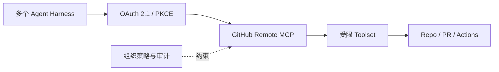

# GitHub Remote MCP Server 治理案例

> [!summary] 案例判断
> GitHub 将仓库、Issue、PR 和 Actions 等能力通过远程 MCP 提供给多个 Agent 客户端，并增加 OAuth 与集中策略。案例证明 MCP 正从本地连接器演进为企业共享工具服务，但协议接入本身不等于授予写权限或 CI/CD 自治。

## 架构与工具链

## 工作流程与控制边界

- Agent 通过标准 MCP 发现工具，不需要每个客户端单独维护 GitHub 集成。
- OAuth、短期凭据与策略管理把用户/组织授权带入远程工具层。
- Toolset 可收窄暴露能力，生产写动作仍受 GitHub 权限和仓库规则约束。
- MCP Server 是能力入口，不负责决定变更是否通过测试、合并或发布。

## 可迁移经验

- 当多个 Harness 共享同一能力时，远程 MCP 的集中升级和审计价值高于本地重复安装。
- 远程 MCP 必须同时设计受众绑定、租户隔离、最小 Toolset 和撤权。
- 代码仓既有 Branch Protection、Actions Policy 和审批不能被 MCP 绕开。

## 证据入口

- L0：[[00_sources/agentic-cicd-source-landscape#S40. Remote GitHub MCP Server is generally available|S40]]
- Source Brief：[[00_sources/briefs/2025-github-remote-mcp-server-ga|GitHub Remote MCP Server GA]]
