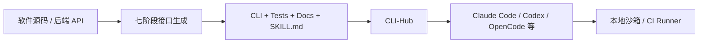

# CLI-Anything Agent 原生接口工厂案例

> [!summary] 案例判断
> CLI-Anything 展示了由宿主 Coding Agent 按七阶段 SOP 从源码/API 生成结构化 CLI、测试、文档和 `SKILL.md` 的方法，可将缺少机器接口的长尾软件接入不同 Agent Harness。它证明“接口工厂”形态存在，但不是确定性编译器，也尚未证明企业 CI/CD 中的大规模可靠性或生产授权能力。

## 背景与任务

传统 GUI 或内部软件常缺少 Agent 可稳定调用的命令面。项目尝试把软件能力转成具备结构化输出、明确状态和确定性反馈的 CLI harness，并通过 CLI-Hub 供 Agent 搜索和安装。

## 架构与工具链

## 工作流程

1. 分析源码和后端能力。
2. 设计命令、状态和机器输出。
3. 生成 CLI、测试、文档和 Skill。
4. 安装到可执行路径或发布到 CLI-Hub。
5. 由 Agent Harness 发现并调用。

## 控制边界

| 边界 | 当前做法 | 未证明或缺口 |
|---|---|---|
| 接口质量 | 生成单元与端到端测试 | 一次生成不保证功能覆盖和业务语义正确 |
| 身份与权限 | 继承生成 CLI 所调用系统的权限 | 无统一任务身份、集中授权或生产审批 |
| 供应链 | CLI 与 Skill 可版本化；CLI-Hub 包有发布来源证明 | 公共 Registry 含可变默认分支和 Shell 安装，仍需企业锁定、扫描、签名和准入 |
| 成功判定 | 结构化输出和测试提高可验证性 | 不能替代 CI/CD 外部 Policy 与 Oracle |

## 结果与证据强度

仓库、Release 和论文提供了方法、代码与局部测试证据，因此为 E2。当前没有覆盖全部 Harness 的统一真实后端 CI，论文也未给出企业任务成功率 Benchmark。Star/Fork 是关注度快照，不构成企业结果证据。

## 可迁移经验

- 优先为只读和低风险能力生成接口。
- CLI、Skill 和测试应同版本发布。
- 将生成接口放入内部 Tool Catalog，而不是直接赋予生产权限。
- 先在 Draft PR、非生产 Runner 或事故回放中评测。

## 不应外推的结论

- 不能据此判断所有 GUI 软件都能一次生成可靠 CLI。
- 不能把 Agent 能调用命令等同于获得 L3/L4 行动权。
- 不能用开源热度替代企业安全与效果验证。

## 证据入口

- L0：[[00_sources/agentic-cicd-source-landscape#S81. CLI-Anything Agent-native interface generator|S81]]
- Source Brief：[[00_sources/briefs/2026-cli-anything|CLI-Anything Brief]]
