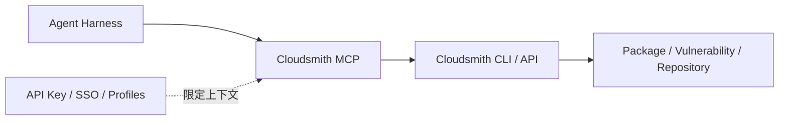

# Cloudsmith 从 CLI 到 MCP 的制品工具面案例

> [!summary] 案例判断
> Cloudsmith 将既有 CLI/API 能力映射为 MCP 工具，使 Agent 能查询漏洞、列举包版本并执行部分制品管理动作。它支持“API/CLI 是能力底座、MCP 是适配层”的架构判断，但没有证明 Agent 可自主签名、晋级或批准版本发布。

## 架构与边界

- 多 Profile 可隔离生产与沙箱上下文。
- 当前证据覆盖查询和部分管理动作，不覆盖自动晋级决策。
- 制品签名、不可变性、保留和跨环境晋级仍应由外部 Policy 控制。

## 可迁移经验

- 先复用成熟 CLI/API，再决定是否增加 MCP。
- MCP 工具命名和 Schema 应保持与底层能力一致，避免出现两套安全语义。
- 制品工具应按只读查询、测试仓写入、生产晋级分层授权。

## 证据入口

- L0：[[00_sources/agentic-cicd-source-landscape#S46. Manage your supply chain using natural language with MCP|S46]]
- Source Brief：[[00_sources/briefs/2026-cloudsmith-mcp-artifact-management|Cloudsmith MCP 制品仓行动面]]
