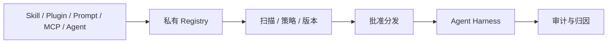

# JFrog Agent 组件与 Skill 供应链案例

> [!summary] 案例判断
> JFrog 将 Skills、Plugins、Prompts、Hooks、MCP Server 和 Agent Package 纳入仓库与扫描对象，说明 Agent 工具链本身正在成为软件供应链。案例能支撑“Skill/CLI/MCP 必须版本化和准入”，但不同能力状态混合，不能统一写成 GA 或成熟生产闭环。

## 架构与工作流

## 控制边界

- Agent 组件需要像依赖包一样记录来源、版本和漏洞状态。
- 恶意 Skill 扫描和私有仓分发降低风险，但不替代运行时最小权限。
- Worker/Webhook 上下文可改善动作归因；实际环境仍需独立身份和审计。

## 可迁移经验

- 建立统一 Agent Asset Registry，而不是让团队从公共目录直接安装。
- CLI、Skill、MCP 和 Prompt 的审批应绑定依赖、权限声明和兼容版本。
- 同时治理发布前供应链和运行时调用，任何一侧缺失都可能形成绕过面。

## 证据入口

- L0：[[00_sources/agentic-cicd-source-landscape#S28. JFrog Platform Skills and MCP tools|S28]]、[[00_sources/agentic-cicd-source-landscape#S65. JFrog Agent packages, plugins and Skill repositories|S65]]
- Source Brief：[[00_sources/briefs/2026-jfrog-skills-and-mcp|JFrog Skills and MCP]]
