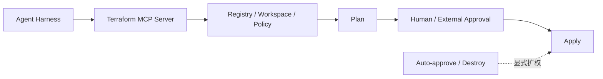

# Terraform MCP Plan 与 Apply 自治边界案例

> [!summary] 案例判断
> Terraform MCP Server 用显式配置区分 Plan、批准后 Apply 与高风险操作，为 Agentic CI/CD 的自治分级提供了清晰样本：分析和计划可开放，生产写入必须另行授权，自动批准与破坏性动作默认关闭。

## 架构与工作流

1. Agent 查询模块、Workspace、策略和运行状态。
2. 默认生成或读取 Plan。
3. Apply 绑定审批；更危险操作需要显式开启。
4. Terraform 仍是确定性执行器，MCP 不是部署成功 Oracle。

## 可迁移经验

- 按命令风险分 Toolset，而不是给 Agent 一个宽泛的“Terraform 权限”。
- Approval 应绑定具体 Plan、环境、哈希和有效期。
- 默认 Plan-only；自动批准、销毁和控制面修改需要独立审批。

## 证据入口

- L0：[[00_sources/agentic-cicd-source-landscape#S51. Terraform MCP Server v1.0 infrastructure patterns and reference|S51]]
- Source Brief：[[00_sources/briefs/2026-terraform-mcp-server|Terraform MCP 自治分层]]
