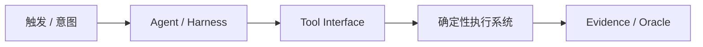

# 案例名称

> [!summary] 案例判断
> 用两到三句话说明案例做了什么、能证明什么、不能证明什么。

## 背景与任务

## 架构与工具链

## 工作流程

1.

## 控制边界

| 边界 | 当前做法 | 未证明或缺口 |
|---|---|---|
| 身份与权限 |  |  |
| 执行环境 |  |  |
| 验证与 Gate |  |  |
| 输出与责任 |  |  |

## 结果与证据强度

## 可迁移经验

## 不应外推的结论

## 证据入口

- L0：
- Source Brief：
- 官方来源：
