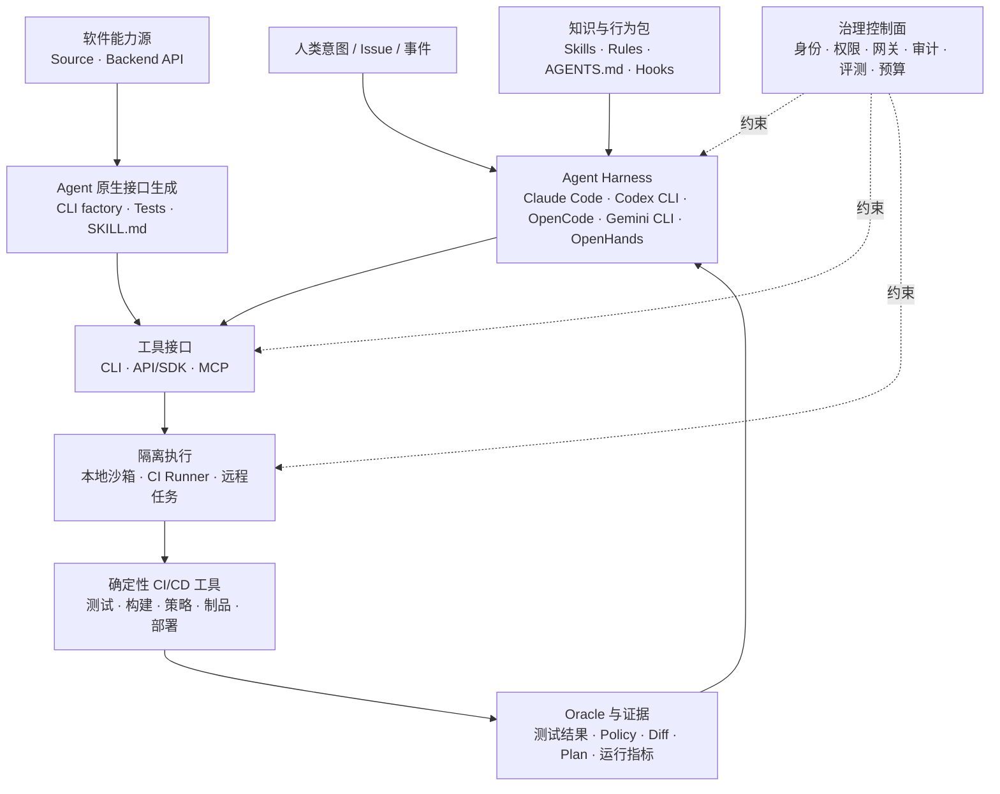

# Agentic CI/CD 的 Agent 工具与技术栈

> [!summary] 核心判断
> Tool 层不应再按代码仓、流水线、制品仓、部署平台划分——这些属于 [[30_summaries/stages/README|Stage 层]]和 [[20_summaries/companies/README|Company 层]]。Tool 层真正要回答的是：**Agent 如何获得知识、生成或发现接口、调用工具、执行任务并被治理**。2026 年的主流技术栈不是 MCP、CLI、Skill 或 Claude Code 四选一，而是将它们组合成“Agent Harness + 知识与规则 + Agent 原生接口 + 隔离执行 + 治理控制面”。

## Tool、Stage、Company 三层边界

| 报告层 | 回答的问题 | 典型分类 |
|---|---|---|
| Tool | Agent 用什么机制理解、扩展、执行和治理？ | MCP、CLI/API、接口生成器、Skills、Claude Code、OpenCode、Runner、沙箱、身份与评测 |
| Stage | Agent 改变了 CI/CD 的哪个环节？ | 代码检查、门禁、编译构建、制品、部署、发布、运行恢复 |
| Company | 哪家公司正在提供和组合这些能力？ | GitHub、Harness、AWS、Google、Microsoft、GitLab 等 |

例如，“Claude Code 读取一个发布 Skill，通过 Terraform MCP 调用 Terraform CLI，在 GitHub Actions Runner 中生成 Plan，并经人工批准后执行”是一条 Tool 组合链；它在 Stage 层属于部署发布，在 Company 层则同时跨越 Anthropic、HashiCorp 与 GitHub。

## 2026 年 Agent 工具栈

| 技术层 | 作用 | 代表形态 | 不能替代什么 |
|---|---|---|---|
| 知识与行为包 | 告诉 Agent “何时、为何、按什么流程做” | Skills、Rules、`AGENTS.md`、`CLAUDE.md`、Hooks | 权限控制和确定性策略 |
| Agent Harness | 负责理解任务、规划、循环调用工具和组织结果 | Claude Code、Codex CLI、OpenCode、Gemini CLI、OpenHands | CI/CD 系统和最终 Oracle |
| 工具接口 | 把系统能力暴露给 Agent | CLI、API、SDK、MCP | 沙箱、身份和审批 |
| 执行承载 | 决定 Agent 在哪里、以什么边界运行 | 本地终端、容器沙箱、CI Runner、远程 Coding Agent | 业务规则和效果评测 |
| 治理控制面 | 限定 Agent 能看到什么、能做什么、如何追责 | 短期身份、RBAC、Gateway、Safe Outputs、审计、Evals | Agent 的任务推理能力 |

## 1. MCP：跨工具、跨客户端的协议层

MCP 的价值是把工具发现、参数 Schema、资源读取和授权边界标准化，使同一个工具服务可被不同 Agent Harness 使用。它最适合三类场景：一是多个 Agent 客户端需要共享同一能力；二是工具由平台团队远程托管并统一升级；三是需要 OAuth、集中策略和多租户治理。

2025 年下半年到 2026 年的实践已经从“本机启动一个 MCP Server”分化为两种形态：

| 形态 | 适用场景 | 优点 | 主要风险 |
|---|---|---|---|
| 本地 `stdio` MCP | 单人开发、隔离网络、工具随项目运行 | 简单、低时延、可复用本地凭据 | 安装与版本碎片化，本地进程和 Skill 可能成为供应链入口 |
| 远程 HTTP MCP | 企业共享工具、统一策略、多客户端接入 | 集中升级、短期授权、审计和 Toolset 管理 | 服务端成为高价值攻击面，需要受众绑定、租户隔离和限流 |

GitHub Remote MCP 已采用 OAuth 2.1/PKCE、短期凭据和集中策略；Cloudsmith 的做法是把现有 CLI/API 能力映射为 MCP 工具；Terraform MCP 则将高风险操作默认关闭，并区分 Plan、批准后 Apply 与自动执行。它们共同说明：**MCP 是能力协议，不是安全边界，也不是 CI/CD 引擎。**

采用 MCP 时应默认：收窄 Toolset、读权限优先、禁止 Token 透传、绑定目标受众、高危动作显式扩权，并把所有调用纳入审计。参考 [[00_sources/briefs/2025-github-remote-mcp-server-ga|GitHub Remote MCP]]、[[00_sources/briefs/2026-cloudsmith-mcp-artifact-management|Cloudsmith MCP]]、[[00_sources/briefs/2026-terraform-mcp-server|Terraform MCP]]。

截至 2026-07-15，当前正式规范仍为 2025-11-25；2026-07-28 无状态核心和扩展框架仍是 Release Candidate。协议能力、企业授权扩展、Registry/Conformance 状态及迁移判断见 [[50_deepdives/mcp-protocol/90_report|MCP 深度报告]]。

## 2. CLI、API 与 SDK：Agent 的确定性执行底座

CLI 并没有因为 MCP 出现而过时。相反，CLI 具有版本可锁定、参数可审查、退出码明确、容易放入 Runner、可重放和继承既有权限体系等特点，仍是 Agent 执行工程任务的主力接口。[Thoughtworks 2026 Technology Radar](https://www.thoughtworks.com/content/dam/thoughtworks/documents/radar/2026/04/tr_technology_radar_vol_34_en.pdf) 将“MCP by default”列为 Caution，核心并非否定 MCP，而是提醒团队：如果成熟 CLI 已能提供结构化输出与可预测错误，就不必为了协议统一而增加一层脆弱抽象。

适合 Agent 调用的 CLI 应具备：

- `--json` 或稳定的机器可读输出，避免解析人类终端文本；
- 稳定退出码、错误类型和 `--help`，便于 Agent 判断下一步；
- `plan`、`dry-run`、幂等与显式确认模式；
- 非交互执行、超时、并发和预算限制；
- 细粒度凭据与作用域，而不是复用开发者长期 Token；
- 版本锁定、命令记录和输入输出脱敏。

推荐的产品架构通常是：**API/SDK 作为能力源，CLI 作为稳定执行与调试面，MCP 作为跨 Agent 的适配层**。不应为了支持 MCP 重写核心逻辑，也不应让 MCP 绕开 CLI/API 已有的安全约束。

CLI 的三种角色、十二类 Agent-ready 契约和直接 CLI/MCP Wrapper 的选择条件见 [[50_deepdives/cli-agent-interface/90_report|CLI 深度报告]]；逐项替代矩阵见 [[50_deepdives/cli-vs-mcp-decision-guide|CLI 与 MCP 决策指南]]。

CLI-Anything 增加了一个值得单独跟踪的工具类别：**Agent 原生接口工厂**。它不是确定性生成器、新 Harness 或 CI/CD 平台，而是由宿主 Coding Agent 按 SOP 分析软件源码和后端 API，生成带结构化输出、测试、文档与 `SKILL.md` 的 CLI harness，再通过 CLI-Hub 供不同 Agent 搜索、安装和调用。v0.4.0 增加的 CLI-Matrix 是 capability/provider 策展和预检安装层，不是 Workflow Engine。对 CI/CD 的直接价值是把原本只适合 GUI 或缺少稳定命令面的测试、构建、制品、部署和运维工具，转成可版本化、可在 Runner 中复验的工具表面。

这条路线同时提高了治理要求：生成成功不等于接口安全或语义完整。公共 CLI-Hub 的可变 Registry、默认分支安装和 Shell 安装路径不应直接成为生产信任根。企业必须审查命令覆盖、危险动作、错误码、幂等性和授权边界，并把生成的 CLI、依赖与 `SKILL.md` 当作供应链制品进行不可变版本锁定、真实后端测试、SBOM/签名/扫描和灰度。参考 [[00_sources/agentic-cicd-source-landscape#S81. CLI-Anything Agent-native interface generator|CLI-Anything L0]]、[[00_sources/briefs/2026-cli-anything|独立 Brief]] 与 [[50_deepdives/cli-anything/90_report|CLI-Anything 深度报告]]。

## 3. Skills、Rules、Instructions 与 Hooks：可复用的组织知识

这组技术解决的不是“系统能做什么”，而是“Agent 应该如何正确地做”。它们容易与 MCP 混淆，但职责不同：

| 机制 | 主要职责 | 典型内容 | 加载方式 |
|---|---|---|---|
| Skill | 封装可复用任务方法和领域知识 | 发布检查、故障诊断、依赖升级、证据模板 | 按任务发现或显式调用 |
| Rules / Instructions | 施加持续有效的项目约束 | 目录边界、测试要求、编码和安全规则 | 会话或仓库级常驻 |
| Hooks | 在确定生命周期点触发机器动作 | 调用前检查、格式化、审计、敏感操作阻断 | 事件驱动、确定性执行 |
| MCP | 暴露可调用工具与资源 | 查询仓库、运行 Plan、读取制品元数据 | Agent 在运行时选择调用 |

在 CI/CD 中，Skill 可以把隐性 Runbook 变成版本化资产，例如“发布前必须验证哪些证据”“CI 失败先排查缓存还是依赖”“生产回滚要满足哪些前置条件”。但 Skill 本身只是给模型的内容和行为指引，不能充当 Policy-as-Code、审批或权限系统。

CLI-Anything 生成的 `SKILL.md` 体现了另一种 Skill 来源：它可以由工具接口生成过程同步产出，而不只由人手写。这样能让命令、测试和使用说明共同演进，但也意味着 Skill 变更必须与 CLI 版本绑定，避免说明和实际权限面漂移。

Skill 生态也带来新的供应链问题：恶意或被篡改的 Skill 可以诱导 Agent 读取机密、调用危险工具或绕过流程。企业需要像管理依赖包一样管理 Skill：来源准入、代码审查、版本锁定、签名、扫描、权限声明、运行时监控和快速撤回。参考 [[00_sources/briefs/2026-jfrog-skills-and-mcp|JFrog Skills/MCP]] 与 [[00_sources/briefs/2026-malicious-agent-skills-usenix|恶意 Agent Skills 研究]]。

## 4. Agent Harness：Claude Code、Codex CLI、OpenCode、Gemini CLI 与 OpenHands

Agent Harness 是把模型、上下文、工具循环、权限和工作区组织成可执行系统的“代理外壳”。比较这类工具时，不应只看模型基准分数，而应关注能否无交互运行、权限如何表达、是否支持 MCP/Skills、能否进入 Runner、日志是否可审计，以及模型和部署方式是否可替换。

| Harness / Runtime | 主要定位 | 2026 年值得关注的能力 | 更适合的企业路径 | 主要边界 |
|---|---|---|---|---|
| [Claude Code](https://docs.anthropic.com/en/docs/claude-code/cli-usage) | Anthropic 的终端 Agent | 交互与 `-p` 非交互模式、stdin 管道、MCP、Skills/Rules/Hooks；可通过 Claude Code Action 进入 GitHub | 希望快速获得成熟终端体验，并围绕 Claude 生态标准化 | 与 Anthropic 模型和产品能力结合较深；生产权限仍需外部控制面 |
| [Codex CLI](https://github.com/openai/codex) | OpenAI 的开源本地 Coding Agent | 本地读取、修改和运行代码；沙箱与批准模式；适合在终端或受控 Runner 中使用 | 已使用 OpenAI/Codex，重视本地工作区、开源 CLI 和审批边界 | 不是完整 CI/CD 平台；流水线触发、证据和发布策略需另行组合 |
| [OpenCode](https://github.com/anomalyco/opencode) | 开源、Provider-agnostic 的终端 Agent | TUI 与 Client/Server 架构；Build/Plan Agent；细粒度工具权限 | 需要多模型、自托管或二次开发，并愿意自建治理能力 | 开源 Harness 不等于企业控制面；需补身份、审计、策略和评测 |
| [Gemini CLI](https://codelabs.developers.google.com/getting-started-gemini-cli-extensions) | Google 的开源终端 Agent 与扩展平台 | Extensions 可打包命令、上下文和 MCP Server；已有 DevOps 扩展 | Google Cloud 技术栈或希望用扩展封装内部平台能力 | 扩展质量与权限仍需企业治理；不应把自然语言结果直接视为门禁证据 |
| [OpenHands](https://github.com/OpenHands/OpenHands) | 开源 Agent SDK、Runtime 与平台 | 可组合工具、远程执行和软件工程 Agent 能力 | 平台团队构建自有 Agent 服务或研究运行时 | 更接近开发底座；CI/CD 控制面和业务流程需自行建设 |

对应 L0 资料：[[00_sources/agentic-cicd-source-landscape#S78. Claude Code CLI reference|Claude Code CLI]]、[[00_sources/agentic-cicd-source-landscape#S79. OpenAI Codex CLI|Codex CLI]]、[[00_sources/agentic-cicd-source-landscape#S80. OpenCode open-source coding Agent|OpenCode]]、[[00_sources/agentic-cicd-source-landscape#S19. Gemini CLI DevOps Extension|Gemini CLI DevOps Extension]] 与 [[00_sources/briefs/2026-openhands-agent-sdk|OpenHands SDK]]。

另有 GitHub Coding Agent、GitLab Duo Agent Platform 等“平台原生 Agent”。它们的优势是天然拥有仓库、Issue、PR、Pipeline 和权限上下文，但模型与执行环境的可替换性通常低于独立 Harness。两类产品会长期共存：独立 Harness 负责跨系统任务，平台原生 Agent 负责在自有数据面中形成短闭环。

## 5. 从终端 Agent 到 CI/CD Agent：执行承载的四种形态

同一个 Harness 放在不同执行环境中，其风险和自治上限完全不同。

| 承载方式 | 触发方式 | 适用任务 | 优势 | 必须补齐的控制 |
|---|---|---|---|---|
| 开发者本地终端 | 人工会话 | 探索、诊断、生成变更 | 上下文丰富、反馈快 | 本地凭据、工作区和敏感文件隔离 |
| CI Pipeline Step | Push、PR、失败事件 | Review、修复、测试、证据生成 | 可复现、可审计、天然连接门禁 | Runner 隔离、Token 收窄、输出出口和成本上限 |
| 远程 Coding Agent | Issue、委派任务 | 跨文件实现、升级、生成 PR | 异步并行、任务级工作区 | 任务身份、网络出口、分支保护和人工评审 |
| 常驻 Agent Service | 事件流、告警、计划任务 | 跨仓治理、运行调查、持续维护 | 可连接长周期上下文 | 多租户隔离、短期身份、熔断、审批和持续评测 |

Claude Code Action、GitHub Agentic Workflows、Harness Worker Agent、Octopus Agent Step 与 Jenkins AI Agent Plugin 都是在把通用 Agent 变成可审计的流水线节点。决定其是否能进入生产的，不是 Agent 名称，而是它是否遵守 Runner 隔离、最小权限、受控输出和原有门禁。参考 [[00_sources/briefs/2026-claude-code-github-action|Claude Code Action]]、[[00_sources/briefs/2026-github-gh-aw-open-source|GitHub Agentic Workflows]]、[[00_sources/briefs/2026-harness-worker-agents|Harness Worker Agents]]、[[00_sources/briefs/2026-octopus-agentic-deployment|Octopus Agent Step]]。

## 6. 治理控制面：工具能力不等于行动权限

无论使用 MCP、CLI 还是某个 Agent Harness，生产级工具栈都必须增加以下控制面：

| 控制能力 | 最低要求 | 2026 年演进方向 |
|---|---|---|
| 身份与委托 | 每任务短期身份，记录人类委托者与 Agent Actor | 可验证的 Agent Identity 和完整 Delegation Chain |
| 授权 | Read-only 默认，按 Tool、仓库、环境和动作分权 | 基于风险、上下文和审批状态的动态授权 |
| 隔离 | 临时工作区、Runner/容器、网络与缓存边界 | Agent 专用沙箱和策略化网络出口 |
| 输出治理 | PR、Plan、Safe Output、Approval 等少数出口 | 输出类型与风险等级绑定 |
| 审计 | 保存模型、Prompt/Skill 版本、工具调用、身份和结果 | 能重放一次决策并解释授权依据 |
| 评测 | 企业任务集、成功率、回归、人工介入和成本 | 根据实时效果动态调整自治等级 |
| 预算与熔断 | Token、时间、并发、重试和 Runner 上限 | 按单位成功任务和风险收益优化 |

Uber 的短期单跳 Token 与 Actor Chain、Google Cloud 的 SPIFFE Agent Identity、GitHub Remote MCP 的 OAuth 和策略管理，都说明“Agent 身份”正在从共享 Service Account 中独立出来。参考 [[00_sources/briefs/2026-uber-agent-identity|Uber Agent Identity]]、[[00_sources/briefs/2026-google-cloud-agent-identity|Google Cloud Agent Identity]] 与 [[00_sources/briefs/2026-openid-authzen-agent-authorization|OpenID AuthZEN]]。

## 7. 推荐的组合模式

| 目标场景 | 推荐组合 | 原因 |
|---|---|---|
| 个人或小团队本地辅助 | Harness + 仓库 Rules/Skill + 成熟 CLI | 依赖少、反馈快，先复用已有工具链 |
| 遗留/内部工具 Agent 化 | 源码/API + 接口生成器 + 生成 CLI/Skill + 测试 + 沙箱 | 先建立机器可读、可测试的能力面，再决定是否增加 MCP |
| 企业仓库评审与修复 | Harness/平台 Agent + 远程 MCP + CI Runner + PR 出口 | 共享上下文和授权集中，所有写动作可审查 |
| IaC 与部署变更 | Harness + 发布 Skill + Terraform CLI/MCP + Plan + Approval | 开放式规划与确定性部署边界分离 |
| 跨平台 DevOps 自助 | Provider-agnostic Harness + 多个窄 Toolset MCP + Gateway | 降低客户端绑定，统一身份、策略和审计 |
| 生产运行与恢复 | 专业 SRE Agent + 实时观测工具 + 预批准 Runbook + 熔断 | 只在低爆炸半径和可回滚动作上提高自治 |

这里没有单一“最佳工具”。如果现有 CLI 足够稳定，应先让 Agent 使用 CLI；需要跨客户端共享和集中治理时再增加 MCP；需要沉淀组织做法时增加 Skills/Rules；需要持续、异步或事件驱动执行时选择合适 Harness 和运行承载；进入生产前必须补齐身份、沙箱、审计和评测。

## 8. 选型检查表

1. Harness 是否支持非交互、可重放执行，还是只能作为开发者聊天工具？
2. 模型、Provider、工具接口和执行环境能否独立替换，锁定发生在哪一层？
3. CLI/API 是否已经满足需求；若缺少 Agent 友好接口，是手工建设还是使用接口生成器；引入 MCP 带来的互操作和治理收益是否大于复杂度？
4. Skill、Rules 和 Hooks 的来源、版本、权限及变更是否可审计？
5. 每个工具调用能否绑定任务身份、委托人、作用域和短期凭据？
6. Agent 是否只能通过 PR、Plan、Safe Output 或 Approval 等受控出口产生变更？
7. Runner、网络、缓存、密钥和不可信输入之间是否真正隔离？
8. 是否保留确定性的测试、Policy、签名、发布门禁和回滚机制？
9. 是否能在企业真实任务集上测量成功率、误操作、人工介入、时延和单位成功成本？
10. 当模型、Skill、MCP Server 或 CLI 版本变化时，能否灰度、回退和重放？

## 证据入口

- [[00_sources/agentic-cicd-source-landscape|81 条核心一手资料景观]]
- [[00_sources/README|Source Brief 索引]]
- [[20_summaries/companies/README|公司维度总结]]
- [[30_summaries/stages/README|八阶段维度总结]]
- [[40_summaries/crosscutting/README|工具、流程、人员与治理变化]]
- [[50_deepdives/cli-agent-interface/README|CLI 专题]]
- [[50_deepdives/mcp-protocol/README|MCP 专题]]
- [[50_deepdives/cli-anything/README|CLI-Anything 专题]]
