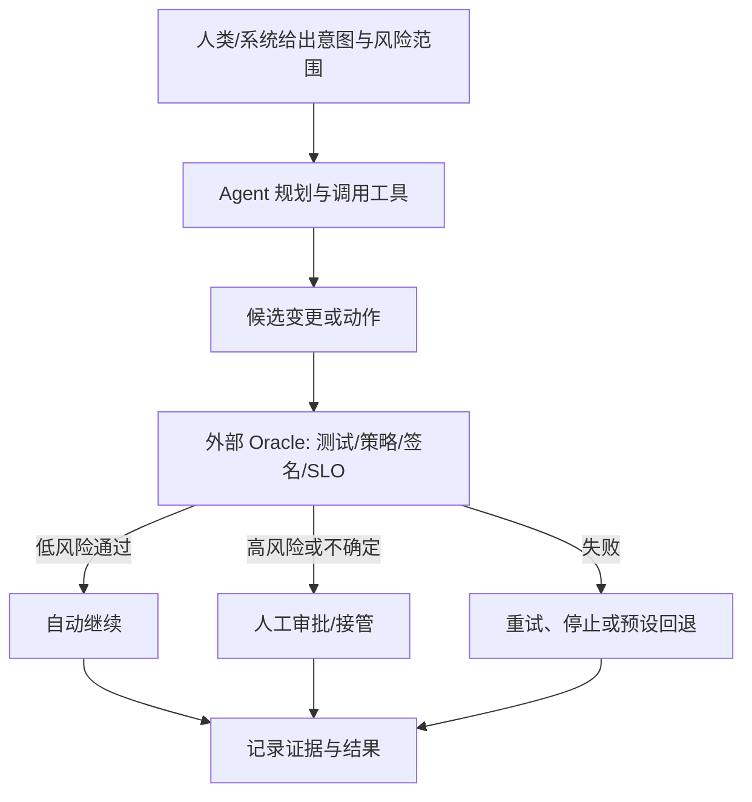

# Agentic CI/CD 八阶段维度总结

> [!summary] 核心判断
> Agent 沿 CI/CD 的扩散并不均匀：越容易获得结构化上下文、越容易用确定性测试验证、写动作越容易通过 PR 隔离，成熟度越高；越接近不可逆生产变更、跨组织审批和大爆炸半径，自治越谨慎。

## 成熟度标尺

本页同时判断两个维度，避免把“产品已 GA”误写成“L4 已成熟”：

- **产品状态**：GA / Preview 或 Beta / 实验或研究 / Roadmap。
- **自主等级**：L0 信息建议、L1 分析计划、L2 可审查变更、L3 批准后执行、L4 边界内闭环。

## 阶段总览

| 阶段 | 主要 Agent 任务 | 2026 可落地等级 | 最高可信边界 | 成熟度 | 主要制约 |
|---|---|---|---|---|---|
| 1. 代码评审与质量 | 仓库级评审、规则检查、修复 PR | L1—L2 | 自动评论/修复，不默认自动合并 | 高 | 业务语义、误报、责任归属 |
| 2. 静态/安全/依赖/合规 | 发现解释、根因、修复、复验 | L1—L2，部分 L3 | 确定性扫描器作 Oracle | 中高 | 修复安全性、例外管理、供应链 |
| 3. 测试/门禁/风险 | 生成测试、选择测试、覆盖分析、风险建议 | L1—L3 | Agent 迭代，确定性 Gate 决策 | 中高 | Oracle 质量、脆弱测试、成本 |
| 4. 编译/构建/出包 | 失败诊断、配置修复、重跑 | L1—L3 | 修复 PR 或批准后重跑 | 中 | 环境可复现性、缓存与密钥 |
| 5. 制品/供应链/版本 | 可信包查询、版本修复、有限制品管理 | L1—L2 | PR/受控操作，签名与晋级确定化 | 中低 | 不可变性、溯源、高风险授权 |
| 6. 环境/IaC/部署 | Plan、策略解释、部署动作、状态核验 | L1—L3 | 同一 Policy/Approval 下执行 | 中 | 凭据、漂移、爆炸半径 |
| 7. 发布/审批/变更 | 就绪评审、依赖分析、验证、渐进发布 | L1—L3 | 人批计划，Agent 受限执行 | 低中 | 跨团队责任、不可逆风险 |
| 8. 发布后验证/恢复 | 跨源调查、根因、Runbook、受限恢复 | L1—L3；局部 L4 | 低风险预批准动作闭环 | 中高（分析）/中低（闭环） | 监控可靠性、动作安全、因果不确定 |

## 1. 代码评审与质量检查

### Agent 如何介入

- 从 Diff、仓库、依赖、历史 PR、规范和运行上下文理解变更。
- 调用搜索、静态分析、测试或组织 MCP 工具验证判断。
- 生成分级评论、建议补充测试，或直接创建修复 Commit/PR。
- 多个专业 Reviewer 并行工作，再由 Judge Agent 去重、处理冲突和过滤低信号建议。

### 工具与流程变化

评审由“人阅读所有行”转向“Agent 先筛查与补证据，人聚焦意图、架构、异常和责任”。PR 成为 Agent 与人类之间最成熟的安全边界：写动作可追踪、可回滚，既有 Branch Protection 和 CI 仍有效。组织规则也从一段通用 Prompt 变为版本化 Skill、仓库指令、服务目录和 MCP 工具。

### 人的能力变化

开发者需写清变更意图和验收条件；Reviewer 更需要判断业务语义、替代方案、长期维护和测试是否真正覆盖风险。平台团队负责评审规则版本、上下文授权、误报反馈和成本等级。

### 证据与成熟度

GitHub Agentic Code Review 已出现 GA 能力，GitLab/Qodo/Atlassian/阿里云均有实际产品或大规模第一方实践；Harness 也将 Review、Coverage 和 AutoFix 分成专项 Agent，并以 Comment/PR 作为输出边界。但研究显示 Agent 对业务上下文、知识传递和复杂取舍仍弱，故推荐上限是 L2。参考 [[00_sources/briefs/2026-human-ai-synergy-agentic-code-review|Human-AI Synergy]]、[[00_sources/briefs/2026-atlassian-rovo-code-review-study|Rovo Study]]、[[00_sources/briefs/2026-harness-code-quality-agents|Harness Code Quality]] 与 [[00_sources/briefs/2026-alibaba-yunxiao-ai-code-review|云效]]。

### 建议指标

有效问题召回率、误报率、建议采纳率、重复评论率、人工评审时长、Agent 修复后二次修改率、遗漏缺陷、每 PR 成本。

## 2. 静态分析、安全、依赖与合规检查

### Agent 如何介入

- 将扫描器发现与代码路径、数据流、依赖、历史例外和业务上下文关联。
- 解释漏洞是否可达、优先级和修复影响。
- 生成修复并反复调用扫描器、编译和测试验证。
- 为无法自动修复的问题准备例外申请、风险证据和负责人路由。

### 工具与流程变化

确定性 SAST/SCA/Policy 引擎继续做事实判断，Agent 承担根因和修复循环。门禁不再只输出“红/绿”，而是输出漏洞证据、修复尝试、剩余风险和例外理由。Snyk、Sonar、Semgrep 和 GitLab 的共同方向都是 Analyzer + Agent，而非 LLM 替代 Analyzer。

### 人的能力变化

安全团队从逐条分诊转向设计策略、风险等级、自动修复边界和抽检；开发者需要评估语义影响，而不是只接受能通过扫描的 Patch；平台团队要保护扫描规则、MCP 工具和 Agent Skill 本身的供应链。

### 证据与成熟度

L1 解释和 L2 修复已较成熟，部分产品能在受控流水线中复验并创建 MR/PR。GitHub Dependabot 告警到 Coding Agent Draft PR 是“确定性发现 + Agent 适配 + 测试复验”的明确样本；Harness STO/SCS Remediation、Zero-day/Manifest/Library Agent 也采用 Analyzer/Policy 与 Agent 组合，而不应让模型替代扫描事实。另一方面，USENIX 2026 已确认真实恶意 Agent Skills，说明 Skill/MCP/Marketplace Agent 自身也必须进入门禁。L3 只适合自动生成修复分支、运行测试等可回滚动作；直接合并或发布仍不宜默认开放。参考 [[00_sources/briefs/2026-github-dependabot-agent-remediation|Dependabot Agent Remediation]]、[[00_sources/briefs/2026-harness-ai-platform|Harness AI Platform]] 与 [[00_sources/briefs/2026-malicious-agent-skills-usenix|Malicious Agent Skills]]。

### 建议指标

真实漏洞修复率、错误修复率、复发率、扫描重试次数、例外老化、修复 Lead Time、Agent 引入的新漏洞、供应链审计完整率。

## 3. 自动化测试、质量门禁与风险决策

### Agent 如何介入

- 根据变更和风险生成单元、集成或 E2E 测试。
- 从历史失败、代码依赖和变更范围选择测试及分片策略。
- 分析 Coverage Gap、脆弱测试和失败日志。
- 在沙箱中循环修改与重跑，最后产出通过证据或升级人工。
- 汇总测试、安全、影响面和事故历史，建议门禁等级。

### 工具与流程变化

测试从一次性流水线步骤变成 Agent 的反馈 Oracle。流水线需要支持更高并发、更低启动时延、按需环境、缓存隔离和可查询历史。门禁可根据风险动态选择验证深度，但最终规则必须由 Policy/测试结果确定，不应由模型主观宣布“可以发布”。

### 人的能力变化

QA 从手写全部用例转向定义测试意图、风险模型、测试 Oracle、数据策略和 Agent 评测集；开发者要提供可验证验收条件；平台团队优化反馈回路成本和隔离。

### 证据与成熟度

Tricentis、Harness、CircleCI、GitHub/GitLab 均覆盖部分能力。Harness AI Test Automation 已形成“自然语言意图 → 应用探索 → 可执行命令 → DOM/截图/语义断言 → 学习”的闭环，并有三个第一方量化案例；但完整模块的账户可获得性仍需核验。短循环内 L2—L3 已可落地，但 SWE-CI、SWE-EVO 表明长期零回归仍不足，不能把当次绿灯等同于长期可维护。还要区分 Locator Self-Heal 与产品缺陷修复：前者可以降低 UI 漂移造成的假失败，却可能选择了错误元素或隐藏真实变化，因此业务断言和关键路径必须独立验证。参考 [[00_sources/briefs/2026-tricentis-agentic-test-automation|Tricentis]]、[[00_sources/briefs/2026-harness-ai-test-automation|Harness AI Test]]、[[00_sources/briefs/2026-swe-ci-benchmark|SWE-CI]]。

### 建议指标

变更缺陷逃逸率、测试有效性、变异测试得分、Agent 生成测试保留率、Flaky Rate、反馈时延、每成功任务重跑次数、长期零回归率。

## 4. 编译、构建与出包

### Agent 如何介入

- 关联日志、构建配置、依赖版本、Runner 环境和历史失败。
- 生成 Pipeline/Build 配置修复，调整重试范围或测试分片。
- 在隔离环境复现失败，修改后重跑并提交 PR。
- 对多仓或多平台构建准备影响分析和证据。

### 工具与流程变化

编译器、构建器和打包器保持不变，新增的是结构化构建上下文和自愈循环。流水线日志需要从供人浏览的文本升级为 Agent 可查询事件；环境、缓存、依赖和 Artifact 元数据必须可复现。CLI-Anything 代表的接口生成器还能把缺少稳定命令面的长尾构建/打包工具转成带 JSON、退出码、测试和 Skill 的 Agent 可调用接口。Agent 可以决定“下一步查什么”，不能模糊“实际执行了什么”。

### 人的能力变化

平台工程师要管理可复现 Runner、沙箱、缓存隔离和诊断接口；构建专家从响应每次失败转向沉淀规则、工具和黄金路径；开发者负责评估 Agent 修改是否改变构建语义。

### 证据与成熟度

CI 诊断和修复已从单一 L2 场景分化：GitHub CI Doctor 是 Public Preview 框架中的参考调查 Workflow，GitLab Fix Flow GA 但停在 Suggestion/MR；GitHub Agentic Autofix 在 Code Scanning 微域用 CodeQL 复验，CircleCI Chunk Beta 把候选接回 Validation Pipeline，Harness Worker Autofix 描述受治理的 Build 重触发循环，Nx 明确复跑原失败 Task 并可对白名单任务 Auto-apply。Buildkite 当前提供 Retry、Test State 与 Agent/MCP 底座，本轮材料未证明原生通用补丁闭环。它们仍不能被统称为全仓自治：Merge、完整 Required Checks 与生产发布继续外置。参考 [[50_deepdives/cicd-self-healing/35_company-mechanism-audit|六家公司机制审计]]。

成熟实践先用失败分类器把 Code、Flaky、Transient、Runner/Cache、External 和 Unknown 分流：瞬态故障进入有限重试/重调度快环，代码与配置进入 Agent 复现和 Fix-forward 慢环，Unknown 停止并接管。测试、扫描和 Policy 必须由 Agent 外部身份执行，禁止以 Skip、Ignore 或降阈值换取绿灯。完整方法见 [[50_deepdives/cicd-self-healing/90_report|CI/CD 问题自愈深度报告]]。

GitHub Agentic Workflows 给出了可复用的复杂链路：确定性 Step 先收集并裁剪 Workflow Run、Job Log、Commit 和 Runner 信息；只读 Agent 做根因假设；结果通过 Diagnostic Issue 或 Safe Output 外化。PR 是否触发原 Required Checks 取决于 Token、Event 和仓库配置，不能由 Safe Output 自动补全。多仓时再由 Orchestrator 派发每仓 Worker，而不是给单 Agent 全组织写权限。详见 [[50_deepdives/github-agentic-workflows/90_report#场景 1：CI Failure Diagnosis 与 Fix PR|CI Failure 实践]]。

Harness 提供另一种平台原生组合：Code Quality AutoFix 通过分支/PR 交付，通用 Worker Agent 作为 Pipeline Step 承载受 Max Turns 限制的修复循环。RBAC、OPA、Approval、Audit 与 Scoped Credential 控制谁能执行什么，但它们不是软件正确性 Oracle；本轮公开一手材料未证明所有 AutoFix/Worker 修复都会运行完整 Required Checks。见 [[50_deepdives/harness-company/90_report#5.4 Worker Runtime：假设 Agent 已被攻陷|Harness Runtime 原理]]。

### 建议指标

失败归因准确率、首次修复成功率、平均诊断时间、无效重试率、缓存污染事件、构建可复现率、修复 PR 人工改动量。

## 5. 制品、软件供应链与版本管理

### Agent 如何介入

- 查询可信包、漏洞、许可证、维护状态、SBOM 和组织策略。
- 解释升级影响、建议版本、生成依赖 Patch 和变更说明。
- 汇总签名、来源证明、扫描和环境晋级证据。
- 提议版本号、Release Note 和兼容性计划。

### 工具与流程变化

制品仓从二进制存储扩展为 Agent 的可信事实源；版本管理从手工汇总变为 Agent 生成候选决策，但签名、不可变性、晋级和 Policy 必须继续确定化。Agent Skill、MCP Server、模型与依赖本身也成为软件供应链的一部分。

### 人的能力变化

供应链和平台团队需要维护可信目录、来源规则、模型/Skill 清单和签名链；开发者需理解兼容性和回滚，而不是盲目接受版本建议；安全团队要覆盖依赖混淆、恶意工具描述与间接提示注入。

### 证据与成熟度

公开证据仍少于评审和运维，但已不再只有只读上下文。Cloudsmith 支持查询漏洞、列举版本和管理制品；Sonatype 把实时组件情报送入 Agent 选包/选版；GitHub Dependabot 可把复杂版本修复交给 Coding Agent；JFrog 开始把 Skill、Plugin、Prompt、MCP 和 Agent 本身作为仓库对象治理。通用 L3/L4 制品签名、晋级与版本发布自治仍缺乏可信案例，因此推荐上限维持 L2。参考 [[00_sources/briefs/2026-cloudsmith-mcp-artifact-management|Cloudsmith]]、[[00_sources/briefs/2025-sonatype-guide-supply-chain|Sonatype]] 与 [[00_sources/briefs/2026-github-dependabot-agent-remediation|GitHub Dependabot Agent]]。

### 建议指标

不可信依赖拦截率、SBOM/签名覆盖率、错误升级率、回退兼容率、版本建议采纳率、Agent 工具供应链合规率。

## 6. 环境准备、基础设施与部署

### Agent 如何介入

- 将自然语言意图转成 IaC、Pipeline 或部署计划。
- 读取 Plan、策略、漂移、集群实时状态和服务依赖。
- 生成变更集并请求审批，批准后调用 IaC/GitOps/Kubernetes 工具。
- 验证资源与应用就绪状态，失败时停止、修复或回退到预设状态。

### 工具与流程变化

部署出现 Git/IaC 之外的自然语言入口，但必须共用同一 Policy、Approval、身份和审计控制面。MCP 把 Kubernetes、Argo CD、Kargo、Terraform 等操作暴露给 Agent，因此工具服务需要前置校验、限流、会话 Token 和环境 Scope。

### 人的能力变化

平台团队从交付脚本转为交付安全能力目录；运维和开发者要学会描述意图、验证 Plan 和判断 Blast Radius；安全/IAM 团队需设计任务级身份与短期授权。

### 证据与成熟度

Spacelift、Harness、Akuity、Terraform MCP、Octopus Agent Step、Kubernetes MCP Server 和 kagent 展示 L2—L3。Terraform 将 Plan、批准后 Apply 和高危显式扩权分开；Octopus 已把 Agent 放进原生部署 Step，但仍为 Alpha。Harness Worker Agent 可在 CD/Custom Stage 的 Containerized Step Group 运行；存在 Principal 时，细粒度有效权限是触发人 RBAC 与 Agent Grant 的交集，第三方 Tool 再由 MCP Gateway 求交集。但这类权限仍需验证目标账户 Feature Flag，Webhook/Schedule/Artifact/Manifest 等 Trigger Run 当前也不能继承触发人 scoped token。L4 仅适合预批准、低风险、可回滚操作。参考 [[00_sources/briefs/2026-terraform-mcp-server|Terraform MCP]]、[[00_sources/briefs/2026-octopus-agentic-deployment|Octopus]]、[[00_sources/briefs/2026-spacelift-intelligence|Spacelift]] 与 [[00_sources/briefs/2026-harness-worker-agent-security|Harness Worker Security]]。

### 建议指标

Plan 准确率、策略拦截率、人工拒绝率、漂移修复成功率、环境准备时间、越权尝试、回滚成功率、环境相关事故率。

## 7. 发布策略、审批与变更管理

### Agent 如何介入

- 汇总跨仓依赖、变更、测试、安全、事故和容量证据。
- 生成 Release Readiness Review、验证方案和回滚计划。
- 推荐灰度范围、批次、观察窗口和停止条件。
- 经过批准后执行发布、验证每一阶段并在触发条件下停止或回退。

### 工具与流程变化

审批对象从“一个 Pipeline 按钮”变成“带证据的发布计划”。Agent 负责收集和解释，Policy 负责硬约束，人类对剩余业务风险负责。审批应绑定计划哈希、制品、环境、权限和有效期，防止批准后上下文漂移。

### 人的能力变化

Release Manager 与 SRE 从手工汇总状态转向定义风险模型、渐进策略、停止/回退阈值和异常接管；业务负责人需要明确风险偏好；审计团队要能重建委托与批准链。

### 证据与成熟度

AWS Release Management 到 2026-06 仍为 Preview，Octopus 原生 Agent Step 为 Alpha；ServiceNow 已把 Agent 用于变更冲突、影响 CI/服务、发布窗口和 Change Request 准备，但没有自主批准证据。跨仓、跨环境、跨审批的 L4 证据仍非常少，近期上限应为 L3。参考 [[00_sources/briefs/2026-aws-devops-agent-release-management-preview|AWS Release Management]]、[[00_sources/briefs/2026-octopus-agentic-deployment|Octopus]] 与 [[00_sources/briefs/2026-servicenow-agentic-change-management|ServiceNow]]。

GitHub Agentic Workflows 更适合置于发布执行之前：确定性 Job 汇集 Artifact Digest、SBOM、签名、测试、安全与事故证据，Agent 生成 Readiness Report 和回滚建议，Safe Output 更新 Release/Issue；真正 Deploy、Promote 与 Rollback 仍由 Environment Protection、Artifact Binding、Policy 和人工批准控制。参考 [[50_deepdives/github-agentic-workflows/90_report#场景 4：Release Readiness，而不是 Autonomous Release|Release Readiness 模式]]。

Harness 的 FME Release Agent 目前更偏发布文档、实验结果和状态解释；Worker Agent 虽可接入发布 Pipeline，但生产动作仍应绑定具体制品、环境、OPA、Approval、SLO 和 Rollback。平台能力广度不能外推为 Release Manager 已被替代。见 [[50_deepdives/harness-company/90_report#六、沿 CI/CD 阶段的覆盖|Harness 阶段覆盖]]。

### 建议指标

就绪评审遗漏率、审批准备时长、计划变更率、灰度异常发现时延、停止决策准确率、变更失败率、批准与实际执行一致率。

## 8. 发布后验证、观测、回滚与故障恢复

### Agent 如何介入

- 关联指标、日志、Trace、拓扑、配置、最近部署、代码和历史事故。
- 并行提出假设、调用工具验证、形成根因和置信度。
- 创建事件、通知负责人、生成处置计划或调用受限 Runbook。
- 发布后自动观察关键 SLO，在阈值触发时停止或执行预批准回退。

### 工具与流程变化

可观测平台从“数据查询界面”转成有状态调查工作台；事件响应从人手动跨工具拼接，转为 Agent 维护调查上下文和证据链。动作面与分析面必须分离：分析可以广泛，写动作必须按服务、环境和 Runbook 收窄。

### 人的能力变化

SRE 的重点从熟记查询语句转为定义可观测标准、Runbook、SLO、恢复边界和验证 Agent 推理；事件指挥官负责高风险取舍和跨团队协调；平台团队持续评测 Agent 在真实事故和回放数据上的表现。

### 证据与成熟度

AWS Production Operations 已 GA，Azure Observability 分析 GA/自治 Preview，Datadog 和 CloudQ 均有 2026 能力；HolmesGPT、Akuity 等提供 PR 或 Runbook 动作面。Harness AI SRE 则用 Scribe 构建事故时间线、RCA Change Agent 关联 Deployment/PR/Change Event，再由预定义 Runbook 调用 Harness/Jenkins/GitHub Pipeline 或 Feature Flag；总览 GA 与细项 Support/Flag/EA 必须分开。必须区分调查与执行：AWS 官方明确其 DevOps Agent 生成 Mitigation Plan 但不代操作员执行 Remediation，因此是 L1—L2；真正 L3/局部 L4 来自另行批准的 Runbook、Tool Policy 和执行身份。生产恢复宜采用“快环恢复可用性 + 慢环根因/Fix-forward”，L4 只限预批准、幂等、可回退、低爆炸半径动作。参考 [[00_sources/briefs/2026-aws-devops-agent-production-operations-ga|AWS DevOps Agent]]、[[00_sources/briefs/2026-harness-ai-sre|Harness AI SRE]]、[[00_sources/briefs/2026-holmesgpt-sre-agent|HolmesGPT]] 与 [[00_sources/briefs/2026-akuity-agents-gitops-operations|Akuity]]；完整实践见 [[50_deepdives/cicd-self-healing/90_report|自愈专题]]。

### 建议指标

根因 Top-k 准确率、首次有用假设时间、MTTD/MTTR、无效工具调用、误操作、Runbook 成功率、人工接管率、恢复后二次故障率。

## 跨阶段接口：长尾工具从“有人会用”变成“Agent 可调用”

CLI-Anything 对八阶段的影响不是新增一个阶段，而是把测试器、构建工具、制品工具、部署客户端和运维软件的能力转成结构化 CLI/Skill，使其能被不同 Harness 在本地或 Runner 中组合。其最强价值位于阶段 3—6，也可延伸至发布和恢复。

但生成接口不等于获得行动权。每个生成 CLI 都要经过命令覆盖和危险动作审查、单元与端到端测试、版本锁定、签名/扫描、最小权限与沙箱验证；涉及制品晋级、生产部署或恢复时，仍必须经过外部 Policy、Approval 和 Oracle。参考 [[00_sources/briefs/2026-cli-anything|CLI-Anything Brief]]。

Harness 公司提供了一个跨阶段的平台化实现：Knowledge Graph/HQL 负责已建模的 Read/Query/Analyze，MCP 负责长尾工具与写动作，Worker Agent 在 Pipeline 内循环，RBAC/OPA/Approval/Scoped Token/Audit 收窄权限，Test/Scan/Signature/SLO 证明结果。其完整阶段矩阵见 [[50_deepdives/harness-company/90_report#六、沿 CI/CD 阶段的覆盖|Harness 八阶段覆盖]]。

## 跨阶段 Gate：Agent 不能自己定义“成功”

八阶段中最重要的架构边界是：Agent 可以规划、解释和修复，但成功条件必须来自 Agent 外部。可用的 Oracle 包括测试、静态分析、Policy-as-Code、签名验证、SLO、发布阈值和人工批准。若 Agent 同时生成规则、执行变更并解释结果，系统就失去独立验证。

## 采用顺序建议

1. 从阶段 1、2、4、8 的只读分析和可审查输出开始。
2. 在阶段 2、3、4 建立“检测/测试 Oracle + Agent 修复 + PR”的闭环。
3. 统一身份、MCP 工具目录、沙箱、审计和任务评测后，再开放阶段 6、7、8 的批准后执行。
4. L4 只用于动作可逆、影响范围小、成功条件清晰且已有可靠 Runbook 的任务。
5. 制品签名、生产批准、策略规则和审计日志不交给同一个 Agent 自主修改与执行。

## 下钻入口

- [[10_summaries/tools/README|Agent 工具与技术栈总结]]
- [[20_summaries/companies/README|公司维度总结]]
- [[40_summaries/crosscutting/README|横向变化总结]]
- [[00_sources/agentic-cicd-source-landscape|信息源景观]]
- [[50_deepdives/harness-company/README|Harness 公司专题]]
