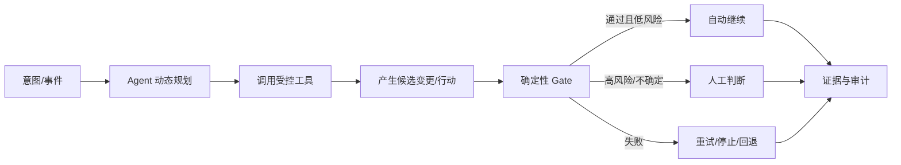

# Agentic CI/CD 横向变化总结

> [!summary] 核心判断
> Agent 带来的不是在每个工具里增加一个聊天框，而是重新分配“谁理解上下文、谁决定下一步、谁能调用工具、谁证明成功、谁承担责任”。平台从步骤编排器升级为受治理的 Agent 运行环境；流程从固定路径变为“动态计划 + 确定性 Gate”；人员从手工执行转向意图、证据、边界和异常管理。

## 一、工具平台的变化

### 1. 从功能孤岛到上下文控制面

过去工具围绕代码、构建、制品、部署和监控各自存储数据，跨工具诊断依赖人脑。Agent 要可靠工作，必须获得结构化、实时且有权限的上下文：变更意图、仓库历史、Pipeline 记录、测试结果、制品溯源、服务拓扑、运行遥测、策略和负责人。

GitHub/GitLab 依赖全生命周期代码与 Pipeline 数据，AWS/Datadog 等依赖云拓扑与遥测，Atlassian 依赖工作项与知识上下文，JFrog/Snyk/Tricentis 等专业工具提供领域事实。由此产生新的平台竞争：谁能成为 Agent 的可信上下文入口，而不仅是谁拥有最终 UI。

Harness 将这场竞争具体化为分层数据访问：已建模的跨 Pipeline、Service、Deployment、Security 查询优先走 Software Delivery Knowledge Graph/HQL，大日志先定位再裁剪，外部长尾系统走 MCP，写动作走受治理 Tool。这说明“上下文控制面”不是把所有 API 返回塞进 Prompt，而是显式管理 Schema、关系、权限、聚合和数据新鲜度。详见 [[50_deepdives/harness-company/90_report#5.1 Knowledge Graph + HQL：先建模，再让模型查询|Harness Knowledge Graph 分析]]。

### 2. 从固定 API 到 Agent Tool Layer

MCP、Skills、Actions 和 Pipeline Agent Step 正把平台能力包装为 Agent 可发现、调用和组合的工具。CLI-Anything 又增加了“接口工厂”路径：对有源码或后端 API、但缺少 Agent 友好命令面的软件，生成结构化 CLI、测试、文档和 `SKILL.md`，再供不同 Harness 调用。平台能力建设因此从“登记已有工具”扩展到“识别接口缺口、生成或手工建设接口、验证后入册”。

工具接口需要比普通 API 多一层治理元数据：用途说明、输入风险、只读/写范围、前置条件、批准策略、成本、速率限制和结果证据。自动生成的 CLI/Skill 还要记录来源版本、生成模型/流程、测试覆盖、权限声明和制品签名，避免把长尾软件的隐含风险批量放大。

工具数量不是目标。一个拥有数百个宽权限工具的 Agent 反而更难评测和治理。企业应提供经过审核的最小能力目录，并把生产动作与只读调查分离。

Harness MCP 的少量通用 Verb + Resource Registry 是另一种渐进式能力面：`describe/schema` 按需加载领域字段，Toolset 先做粗裁剪，Registry 负责 API 细节。它减少 Tool Schema 的线性膨胀，但安全仍来自 RBAC、Scoped Token、MCP Gateway Tool Intersection 和外部 Policy，而不是 Tool Discovery 本身。参考 [[00_sources/briefs/2026-harness-ai-platform|Harness AI Platform]] 与 [[00_sources/briefs/2026-harness-worker-agent-security|Worker Agent 安全与身份]]。

### 3. 从 Pipeline Runner 到 Agent Feedback Infrastructure

人类通常提交一次、等待一次 CI；Agent 会快速生成、验证、修改并再次运行。因此平台容量、排队、环境启动、分片、缓存和失败信息质量开始限制 Agent 产出。CI 的单位从“每次提交”转为“每个成功任务的多轮验证”。

平台需要支持：按任务分配预算和并发、隔离缓存/密钥、复用环境、结构化失败、快速局部验证，以及在超过重试或成本阈值时自动停止并升级人工。

### 4. 从静态配置到“意图编译”

GitHub Agentic Workflows 把自然语言 Markdown 编译为 Actions，Spacelift 将意图转为受同一 Policy 控制的部署，Harness 让 Agent 创建或修改 Pipeline。这代表一种新抽象：人描述目标与约束，Agent 生成执行计划，平台将其编译或映射到确定性执行对象。

这个抽象只有在生成物可查看、可版本化、可复现、可审批时才安全。纯运行时自由发挥会削弱审计与变更控制。

`gh-aw` 进一步说明“意图编译”不只是生成 YAML：Compiler 同时构造 Pre-activation、只读 Agent、Threat Detection、Safe Output 和 Conclusion 等权限阶段，固定 Action/Import，并将 Agent 请求的写动作先缓冲为 Artifact。这使平台评审对象从单一 Prompt 扩展为 Source、Lock、Job Graph、Tool/Network Policy 和 Safe Output Schema。复杂任务再通过 DeterministicOps 与 Orchestrator/Worker 拆分。详见 [[50_deepdives/github-agentic-workflows/90_report|GitHub Agentic Workflows 深度报告]]。

### 5. 新增 Agent 控制面

企业 CI/CD 平台将新增一组横切能力：

- Agent/任务身份与人类委托链；
- 短期凭据、最小权限、环境 Scope；
- 沙箱、网络和密钥隔离；
- 工具注册、版本、签名与供应链；
- Safe Output、审批、Policy 和动作预算；
- 模型、Prompt/Skill、上下文、工具调用、结果的完整审计；
- 离线评测、在线监控、回放和动态降权；
- Token、Runner、重试和外部服务成本治理。

NIST 概念稿给出原则，Uber 的生产架构、Google Cloud Agent Identity 和 OpenID AuthZEN 草案则把原则进一步具体化：独立 Agent 身份、短期单跳凭据、完整委托链、网关策略与执行时重新授权。Agent 不能继续使用共享机器人账号，也不能把批准状态只保存在 Prompt 中。参考 [[00_sources/briefs/2026-uber-agent-identity|Uber Agent Identity]]、[[00_sources/briefs/2026-google-cloud-agent-identity|Google Cloud Agent Identity]] 与 [[00_sources/briefs/2026-openid-authzen-agent-authorization|OpenID AuthZEN]]。

Harness 2026-07 的 Worker Agent 设计增加了一个可落地的产品样本：存在触发 Principal 时，单次 Token 只包含 `parent RBAC ∩ declared grant`，第三方工具再取 `connector.allowedTools ∩ agent.allowedTools`，每次调用记录 Agent、Run 与 Principal。与此同时，Image/Process/Secret/Network 四层隔离假设 Agent 已被攻陷。它补足了“身份可追责”和“运行时 Blast Radius”两个不同问题，但当前仍是第一方证据，且部分权限依赖 Feature Flag；Webhook/Schedule 等事件 Trigger 目前没有可继承的触发人 scoped token，必须另建身份与批准路径。

## 二、工作流程的变化

### 1. 从固定 DAG 到动态计划 + 固定 Gate

流程不会整体变成不可预测的自由 Agent。更可能的结构是：Agent 在边界内选择调查与修复步骤，而测试、策略、签名、审批和 SLO 继续确定性执行。

### 2. 从建议到可验证行动

高价值输出正在从摘要和评论转向修复 PR、测试、Pipeline Patch、Policy、Release Plan、Runbook 和受控部署动作。每个输出都应附带验证证据：运行了哪些测试、哪些规则通过、未解决什么、影响范围和如何回滚。

### 3. 从逐步人工操作到风险分级监督

低风险、可逆、可验证任务可以 L2/L3；高风险、不可逆、跨组织任务保持人工批准。审批不应只是点击，而应针对具体计划、制品、环境和有效期。Agent 变更计划后，原批准应失效或重新确认。

### 4. 从失败后排查到持续反馈循环

Agent 可以在 PR 前后、构建、发布和生产运行中持续吸收反馈，形成“发现 → 修复 → 验证 → 再观察”的循环。风险是无限重试、为通过测试而过拟合、成本失控和反复扰动生产。因此必须设置最大轮次、成本、时间、动作次数和异常停止条件。

更稳健的实践是快慢双环：确定性快环只处理可识别的瞬态故障、重调度、停止或回退；Agent 慢环负责复现、根因与 Fix-forward。两者共享 Incident Lineage，但分开权限、预算和停止条件。若不先分类，Agent 可能对网络 503 修改业务代码，或用无限重跑掩盖真实缺陷。详见 [[50_deepdives/cicd-self-healing/90_report|CI/CD 问题自愈专题]]。

### 5. 从单 Agent 演示到专业 Agent 协同

Qodo 的专业 Reviewer、AWS 的多 Agent 根因调查、GitLab Flow 和早期多 Agent 平台表明任务会按角色拆分。但更多 Agent 不天然更好：上下文重复、冲突、延迟和责任模糊会增加。Harness 从五个子 Agent 收敛为一个统一 Agent 是反向证据。企业应以任务边界和评测结果决定拆分，而非追求多 Agent 数量。

### 6. PR、Pipeline 与 Runbook 成为三类关键人机边界

- **PR**：适合代码、配置、测试和策略的可审查变更。
- **Pipeline**：适合隔离执行、确定性验证和证据留存。
- **Runbook/Approval**：适合生产动作、渐进发布和恢复。

这三者能让 Agent 使用现有工程控制，而不是另建一套不可审计的“AI 流程”。

Harness 的产品组合正好对应这三类边界：Code Quality/AutoFix 主要通过 PR；Worker Agent 进入 Pipeline；AI SRE 将动态 Scribe/RCA 与预定义 Runbook 分开。其经验不是让所有步骤 Agent 化，而是把概率推理嵌入可审批、可复验、可回退的确定性结构。

## 三、人员角色与能力的变化

### 1. 开发者

减少：逐条查日志、重复修配置、机械补测试和低价值评审。

增加：描述意图与验收条件、选择或修正 Agent 计划、判断业务语义、审查证据、处理异常和对最终变更负责。开发者需要理解模型不确定性、工具权限和 Agent 生成代码的安全风险。

### 2. 平台工程与研发效能团队

从“做一个门户和模板”转为“运营 Agent 工作环境”。新增职责包括上下文产品、Tool/MCP/CLI/Skill 目录、长尾工具接口改造、Agent Runtime、权限与预算、黄金评测集、回放、失败分类和自治等级运营。接口生成器可以降低接入成本，但平台团队仍需与工具 Owner、安全团队共同验收命令语义、危险动作和版本生命周期。

高质量平台是 Agent 规模化的前提。DORA 研究提示，平台薄弱时，AI 可能提高产出同时恶化稳定性。参考 [[00_sources/briefs/2026-dora-platform-engineering-ai|DORA Platform Engineering]]。

### 3. QA 与测试工程

从主要编写测试步骤转为设计风险模型、测试意图、Oracle、数据和覆盖策略；评估 Agent 是否只是让当前测试变绿，还是改善长期可维护性。需要维护未来测试、变异测试、真实失败回放和 Agent 生成测试的质量基线。

### 4. 安全、合规与 IAM

新增 Agent 身份、任务级授权、委托链、工具供应链、Prompt Injection、数据边界、模型与 Skill 版本审计。安全团队需要将 Policy 放到模型外部执行，同时为低风险自动修复设计可操作的例外和批准机制。

### 5. SRE、运维与发布管理

从跨工具收集信息转为设计 SLO、Runbook、恢复边界和验证 Agent 调查；保留事件指挥、业务风险取舍和高影响动作审批。发布经理从状态汇总者转向风险与证据设计者。

### 6. 工程管理者

需要避免用生成代码量、Agent 使用率或节省工时作为唯一目标。管理者应关注交付稳定性、人工认知负荷、失败类型、责任是否清晰和平台瓶颈，并允许团队在证据不足时降低自治等级。

## 四、治理与安全的变化

### 治理原则

1. **模型可变，边界确定**：测试、策略、签名和批准在模型外部。
2. **每次任务可追责**：独立身份、委托人、短期凭据和完整审计。
3. **默认只读，少数写出口**：PR、Safe Output、Approval、预批准 Runbook。
4. **权限与证据匹配**：通过真实任务持续评测，达到阈值才升级自治。
5. **高风险职责分离**：同一 Agent 不应同时修改规则、批准变更、执行和解释结果。
6. **输入不可信**：代码、Issue、日志、网页、工具描述都可能包含间接提示注入。
7. **可停止、可回退、可接管**：任何长循环都有预算和停止条件。
8. **Oracle 独立且不可自改**：Agent 不得通过 Skip、Ignore、降阈值或替换测试集制造“伪绿灯”。

### 主要新增风险

| 风险 | 典型表现 | 关键控制 |
|---|---|---|
| 提示注入与工具投毒 | PR/日志/MCP 描述诱导越权 | 内容隔离、工具白名单、网关策略、最小权限 |
| 共享身份与不可追责 | Agent 共用机器人 Token | 任务身份、短期凭据、委托链、不可变审计 |
| 为通过 Gate 而过拟合 | 删除测试、弱化规则、表面修复 | 职责分离、规则保护、未来/隐藏测试、人工抽检 |
| 无限重试与成本爆炸 | Agent 循环构建和调用模型 | 时间/Token/Runner/动作预算，失败升级 |
| 供应链污染 | 恶意 Skill、MCP、模型或依赖 | 注册、签名、版本锁定、来源策略、扫描、隔离 |
| 监控能力落后 | 强 Agent 规避弱 Monitor | 模型监控 + 确定性策略，持续红队与升级 |
| 自动化偏差放大 | 错误判断快速扩散到多仓/多环境 | 渐进 rollout、Blast Radius 限制、抽样与 Kill Switch |

METR 的早期研究提示 Monitor 与执行 Agent 能力差距会影响可监控性；USENIX 2026 的实证研究确认公共生态中存在通过脚本和文档操纵 Agent 的恶意 Skills。前者不能当作生产安全率，后者也不能直接外推企业私有目录，但两者共同要求“模型监控 + 供应链治理 + 运行时最小权限”。参考 [[00_sources/briefs/2026-metr-shushcast-monitorability|METR SHUSHCAST]] 与 [[00_sources/briefs/2026-malicious-agent-skills-usenix|Malicious Agent Skills]]。

## 五、度量体系的变化

### 不能只看

- 生成代码行数；
- Agent 调用次数或月活；
- 单次 Demo 成功；
- Vendor Benchmark；
- 节省的理论工时；
- 开源 Star。

### 建议五层指标

| 层级 | 指标示例 | 回答的问题 |
|---|---|---|
| 任务质量 | 成功率、回归率、错误修复、人工拒绝、保留率 | Agent 是否真正完成任务？ |
| 自愈质量 | Verified Repair Yield、无效重试、7/30 日复发、Gate 弱化、接管与回退成功 | 问题是否真正恢复且没有被掩盖？ |
| 流程效果 | Lead Time、反馈时延、MTTR、变更失败率、评审负荷 | 是否改善交付系统？ |
| 治理安全 | 越权、策略拦截、审计完整率、接管率、回滚率 | 是否在边界内运行？ |
| 经济性 | 每成功任务 Token/Runner/人时、重试成本、平台成本 | 是否值得规模化？ |

所有指标应按任务类型、风险等级、自治等级、模型/Agent 版本和业务域切片。SWE-chat 的代码保留率/人工纠正、SWE-CI/SWE-EVO 的长期零回归、CodeThread 的连续 Agent-on-Agent 代码演化，以及 DORA 的交付稳定性和平台质量，提供了比“生成量”更有意义的方向。参考 [[00_sources/briefs/2026-swe-chat-real-world-agent-use|SWE-chat]]、[[00_sources/briefs/2026-swe-ci-benchmark|SWE-CI]] 与 [[00_sources/briefs/2026-codethread-maintainability|CodeThread]]。

## 六、组织成熟度模型

| 级别 | 特征 | 允许的典型自治 |
|---|---|---|
| M0 工具试用 | 各团队自行使用，缺少统一数据和审计 | L0—L1 |
| M1 受控辅助 | 企业账号、只读上下文、PR 输出、基础日志 | L1—L2 |
| M2 可验证执行 | 沙箱、确定性 Gate、任务身份、预算、评测集 | L2，局部 L3 |
| M3 平台化运营 | 统一 Tool/Context Plane、在线监控、动态权限、回放 | 广泛 L3，少量 L4 |
| M4 受限闭环 | 低风险场景闭环，自动停止/回退，持续审计与红队 | 明确边界内 L4 |

M4 不是“所有 CI/CD 无人化”，而是企业能在多个明确场景中证明 L4 的安全性、可恢复性和经济性。高风险发布、策略变更和跨组织责任仍可能永久保留人工控制。

## 七、未来两年的结构性判断

### 高概率

- Agent 会成为主流代码仓、Pipeline 和可观测平台的一等运行单位。
- MCP/Skills 继续普及，但企业会从“多接工具”转向“治理工具目录”。
- PR、测试、Policy、签名和 SLO 继续作为 Agent 外部 Oracle。
- 平台工程团队新增 Agent Control Plane 与 Evaluation 职能。
- 代码评审、CI 修复和事故调查率先规模化到 L2/L3。

### 中概率

- 发布就绪、渐进发布和低风险恢复出现更多受限 L4。
- 制品仓与软件供应链平台从可信依赖选择和证明入口，继续演化为受控行动面；签名和晋级权仍外置。
- Agent 任务量推动 CI 计算、环境和成本模型重新设计。

### 低概率或不应作为基线

- 2027—2028 年前关键生产发布普遍实现无人监督 L4。
- 一个通用 Agent 取代所有专业测试、安全、制品和运维工具。
- 单靠更强模型解决身份、权限、审计、回滚和组织责任问题。

## 下钻入口

- [[90_report/seven-dimension-analysis|七维交叉分析工作台]]
- [[10_summaries/tools/README|Agent 工具与技术栈总结]]
- [[20_summaries/companies/README|公司维度总结]]
- [[30_summaries/stages/README|阶段维度总结]]
- [[00_sources/agentic-cicd-source-landscape|信息源景观]]
- [[50_deepdives/cicd-self-healing/README|CI/CD 问题自愈专题]]
- [[50_deepdives/harness-company/README|Harness 公司专题]]
