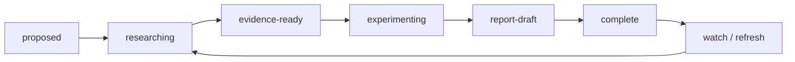

# Agentic CI/CD 专题深研

> [!summary] 定位
> 专题层位于分类总结与主报告之间，用于对高价值问题进行问题树拆解、证据映射、跨案例比较、动手复现和企业 Playbook 设计。专题可以深入，但不复制 [[00_sources/README|L0 证据]]和 [[05_case_library/README|规范案例卡]]。

## 专题工作单元

每个专题至少包含：

```text
<topic>/
  README.md             # 单一入口、状态、关键结论和导航
  00_charter.md         # 研究范围、决策问题、非目标
  10_question-tree.md   # 问题树、假设和验收标准
  20_evidence-map.md    # Claim—Evidence—Gap 矩阵
  30_case-map.md        # 规范案例的横向比较
  40_labs/              # 自有实验、复现和原始结果
  50_findings.md        # 分析发现、反例与置信度
  60_playbook.md        # 企业试点和治理建议
  90_report.md          # 专题完整报告
  assets/               # 图、截图和非文本附件
```

## 专题地图：按研究维度拆分

> [!important] 拆分原则
> MCP、CLI、Skill 和 Agent/Harness 分别属于协议、执行接口、知识资产和运行主体四个不同维度。它们可以在主报告中讨论组合关系，但专题深研必须分别建立研究问题、案例、评价指标和实验，不能共用一份专题报告。

| 专题 | 核心维度 | 主要研究边界 | 不在该专题深入的问题 | 状态 |
|---|---|---|---|---|
| [[50_deepdives/mcp-protocol/README|MCP]] | 协议与工具连接层 | 本地/远程传输、Tool/Resource Schema、OAuth、Gateway、互操作和安全 | CLI 设计细节、Agent 推理能力 | complete |
| [[50_deepdives/cli-agent-interface/README|CLI 与 Agent-ready Interface]] | 确定性执行接口 | 结构化输出、错误语义、非交互、幂等、版本、Runner 和任务身份 | MCP 企业协议治理、Skill 内容设计 | complete |
| [[50_deepdives/cli-anything/README|CLI-Anything]] | Agent 原生接口生成项目 | 七阶段 SOP、CLI/测试/Skill、CLI-Hub、Preview、成熟度和 CI/CD 场景 | 全部 CLI 的设计理论、MCP 协议治理 | complete |
| [[50_deepdives/github-agentic-workflows/README|GitHub Agentic Workflows]] | Agent Workflow 编译与 Actions 运行平台 | Markdown/Frontmatter、Compiler、Safe Outputs、Sandbox、复杂编排与 CI/CD 实践 | GitHub 全产品线、通用 Harness 模型能力比较 | complete |
| [[50_deepdives/cicd-self-healing/README|CI/CD 问题自愈]] | 端到端问题恢复场景 | 失败分类、诊断、修复、独立验证、受控执行、观察、回退与学习闭环 | 通用传统 CI/CD、单一模型能力比较 | complete |
| [[50_deepdives/harness-company/README|Harness 公司]] | 单一厂商/平台 | Harness Inc. 产品组合、Agent 应用、Knowledge Graph/MCP/Pipeline 原理、隔离与委托权限、案例、成熟度和采购落地 | 通用 Agent Harness 工程方法、所有 Agent Runtime 横向比较 | complete |
| Skill / Rules / Hooks | 知识与行为资产 | 组织知识封装、发现与加载、版本、测试、供应链和生命周期 | Harness 推理架构、底层 CLI 实现 | proposed |
| 通用 Agent Harness / Runtime | 推理与运行主体 | 上下文、规划、工具循环、权限、沙箱、审批、评测和 Claude Code/Codex/OpenCode 等实现 | Harness Inc. 公司产品线、单个协议或知识包的完整标准研究 | proposed |

CLI 与 MCP 仅在选型边界发生交叉，统一比较见 [[50_deepdives/cli-vs-mcp-decision-guide|CLI 与 MCP 可替代性决策指南]]，不将两者合并为一个专题。规范案例仍保存在 [[05_case_library/README|案例库]]，可被多个独立专题引用。

## 专题类型

- `technology`：MCP、CLI、Skill、Harness、Identity 等技术机制。
- `scenario`：CI 自愈、制品晋级、发布就绪、事故恢复等端到端任务。
- `company`：对单一厂商或开源生态做产品线和战略深研。
- `governance`：身份、授权、供应链、审计、评测与经济性。
- `benchmark`：围绕任务集、指标和复现实验验证行业主张。

## 状态流转



专题完成不是“写完一篇文章”，而是以下条件同时成立：关键 Claim 能下钻到证据、案例与实验不混写、重要反例已处理、结论置信度明确、需要回流的上层报告已经更新。

## 增量洞察回流

- 补充洞察默认进入最相关的专题目录，并按性质更新 `20_evidence-map.md`、`30_case-map.md`、`40_labs/`、`50_findings.md`、`60_playbook.md` 或 `90_report.md`，不能只在 PPT 中维护。
- 新的一手证据先在 [[00_sources/README|信息源层]]保留 Source Brief 或可追溯入口，专题层负责 Claim、反例、置信度和企业含义。
- 没有匹配专题且问题尚未形成完整研究范围时，先在本索引登记为 `proposed`；不要把不同研究维度强行合并。
- 每次专题更新后评估其演示影响。如果它改变页面主张、作业流、产品状态、自治或成熟度、控制边界、企业启示或来源映射，可以同步到 [[80_presentations/README|演示文稿层]]；否则保留在 Deep Dive 即可。

## 规范

- [[50_deepdives/_templates/Topic Template|Topic Template]]
- [[50_deepdives/_templates/Evidence Map Template|Evidence Map Template]]
- [[50_deepdives/_templates/Lab Template|Lab Template]]
- [[05_case_library/Case Template|Case Template]]
