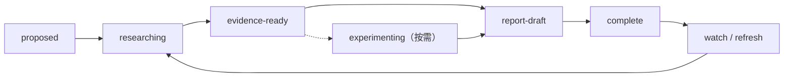

# Agentic CI/CD 专题深研

> [!summary] 定位
> 专题层是一条独立作业流，用于对单一公司、功能、技术、治理问题或端到端场景进行问题树拆解、证据映射和完整论证，并按需开展跨案例比较、动手复现和企业 Playbook 设计。它不再是所有批量洞察进入主报告的必经中间层，也不复制 [[00_sources/README|L0 证据]]和 [[05_case_library/README|规范案例卡]]。

## 专题工作单元

每个专题的必需交付物：

```text
<topic>/
  README.md             # 单一入口、状态、关键结论和导航
  00_charter.md         # 研究范围、决策问题、非目标
  10_question-tree.md   # 问题树、假设和验收标准
  20_evidence-map.md    # Claim—Evidence—Gap 矩阵
  50_findings.md        # 分析发现、反例与置信度
  90_report.md          # 专题完整报告
```

按研究问题选择可选交付物：

```text
<topic>/
  30_case-map.md        # 需要跨案例比较时
  40_labs/              # 能够或必须通过学习、配置、复现验证时
  60_playbook.md        # 需要企业试点和治理建议时
  assets/               # 需要图、截图或非文本附件时
```

配置或实践细节具有复用价值时，可在 [[60_tutorials/README|教程层]]形成专题衍生物，不要求每个专题都编写教程。

## 专题地图：按研究维度拆分

> [!important] 拆分原则
> MCP、CLI、Skill 和 Agent/Harness 分别属于协议、执行接口、知识资产和运行主体四个不同维度。它们可以在主报告中讨论组合关系，但专题深研必须分别建立研究问题、案例、评价指标和实验，不能共用一份专题报告。

| 专题 | 核心维度 | 主要研究边界 | 不在该专题深入的问题 | 状态 |
|---|---|---|---|---|
| [[50_deepdives/mcp-protocol/README|MCP]] | 协议与工具连接层 | 本地/远程传输、Tool/Resource Schema、OAuth、Gateway、互操作和安全 | CLI 设计细节、Agent 推理能力 | complete |
| [[50_deepdives/cli-agent-interface/README|CLI 与 Agent-ready Interface]] | 确定性执行接口 | 结构化输出、错误语义、非交互、幂等、版本、Runner 和任务身份 | MCP 企业协议治理、Skill 内容设计 | complete |
| [[50_deepdives/cli-anything/README|CLI-Anything]] | Agent 原生接口生成项目 | 七阶段 SOP、CLI/测试/Skill、CLI-Hub、Preview、成熟度和 CI/CD 场景 | 全部 CLI 的设计理论、MCP 协议治理 | complete |
| [[50_deepdives/github-agentic-workflows/README|GitHub Agentic Workflows]] | Agent Workflow 编译与 Actions 运行平台 | Markdown/Frontmatter、Compiler、Safe Outputs、Sandbox、复杂编排与 CI/CD 实践 | GitHub 全产品线、通用 Harness 模型能力比较 | complete |
| [[50_deepdives/cicd-self-healing/README|CI/CD 问题自愈]] | 端到端问题恢复场景 | 失败分类、诊断、修复、独立验证、受控执行、观察、回退与学习闭环 | 通用传统 CI/CD、单一模型能力比较 | complete |
| [[50_deepdives/runtime-generated-verification-gates/README|Agent 生成验证的运行时 Gate]] | 生成式验证与门禁控制 | 变更感知验证的规划、执行、证据契约、Gate adapter，以及 AWS Release Management 与 Meta JiTTesting 的机制边界 | 测试生成算法、mutant 质量、UI/API 测试类型 | complete |
| [[50_deepdives/harness-company/README|Harness 公司]] | 单一厂商/平台 | Harness Inc. 产品组合、Agent 应用、Knowledge Graph/MCP/Pipeline 原理、隔离与委托权限、案例、成熟度和采购落地 | 通用 Agent Harness 工程方法、所有 Agent Runtime 横向比较 | complete |
| [[50_deepdives/aws-devops-agent/README|AWS DevOps Agent]] | 单一厂商/平台 | Agent Space、Topology、Learned Skills、Production Operations、Release Management、IAM/数据/执行边界与企业试点 | AWS 全产品线、通用 AIOps 横评、端到端自主发布效果 | complete |
| [[50_deepdives/aws-microsoft-intelligent-cicd/README|AWS 与 Microsoft 智能化 CI/CD 对比]] | 双公司能力对比 | AWS 与 Microsoft（GitHub/Azure DevOps/Azure）在发布前审查、合并前门禁、发布后恢复的 Agent 能力清单、生命周期与授权边界 | 全产品线盘点、成熟度排名、跨企业效果、端到端自治 | complete |
| [[50_deepdives/amazon-bedrock-agentcore/README|Amazon Bedrock AgentCore]] | Agent 生产运行与治理平台 | Harness/Runtime、Gateway/Identity/Policy、Memory、Observability/Evaluations/Optimization，以及 Agent 行动与质量双闭环 | AWS DevOps Agent 业务能力、通用 Agent framework 横评、把 Evaluation 当发布授权 | complete |
| [[50_deepdives/dagger/README|Dagger]] | 可编程软件交付执行层 | Engine、Module/Function、增量执行、Hybrid CI、Cloud、特权边界、LLM/MCP、采用与替代关系 | 通用 CI 平台全功能采购横评、完整 SDK 教程、所有 Build System 基准 | complete |
| [[50_deepdives/claude-code-container-use/README|Claude Code × Dagger Container Use]] | Agent 候选执行环境 | Claude 原生 worktree/并行能力与 Container Use 的容器状态、执行历史、环境配置和本地—CI 复用边界 | Claude 模型质量 Benchmark、通用 Agent 编排、成熟联合客户方案 | complete |
| [[50_deepdives/buildkite/README|Buildkite]] | 可编程 CI 编排与执行基础设施 | Dynamic Pipeline、Cluster/Queue/Agent/Stack、Hosted/Self-hosted Fleet、Test Engine、Package Registry、Agentic CI | Build System 内部依赖图、完整 CD/发布治理、所有 CI 产品采购横评 | complete |
| [[50_deepdives/qovery/README|Qovery LLM/CI/CD]] | Agent 可操作的交付控制面 | AI Copilot、MCP、Skills、Code-to-Environment、部署诊断、Preview、RDE/Agent Workflow 与权限边界 | Qovery 全产品采购、基础模型 Benchmark、把 closed workflow 当 GA | complete |
| [[50_deepdives/llm-era-cicd-infrastructure/README|大模型时代的 CI/CD 基础设施]] | 跨基础设施技术变化 | 代码仓、流水线、构建系统、制品仓，以及身份、证据、审计和成本控制 | 单一产品教程、基础模型能力比较、LLMOps | complete |
| Skill / Rules / Hooks | 知识与行为资产 | 组织知识封装、发现与加载、版本、测试、供应链和生命周期 | Harness 推理架构、底层 CLI 实现 | proposed |
| [[50_deepdives/agent-workbench/README|Agent 工作台产品功能与控制边界]] | 工作台、Agent 构建治理与 CI/CD 原生 Agent | WorkBuddy、ChatGPT Work/Codex、Claude Cowork、GitLab Duo、Harness Inc. Worker Agents、GitHub Agentic Workflows 的入口、配置、协作、产物、权限、状态和限制 | 产品事实之外的企业方案、采用效果或采购排名；相关旧假设仅保存在隔离附录 | complete |

CLI 与 MCP 仅在选型边界发生交叉，统一比较见 [[50_deepdives/cli-vs-mcp-decision-guide|CLI 与 MCP 可替代性决策指南]]，不将两者合并为一个专题。规范案例仍保存在 [[05_case_library/README|案例库]]，可被多个独立专题引用。

Dagger 与 Buildkite 的相邻层关系、双 DAG 所有权与分阶段采用路径见 [[50_deepdives/dagger-buildkite-decision-guide|Dagger 与 Buildkite 分层选型指南]]；该指南只综合两个已完成专题，不将其合并成单一事实源。

## 专题类型

- `technology`：MCP、CLI、Skill、Harness、Identity 等技术机制。
- `scenario`：CI 自愈、制品晋级、发布就绪、事故恢复等端到端任务。
- `company`：对单一厂商或开源生态做产品线和战略深研。
- `governance`：身份、授权、供应链、审计、评测与经济性。
- `benchmark`：围绕任务集、指标和复现实验验证行业主张。

## 状态流转



专题完成不是“写完一篇文章”，而是以下条件同时成立：关键 Claim 能下钻到证据、事实与分析不混写、重要反例已处理、结论置信度明确、必需交付物已完成。只有专题结论改变跨行业观点时才回流主报告。

## Presentation-ready 门禁

专题 README Frontmatter 使用 `presentation_ready: true/false` 表示它能否作为正式汇报页面的主要分析来源。

设置为 `true` 至少要求：

- 有清晰、可被一页汇报表达的核心主张；
- 机制、作业流或能力关系能够直接证明主张；
- 产品状态、自治等级、证据强度、时间点和关键边界已经校准；
- 重要反例不会推翻页面结论；
- `90_report.md` 已形成可引用的完整论证。

该字段不表示产品本身成熟，也不要求专题一定进入某个 Deck。

## 增量洞察回流

- 单一公司、功能、技术或场景的补充洞察进入最相关的专题目录，并按性质更新 Evidence Map、案例、实验、Findings、Playbook 或专题报告。
- 新的一手证据先在 [[00_sources/README|信息源层]]保留 Source Brief 或可追溯入口，专题层负责 Claim、反例、置信度和企业含义。
- 没有匹配专题且问题尚未形成完整研究范围时，先在本索引登记为 `proposed`；不要把不同研究维度强行合并。
- 每次专题更新后重新判断 `presentation_ready`。只有它改变已有页面主张、作业流、状态、控制边界、企业启示或来源映射时才同步到 [[80_presentations/README|演示文稿层]]。

## 规范

- [[50_deepdives/_templates/Topic Template|Topic Template]]
- [[50_deepdives/_templates/Evidence Map Template|Evidence Map Template]]
- [[50_deepdives/_templates/Lab Template|Lab Template]]
- [[05_case_library/Case Template|Case Template]]
