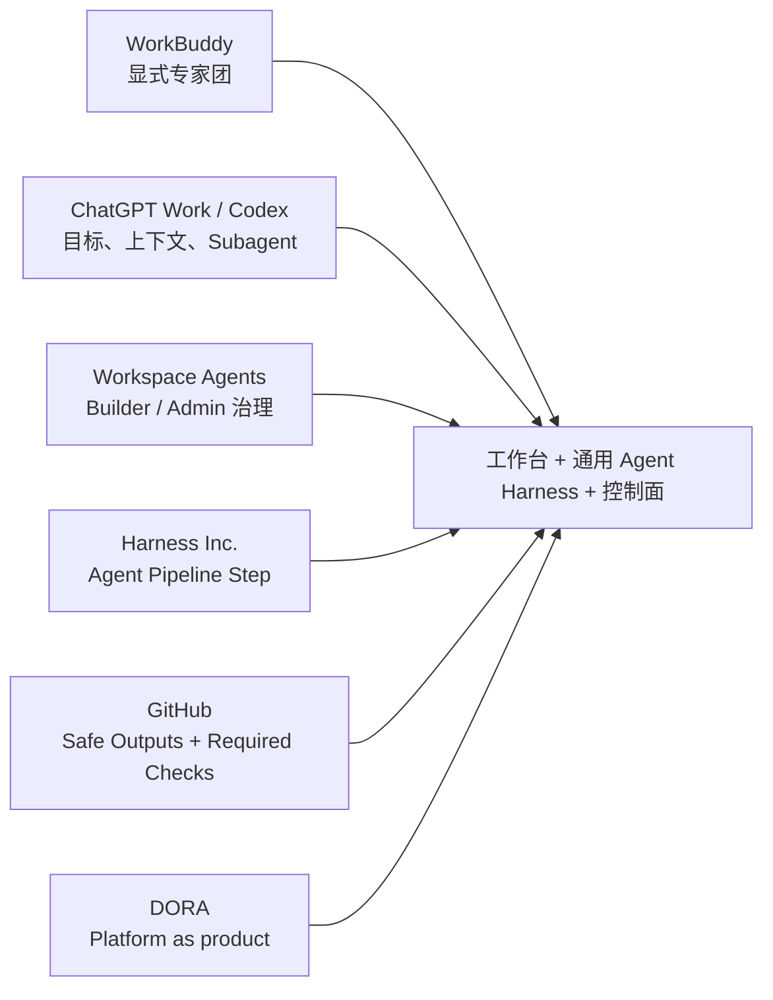

# Agent 工作台、专家团与交付控制案例地图

## 比较口径

案例不按“功能数量”排名，而按三种责任比较：谁消费能力、谁供应 Agent 能力、谁最终接受交付动作。产品状态只描述当前证据，不将 Research Preview 或 Public Preview 写成 GA。

| 案例 | 开发者 / 用户工作面 | 通用 Agent Harness 供给与治理 | 专家协作 | CI/CD 接受边界 | 状态与证据强度 | 对主张的作用 |
|---|---|---|---|---|---|---|
| Tencent WorkBuddy | 自然语言任务、项目上下文、过程与产物 | 企业管理员上传、版本化、启停、分类并按成员下发专家；Skill/MCP 受授权 | 显式团长拆解、分配、并行、整合 | 未证明内建 Required Checks、签名、发布审批或 SLO | 产品 2026-03-04 正式发布；专家团单项阶段未标；官方文档 high | 证明工作台与专家团形态，并证明专家管理可从使用入口分离 |
| ChatGPT Work | 长任务、项目文件/来源、过程观察、改方向、重要动作确认、成品交付 | 工作区计划、Plugin/App 和项目策略约束可用能力 | 合资格账户可调用专业 Subagent | 未证明是 CI/CD 放行控制面 | 2026-07-09 发布后分批开放；官方文档 high | 证明最终用户工作面和主会话整合并行结果 |
| Codex | 代码目录/Workspace、Diff、测试与工程任务 | AGENTS.md、Skill、自定义 Agent、权限和本地/云执行环境 | 专业 Subagent 并行，主任务汇总 | 仓库 CI、Required Checks、Review 和部署环境继续外置 | 当前产品文档；官方文档 high | 证明“更多给开发使用”可以落在真实代码库入口 |
| ChatGPT Workspace Agents | 组织成员调用共享、可计划执行的 Agent | Builder 配置 Apps、Skills、指令；Admin 用 RBAC 控制启用、构建、分享和发布 | 当前证据重点是共享 Agent，不等同于专家团 | 连接系统权限与动作确认仍独立 | Research Preview；官方 Cookbook high | 证明后台 Builder/Admin 供给面，但成熟度不能回填给 ChatGPT Work |
| Harness Inc. Worker Agents | 开发/平台人员在 Pipeline 中消费预配置 Agent Step | 指令、模型、MCP、上下文、权限、Runtime、Marketplace 资产 | 可实现专业步骤组合，但不以“专家团”作为核心证据 | Pipeline、短期权限、Tool Allowlist、外部 Oracle | Worker Agents 平台总览 GA；部分权限路径需目标账户验证 | 证明通用 Agent Harness 可以被 CI/CD 平台化并嵌入流水线 |
| GitHub Agentic Workflows | 仓库维护者用 Markdown 描述 Agent 任务并审查输出 | Enterprise/Repo 管理员控制 Actions、Reusable Workflow、Runner 和 Ruleset | 可选择不同 Agent 引擎；不是本专题的专家团主证据 | 默认只读、Safe Outputs、Ruleset、Required Checks、部署保护 | Public Preview；官方文档 high | 证明 Agent 候选输出不等于合并或发布授权 |
| DORA Platform Engineering | 开发者通过 Golden Path 自助构建、测试、部署和诊断 | 平台团队把工具链和流程作为开发者内部产品运营 | 不直接研究多 Agent | 高质量平台提供自动化、标准化与安全路径 | 原始研究 / 官方能力页；medium-high | 为“开发者是客户，平台团队从工单转向产品供给”提供组织机制基础 |

## 产品形态，而非单一赢家

这些案例不是同层替代品：WorkBuddy 与 ChatGPT Work/Codex 更接近使用面，Workspace Agents 更接近组织供给面，Harness Inc. 与 GitHub 更接近交付运行和接受面，DORA 提供 operating-model 研究背景。

## 关键反例

### 多 Agent 不天然优于单 Agent

- WorkBuddy 官方提示专家团通常消耗单专家 3—5 倍积分；
- OpenAI 官方提示 Subagent 使用更多 Token，并提醒并行写任务会增加冲突；
- Harness Inc. 既有产品演进中存在从多个子 Agent 收敛到统一 Agent 的反向案例，见 [[00_sources/briefs/2026-harness-ai-devops-agent|Harness AI DevOps Agent]]。

因此，专家拆分必须由任务独立性、上下文隔离、评测结果和单位成功成本决定。

### 供给层不等于中央团队包办

DORA 同时强调平台的可扩展贡献模型。Harness 设计者应维护契约、门禁和共享骨架，领域团队可以贡献自己的 Skill、专家知识和任务集；否则平台团队会重新成为工单瓶颈。

### 自助不等于无审批

开发者可以自助启动构建准备、诊断和候选修复，但测试、策略、签名、环境保护、变更授权和回滚决策仍可由独立系统或人员执行。自助提高的是入口效率，不是取消责任分离。
