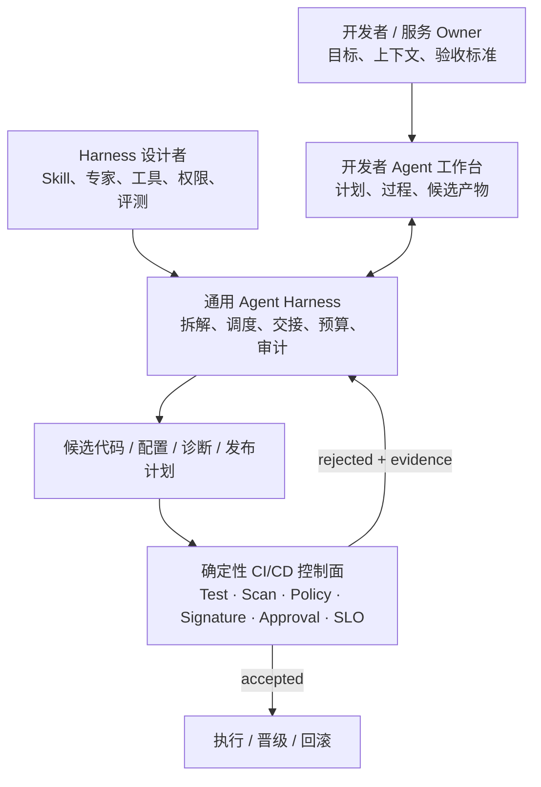

# Agent 工作台与通用 Agent Harness 企业 Playbook

## 目标 operating model

## 五角色职责

| 角色 | 核心责任 | 明确不负责 |
|---|---|---|
| 开发者 / 服务 Owner | 业务意图、验收标准、服务上下文、候选结果确认和业务风险 | 维护所有底层工具细节；自行绕过生产门禁 |
| Harness 设计者 / 运营者 | Skill、专家、上下文、工具、权限、评测、预算、升级、审计和生命周期 | 代替所有团队完成每一张交付工单 |
| 主 Agent / 团长 | 澄清目标、形成任务图、选择专业 Agent、整合证据与候选产物 | 给自己授予工具权限；批准自己的生产动作 |
| 专业 Agent | 在限定上下文和工具内完成诊断、测试计划、代码/配置候选或证据整理 | 越过任务 Scope；把推断写成确定事实 |
| 外部 Oracle / 批准者 | Test、Scan、Policy、Signature、Approval、SLO、环境保护、放行与回滚判定 | 依赖 Agent 的自评作为唯一接受证据 |

## 职责迁移 RACI

`R` = 执行，`A` = 最终负责，`C` = 协商，`I` = 知会。

| 工作对象 | 开发者 / 服务 Owner | Harness 设计者 | 主 Agent | 专业 Agent | 外部 Oracle / 批准者 |
|---|---|---|---|---|---|
| 定义业务目标、验收标准和风险等级 | A/R | C | C | I | C |
| 注册、版本化和发布 Skill/专家 | C | A/R | C | C | C |
| 配置工具、凭据、Scope、Runner 与沙箱 | I | A/R | I | I | C |
| 形成任务图、分配子任务和整合结果 | C | C | A/R | R | I |
| 生成代码、配置、诊断或发布计划候选 | C | I | A | R | I |
| 维护离线任务集、回归评测与成本基线 | C | A/R | I | I | C |
| 执行 Test、Scan、Policy、Signature 和 SLO 判定 | I | C | I | I | A/R |
| 审查候选产物的业务适用性 | A/R | C | C | I | C |
| 生产晋级、回滚与例外审批 | C | C | I | I | A/R |
| 事故升级、权限收回、版本撤回和复盘 | C | R | I | I | A |
| 审计日志、成本、使用率和生命周期复核 | I | A/R | I | I | C |

## 分阶段落地

### Phase 0：先定义服务契约

- 选一个高频、可逆、证据清晰的旅程，例如“构建失败诊断并形成候选修复”；
- 写清输入、输出、验收证据、最大轮次、成本、超时和升级条件；
- 明确哪些是只读、候选写入、可预授权写入和必须人工批准动作；
- 保留现有 CI/CD 接受门禁，不先改变生产授权。

### Phase 1：单 Agent + 外部门禁

- 用一个主 Agent 跑完整旅程，建立失败语料和单位成功成本；
- 所有代码/配置写入只形成 Branch、PR、Plan 或 Dry-run 产物；
- 由现有 Test、Scan、Policy 和 Required Checks 接受；
- 没有达到稳定基线前不引入专家团。

### Phase 2：只拆独立专业任务

- 将日志归因、安全影响、测试选择、发布说明等相互独立任务拆给专业 Agent；
- 每个 Agent 只获得必要上下文和 Tool Scope；
- 定义交接 Schema、冲突规则、失败补偿和主 Agent 汇总责任；
- 用单 Agent 基线比较质量、P95 时延、总成本和写冲突率。

### Phase 3：把能力变成组织资产

- 为 Skill/专家分配 Owner、唯一 ID、语义版本、Changelog 和兼容矩阵；
- 在 Registry 中记录来源、权限、依赖、任务集、评测结果、成本和状态；
- 引入 Draft → Test → Limited → Published → Deprecated → Revoked 生命周期；
- 允许领域团队贡献，但由平台、安全和 Oracle Owner 审核契约。

### Phase 4：开发者自助与平台运营

- 工作台按服务/项目自动装载最小上下文和允许的专家；
- 开发者提交目标、审查计划和候选产物，不需要逐张工单找发布/运维执行；
- 平台/发布/运维人员观察失败簇、维护 Skill 和评测、处理异常、收紧或扩大授权；
- 用 Adoption、Task Success、Time-to-Evidence、Unit Success Cost、Override/Incident Rate 共同判断价值。

## Skill / 专家发布门禁

| 门禁 | 最低要求 |
|---|---|
| 版本 | 唯一 ID、语义版本、Owner、Changelog、依赖与兼容范围 |
| 测试 | 正常、边界、拒绝、工具错误、超时、Prompt Injection 和回归任务 |
| 权限 | 最小 Scope、短期身份、工具 Allowlist、敏感动作确认、撤权路径 |
| 成本 | Token/调用/计算预算、最大并发、最大轮次、单位成功成本 |
| 质量 | 任务成功率、证据完整率、误报/漏报、人工接受率、失败分类 |
| 审计 | 输入来源、上下文版本、模型、工具调用、产物、门禁结果和操作者 |
| 生命周期 | Draft、Limited、Published、Deprecated、Revoked 与回滚策略 |

## 试点记分卡

| 维度 | 建议指标 | 解释 |
|---|---|---|
| 开发者自助 | 无人工转派完成率、Time-to-First-Evidence | 衡量入口是否真的减少等待，而非只增加聊天步骤 |
| 任务质量 | 独立门禁通过率、人工接受率、复发率 | 以外部证据衡量，不用 Agent 自评分 |
| Harness 质量 | Skill/专家回归通过率、撤回率、上下文新鲜度 | 衡量供给层是否可持续运营 |
| 经济性 | 单位成功成本、P95 时延、并行浪费率 | 专家团必须相对单 Agent 有明确收益 |
| 风险 | 越权拒绝、人工 Override、误写、回滚和事故率 | 低事件数也要与调用规模配对解释 |
| 组织变化 | 工单量、重复执行工时、Harness 运营工时、开发者满意度 | 只能用企业自己的纵向数据判断职责迁移 |

## 停止条件

- Required Check、策略或审批被绕过；
- Agent 无法回链输入、工具调用或候选产物；
- 单位成功成本持续高于人工/单 Agent 基线且质量无提升；
- 专家间冲突、重复上下文或写竞争无法稳定控制；
- Skill 无 Owner、无版本、无回归任务或无法撤回；
- 生产异常无法关联到具体 Agent、版本、权限和门禁结果。
