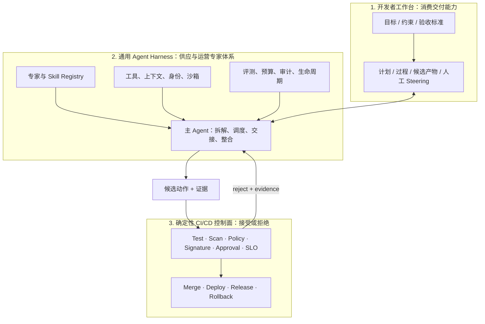

# Agent 工作台、专家团与交付角色重构专题报告

## 执行摘要

智能化 CI/CD 的下一阶段不只是“在流水线里增加一个 Agent”，而是出现新的能力消费与供给关系：开发者通过 Agent 工作台提交目标、补充项目上下文、观察专家协作并审查候选产物；发布、运维、SRE 和平台人员则把稳定知识沉淀为 Skill、专家角色、任务图、工具契约、评测集、权限和异常升级机制。

因此，本专题的核心判断是：

> **Agent 工作台把交付能力变成开发者可自助消费的服务；发布与运维人员则从流程执行者逐步转为 Agent 专家体系和安全边界的设计者。**

前半句已有 WorkBuddy、ChatGPT Work 和 Codex 的产品机制支撑；后半句是结合 Workspace Agents、WorkBuddy Enterprise、Harness Inc.、GitHub 与 DORA 形成的 operating-model 建议。当前没有足够跨企业证据把它写成已经普遍发生的岗位事实。

## 一、为什么“工作台”比“聊天助手”更重要

聊天助手回答一个问题；工作台承载一个持续任务。它至少同时管理：

- 目标、约束和验收标准；
- 项目文件、连接来源、规则与历史上下文；
- 计划、子任务、问题、人工补充与进度；
- 代码、配置、报告、发布计划等候选产物；
- 审查、批准、拒绝、回放和后续任务。

WorkBuddy 进一步把“专家团”显式产品化：团长拆解和分配任务，多位专家并行处理，再整合交付。ChatGPT Work 和 Codex 的 Subagent workflow 则把专业子线程的活动与摘要呈现在主会话中。这些事实能够佐证“专家团协作工作台”不是概念图，而是已经出现的产品形态。

但产品形态不等于交付可信。专家团可以提高分析吞吐，也会增加 Token、时延、上下文重复、交接损耗和并发写冲突。是否拆分专家，必须由任务独立性和评测证明。

## 二、三层架构：消费、供给、接受

### 第一层：开发者工作台

开发者是交付能力的客户，不再需要知道每个脚本、平台入口和工单队列。开发者的责任也没有减少为“一句话发布”：他必须给出业务意图、风险等级和验收标准，并确认候选结果是否符合服务语义。

### 第二层：通用 Agent Harness

Harness 设计者把交付知识变成可运营资产：

`专家角色 → Skill 行为包 → 工具/数据接口 → 身份与权限 → 编排与隔离 → 候选产物 → 评测 → 审计、预算和生命周期`

WorkBuddy Enterprise 的专家版本、发布状态、成员权限和下架机制，以及 Workspace Agents 的 Apps、Skills、Builder/Admin RBAC，证明这一供给面在产品上可成立。它仍需要企业自己补齐任务集、回归、依赖兼容、成本和事故责任。

### 第三层：确定性 CI/CD 控制面

Harness Inc. 将 Agent 做成流水线步骤；GitHub 将 Agent 输出限制在 Safe Outputs，并让 Ruleset、Required Checks 和部署规则继续决定接受。这说明可靠结构不是“Agent 替代流水线”，而是“Agent 产生候选，控制面接受候选”。

## 三、五类角色如何重构

| 角色 | 目标 | 新增或加重的责任 |
|---|---|---|
| 开发者 / 服务 Owner | 更快获得构建、发布准备、诊断与恢复支持 | 写清意图、验收标准和风险；审查候选产物；对服务结果负责 |
| Harness 设计者 / 运营者 | 把交付知识变成可复用、自助、受控的服务 | 设计 Skill、专家、上下文、工具、权限、评测、预算、升级和生命周期 |
| 主 Agent / 团长 | 把复杂目标变成可执行任务图 | 澄清、拆解、路由、整合、暴露冲突和证据缺口 |
| 专业 Agent | 在限定边界内完成专业子任务 | 使用最小上下文和工具，输出结构化候选物与证据 |
| 外部 Oracle / 批准者 | 保持交付结果可验证、可问责 | 运行门禁、执行授权、拒绝不合格候选、触发回滚或人工升级 |

发布、运维、SRE、平台和安全人员可能共同组成 Harness 设计者和 Oracle Owner，而不是被某个新岗位一一替代。岗位名称可以不变，价值重心从重复执行上移到契约、知识、控制和异常。

## 四、从当前产品事实到目标 operating model

| 层次 | 结论 | 证据状态 |
|---|---|---|
| 当前事实 | 开发者/用户已有目标与产物工作台；专家团/Subagent 可并行；Builder/Admin 可配置专家、Skill、App 和权限；CI/CD 外部门禁仍存在 | 多个独立一手来源，high |
| 结构推断 | 工作台、通用 Agent Harness、确定性 CI/CD 控制面正在形成三层分工 | 跨案例分析，medium-high |
| 企业建议 | 用发布/运维/平台人员经营通用 Agent Harness，让开发者自助消费交付能力 | operating-model 建议，medium |
| 未验证趋势 | 大多数企业已经完成职责迁移，或岗位数量会明显变化 | unverified |

“更多给开发使用”因此不能只写一句。它的当前态是开发者入口已经出现；目标态是企业把交付知识产品化；尚未证明的是这一 operating model 已经跨企业普及。

## 五、为什么 Skill 和专家也需要软件工程

一个能运行的 Skill 不等于一个可靠的企业能力。它至少需要：

1. **版本：** ID、Owner、语义版本、兼容矩阵、Changelog；
2. **测试：** 正常、边界、拒绝、工具失败、Prompt Injection、回归；
3. **权限：** 最小 Scope、短期身份、Allowlist、敏感动作确认、撤权；
4. **成本：** Token、计算、工具调用、并发、轮次和单位成功成本；
5. **可观察：** 上下文版本、模型、工具、候选产物、门禁结果和人工 Override；
6. **生命周期：** Draft、Limited、Published、Deprecated、Revoked 和回滚。

这正是发布与运维经验的新载体：把“这个步骤什么时候能安全做、失败时如何停、证据不足时找谁”从个人经验转成通用 Agent Harness 契约。

## 六、企业落地顺序

1. 选择高频、可逆、证据明确的旅程，不从生产自动发布开始；
2. 先建立单 Agent + 外部门禁基线；
3. 只把独立、可评测的任务拆给专业 Agent；
4. 为 Skill/专家建立 Registry、版本、回归、权限和撤回；
5. 在工作台开放给开发者自助，并观察任务成功、单位成本和 Override；
6. 发布/运维/平台团队从失败簇反向改进通用 Agent Harness，而不是继续逐单代执行。

完整 RACI、门禁和记分卡见 [[50_deepdives/agent-workbench/60_playbook|企业 Playbook]]。

## 七、边界与反例

- **小团队或低频流程：** 维护专家 Registry 和评测可能比人工路径更贵；
- **高耦合任务：** 多 Agent 交接成本可能超过并行收益；
- **低质量平台：** DORA 指出 AI 会放大系统问题，工作台可能只把下游混乱暴露得更快；
- **强监管生产：** 自助入口必须更严格地区分建议、执行和接受权；
- **权限错配：** WorkBuddy 的 Full Access、第三方 Skill 或共享凭据不能被当成企业强制门禁；
- **Preview 能力：** Workspace Agents 和 GitHub Agentic Workflows 的生命周期限制必须保留。

## 八、最终判断

Agent 工作台和专家团足以佐证一个明确方向：**交付能力的消费接口正在前台化给开发者，交付知识的供给与治理则需要后台平台化。**

对企业最有价值的不是让 Agent 直接“接管发布”，而是把发布、运维和平台专家的经验变成可版本、可评测、可授权、可审计、可撤回的通用 Agent Harness 资产。开发者以目标消费这些资产；Agent 生成计划、分析和候选动作；确定性 CI/CD 控制面继续承担最终接受。

这是一套有产品机制支撑的目标 operating model。岗位迁移幅度、跨企业采用率和 ROI 仍需后续纵向数据验证。

## 主要证据入口

- [[00_sources/research-agent-workbench-expert-team-2026-08-08|Agent 工作台与专家团一手证据研究]]
- [[00_sources/briefs/2026-tencent-workbuddy-agent-workbench|Tencent WorkBuddy Source Brief]]
- [[00_sources/briefs/2026-openai-chatgpt-work-codex-workspace-agents|OpenAI Source Brief]]
- [[00_sources/briefs/2026-harness-worker-agents|Harness Inc. Worker Agents]]
- [[00_sources/briefs/2026-github-agentic-workflows|GitHub Agentic Workflows]]
- [[00_sources/briefs/2026-dora-platform-engineering-ai|DORA Platform Engineering and AI]]
