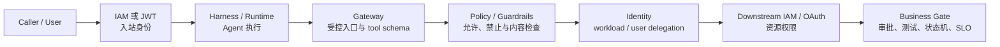

# Amazon Bedrock AgentCore Findings

## 提纲

1. 产品中心：从 Agent loop 转向生产控制面
2. 两种运行抽象：Harness 与 Runtime
3. 行动闭环：四层授权而不是一个“安全开关”
4. 质量闭环：把生产轨迹变成可回归证据
5. 状态、记忆与事实系统的边界
6. 开放性与锁定的非对称关系
7. CI/CD 的关系：交付 Agent，不让 Agent 取代交付权威
8. 经济性、生命周期和证据缺口
9. Evaluations：从回答评分到行为证据合同

## F1：AgentCore 的产品中心不是模型，也不是又一种 Agent framework，而是 Agent 的生产控制面

**判断：分析，置信度 high。**

AgentCore 将过去散落在应用代码和平台工程中的三类责任显式化：

- **运行责任：**session、隔离、长任务、版本、Endpoint、文件系统和伸缩；
- **行动责任：**tool / agent / model 的统一入口、caller 与 workload identity、凭证委托、外置 policy；
- **质量责任：**trace、online / on-demand / batch evaluation、recommendation、experiment 与 rollout。

这比“托管一个 Agent”更深。它使安全团队可以在 Agent code 外定义工具授权，使平台团队可以统一 session / identity / telemetry，使产品团队可以把真实失败轨迹转成回归集。对应证据为 AC-C02、AC-C04、AC-C09—C17。

但“控制面”不表示单体。AWS 明确允许这些服务独立使用；企业只有把入口、身份、策略、trace、evaluation 和版本关联起来，才真正得到闭环。若只使用 Runtime，得到的是托管执行；若只使用 Gateway，得到的是受管连接；若不建立 evaluation set 和发布门禁，Observability 仍只是事后可见性。

## F2：Harness 与 Runtime 代表两种责任分配，不是高低版本

**判断：事实 + 分析，置信度 high。**

| 维度 | Harness | Runtime | 企业含义 |
|---|---|---|---|
| Agent loop | AWS / Strands 提供，以配置声明 model、instruction、tool、memory、limits | 团队自带代码和任意 framework / 自定义 loop | 选择“托管编排”或“保留编排所有权” |
| 部署单位 | Harness 配置，底层运行在 Runtime | 容器或 direct code package | 两者都需要版本、评测和发布记录 |
| AgentCore primitives | 多数通过配置接入 | 由代码显式调用 SDK / service | Runtime 自由度更高，集成与测试责任也更高 |
| 安全边界 | 与 Runtime 共享 IAM / JWT + microVM | IAM / JWT + microVM | Harness 不额外提供一个安全层 |
| 退出路径 | 可导出 Strands code | 代码本来由团队持有 | 导出 loop 不等于迁走 Memory、Policy、trace 和 Endpoint 语义 |

因此，Harness 适合通用 orchestration、快速验证和配置式治理；Runtime 适合自定义状态机、特殊依赖、既有 framework 或对 loop 行为有强所有权要求的团队。两者不是 maturity ladder：复杂度增长不必然要求从 Harness 迁走，反之自定义 Runtime 也不天然更“生产级”。证据为 AC-C04—C08。

## F3：Agent 行动的安全性由四层共同构成，Policy 只是其中一层

**判断：事实 + 分析，置信度 high。**

| 控制层 | 回答的问题 | 不能回答的问题 |
|---|---|---|
| 入站 IAM / JWT | 谁能调用哪个 Agent / Endpoint | 这次业务动作是否合理 |
| Gateway + Policy | 该 principal 是否能调用这个 tool、参数是否满足规则 | 下游是否授权、代码或部署是否正确 |
| Identity + downstream IAM / OAuth | Agent 以谁的身份取得什么凭证、资源是否允许 | 是否满足 CAB、Required Check、风险窗口 |
| Business Gate | 测试、签名、审批、环境状态是否允许动作生效 | Agent 内部 trajectory 是否高质量 |

Gateway Policy 的价值在于它位于 Agent code 外，并对每次工具调用 default-deny / forbid-wins；其局限也同样明确：若 Runtime 或下游系统可被直达，Gateway 控制可被绕过。安全结论必须建立在“所有相关流量确实经过 Gateway”之上，而不是“项目里存在一个 Policy 资源”。证据为 AC-C09—C12。

## F4：真正的差异化在“行动闭环”和“质量闭环”能否被绑定

**判断：分析，置信度 medium-high。**

AgentCore 的完整机制不是线性的功能列表，而是两个互相反馈的闭环：

### 行动闭环

`请求 → Harness / Runtime → Gateway → Policy → Identity → Tool / Agent / Model → 结果`

### 质量闭环

`trace → Evaluations → failure / intent / trajectory analysis → recommendation → batch / A-B validation → approval → immutable version / endpoint`

Observability 让团队知道 Agent 做了什么；Evaluations 把轨迹与期望答案、assertion 或 expected tool trajectory 比较；Optimization 尝试从生产证据中产生改进并验证。Agent 质量由此开始具备与软件版本类似的回归链，而不是只靠 prompt 调试。

最关键的边界是证据强度分层：

1. trace complete：证明路径被记录；
2. LLM evaluator pass：提供概率质量信号；
3. programmatic trajectory / deterministic code evaluator pass：证明已明确编码的工具序列或 invariant；
4. Policy / IAM allow：证明授权规则允许；
5. 外部 Test / Scan / Signature / SLO / 人工审批：证明业务发布条件；
6. 真实结果观测：证明动作实际产生的效果。

上层不能由下层自动推出。尤其是 evaluation pass 不能替代发布 Gate，A/B 优势不能替代高风险变更的预发布验证。证据为 AC-C14—C17、AC-C21、AC-C23。

## F5：Memory 解决上下文连续性，不应承担业务事实权威

**判断：事实 + 分析，置信度 high。**

AgentCore Memory 的 short-term events 维持 session 内连续性，long-term memory 从交互中抽取偏好、摘要和可检索记录。它适合“Agent 记得发生过什么”，不等于“组织已经证明什么”。

在软件交付场景中：

- 可以记住某次诊断的假设、工具轨迹和用户偏好；
- 不应把 memory record 当作测试通过、制品签名有效、审批完成或部署健康的事实源；
- 需要用 commit SHA、pipeline execution ID、artifact digest、approval ID 和真实系统查询重新锚定状态；
- actor / session scoping 不能替代应用侧 user—session 映射。

数据删除也不是单一动作。AWS 文档明确：删除 short-term Event 不会自动删除从它提炼出的 long-term Memory Record；涉及敏感内容或用户遗忘请求时，必须分别治理 raw event 与 derived record。`actorId` 只是客户提交的 logical partition key，不是 AgentCore 自动校验的企业用户目录事实。

如果 long-term extraction 把错误结论固化，后续 Agent 可能把派生记忆当作事实重复使用。因此应把高风险 Memory 视为可审计、可过期、可双层删除的上下文缓存，而不是事件账本。证据为 AC-C06、AC-C13。

## F6：AgentCore 的开放性是真实的，但集中在模型、框架和协议层；生产控制面仍有显著 AWS 语义

**判断：分析，置信度 medium-high。**

AgentCore 支持 Bedrock 内外模型、多种开源 Agent framework、MCP / A2A / OpenAPI / Smithy / Lambda 等接口，这显著降低了“必须重写 Agent 业务逻辑”的耦合。Bedrock Agents Classic 于 2026-07-30 起不再向新客户开放，AWS 又明确指向 AgentCore，说明 AWS 的新主线从单一托管 Agent 产品转向更开放的 Agent 平台。证据为 AC-C02—C04。

但可移植性是分层的：

| 层 | 相对可移植 | AWS-specific 资产 |
|---|---|---|
| 模型 | 可切换 Bedrock 内外模型 | provider credential、routing、模型行为与计费 |
| Agent logic | Runtime 可自带任意 framework；Harness 可导出 Strands code | Harness 配置、版本、Endpoint 与 managed behavior |
| Tool protocol | MCP / A2A / OpenAPI 等开放接口 | Gateway target、semantic index、Policy schema、WAF / IAM 集成 |
| State / quality | 可用 OTEL / OpenInference 等标准接入 | Memory records、CloudWatch telemetry、evaluation history、recommendations |
| Governance | Cedar 是开放语言 | AgentCore principal / action schema、IAM、Registry approval 与资源策略 |

所以“model agnostic”不等于“platform neutral”。采购判断应分别问：业务 Agent 能否迁走，历史状态能否迁走，安全策略能否重放，质量基线和 trace 能否保留。证据为 AC-C02、AC-C08—C18、AC-C24。

## F7：对 CI/CD，AgentCore 的最佳定位是 Agent 控制面；CI/CD 继续持有确定性权威

**判断：分析，置信度 high。**

AgentCore 能支持三条逐步升级的路径：

1. **只读诊断：**从 pipeline / EventBridge / 人工请求触发 Agent，只暴露日志、构建、制品和部署状态查询；
2. **受控触发：**Agent 经命名 Gateway tool、Policy、Identity 和下游 IAM 发起指定 pipeline / workflow，返回 execution ID 并跟踪状态；
3. **Agent 自身交付：**Agent code、prompt、tool schema、policy、evaluation set 进入 CI；batch / on-demand evaluation 通过后，经审批切换 immutable version / endpoint。

这三条路径都不要求让 AgentCore 取代 CodePipeline、GitHub / GitLab protection、制品签名、部署审批或 SLO gate。相反，AgentCore 使“Agent 为什么发起这次动作”可追踪，使“Agent 是否按期望轨迹工作”可回归；CI/CD 仍决定构建什么、允许哪个制品晋级、何时回滚。

建议的审计关联键是：

`commit SHA → agent version → prompt/tool/policy version → trace ID → pipeline execution ID → artifact digest → deployment / approval record`

AWS 没有提供一个自动把所有这些对象绑定为原子发布单元的公开合同，因此关联、变更审批和 evidence retention 仍是平台团队职责。证据为 AC-C08、AC-C11、AC-C14—C15、AC-C19、AC-C22—C23，以及 [[00_sources/research-aws-llm-cicd-agent-platform-capabilities-2026-08-03|AgentCore CI/CD 接点研究]]。

## F8：经济性不是“serverless 更便宜”，而是模块用量、等待形态和证据保留的联合函数

**判断：事实 + 分析，置信度 medium-high。**

AgentCore 按组件消费计费：Runtime / Browser / Code Interpreter 关注 active CPU 与 peak memory；Gateway / Policy 关注调用；Memory 关注 event、record storage / retrieval；Evaluations 关注 token 或 custom evaluator；Observability 进入 CloudWatch；模型、网络、ECR / S3 和下游服务另计。

因此成本至少由五个变量决定：

1. session 的 CPU / memory 曲线与 I/O wait；
2. 每任务工具调用、policy check 和搜索次数；
3. memory extraction / retention / retrieval 密度；
4. trace、prompt、tool payload 的日志体量与保留期；
5. online sampling、batch regression 与 A/B traffic 的评估规模。

AWS 定价示例只能用于理解公式，不能用于预测本企业成本。“I/O wait 免费”只有在等待期间没有背景 CPU 消耗时成立；为了审计而保留的高基数 trace 也可能把成本从 Runtime 转移到 CloudWatch 与 Evaluations。证据为 AC-C07、AC-C20。

## F9：生命周期已足以支撑受控生产采用，但还不足以支持无条件平台标准化

**判断：分析，置信度 medium-high。**

截至 2026-08-03，Runtime、Gateway、Identity、Memory、Observability、Policy、Evaluations 与 Harness 已具备 GA 基座；Optimization 的 batch / recommendation / A-B 已 GA，但 insights 仍 Preview；Registry 仍 Preview；具体区域、配额和新增文件系统能力并不一致。证据为 AC-C01、AC-C07、AC-C16—C18。

这支持以下结论：

- **可做：**低风险、可回退、只读优先的生产试点；明确版本、工具面、评测集与日志保留；
- **可逐步做：**受控写动作，前提是 Gateway 不可绕过、Policy / IAM / business gate 分层并有幂等与补偿；
- **不应直接做：**把 Preview Registry / Insights 设为关键生产依赖，把 LLM evaluator 当硬 Gate，或用平台级 GA 推断全部区域与能力成熟；
- **仍需采购验证：**独立客户结果、端到端延迟、故障耦合、平台人力节省、跨云退出路径和大规模 TCO。

## F10：Evaluations 的核心变化不是多了评分器，而是 Agent regression 开始围绕“行为证据合同”组织

**判断：事实 + 分析，置信度 high-for-mechanism。**

AgentCore 在 `SESSION`、`TRACE` 和 `TOOL_CALL` 层评测行为，并把 `expectedResponse`、natural-language `assertions` 与 `expectedTrajectory` 绑定到 trace / session。由此，测试对象从最终文本扩展到多轮任务、工具选择、参数忠实度和工具名称轨迹。详见 [[50_deepdives/amazon-bedrock-agentcore/55_evaluations-insight|Evaluations 补充洞察]]与 AC-E01—E13。

三个执行面对应三种证据合同：On-demand / Batch 可携带 Ground Truth，适合变更前回归；Online 对真实生产 trace 抽样，不能使用 Ground Truth placeholder，适合发现退化并把失败回流为新场景。Batch Evaluation 已 GA，但自动管理 dataset / scenario / runner 的 Dataset Evaluation 仍为 Public Preview，不能把二者混写成同一成熟度。

Ground Truth 也必须继续分层：

- expected response 的 Correctness 与 assertions 的 GoalSuccessRate 仍由 LLM judge 评分；
- Exact / InOrder / AnyOrder trajectory 是程序化判定，但只检查工具名称、顺序和额外工具；
- Lambda code evaluator 可承接 schema、regex、外部 API 或业务规则，仍只证明已编码条件；
- 工具参数、授权、真实副作用、部署健康和业务结果必须由 Policy / IAM、target audit、read-after-write、tests、SLO 与审批补齐。

Dataset Evaluation 还暴露出“覆盖 vs. Oracle”权衡：predefined scenario 能提供每轮参考回答和固定轨迹，回归更强；LLM simulated scenario 扩大 persona 与多轮路径覆盖，却不能预先提供每轮 expected response 或 expected trajectory，只能更多依赖 assertions。两类场景应组合使用，不应把更多生成样本误当成更强验证。

对 CI/CD 最重要的结论是：Evaluation 产出 score / label / explanation 和 session evidence，pipeline 才拥有 threshold、must-pass、override、approval 与 rollback 的权威。Batch 平均分不能替代关键场景；超过 500 sessions 时服务只取最近 500 个，也不能把结果外推成全量历史质量。

## 反例与限制

1. **团队只需要单一、低风险 Agent：**自建轻量 loop + Lambda / container + 现有 IAM / logging 可能更简单，AgentCore 全套控制面并非必需；
2. **强多云 / on-prem 控制面要求：**Agent logic 可移植，不表示 Memory、Policy、Registry、Observability 和 evaluation history 易迁移；
3. **确定性流程占主导：**能用普通代码、规则引擎或 Step Functions 明确表达的步骤，不应为“Agent 化”而经过 LLM；
4. **敏感日志限制：**若 prompt、tool 参数和结果不能进入 CloudWatch，质量闭环需要专门的脱敏、采样或替代存储设计；
5. **缺少独立效果数据：**当前只能高置信判断机制和边界，不能高置信判断普遍 ROI、正确率或上线速度。

## 综合结论

> **AgentCore 把 Agent 的生产问题从“怎样写一个循环”提升为“怎样治理一个会行动、会积累状态、会持续变化的软件主体”。它用行动闭环约束能做什么，用质量闭环积累做得如何的证据；但动作是否应该生效、结果是否正确，仍必须由下游事实系统和确定性 Gate 裁决。**
