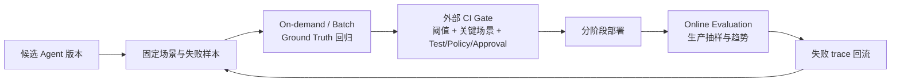

# Amazon Bedrock AgentCore Evaluations 补充洞察

> [!abstract] 专题目标
> 解释 AgentCore Evaluations 如何把 Agent 的 response、session、trace 与 tool call 变成可回归的行为证据，并明确这些证据为何仍不能单独承担发布授权、业务正确性和真实副作用验证。本文是后续洞察 PPT 的语义输入，不是页面设计稿。

## 提纲

1. 核心判断与能力状态
2. 三种 Evaluation 是三份不同的证据合同
3. Agent 的测试对象从答案扩展为行为轨迹
4. Ground Truth 不等于确定性 Oracle
5. 场景覆盖与 Oracle 强度存在结构性权衡
6. Agent Scenario Contract 与发布证据链
7. Batch、成本、数据和优化闭环的边界
8. 后续 PPT 的推荐主张与红线

## 一、核心判断

### 判断 1：Agent Evaluation 的测试对象已经从“最终回答”扩展为“行为证据”

AgentCore 可在 `SESSION`、`TRACE`、`TOOL_CALL` 三个层级评测 Agent，并允许把预期回答、自然语言断言和工具名称轨迹作为 Ground Truth。这意味着 Agent regression 不再只问“最后说得对不对”，还会问：

- 整个多轮任务是否完成；
- 某一轮回答是否符合参考答案；
- Agent 是否选对工具、参数是否忠实于上下文；
- 工具名称及顺序是否符合预期；
- 生产行为在持续采样中是否出现趋势性退化。

但这些问题由不同 evaluator、不同输入和不同确定性强度回答，不能合并成一个无条件的“Agent 正确率”。

### 判断 2：Online、On-demand、Batch 不是同一评测的三个按钮，而是三份不同的数据与证据合同

- **On-demand：**调用方提交选定 session 的 OTel spans，同步获得详细结果；可携带 Ground Truth，适合开发期、修复验证和 CI/CD spot check。
- **Batch：**服务从 CloudWatch Logs 发现多 session，异步返回聚合结果并把逐 session 明细写回 Logs；可携带 Ground Truth，适合 baseline、版本前后比较、curated regression 和生产时间窗口审计。
- **Online：**从 live production traces 持续采样和过滤，输出 CloudWatch 指标与结果；生产流量没有预先标注的 Ground Truth，因此不能使用依赖 Ground Truth placeholder 的 custom evaluator。

所以，**上线前可以回答“候选版本是否满足已知场景的期望”，上线后更多回答“真实流量中的质量信号是否变化”。**二者是闭环，不是同一种证明。

### 判断 3：Evaluations 可以成为 CI 信号，但发布权仍在外部确定性 Gate

AWS 明确把 on-demand 用于 CI/CD regression，并把 Batch 用于变更前后与回归集比较；AWS 定价页也称支持带质量阈值的 CI/CD integration。但 `Evaluate` 与 Batch API 的正式结果语义是 score、label、explanation、job status、session counts 和 token usage，并没有制品批准、环境晋级或部署授权合同。

因此正确分工是：

> **AgentCore 产出行为质量证据；CI/CD 把该证据与测试、扫描、签名、Policy、SLO 和审批共同解释为放行或阻断。**

## 二、能力状态必须拆开写

| 能力 | 截至 2026-08-03 | 可安全表述 | 不能写成 |
|---|---|---|---|
| AgentCore Evaluations | 2026-03-31 GA | online / on-demand Agent 评测、Ground Truth、LLM / Lambda custom evaluator | 所有评测子能力同日 GA |
| Batch Evaluation | 2026-06-17 GA | 多 session 异步 baseline、pre/post、regression、周期审计 | 自动 release gate |
| Dataset Evaluation | **Public Preview** | Dataset runner 可自动调用 Agent、等待 telemetry、收集 spans 并评测 | GA 的标准测试管理平台 |
| Recommendations / A-B tests | 2026-06-17 GA | 建议、离线验证、真实流量比较 | 无人批准的自动生产优化 |
| Failure / intent / trajectory insights | Preview | 辅助发现生产模式和异常 | 已定型的根因 Oracle |

最容易混淆的是 **Batch Evaluation GA** 与 **Dataset Evaluation Preview**：前者是正式的批量评测作业；后者是围绕 dataset、scenario 和 runner 的自动化编排层。后续 PPT 若展示“版本化测试集一键执行”，必须明确 Preview 标签。

## 三、三种 Evaluation 的证据合同

| 维度 | On-demand | Batch | Online |
|---|---|---|---|
| 触发 | caller-initiated、同步 | caller-initiated、异步 job | continuous、event-driven |
| 输入 | inline OTel `sessionSpans` | CloudWatch Logs 中发现的 sessions | live traces 的 sampling / filtering |
| Ground Truth | 支持 | 支持 | 不支持 |
| 结果 | 每目标的 score / label / explanation | evaluator 平均分、session counts；逐 session 明细在 CloudWatch | metrics、dashboard、结果日志与低分 session |
| 最合适用途 | PR / build spot check、修复验证 | baseline、pre-release regression、周期审计 | production drift / silent-failure radar |
| 关键边界 | 同步 API 仍需先获得完整 spans | 最多 500 sessions/job，超过时取最近 500 个 | 抽样不是全量；没有场景真值 |

### 对 CI/CD 的正确映射

这条闭环的关键不是让 Online 替代预发布验证，而是让生产失败持续转化为新的版本化回归场景。

## 四、证据强度：Ground Truth 不是单一概念

| 证据层 | AgentCore 机制 | 确定性 | 能证明 | 不能证明 |
|---|---|---:|---|---|
| 执行记录 | OTel / OpenInference trace | 记录性 | 被采集路径中发生了什么 | 选择是否正确、日志是否完整 |
| 通用质量判断 | built-in / custom LLM judge | 概率 | rubric 下的相关性、帮助性、安全性等信号 | 硬性不变量、真实业务状态 |
| 参考回答 | `expectedResponse` + Correctness | 概率 | 回答与参考答案的语义一致程度 | 精确匹配、外部事实一定真实 |
| 行为断言 | `assertions` + GoalSuccessRate | 概率 | 多轮行为是否满足自然语言成功条件 | assertion 无歧义、步骤均符合硬约束 |
| 工具轨迹 | Exact / InOrder / AnyOrder trajectory matcher | **程序化** | 工具名称集合和顺序是否匹配 | 参数、返回、授权、副作用、业务结果 |
| 自定义硬检查 | Lambda code-based evaluator | 取决于实现，可确定 | schema、regex、业务规则或外部 API 检查 | 未编码规则、输入被截断后的完整行为 |
| 最终 Oracle | target-side audit、read-after-write、tests、signature、SLO、人工审批 | 外部确定性 / 治理 | 真实系统状态、发布条件和风险接受 | Agent 内部全部推理质量 |

两个特别需要在 PPT 中纠正的误解：

1. **带 expected response 的 Correctness 仍是 LLM-as-a-judge，不是 deterministic exact match。**
2. **Natural-language assertions 仍由 LLM 判断；“assertion”这个词本身不等于测试框架里的硬断言。**

### 内置 evaluator 数量的官方口径冲突

2026-03 GA 公告、Release Notes、Pricing 和 Well-Architected Lens 仍使用“13 built-in evaluators”；截至观察日的 Prompt Templates 页面已经显示 14 个 LLM judge 模板，Ground Truth 页面又明确列出 3 个 programmatic trajectory evaluator。AWS 当前没有提供一份带发布日期、版本和完整 ID 的稳定静态 roster。

**处理规则：**

- 回述 GA 发布时可以写“当时公布 13 个”；
- 描述当前能力时按 evaluator 类别和已核验 ID 表达，不写一个未经账户实测的总数；
- 若 PPT 必须呈现当前精确数量，需在目标账户 / Region 调用 `ListEvaluators`，保存带时间戳的结果。

## 五、覆盖面与 Oracle 强度的结构性权衡

Dataset Evaluation 当前为 Public Preview，支持两类 scenario：

| Scenario | 机制 | 可用 Ground Truth | 优势 | 代价 |
|---|---|---|---|---|
| Predefined | 人工编写固定 turns，runner 按顺序重放 | 每轮 `expected_response`、session 级 `expected_trajectory`、`assertions` | 可复现、可比较、Oracle 较强 | 覆盖受人工设计限制，容易偏向已知路径 |
| Simulated | LLM actor 根据 persona、context、goal 动态生成多轮对话 | `assertions`；**不支持**每轮 expected response 或 expected trajectory | 扩大人物、表达和多轮路径覆盖 | 流程未知，精确 Oracle 变弱，更依赖 LLM judge |

由此形成一个不应被画成成熟度阶梯的权衡：

> **固定场景提高回归的可重复性与 Oracle 强度；模拟场景提高行为覆盖，但削弱精确预期。成熟的评测组合应同时保留二者，而不是用更多生成样本替代强 Ground Truth。**

## 六、Agent Scenario Contract：让分数成为可复现的发布证据

### AgentCore 原生可承载的字段

- `scenario_id`、turn input、session / trace context；
- 每轮 `expected_response`；
- session 级 `assertions`；
- session 级 `expected_trajectory`（工具名称列表）；
- evaluator ID / ARN、score、label、explanation、unused reference fields；
- batch 的 aggregate 与 per-session result。

### 企业还必须补齐的字段（分析）

| 区块 | 建议字段 | 原因 |
|---|---|---|
| 版本与风险 | commit、agent / prompt / model / tool schema / policy / endpoint version、risk tier、owner | 没有版本与风险等级，分数无法成为 release evidence |
| Given | identity / tenant、Memory fixture、可调用工具面、依赖状态、模拟 / 隔离方式 | 同一输入在不同身份、状态和工具目录下可能走不同路径 |
| 禁止条件 | forbidden tool / parameter、不得发生的副作用、最大重试 / 成本 / 时延 | expected trajectory 只表达工具名称和顺序，不能覆盖参数与负向约束 |
| Deterministic Oracle | unit / integration / schema / contract test、target fixture、read-after-write、code evaluator | 把硬约束从 LLM judge 中剥离 |
| Evidence | trace / session ID、Policy span、target audit ID、dataset / evaluator version、raw score | 允许评审者重建“什么被测、按什么规则、发生了什么” |
| Gate | 关键场景全过、分维度阈值、回归预算、人工审批、rollback rule | AWS 给出质量信号；组织定义风险接受与发布权 |

可以把发布证据链表达为：

`commit → agent/prompt/tool/policy version → scenario contract → trace → evaluation result → Policy decision → target audit → external gate → deployment record`

## 七、四个容易被平均数和闭环掩盖的问题

### 1. Batch 平均分可能掩盖关键失败

Batch API 的正式聚合是 per-evaluator `averageScore` 和 session counts。平均分改善不等于每个关键场景改善；逐 session 详情在 CloudWatch Logs，个别 evaluator / session 还可能失败而 job 仍返回部分结果。

**门禁设计：**关键场景采用 must-pass；普通场景再看分布、回归预算和趋势，不能只比较平均分。

### 2. 超过 500 个 session 时样本发生有偏截断

Batch 每 job 最多评 500 sessions；发现更多时取最近 500 个并忽略其余。若直接把结果称为“历史窗口总体质量”，会把 recency selection 误写成代表性抽样。

**门禁设计：**显式分层抽样、按风险 / intent / 版本分 job，并记录 `numberOfSessionsIgnored`。

### 3. Evaluation 成本随“评估维度 × trace 长度 × 样本量”相乘

Built-in evaluator 按输入 / 输出 token 计费，custom evaluator 还有每次评估与模型 / Lambda 成本，CloudWatch telemetry 另计。同一 session 跑多个 evaluator 会重复处理长上下文。

**成本控制旋钮：**采样率、evaluator 数量、target level、上下文长度、场景分层和 retention，而不只是减少 Agent session 数。

### 4. 优化闭环可能对 evaluator 或测试集过拟合

Recommendations、Batch 和 A/B 把“发现问题—产生候选—按指标验证”连在一起。若同一 evaluator 和同一 dataset 同时定义改进目标与验收标准，候选可能优化代理指标而不是未覆盖的真实业务结果。这是基于产品机制的分析，不是 AWS 声明的已发生缺陷。

**治理措施：**冻结 evaluator / dataset 版本；保留 holdout 场景；并置 deterministic code evaluator、目标系统 Oracle 和抽样人工复核；Recommendation shipping 前继续保留客户批准。

## 八、后续 PPT 的语义输入

### 推荐单页主张 S1

> **Agent 的测试对象正在从最终回答扩展为执行轨迹。AgentCore Evaluations 把 trace 变成可回归的行为证据，但真正的发布门禁必须组合确定性轨迹 / 代码断言与外部业务 Oracle。**

### S1 的三块证明材料

1. **对象扩展：**Session / Trace / Tool Call + response / assertions / trajectory；
2. **生命周期：**On-demand / Batch 负责带 Ground Truth 的变更前证据，Online 负责生产抽样和失败回流；
3. **权威边界：**LLM judge、programmatic trajectory、Lambda rule 和外部 Oracle 的证据强度分层。

### 可选后备主张

- **S2：**“Online、On-demand、Batch 不是三个评测按钮，而是 Agent 质量控制的生产生命周期：上线前用 Ground Truth 回归，上线后用 sampled traces 监测，再把失败固化成版本化场景。”
- **S3：**“Agent 场景覆盖越开放，Oracle 越难精确：预定义场景提供强回归，用户模拟扩大覆盖但只能更多依赖自然语言断言。”

### 页面必须保留的红线

- Dataset Evaluation 当前为 Public Preview；
- Online 无 Ground Truth，且是采样监测，不是同步执行 Gate；
- Correctness / assertions 即使有 Ground Truth 仍可能由 LLM judge 评分；
- trajectory 只验证工具名称与顺序，不验证参数、授权、结果或副作用；
- Batch 平均分与最近 500 session 选择不能冒充全量质量；
- Evaluation / A-B 提供质量证据，不授予生产发布权；
- 不使用未经当前账户 / Region 核验的 built-in evaluator 精确总数。

## 九、研究入口

- [[00_sources/research-amazon-bedrock-agentcore-evaluations-mechanics-2026-08-03|Evaluations 机制、数据合同与生产边界]]
- [[00_sources/research-amazon-bedrock-agentcore-evaluations-cicd-2026-08-03|Evaluations 与 CI/CD 发布门禁的证据边界]]
- [[50_deepdives/amazon-bedrock-agentcore/20_evidence-map|Claim—Evidence—Gap Matrix]]
- [[50_deepdives/amazon-bedrock-agentcore/70_fact-audit|逐主张事实审计]]

## 十、剩余证据缺口

- 没有公开、带版本的完整 built-in evaluator ID、judge model、prompt / rubric version 和 label→number mapping 合同；
- 没有独立 benchmark 证明 LLM judge 与人工标注的一致度、漂移率或跨框架等价性；
- 没有覆盖 trace、evaluation explanation、dataset metadata、result log 的统一 retention / deletion / export 合同；
- 没有独立客户对照数据证明 AgentCore Evaluations 会普遍降低 defect escape、change failure rate、上线周期或 TCO；
- 没有原子地绑定 code、prompt、model、tool、policy、dataset、evaluator 与 endpoint 的通用 release bundle。
