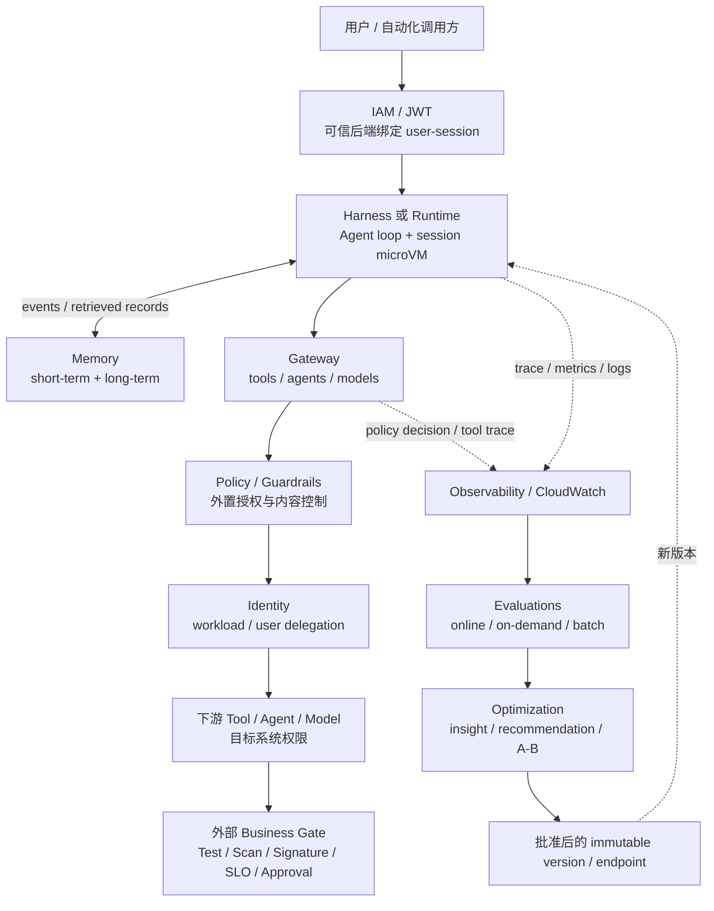

# Amazon Bedrock AgentCore 深度洞察报告

## 执行摘要

Amazon Bedrock AgentCore 的战略意义不是 AWS 又增加了一个 Agent framework，而是把 Agent 的生产责任拆成了一组可组合控制面：Runtime / Harness 管运行与 loop，Gateway / Identity / Policy 管工具行动，Memory 管跨 session 上下文，Observability / Evaluations / Optimization 管质量证据与版本演进。

这形成两个闭环：

- **行动闭环：**Agent 在什么环境运行、能看到哪些工具、代表谁、以什么规则和凭证行动；
- **质量闭环：**Agent 实际做了什么、是否符合期望轨迹、改动是否回归、哪个版本应发布或回滚。

AgentCore 的价值是把这两个闭环从每个 Agent 的应用代码里抽出来，使平台、安全和产品团队能共同治理。但它没有提供业务正确性的最终 Oracle：Policy allow 只证明规则允许，Evaluation pass 只提供行为质量证据，microVM isolation 只隔离执行环境。代码、制品、部署、交易或生产变更是否正确，仍必须由外部 Test、Scan、Signature、SLO、事实系统与人工审批裁决。

**总体判断：**AgentCore 已足以支撑受控生产采用，尤其适合 AWS 主场、多 Agent、多团队、需要统一工具与质量治理的组织；但 Preview 能力、跨模块数据生命周期、跨云退出路径、独立客户效果和完整 TCO 仍需在采购 / 试点阶段验证。当前不应把它标准化为“所有 Agent 必须使用的全套平台”，更不应把平台级 GA 外推为所有模块和区域均成熟。

## 1. 为什么 AgentCore 不是“Bedrock Agents 的改名”

### 1.1 产品路径已改变

Amazon Bedrock Agents 现已称为 **Bedrock Agents Classic**，并于 2026-07-30 起不再向新客户开放；AWS 文档把相似能力的新增设计指向 AgentCore。现有客户仍可继续使用，因此这不是停服，也不是自动迁移。[AC-C03]

两者的产品合同不同：

| 对象 | 核心合同 | 团队拥有的部分 | 平台拥有的部分 |
|---|---|---|---|
| Bedrock Agents Classic | 在 Bedrock 内配置 model、instructions、action group、knowledge base | 用例配置与 Lambda / API | 特定 Agent 编排、prompt 模板、memory、monitoring 等托管体验 |
| AgentCore Harness | 以配置声明 model、instructions、tools、skills、memory、limits | Agent 定义与业务工具 | Strands-powered loop、Runtime、session 与 AgentCore primitives |
| AgentCore Runtime | 托管任意 framework / custom loop 的 agent 或 tool code | 完整 loop、代码、依赖与集成 | serverless hosting、session isolation、auth gate、版本与 telemetry plumbing |
| 开源 framework | 应用内的 planning / state / tool loop | 全部 framework 与运行责任 | 无 AgentCore 托管控制，除非接入对应服务 |

AgentCore 的开放性体现在：Runtime 支持多 framework、多模型和 MCP / A2A，Harness 又提供低代码的托管 loop。企业可以只买运行、只买 Gateway / Policy，或把外部 Runtime 的 trace 送入 Evaluations；它不是一个必须全量采用的单体产品。[AC-C02、AC-C04]

### 1.2 不能用固定“八个服务”描述

2025-07 的首个 Preview 公告只列七项初始能力；此后又增加 Policy、Evaluations、Harness、Optimization、Payments、Agent Registry、Web Search 等。固定数量会把发布历史误写成当前产品架构。[AC-C26]

更稳定的分类是：

| 能力域 | 当前代表能力 | 解决的问题 |
|---|---|---|
| 编排与运行 | Harness、Runtime、CLI / CDK、version / endpoint | Agent loop、隔离、部署、伸缩、长任务、发布与回滚 |
| 工具与行动 | Gateway、Identity、Policy、Browser、Code Interpreter、Web Search | 工具暴露、身份委托、确定性授权、执行与外部信息访问 |
| 状态与上下文 | Memory、session / persistent filesystem | 对话连续性、跨 session 记忆、任务文件 |
| 观测与质量 | Observability、Evaluations、Optimization | trace、质量分数、回归、建议、batch / A-B 实验 |
| 资产与经济行为 | Agent Registry、Payments | 资产发现 / 审批、x402 支付与 spending limit |

这些能力状态不同：平台和核心基座已 GA；Harness、Policy、Evaluations 后续分别 GA；Optimization Insights、Registry、Payments 等截至观察日仍含 Preview。[AC-C01、AC-C16—C18、AC-C26]

## 2. 核心架构：行动闭环与质量闭环



### 2.1 行动闭环的关键不是“能调用”，而是“每次行动能否被归因、约束和回查”

Gateway 可以把 OpenAPI、Smithy、Lambda 转成 MCP-compatible tools，也能连接其他 MCP、HTTP / A2A Agent 和模型流量；Identity 管 workload 与用户委托凭证；Policy 在 Gateway 外部用 Cedar 对每次工具调用 default-deny / forbid-wins。[AC-C09—C11]

这三个能力不能合并成一个“已授权”标记：

1. 工具被注册或列出，只说明它存在潜在允许条件，不表示带真实参数的调用会获准；[AC-C27]
2. Gateway Policy allow，只说明该请求满足已配置规则；
3. Identity 成功取得 token，只说明凭证路径成功；
4. 下游 IAM / OAuth / 资源策略仍决定资源是否允许；
5. 业务 Gate 再决定此时是否应当执行或让结果生效。

若 Runtime、命令 API 或下游 target 可被直接调用，流量可以绕过 Gateway Policy。故企业需要证明“高风险路径没有旁路”，而不只是证明“已经创建 Policy”。[AC-C12]

### 2.2 质量闭环把 Agent 行为变成可回归的软件证据

Observability 收集 session、trace、span、tool invocation 和服务指标；Evaluations 提供 online、on-demand 和 batch 三种模式，on-demand / batch 可用 expected response、assertion 与 expected tool trajectory；Optimization 再用 traces 和 evaluation outputs 生成 insight / recommendation，并用 batch / A-B 验证候选版本。[AC-C14—C17、AC-E01—E05]

这意味着 Agent 的 prompt、tool description 与 trajectory 开始拥有类似软件代码的回归生命周期。但证据有强弱：

| 证据 | 能证明 | 不能证明 |
|---|---|---|
| 完整 trace | 某条执行路径被记录 | 选择正确、信息真实 |
| 无 Ground Truth 的 LLM evaluator | 在选定 rubric 下得到概率分数 | 确定性合规或真实业务结果 |
| expected response / natural-language assertion | 对参考答案或成功条件作 LLM judge 比较 | exact match、assertion 无歧义或硬性 invariant |
| programmatic trajectory | 工具名称、顺序和 extras 规则匹配 | 参数、返回、授权、副作用或业务结果 |
| Lambda code evaluator | 已编码规则或外部 API 检查通过 | 未写进规则的风险不存在；输入和外部 Oracle 必然完整 |
| Policy / IAM allow | 权限规则允许 | 动作符合业务时机与结果正确 |
| Test / Scan / Signature / SLO / Approval | 外部事实和门禁满足 | Agent 的推理一定最优 |
| 结果观测 | 实际系统产生某个结果 | 因果完全由 Agent 决定 |

推荐和 A/B 结果仍需批准；Preview Insights 不能成为关键生产依赖。所谓“持续改进”应当解释为 `观察 → 候选改动 → 离线 / 在线验证 → 批准 → 版本切换 → 可回滚`，而不是 Agent 自动改写自己。[AC-C16—C17]

### 2.3 Evaluation 是行为证据合同，不是单一“正确率”

三个执行面不能互换：On-demand 由调用方提交 OTel spans 并同步返回，可带 Ground Truth；Batch 从 CloudWatch Logs 发现多个 sessions，异步给出平均分和逐 session 明细，也可带 Ground Truth；Online 对 live traces 做持续 sampling / filtering，没有预先标注的 Ground Truth，适合生产趋势而不是同步 Gate。[AC-E02—E04]

状态也必须拆开：Evaluations 本体和 Batch Evaluation 已 GA，围绕 dataset、scenario 与 runner 的 Dataset Evaluation 仍是 Public Preview。其 predefined scenario 能提供每轮 expected response、session assertions 和固定 tool trajectory；LLM simulated scenario 扩大 persona 与多轮路径覆盖，但不能预先给出每轮 expected response 或 expected trajectory。覆盖广度与 Oracle 强度因此存在结构性权衡。[AC-E01、AC-E07]

Batch 的正式聚合是 per-evaluator average；每 job 最多 500 sessions，发现更多时只取最近 500 个。关键场景必须采用 must-pass 和逐 session 审查，不能把平均分或 recency selection 冒充全量质量。[AC-E09]

对发布而言，建议把 native reference inputs 扩展为版本化 Agent Scenario Contract：绑定 code / prompt / model / tool / policy / dataset / evaluator / endpoint，保存 trace、Policy decision 与 target audit，再交给外部 CI/CD 解释 threshold、override、approval 和 rollback。[AC-E11—E12]

完整机制、场景合同和后续 PPT 语义见 [[50_deepdives/amazon-bedrock-agentcore/55_evaluations-insight|Evaluations 补充洞察]]。

## 3. Runtime 与 Harness：自由度和责任的交换

### 3.1 Harness

Harness 将 model、system prompt、tools、skills、memory 与 limits 变成配置，由 Strands-powered managed loop 负责 orchestration、tool execution、context 与 failure recovery。它运行在 Runtime 上，并与 Runtime 共享 IAM / JWT + microVM 的安全边界。[AC-C04—C05]

优点是统一配置、版本、Endpoint 和 AgentCore 原语；代价是 loop 行为与配置语义更依赖 AWS。导出 Strands code 能拿回部分编排代码，但不会自动迁走 Memory records、Gateway / Policy、CloudWatch trace、evaluation history 或 endpoint semantics。

### 3.2 Runtime

Runtime 接受任意 framework / custom loop 的 code 或 container，团队持有 planning、state 和 tool orchestration 代码。平台负责 serverless hosting、session microVM、伸缩、认证入口与观测 plumbing。[AC-C04]

但托管基础设施不等于托管风险：

- AgentCore 不负责 session-to-user mapping；
- 同一 microVM 中的 code / command 能接触 execution-role credentials；
- persistent filesystem 的权限记录不等于 session 内多用户隔离；
- container 依赖、SBOM、镜像扫描和重建仍由客户负责；
- 2vCPU / 8GB、2GB image、8-hour async 等限制使 Runtime 不适合充当任意 build farm。[AC-C06—C07]

因此 Harness 与 Runtime 的选择问题是“编排责任由谁持有”，不是“哪个更生产级”。

## 4. Memory：上下文资产，而不是事实系统

Memory 用 short-term Event 保存会话交互，用 long-term strategy 提炼跨 session record。它能让 Agent 保持连续性，也会把错误、偏见或敏感信息从一次交互固化为后续上下文。[AC-C13]

企业需要单独治理：

- `actorId` / `sessionId` 由可信后端赋值和映射，不接受客户端把逻辑 key 当身份；
- raw event 与 derived record 分别设置保留、访问、过期与删除；
- 删除 Event 不会自动删除相应 long-term record，遗忘请求必须覆盖两层；
- 审批、交易、部署、测试和制品状态每次从外部 source of truth 查询，不从 Memory 推断；
- 跨 Agent 共享 Memory 前定义 namespace、数据分类和错误传播边界。

当前一手材料没有给出覆盖所有 AgentCore 模块的统一内容保留、物理删除、跨区域复制与备份 SLA。加密不能替代保留与可删除性结论；需按实际使用的 Memory、CloudWatch、Gateway 和相邻服务逐项做数据处理审查。

## 5. Agent 的最小发布单元已经扩大

传统应用通常把代码和配置作为发布对象。AgentCore 暴露的控制面表明，一个可审计 Agent Release 至少应关联：

```text
agent code / harness config
+ model provider and pinned model/version policy
+ system prompt / instructions / skills
+ tool schemas and gateway targets
+ Cedar policy / guardrail / IAM bindings
+ memory strategies and retention rules
+ evaluation dataset / evaluator versions / thresholds
+ runtime or harness immutable version
+ endpoint mapping / rollout / rollback record
```

AWS 提供版本、Endpoint、CDK、CLI、Observability 和 Evaluations 等原语，但当前没有公开的通用合同把上述对象原子锁定为一个 release bundle。因此企业需要建立自己的 manifest / config fingerprint，把 `commit SHA → agent version → prompt/tool/policy version → evaluation run → endpoint change` 串起来。[AC-C08、AC-C22]

CLI 自动生成的开发权限不能直接进入生产；模型或 tool description 的变动也不能被当作普通文案修改。Agent Release 应经过：

`静态校验 → 单元/集成测试 → trajectory / assertion 回归 → policy shadow test → 审批 → immutable version → endpoint rollout → production sampling → rollback trigger`

## 6. 与 CI/CD 的正确分工

AgentCore 可以承载或治理 CI/CD Agent，但不是 CodePipeline、CodeBuild、GitHub / GitLab protection 或部署系统的替代物。[AC-C23]

### 6.1 三阶段采用路径

#### 阶段一：只读诊断

`EventBridge / 人工请求 → Step Functions → Harness / Runtime → Gateway read-only tools → pipeline / artifact / telemetry → trace + evaluation`

只开放日志、构建状态、制品元数据、部署状态与 SLO 查询；不允许启动 pipeline、重试 stage、修改配置或操作生产。目标是验证 session mapping、工具轨迹、证据完整性、评测基线和单位成本。

#### 阶段二：受控触发

`Agent → named Gateway tool → Policy ENFORCE → Identity / IAM → 指定 pipeline / workflow → execution ID → 结果回流`

tool schema 只允许预先批准的 pipeline、revision、environment 和 variables，并要求 client request token / change ID。Agent 只能发起一个符合参数与权限的 execution，不能把自己的自然语言判断当作发布批准。

#### 阶段三：Agent 自身的交付质量门

把 code、prompt、tool、policy、memory strategy、evaluation set 共同纳入 CI。使用 programmatic trajectory、Lambda code evaluator 与外部 deterministic tests 保护不可违反的规则，LLM judge 只补充质量信号；通过后仍由外部审批切换 Agent endpoint。

### 6.2 双控制面

| AgentCore 控制面 | CI/CD / 业务控制面 |
|---|---|
| Agent 运行、工具发现、身份委托、工具授权、trajectory、质量评估 | 构建、测试、扫描、签名、制品晋级、部署审批、SLO、回滚 |
| 解释“Agent 为什么提出 / 发起了动作” | 决定“动作是否应生效、结果是否可接受” |
| 允许受限 tool call | 持有最终资源权限和状态机 |

推荐审计链：

`commit SHA → agent version → prompt/tool/policy version → trace ID → pipeline execution ID → artifact digest → deployment / approval record`

## 7. 生命周期、区域和经济性

### 7.1 生命周期不能折叠

| 能力 | 截至 2026-08-03 | 采用含义 |
|---|---|---|
| Runtime、Gateway、Identity、Memory、Observability | GA 基座 | 可进入受控生产试点，仍按 feature / region 核验 |
| Policy | 2026-03-03 GA | 可做工具授权；先 LOG_ONLY 再 ENFORCE |
| Evaluations | 2026-03-31 GA | 可做 online / on-demand / batch 质量评估 |
| Harness | 2026-06-17 GA | 可做配置式 managed loop；安全边界仍是 Runtime |
| Optimization | batch / recommendation / A-B GA；insights Preview | 关键门禁不依赖 Preview Insights |
| Agent Registry | Preview | 可试验目录和审批，不作为运行时强制层 |
| Payments | Preview | 不外推为通用财务授权或采购治理 |
| Web Search | 已有 GA 公告但区域范围窄 | 按目标区域单独核验 |

AWS 的区域矩阵按 capability 标记，不存在“某个 Region 有 AgentCore，所以所有组件都可用”的安全推断。Runtime、Memory、Harness、Evaluations、Optimization、Registry、Payments 的共同区域交集可能远小于平台覆盖。[AC-C01、AC-C07、AC-C16—C18、AC-C26]

### 7.2 TCO 是联合函数

AgentCore 不只是 Runtime 账单：

- Runtime / Browser / Code Interpreter：active CPU 与 peak memory；
- Gateway / Policy：invoke、search、index 与 authorization requests；
- Memory：event、record storage、retrieval 与 extraction；
- Observability：CloudWatch ingest、storage、query、masking；
- Evaluations / Optimization：judge tokens、custom evaluator、batch 与 A/B traffic；
- 相邻成本：模型、ECR / S3、KMS、NAT / VPC Lattice、PrivateLink、网络与下游服务。

“I/O wait 免费”是定价机制，不是成本结论；真实收益依赖 Agent 等待时是否仍有 background process、memory 峰值、tool density 和 trace retention。AWS 示例只能解释公式，不能替代 workload replay。[AC-C20、AC-C25]

## 8. 开放性与平台锁定

AgentCore 的开放性集中在接入层：多模型、多 framework、MCP、A2A、OpenAPI、OTel / OpenInference。其锁定集中在生产语义：IAM / resource policy、AgentCore Gateway / Identity API、Cedar principal/action schema、Memory records、CloudWatch telemetry、evaluation history、Registry、version / endpoint。

因此退出评估要分四问：

1. Agent code 能否迁走？
2. 工具和策略能否在新平台重放并保持相同授权语义？
3. Memory、trace、evaluation baseline 与历史 decision 能否导出并继续使用？
4. Endpoint、rollout、CloudTrail 与跨账户权限能否重建？

“Harness 能导出 Strands code”主要回答第一问的一部分，不能代表完整控制面可移植。[AC-C24]

## 9. 企业采用建议

### 9.1 适合优先采用

- AWS 是主要运行环境，需要把 IAM、VPC、CloudWatch 和 Agent 工具治理统一起来；
- 多个团队 / Agent 正在重复建设 session isolation、MCP gateway、OAuth、trace 和 evaluation；
- 需要在 Agent code 外实施工具授权，并让安全团队独立管理；
- 需要把生产失败轨迹转成可重复回归集；
- Agent 任务多为 I/O-heavy、突发并发或长任务，且能用真实 profile 验证消费计费。

### 9.2 不应全量标准化

- 只有一个低风险、低并发、无持久状态的简单 Agent；
- 所有关键步骤本身可用确定性代码 / workflow 明确表达；
- 有强多云 / on-prem 控制面、数据不出域或完整可移植要求；
- prompt、tool payload 和 trace 不能进入 CloudWatch，又没有替代 telemetry 方案；
- 团队还没有外部 test / scan / approval / rollback，试图用 AgentCore Evaluations 补位。

### 9.3 生产进入门槛

1. 目标区域的所有必需组件、状态、配额和数据路径已核验；
2. user—session、actor / namespace 与 tenant 映射由可信后端维护并有负向测试；
3. 高风险行动无 Gateway 旁路；Policy 经 LOG_ONLY 样本验证后进入 ENFORCE；
4. workload identity、用户委托、下游 IAM / OAuth 与 business gate 分层审计；
5. raw Memory Event 与 derived Record 的保留、访问和双层删除流程已验证；
6. Agent release manifest 能关联 code、prompt、tool、policy、memory、evaluation 与 endpoint；
7. deterministic invariant、trajectory regression、错误样本和 rollback trigger 已建立；
8. CloudWatch / evaluation / model / network 的单位成功任务成本经过 replay；
9. 外部系统继续持有最终事实、审批、制品和生产权限；
10. 退出路径至少覆盖 code、policy intent、memory export、trace / evaluation evidence 与 endpoint cutover。

## 10. 证据强度与剩余缺口

### 高置信事实

- 平台、Policy、Evaluations、Harness 的发布时间与 GA 状态；
- Harness / Runtime 责任分工及共享安全边界；
- microVM session isolation 与客户侧 user mapping 责任；
- Gateway、Identity、Cedar Policy 的作用和旁路边界；
- Memory 双层数据与删除差异；
- evaluation types、Ground Truth 评分方式、Batch / Dataset 状态差异、Optimization 混合状态、区域和代表性配额 / 定价。

### 中高置信分析

- AgentCore 的产品中心是 Agent 生产控制面；
- 行动闭环 + 质量闭环是比模块清单更稳定的架构解释；
- Agent 最小发布单元必须扩展到 prompt / tool / policy / memory / evaluation；
- CI/CD 与 AgentCore 应采用双控制面；
- 模型 / framework 开放性不能消除生产控制面锁定。

### 仍缺证据

- 独立客户上线周期、平台人力节省、failure rate、regression escape rate 与每成功任务 TCO；
- 大规模多租户下 Gateway / Policy / Identity / Evaluations 的端到端延迟和故障耦合；
- 跨模块统一的内容处理、备份、物理删除、跨区域复制与保留 SLA；
- Memory、Registry、evaluation history 与 policy assets 的完整导出 / 迁移合同；
- 对 prompt injection、tool misuse、cross-session contamination、evaluator drift 的独立 benchmark；
- built-in evaluator 的完整版本化 ID、judge model、prompt / rubric 与 score mapping；
- LLM judge 与人工标注的一致度、漂移率及跨 framework telemetry 等价性；
- trace、evaluation explanation、dataset metadata 和 result logs 的统一 retention / deletion / export 合同；
- Preview Registry / Payments / Insights 的 GA、SLA、区域和正式长期价格。

## 11. 最终判断

> **AgentCore 把 Agent 从“模型 + loop 的应用”变成一种拥有独立运行、行动治理和质量回归生命周期的生产工作负载。它用行动闭环约束 Agent 能做什么，用质量闭环积累 Agent 做得如何的证据；但动作是否应生效、结果是否正确，仍由外部事实系统与确定性 Gate 裁决。**

这一定义既解释了 AgentCore 相对 Bedrock Agents Classic 的方向变化，也给出了企业采用边界：优先用它统一多 Agent 的生产控制，不用它替代业务授权、CI/CD、测试与发布治理。

## 12. Presentation-ready 判断

- **状态：**`true`，仅限受控的架构 / 平台判断页面；
- **推荐单页主张：**“Agent 平台的生产中心从编写 loop 转向治理行动与质量：AgentCore 把运行、工具授权和回归证据串成双闭环，但外部确定性 Gate 仍持有最终权威。”
- **Evaluations 专题主张：**“Agent 的测试对象正在从最终回答扩展为执行轨迹。AgentCore Evaluations 把 trace 变成可回归的行为证据，但真正的发布门禁必须组合确定性轨迹 / 代码断言与外部业务 Oracle。”
- **页面必须保留：**平台 GA 与 Preview 子能力分开；Policy 只覆盖 Gateway；Evaluation 不是业务正确性；Memory 删除为双层；无独立客户 ROI / benchmark；
- **不支持的页面：**全功能全球 GA、自动自主发布、普遍成本节省、跨云无锁定、已证明的客户效果。

## 研究入口

- [[50_deepdives/amazon-bedrock-agentcore/00_charter|Charter]]
- [[50_deepdives/amazon-bedrock-agentcore/10_question-tree|Question Tree]]
- [[50_deepdives/amazon-bedrock-agentcore/20_evidence-map|Evidence Map]]
- [[50_deepdives/amazon-bedrock-agentcore/50_findings|Findings]]
- [[50_deepdives/amazon-bedrock-agentcore/55_evaluations-insight|Evaluations 补充洞察]]
- [[00_sources/research-amazon-bedrock-agentcore-architecture-2026-08-03|架构研究底稿]]
- [[00_sources/research-amazon-bedrock-agentcore-governance-2026-08-03|治理研究底稿]]
- [[00_sources/research-amazon-bedrock-agentcore-evaluations-mechanics-2026-08-03|Evaluations 机制研究底稿]]
- [[00_sources/research-amazon-bedrock-agentcore-evaluations-cicd-2026-08-03|Evaluations 与 CI/CD 边界研究底稿]]
- [[00_sources/research-aws-llm-cicd-agent-platform-capabilities-2026-08-03|CI/CD 平台能力底稿]]
- [[00_sources/research-agentcore-transform-devops-agent-relationship-2026-08-03|AWS Agent 产品层级底稿]]
