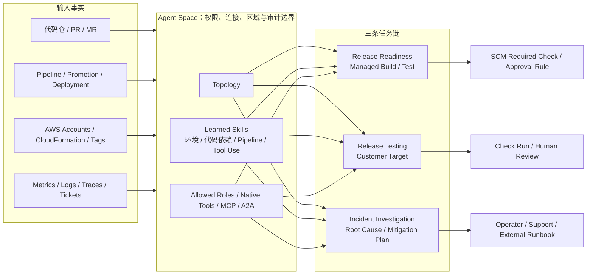

# AWS DevOps Agent：共享交付上下文，但不合并最终授权

## 执行摘要

AWS DevOps Agent 不应被简单描述为“用 AI 自动做运维”。它更重要的架构变化，是将过去分散在代码仓、CI/CD、CloudFormation、资源标签、可观测系统和工单中的信息，收敛进一个受权限约束的 Agent Space，再生成 Topology 与 Learned Skills，供发布前评审、部署后测试和生产事件调查共同读取。

这使发布风险判断从“每个阶段只看自己的局部数据”，转向共享的变更—部署—运行上下文：

- 代码侧能读取跨仓依赖、Pipeline 晋级和环境标准；
- 验证侧能针对本次变更生成构建/测试计划；
- 运行侧能把 Alarm、Log、Trace、代码变化和部署历史放进同一次调查。

但它没有把所有权力收进 Agent。Production operations 的内建工具默认不修改基础设施或应用；Release readiness 的 `BLOCK / Proceed with Caution / Safe to Release` 只有接入 GitHub/GitLab 保护规则才成为 Gate；Release testing 会对客户目标产生真实写请求，安全边界由目标环境和测试凭证承担；Custom MCP 与 EventBridge 下游执行又是客户另行授权的扩展面。

因此最准确的判断是：

> **AWS 正把 DevOps Agent 做成交付上下文与证据控制面。它统一“看见什么”，但没有统一“谁有权合并、部署、修改测试数据或恢复生产”。**

截至 2026-08-03，Production operations 已 GA；Release Management 仍是 `us-east-1` Preview。现有一手资料足以证明机制与控制边界，不足以证明跨客户普遍降低 MTTR、提高缺陷捕获率或实现端到端自主发布。

## 一、产品状态：同一品牌下的两种成熟度

| 能力面 | 主要任务 | 当前状态 | 关键执行边界 |
|---|---|---|---|
| Production operations | Incident investigation、prevention、on-demand SRE task | **GA，2026-03-31** | Native tools 不修改基础设施/应用；Ticket/Support Case 是例外 |
| Release readiness | 标准、跨仓依赖、访问控制、Managed Verification | **Preview，`us-east-1`** | 输出建议/状态；是否阻断由 SCM 保护规则决定 |
| Release testing | 针对变更生成并运行 Web/API 测试 | **Preview，`us-east-1`** | 对客户已部署目标发出真实请求，可能修改数据 |
| Custom agents / MCP / A2A | 定制 SRE 任务与外部工具/Agent | 当前文档能力 | 工具、凭证与写权限由客户配置；不继承 Native tool 的全部安全边界 |

AWS 在 [2026-03-31 GA 公告](https://aws.amazon.com/about-aws/whats-new/2026/03/aws-devops-agent-generally-available/)中明确宣布 Production operations GA；[2026-06-17 Release Management 公告](https://aws.amazon.com/about-aws/whats-new/2026/06/aws-devops-agent-release-management/)与当前[区域表](https://docs.aws.amazon.com/devopsagent/latest/userguide/about-aws-devops-agent-supported-regions.html)仍把发布管理标为 Preview、仅 `us-east-1`。品牌层“已 GA”不能覆盖后来加入的 Preview 子能力。

## 二、共同控制面：Agent Space 与可演化环境模型

### 2.1 架构归纳



该图是对 AWS 官方分散机制的分析归纳，不是 AWS 公布的内部模型或组件图。事实依据来自 [Agent Space Security](https://docs.aws.amazon.com/devopsagent/latest/userguide/aws-devops-agent-security.html)、[Topology](https://docs.aws.amazon.com/devopsagent/latest/userguide/about-aws-devops-agent-what-is-a-devops-agent-topology.html)、[Learned Skills](https://docs.aws.amazon.com/devopsagent/latest/userguide/about-aws-devops-agent-learned-skills.html)和 Release Management 文档。

### 2.2 Agent Space 不只是项目容器

AWS 将 Agent Space 定义为 primary security boundary：它独立配置账户、资源、第三方连接、IAM 角色、数据区域和可用工具。Primary role 覆盖创建 Space 的账户，Secondary role 扩展到其他账户；Web app role 控制人对调查与发现的访问。

因此 Space 的合理划分维度不是“一个团队一个聊天入口”，而是：

- 可接受的 blast radius；
- 数据驻留与推理区域；
- 账户/环境边界；
- 连接与凭证所有权；
- 运营责任和审计域。

### 2.3 Topology 与 Learned Skills 是派生知识，不是真理层

[Topology 文档](https://docs.aws.amazon.com/devopsagent/latest/userguide/about-aws-devops-agent-what-is-a-devops-agent-topology.html)说明，资源来自账户扫描；关系来自配置、CloudFormation、Tag、代码/部署映射与观测行为。非 CloudFormation 资源依赖 Resource Explorer 与 Tag。图能帮助定位 blast radius 和依赖路径，但不能自动证明某次部署导致某个 Incident。

[Learned Skills](https://docs.aws.amazon.com/devopsagent/latest/userguide/about-aws-devops-agent-learned-skills.html)进一步生成四类结构化知识：

1. **Agent Space Understanding：**服务、环境、请求路径、仓库、资源和观测覆盖；
2. **Code Dependencies：**服务、包、事件和基础设施依赖；
3. **Pipeline Topology：**步骤、环境晋级和部署；
4. **Tool Use Best Practices：**历史调查中的有效参数、常见错误和输出管理。

它们把交付与运行数据变成 Agent 可加载的“环境模型”。真正的工程问题因此转为：模型覆盖多少、多久刷新、缺失什么、错误如何被发现。一个能流畅回答问题但看不到关键仓库或部署的 Agent，仍然不具备发布或调查可信度。

## 三、三条工作流：共享上下文，分开执行

### 3.1 生产事件调查：自动调查，不是自动恢复

[Autonomous incident response](https://docs.aws.amazon.com/devopsagent/latest/userguide/production-operations-autonomous-incident-response.html)支持内建工单集成、Webhook 和人工三类入口。Agent 进行 triage、收集 Metrics/Logs/Traces、检查代码与部署历史、给出时间线、根因和 mitigation plan；错误关联或 skip 可以由人纠正，调查后还能反馈根因、steering 和 mitigation 是否正确。

关键限制来自 [Security](https://docs.aws.amazon.com/devopsagent/latest/userguide/aws-devops-agent-security.html)：Native tools 不修改基础设施或应用，例外为创建 Ticket 与 Support Case。Journal 记录 reasoning 和 action 且不能由 Agent 修改，CloudTrail 记录 API 调用。

因此“Autonomous”在这里主要描述触发、分诊、调查和建议生成。生产恢复仍需要 Operator、AWS Support 或客户另建的 Runbook/Executor。把 EventBridge lifecycle event 接到 Lambda/Step Functions，也只是获得集成入口；动作、权限、审批和回退仍由下游系统定义。

### 3.2 Release readiness：从静态检查扩展到环境感知评审

[Release Management](https://docs.aws.amazon.com/devopsagent/latest/userguide/working-with-devops-agent-release-management-index.html)将 readiness 拆为三类判断：组织标准、跨仓依赖、访问控制。对于 CloudFormation 变更，文档明确讨论 IAM、Resource Policy 和 Network Configuration；对于组织标准，可用自然语言 Skills 表达。

它还可以在 AWS-managed verification environment 中 clone 代码、识别 Build 工具和依赖、Build/Run/Test，并将结果并入 readiness report。默认网络访问受 Allowlist 限制；需要私有 Registry/Artifact 时，可配置 VPC private connection 与单独 Runtime role。

这比普通 Lint 增加了架构和环境上下文，但自然语言标准不是自动变成确定性 Policy。可靠使用应让 Policy-as-Code、Compiler、Test 和签名继续作为外部 Oracle；Agent 用于找到受影响范围、组织候选证据和解释冲突。

### 3.3 Release testing：变更感知，但有真实副作用

[Release testing](https://docs.aws.amazon.com/devopsagent/latest/userguide/release-management-release-testing.html)根据代码变更或 test intent 生成计划，对已部署 Web UI 或 REST API 执行探索式 UAT、回归、用户旅程、集成与边界测试，然后返回失败、截图、复现步骤和建议。

这条链与 Managed Verification 有根本差异：它指向客户目标，会发送 `POST / PUT / DELETE`，可能创建、修改或删除数据。AWS 明确建议使用 Staging；Production 只有在写操作对自动测试安全时才应成为目标。

因此它更像“针对本次变更动态生成的额外验证作业”，而不是固定测试套件替代品。成熟试点必须具备合成数据、隔离身份、无外部支付/通知、确定性清理和目标侧审计。

## 四、Gate、建议与执行权必须分开

| 输出 | Agent 产生什么 | 谁决定是否继续 | 不能混写为 |
|---|---|---|---|
| Release readiness | `BLOCK / Proceed with Caution / Safe to Release`、finding、journal | GitHub required status check、GitLab approval rule、组织政策 | Agent 自动批准或拒绝发布 |
| Release testing | Check Run、pass/fail、截图、复现步骤 | SCM/CI 是否将检查设为 required，人工如何处理 | Check Run 默认就是强 Gate |
| Incident investigation | Root cause、timeline、mitigation plan | Operator、Support、外部 Runbook/Approval | 自动生产修复 |
| Custom MCP/A2A | 外部工具或 Agent 输出，可能含写动作 | 客户 IAM、Tool policy、Approval、目标系统 | 与 Native tool 相同的只读保证 |

AWS 官方 GitHub Release Testing 接入展示了一个有价值的模式：Action 提交带签名的 Webhook，Agent Space 异步执行，再把状态写回当前 Commit/PR 的 Check Run。它让 Agent 执行与 Runner 生命周期分离，同时保留 Revision 绑定的宿主状态。

但当前 User Guide 的说明段与代码示例使用了不同 Action 标识，AWS 官方仓库可核验的是 [`aws-actions/devops-agent-qa`](https://github.com/aws-actions/devops-agent-qa)。本专题只采信稳定机制，不把易变包名当成长期接口合同。

## 五、安全与数据治理：至少六个独立边界

### 5.1 身份边界

Agent Space、Primary/Secondary IAM role、Web app role 与 Runtime role 分别控制不同主体。Release Managed Verification 的 Runtime role 应与 Production Investigation role 分离，避免“为了 Build 取私有 Artifact”而扩大生产资源读取。

### 5.2 工具边界

Native tools 的近只读、Custom MCP 的客户责任、A2A Sub-agent 的工具权限和 EventBridge 下游执行必须分别审计。删除一个 Tool、收缩一个 Role 或禁用一个 Trigger，应能明确减少一类风险。

### 5.3 网络边界

私有工具可通过 Private Connection/VPC Lattice 接入；Managed Verification 需要访问内部依赖时建立 ENI。网络连通不是授权，仍需 Security Group、Route、Firewall、Endpoint 与应用凭证共同限制。

### 5.4 数据驻留边界

Agent Space 数据存储在创建 Region，但 [Security 文档](https://docs.aws.amazon.com/devopsagent/latest/userguide/aws-devops-agent-security.html)说明 Bedrock 推理可在同一 Geography 内跨 Region，Mumbai、Singapore、São Paulo 还有 Global Routing 例外；SCP/Control Tower 的内容区域限制不约束这一路由。Region 选择必须同时评估 Storage 与 Inference processing。

### 5.5 非可信输入边界

Logs、Tags、Tickets、Repositories 与网页都可能包含 Prompt Injection。AWS 提供 limited native write、account boundary、ASL-3 protection、Bedrock Guardrails 与不可变 Journal，但也明确要求客户信任数据源、审查 MCP 并采用 read-only/least privilege。Guardrail 不能替代授权设计。

### 5.6 PII 与模型使用边界

AWS 说明不会自动从调查摘要中过滤 PII，客户应在日志等数据源入库前脱敏；同时声明不使用 Agent 数据、Chat 或集成数据训练模型或改进产品。后者不消除客户对敏感数据分类、第三方连接和审计的责任。

## 六、它与既有方案的精确差异

### 相对 AIOps / 告警关联

差异不在“能否总结告警”，而在 Code/Deployment/Pipeline/Topology/Telemetry 被放进同一可演化上下文。公开证据支持机制存在，不支持其 Root Cause 正确率必然高于其他 AIOps。

### 相对 Runbook Automation

Runbook 以确定性步骤、权限、回退和审批执行动作；AWS DevOps Agent Native production 面以调查和建议为主。Custom MCP 或 EventBridge 可以组合 Runbook，但那是客户系统扩展后的写链，而非产品默认行为。

### 相对 CI/CD Orchestrator

CI/CD 平台负责触发、Job Graph、Artifact、Environment Promotion、Approval 和 Deployment；DevOps Agent读取这些关系、产生风险证据和验证结果。它补充 Orchestrator，不替代 Pipeline 的状态机与权限模型。

### 相对代码评审/测试工具

它的差异是把跨仓依赖、部署拓扑和运行环境带入 Review/Test。但当前只支持有限 Release Testing 目标，且独立效果数据缺失，不能用功能描述推导“更高缺陷发现率”。

## 七、成熟度、经济性与证据缺口

### 7.1 定价与配额

[Pricing](https://aws.amazon.com/devops-agent/pricing/)按 Agent Active Time 每秒计费：Investigation、Prevention Evaluation、On-demand/Custom SRE task 当前均为 `$0.0083 / agent-second`；Release Management Preview 暂无额外费用。CloudWatch 查询、Trace 和执行环境等其他服务另收费。

[Quotas](https://docs.aws.amazon.com/devopsagent/latest/userguide/quotas.html)显示每 Space 默认同时 3 个 Investigation、4 个 Release Readiness、4 个 Automated Release Test；同一 Custom Agent 只能一个并发调用。并发和时延因此是 Gate SLO 的真实约束，而不是纯模型问题。

企业应计算：

```text
单位成功任务成本
= Agent active seconds
+ Telemetry / Trace / Build / Test environment
+ 人工复核与 steering
+ 误报、重跑、等待和副作用恢复
```

Support Credits 降低账单，不改变正确率、人工负担或 Blast Radius。

### 7.2 证据成熟度

本轮未在 AWS 官方产品、文档、公告、博客和官方 GitHub 范围内识别到可审计的具名客户前后对照，能够独立证明 Root Cause 准确率、MTTR、Change Failure Rate、Release-test Catch Rate 或误报率。AWS 展示和价格示例可证明流程与计费，不是客户效果。

AWS 也未公开具体基础模型、Planner、Tool-selection、评估集、置信度、重试和 Root Cause 失败率。Journal 提高可追踪性，但不能替代独立正确性评估。

## 八、企业采用判断

### 值得试点

- 已有较完整 CloudFormation/Tag/Resource Explorer、Repository、Pipeline 与 Telemetry 基础；
- 生产事故经常需要人工跨系统拼接代码、部署、Trace 与日志；
- 能以 Agent Space、IAM、VPC、Staging 与 SCM Gate 做明确隔离；
- 有能力建立根因、Readiness、Testing 的独立真值和基线；
- 接受 Release Management 的 Preview、单区域和接口变化风险。

### 暂不优先

- 资源、仓库、部署和遥测关系尚未标准化，Topology 会大面积缺失；
- 需要离线、全自托管或严格不允许跨 Region Inference；
- 希望产品直接替代现有 CI/CD Orchestrator、Change Approval 或 Runbook Executor；
- 目标应用无法隔离写请求、支付、通知或不可逆数据；
- 没有 Owner 处理误报、模型/规则漂移、成本和 Preview 变化；
- 采购结论必须依赖已验证 ROI 或正式 Release Management SLA。

### 推荐试点顺序

```text
只读环境建模与调查
  → Advisory Readiness
  → Managed Verification
  → 隔离 Staging Release Testing
  → 依据组织实测决定是否设为 Required
  → 任何生产写动作另立授权项目
```

该顺序把上下文价值、验证价值和写权限价值分开测量，避免一次性扩大范围后无法归因。

## 九、最终判断

AWS DevOps Agent 显示了一个比“AI 进入 CI/CD”更具体的方向：

> **交付平台的下一层竞争，可能不是增加更多孤立 Agent，而是谁能把代码变更、Pipeline、部署、资源与运行证据维护成可审查、可加载、可授权的共同环境模型。**

AWS 已用 Agent Space、Topology 与 Learned Skills 给出一个产品化实现，并把它向发布前评审、动态验证和生产调查延伸。但它当前仍依赖外部系统决定合并、部署、测试副作用和恢复执行；Release Management 也仍为单区域 Preview。

对企业最有价值的不是追求一个“全自动 DevOps Agent”，而是采用两条相互约束的原则：

1. **共享上下文：**让发布前与发布后使用同一份可审查的变更—部署—运行证据；
2. **分离授权：**让 SCM Gate、IAM、目标环境和人工 Oracle 分别掌握最终动作权力。

只有上下文和授权同时工程化，Agent 才会成为交付控制面的增量，而不是新的不透明单点。
