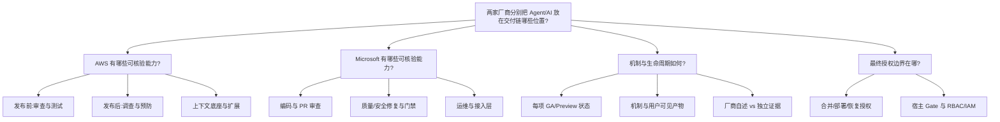

# AWS 与 Microsoft 智能化 CI/CD 对比问题树

## 主问题

> AWS 与 Microsoft 在智能化 CI/CD 领域分别提供哪些功能/特性？它们以什么机制工作、处于什么生命周期、在哪些位置仍保留确定性与人工控制？

## 问题树

## 假设与验收标准

| ID | 假设 | 验收标准 | 状态 |
|---|---|---|---|
| H1 | AWS 把智能化收敛到"发布—运行上下文" | 能列出 Agent Space、Topology、Learned Skills 与事件/发布能力的机制链 | accepted |
| H2 | Microsoft 把智能化嵌入"仓库—工作流—工具接口" | 能列出 coding agent、code review、Code Quality、autofix、MCP 的能力链 | accepted |
| H3 | 两家都保留确定性 CI/CD Gate | 每项能力都能指出其输出如何（或不能）变为合并/部署阻断 | accepted |
| H4 | 效果数据全部为厂商自述 | 不把任何 MTTR/解决率数字写成独立结论 | accepted |
| H5 | 生命周期必须逐项拆分 | 能对每项能力给出 GA/Preview/unverified 标注及日期 | accepted |

## 关键研究问题清单

1. AWS 哪些能力属于 Release Management（Preview、us-east-1）？哪些属于 Production Operations（GA）？
2. AWS 的上下文地图（Learned Skills / Topology / Code Dependencies / Pipeline Topology）如何支撑发布前后能力？
3. AWS Release testing 的真实写副作用边界是什么？
4. Microsoft GitHub 侧哪些能力已 GA（coding agent、code review、Code Quality、Dependabot remediation）？
5. Microsoft Agentic autofix 的"修复+重跑验证"闭环处于什么状态？
6. Azure DevOps 侧（Azure Repos Copilot review、Autofix）与 Azure SRE Agent 的生命周期是什么？
7. Azure SRE Agent 的 Review/Autonomous run modes 与审批边界是什么？
8. 两家厂商的能力在"发布前审查、合并前门禁、发布后恢复"三个位置如何对应对比？
9. 哪些能力存在证据缺口（无独立效果数据、生命周期未标注、文档矛盾）？