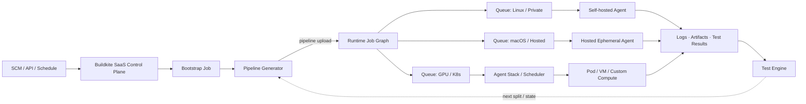

# Buildkite：把 CI 从固定流水线升级为任务图与算力图的双重编程

## 执行摘要

Buildkite 不应被简单归类为“托管 Jenkins”或“支持自托管 Runner 的 CI”。GitHub Actions、GitLab、Harness、Jenkins 都有 Runner/Agent；Buildkite 更有辨识度的地方，是把三张图拆开并建立清晰接口：

1. **任务图：** Dynamic Pipeline 在 Build 运行时生成 Job、依赖和路由；
2. **算力图：** Cluster、Queue、Agent 与 Stack 将 Job 映射到自管/托管、VM/Kubernetes、Linux/macOS/GPU/私网等执行资源；
3. **测试反馈图：** Test Engine 将历史测试耗时、状态和 Owner 反馈到下一次分片与 Flaky Workflow。

因此 Buildkite 的核心价值是：让平台团队用程序决定“本次真正需要哪些任务”和“这些任务应该落到哪类资源”，同时保留 SaaS Control Plane 的统一状态、日志、API 与开发者体验。

这套能力最适合大型 Monorepo、移动端、多语言、多平台、大型测试矩阵或已有 AWS/Kubernetes 平台能力的组织。其主要代价也来自相同架构：Self-hosted Fleet 的镜像、容量、Cache、升级、Spot、故障域和 Queue 设计仍由企业承担；Dynamic Generator 和 Test Workflow 又成为新的平台产品。Buildkite 减少的是通用 CI Control Plane 运维，不是消除执行基础设施工程。

## 一、产品分层：一条 Build 的真实路径



官方 [Pipelines architecture](https://buildkite.com/docs/pipelines/architecture) 把 Pipelines 定义为 SaaS Control Plane、Agent 定义为执行工作的小型 Runner。Self-hosted 模式中客户提供 Build Environment；Hosted 模式中 Buildkite 为每个 Job 启动临时环境并在完成后销毁，Cache Volume 除外。[Hosted agents](https://buildkite.com/docs/agent/buildkite-hosted)

这使企业可以为不同工作负载选择不同责任模型，而不是全局二选一：稳定、磁盘密集型 Job 放在 Warm VM；突发测试放到 Kubernetes；macOS 使用 Hosted Agent；私网或专用硬件保留 Self-hosted。

## 二、Dynamic Pipeline：把任务图变成程序输出

传统 Pipeline-as-Code 通常预先声明完整 Job 图，再用条件跳过。Buildkite 支持任何运行中 Job 生成 YAML/JSON，并通过 `buildkite-agent pipeline upload` 加入同一 Build；生成 Step 是独立 Job，可各自指向不同 Queue。[Dynamic pipelines](https://buildkite.com/docs/pipelines/configure/dynamic-pipelines)

这种模型适合把以下领域知识编译为任务图：

- 代码变更影响了哪些服务；
- 依赖图中哪些模块需要 Build/Test；
- 本次需要哪些 OS/Architecture/SDK Matrix；
- 测试应拆成多少分片；
- OOM/Spot 等基础设施失败后是否换更大或更稳定 Queue；
- 不同团队声明的步骤如何被平台规则补全。

Buildkite SDK 为多种语言提供类型化、可测试的 Pipeline API；不用 SDK 时，只要程序能输出 YAML/JSON 也可工作。[Buildkite SDK](https://buildkite.com/docs/pipelines/configure/dynamic-pipelines/sdk)

真正需要治理的是 Generator，而不是 YAML：默认每次 Upload、每 Build Upload 数和每 Build Job 数均有限额；失败可能发生在 Build 已开始之后；Retry 可能重复添加任务；环境变量在上传时插值。官方建议本地 dry-run、保存生成产物、使用稳定 Step Key，并为整图生成场景谨慎使用 `--replace`。

因此 Dynamic Pipeline 的成熟形态是“领域编译器”，不是任意脚本：输入有版本、输出可审计、语义有测试、漏跑由全量模式验证。

## 三、Agent Fleet：从 Runner 池升级为 Workload Portfolio

Cluster、Queue、Agent 与 Stack 分别承担不同职责：

| 对象 | 主要职责 | 平台设计问题 |
|---|---|---|
| Cluster | Pipeline、Queue、Agent Token 的组织/隔离边界 | 按产品线、信任域还是业务单元划分？ |
| Queue | Job 与一类资源匹配 | 如何控制 OS、Arch、Size、Network、Cost 而不碎片化？ |
| Agent | 获取并执行 Job | 生命周期、Image、Cache、升级和可观测如何管理？ |
| Stack | 将预定 Job 物化为 Agent | 如何接入 Kubernetes、VM、Serverless 或专用 Scheduler？ |

[Stacks API](https://buildkite.com/docs/apis/agent-api/stacks) 将 Stack 定义为能获取 Job 并将其转成正在运行 Agent 的 Scheduler。官方 Kubernetes Agent Stack 以 Controller 观察 Queue 的 Scheduled Job，再为 Job 创建 Kubernetes Job/Pod；AWS Elastic CI Stack 则围绕 ASG、Launch Template 与 Build Demand 扩缩容。[Kubernetes Stack](https://buildkite.com/docs/agent/self-hosted/agent-stack-k8s)、[AWS Stack](https://buildkite.com/docs/agent/self-hosted/aws/elastic-ci-stack)

这里最值得企业借鉴的是：**CI 资源不应被抽象成一个通用 Runner Pool，而应成为少量按工作负载设计的能力队列。** 但 Queue 是平台 API，过多标签会将基础设施细节泄漏给每个仓库；过少 Queue 又无法体现硬件、网络和成本差异。

## 四、Test Engine：测试数据开始参与下一轮调度

Test Engine 可以从 Buildkite 或其他 CI 收集结构化测试结果，追踪测试耗时、可靠性和 Owner。[Test Engine overview](https://buildkite.com/docs/pipelines/configure/tests) `bktec` 使用历史时长自动分片并持续再平衡；Test State 可以 Mute 或 Skip 被隔离测试。[Test Engine Client](https://buildkite.com/docs/pipelines/speed-up-builds-with-bktec)

这把传统的“测试 Job 成功/失败”扩展成测试粒度的反馈系统：

```text
执行事实 → 测试历史 → 分片/状态 → 下一轮执行 → 新事实
```

Flaky Workflow 可以检测、标记、通知、创建外部任务并在可靠性恢复后移除标签或恢复 Test State。[Reduce flaky tests](https://buildkite.com/docs/pipelines/reduce-flaky-tests) 但 Quarantine 只控制影响，不修复原因。企业必须为 Mute 设置 Owner、Issue、期限和恢复阈值，否则“更稳定的绿色流水线”可能只是更少的有效门禁。

## 五、案例反映的不是同一种收益

### Reddit：异构移动 CI 的整体迁移

Reddit 2025 年工程材料描述了完整 Android/iOS CI 迁移，并组合 Buildkite Hosted Compute、自管 Kubernetes、Dynamic Pipeline、Git/Container Cache。它证明 Buildkite 可承载大型移动 CI 的任务图和资源混合；公开提速数字同时受缓存、容器化、执行环境和流程迁移影响，不能做单因素归因。[Reddit Engineering](https://www.reddit.com/r/RedditEng/comments/1megwf1/)

### Canva：编排器不会自动修复错误的计算图

Canva 的大量 Step、频繁冷启动、依赖下载和非 Hermetic 命令曾放大 Buildkite Worker 数量带来的成本。改善依赖 Bazel/RBE、Starlark Generator、大实例和 Warm-up 的组合。这说明 Buildkite 的灵活调度只有与 Build System 和数据拓扑共同设计才产生价值。[Canva Engineering](https://www.canva.dev/blog/engineering/faster-ci-builds-at-canva/)

### Rippling：自带算力意味着自带恢复工程

Rippling 使用 Buildkite 作为 Control Plane、AWS Elastic CI Stack 承载大规模测试，并为 Spot Outage 自建检测与 On-demand 切换。案例同时证明了成本优化自由度和客户运营责任；文中还明确当时重试动态换 Queue 不是内建能力。[Rippling Engineering](https://www.rippling.com/blog/how-rippling-used-spot-instances-to-save-and-scale-ci-cd)

这些案例共同支持的不是“Buildkite 一定更快”，而是：**平台团队可以把任务图、算力、缓存和 Build System 按自己的工作负载重组。** 是否更快、更便宜取决于重组质量。

## 六、Agentic CI：邻接能力，而非本页核心

Buildkite 将 Agentic CI 分成两条路径：

1. Skills、Markdown 文档与 MCP 让 Coding Agent 查询 Build、Job、Log、Artifact、Cluster、Queue 和 Test Engine，并触发允许的动作；
2. Model Providers/Agent Step 让 LLM 在 Pipeline 中使用实时 Build Context。

[AI agents in Pipelines](https://buildkite.com/docs/platform/ai-agents) 已提供当前文档；但原生 [Model Providers](https://buildkite.com/docs/apis/model-providers) 当前只支持 Anthropic，Remote MCP API Token 直连的 Headless 路径截至 2026-06-12 仍为 Preview。[Preview Changelog](https://buildkite.com/resources/changelog/363-remote-mcp-server-api-access-token-support-is-now-available-preview/)

因此 Agentic CI 更适合作为成熟执行图上的诊断、维护和候选变更能力。它没有取代 Dynamic Pipeline、Queue/Stack 或测试数据层，也没有公开证明生产自治收益。

## 七、与主要方案的精确边界

| 对象 | 核心抽象 | Buildkite 的区别 |
|---|---|---|
| GitHub Actions | SCM 原生 Workflow/Action/Runner | Buildkite 更强调运行时 Job Graph 与独立 Agent Fleet；GitHub 接入成本和 SCM 语境更低 |
| GitLab CI | DevSecOps 平台与 Runner/Child Pipeline | GitLab 也支持 Dynamic Child Pipeline；Buildkite 更专注 CI 控制面和可替换执行 Stack |
| Harness CI | Pipeline/Stage/Step、Delegate、CI Intelligence、宽 CD 平台 | Harness 更一体化；Buildkite 更突出动态图与异构执行资源的组合 |
| Jenkins | 自托管 Controller/Agent/Plugin | Buildkite 卸载 Control Plane 运维，但保留客户 Agent 控制；仍需运营执行面 |
| Dagger | 类型化 Function/Module 与内容执行 DAG | Dagger 编程 Job 内执行语义；Buildkite 编程跨 Job 图和算力路由，可组合但无公开共同客户证明 |
| Bazel/Nix | 目标依赖、Hermetic Build、增量/远程执行 | 负责更细粒度的 Build Graph；Buildkite 负责 CI Event、Job Graph、Fleet 与团队体验 |

Dynamic Pipeline 并非 Buildkite 独有：GitLab 官方支持 Job 生成配置并触发 Dynamic Child Pipeline。[GitLab downstream pipelines](https://docs.gitlab.com/ci/pipelines/downstream_pipelines/) Buildkite 的差异应表述为“动态图 + Queue/Fleet + 开放 Agent/Stack + Test Feedback 的组合”，而不是首创动态配置。

## 八、采用判断

### 值得采用

- 多平台/多架构/移动端/GPU/私网等异构执行需求强；
- Monorepo 或大型测试矩阵需要基于变化生成最小任务图；
- 已有 AWS/Kubernetes 平台团队，希望卸载 CI Control Plane 而保留算力控制；
- CI 性能、成本和可靠性已经需要专职平台产品运营；
- 希望测试历史直接参与分片与 Flaky Workflow。

### 不值得优先采用

- 少量静态 Job，SCM 原生 CI 已满足；
- 没有 Agent Fleet 运维能力，又不能使用 Hosted Agent；
- 真正瓶颈是 Build Graph、Hermeticity 和内容缓存；
- 需要完全自托管 Control Plane；
- 希望单一平台覆盖完整 CI/CD/发布治理，而不愿组合多个产品。

## 九、最终判断

Buildkite 最值得借鉴的不是某个 Feature，而是一种架构取舍：

> **把 CI 平台拆成三个独立可优化对象——任务图、算力图和测试反馈图。Control Plane 负责协调，平台团队用 Generator/Queue/Stack 表达领域知识，测试历史再影响下一次执行。**

这使 Buildkite 与 Dagger 形成清晰的相邻关系：Dagger 让一个交付任务成为类型化、内容驱动的函数图；Buildkite 让整次 CI 成为运行时生成、可映射到异构算力的 Job 图。两者共同指向“可编程软件工厂”，但当前公开证据只支持技术分层，不支持共同客户或普遍 ROI 结论。
