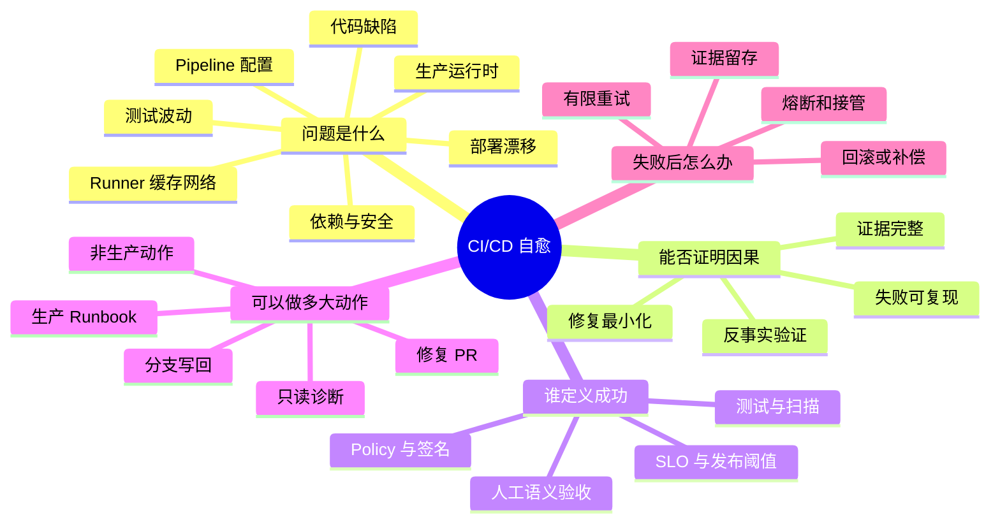

# CI/CD 问题自愈问题树

## 总问题

什么样的 CI/CD 故障能够由 Agent 安全、有效、经济地形成自愈闭环？

## Q1：什么才算自愈？

| 假设 | 验收标准 |
|---|---|
| 只做根因分析不算完整自愈 | 能区分只读调查、修复建议、可验证修复和闭环恢复 |
| 产品名不能代表实际自治 | 每个案例按证据逐项标注检测、修复、验证、执行和回退 |
| 自愈完整度与行动权限不同 | 能解释“临时分支 SH3、主分支 L2”这类组合 |

## Q2：哪些故障适合闭环？

| 假设 | 验收标准 |
|---|---|
| 可复现、低风险、可逆问题最先成熟 | 能按失败类型给出自动化上限和停止条件 |
| 瞬态故障不应进入代码修复 Agent | 有独立的重试/重调度快环和重试预算 |
| 未知故障必须停止 | 分类器提供 `unknown` 和人工接管路径 |

## Q3：闭环应如何设计？

| 假设 | 验收标准 |
|---|---|
| 独立 Oracle 是最重要的边界 | Agent 不能修改测试、门禁和成功判据来证明自己正确 |
| 快环与慢环应分离 | 瞬态恢复不会触发无意义代码修改；根因修复不被无限重试掩盖 |
| Proposal 与 Execution 应分权 | 计划、身份、工具、环境和有效期都可审计、可撤销 |

## Q4：复杂场景如何实践？

| 场景 | 关键问题 |
|---|---|
| CI 红灯 | 如何区分代码、Flaky、Runner、缓存、网络和外部服务问题？ |
| 安全修复 | 如何用同一 Analyzer 复验，又避免只为消除告警而破坏业务？ |
| 多仓回归 | 如何定位引入变更、拆分 Worker、按依赖顺序修复？ |
| GitOps 部署 | 如何绑定 Git Commit、Plan、环境、Canary 和 SLO？ |
| 生产事故 | 哪些 Runbook 可预授权，哪些动作必须由事件指挥官批准？ |

## Q5：如何判断值得规模化？

| 假设 | 验收标准 |
|---|---|
| Time-to-Green 不是唯一指标 | 同时统计错误修复、缺陷逃逸、复发、接管和成本 |
| 一次成功不能证明生产成熟 | 使用历史回放、影子运行、故障注入和持续漂移监控 |
| 自治必须可降级 | 达到错误率、成本、权限或环境异常阈值时自动退回只读模式 |
