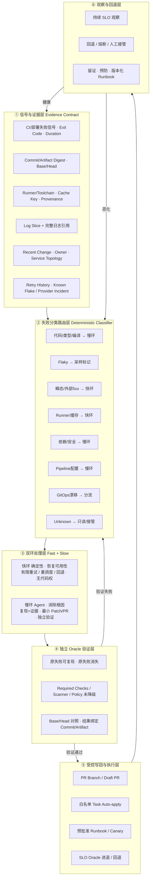
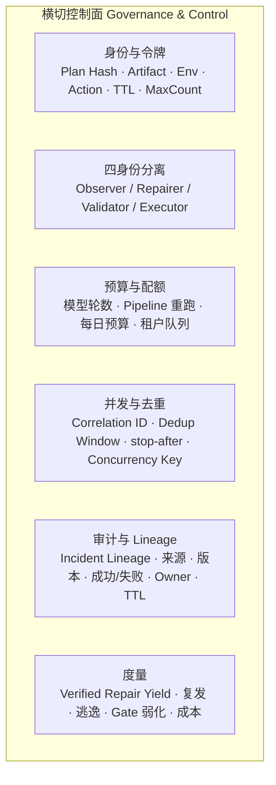
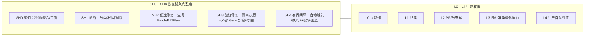
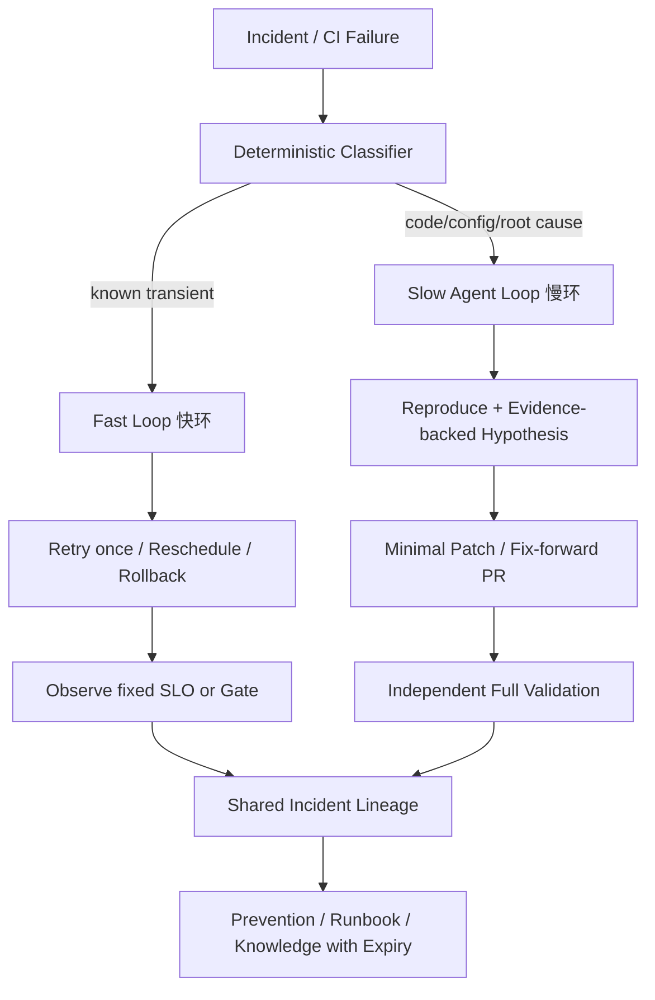

# CI/CD 自愈架构设计图

> [!abstract] 定位
> 本页是 [[50_deepdives/cicd-self-healing/90_report|自愈深度报告]] 的架构化视图，不引入新事实，仅把报告中的闭环、双环、四身份、Oracle、控制面和落地阶段重新组织成一张可实施的总图。所有主张以 90_report 为准，本页为压缩呈现。

> [!summary] 一句话判断
> CI/CD 自愈是一个**有边界的控制系统**，不是“Agent 看见红灯后改到绿”。正确架构是：**先把失败和证据结构化 → 用确定性分类器路由 → 快慢双环各司其职 → 独立 Oracle 复验 → 受控写回 → 观察并回退**，全程被身份、预算、并发、审计、度量六层控制面包裹。

---

## 一、端到端架构总览

**主轴语义：** 信号 → 分类 → 双环 → Oracle → 写回 → 观察，构成一条闭环。少一个环节，能力性质就会从“自愈”退化为“摘要”“建议”或“伪绿灯”。任一环节的失败或不确定都应回流到分类层（`Unknown` 是必要的成功输出），而不是继续猜测式修复。详见 [[50_deepdives/cicd-self-healing/90_report#二、先定义：什么才是 CI/CD 自愈|报告第二节]]。

---

## 二、横切控制面（贯穿 ①—⑥）

控制面不依附于某一层，而是横向约束所有动作：任何 Patch、参数或目标变化都使 Executor Token 失效；任何 Agent 不得同时定义、修改并裁决自己的成功判据。模型能力会趋同，自愈系统的可信度最终由控制面决定。详见 [[50_deepdives/cicd-self-healing/90_report#四、实践架构：先分类，再选择闭环|报告第四节]] 与 [[50_deepdives/cicd-self-healing/90_report#十、主要风险与对策|风险与对策]]。

---

## 三、六层职责对照

| 层 | 职责 | 关键约束 | 失败后果 |
|---|---|---|---|
| ① 证据 | 提供机器可用的 Event Contract，而非几千行裸日志 | Commit/Artifact Digest 绑定，防旧版本修复 | 上下文噪声大、修错对象 |
| ② 分类 | 确定性分类器把失败路由到快环/慢环/Unknown | `Unknown` 是必要出口；不分类不修复 | Retry Storm、错误 Patch、故障掩盖 |
| ③ 双环 | 快环恢复可用性，慢环消除根因 | 权限与预算分开；慢环不允许无限尝试 | 用重跑掩盖缺陷 / 对 503 改代码 |
| ④ Oracle | 独立验证修复，不由 Repairer 裁决 | 不可变 Gate；结果绑定同一 Commit/Artifact | 门禁变绿、问题未愈 |
| ⑤ 写回 | 受控写回 PR 分支或执行类型化 Runbook | 白名单 Task/分支；Token 绑定 Plan Hash | 越权写入、跨环境扩权 |
| ⑥ 观察 | 持续 SLO 观察并保留回退/接管能力 | 恶化即回退；保存证据不继续猜测 | 恢复即关闭、根因不修 |

---

## 四、失败分类路由（第②层展开）

| 失败类别 | 处置路径 | 默认自治上限 |
|---|---|---|
| 稳定代码/类型/编译失败 | Base/Head 复现 → 最小 Patch → 完整 Gate → PR | SH3，L2 |
| Flaky Test | 重复采样 → 标记 Flake → 隔离建议/Owner Issue | 自动重跑有限；测试修改 L2 |
| 瞬态网络/外部 5xx | 指数退避、最多一次或两次、全局预算 | SH4 快环，无代码权 |
| Runner/磁盘/镜像 | 重调度或换干净 Runner，清本 Run Scope 缓存 | SH4 快环，禁止全局清理 |
| 依赖/安全 | Analyzer → Patch → Re-scan + Test → PR | SH3，L2 |
| Pipeline 配置 | Schema/Lint/Dry-run → 最小配置 PR | SH3，L2；Secret/Prod Job 人批 |
| GitOps 漂移/部署异常 | Diff → Policy → Canary/Runbook → SLO → 回退 | 非生产可 SH4；生产 L3 |
| 未知/冲突证据 | 只读调查、分派 Owner、保存证据 | SH1，禁止自动修复 |

`Unknown` 是一个必要的成功输出——没有 Unknown 路径的系统会把不确定性伪装成行动。详见 [[50_deepdives/cicd-self-healing/90_report#2. 使用失败路由，而不是让一个 Agent自由发挥|报告失败路由表]]。

---

## 五、四身份分离（控制面 C2 展开）

| 身份 | 权限 | 明确禁止 |
|---|---|---|
| Observer | 读 CI、Repo、Telemetry、Topology | 代码/环境写入 |
| Repairer | 写临时 Workspace 或 PR Branch | Merge、改 Branch Protection、生产 Secret |
| Validator | 运行固定 Tests/Scans/Policy | 修改被验证代码和 Gate |
| Executor | 执行已批准的类型化 Runbook/Deployment | 自由 Shell、变更计划、跨环境扩权 |

Executor Token 应绑定 Plan Hash、Artifact、Environment、Action、TTL 和最大次数；任何 Patch、参数或目标变化都使批准失效。详见 [[50_deepdives/cicd-self-healing/90_report#4. 四身份分离|报告四身份分离]]。

---

## 六、双轴判级：SH × L（不可合并）

两者正交：一个 Agent 可在临时分支完成 SH3（完整修复+复验），但对主分支仍只有 L2；AWS DevOps Agent 可自动启动调查并生成 Mitigation Plan（SH1—SH2），但官方明确不代执行 Remediation，不能写成生产 L4。2026 年业界主流边界是 SH1—SH3。详见 [[50_deepdives/cicd-self-healing/90_report#SH 与 L 不能合并|报告 SH/L 说明]]。

---

## 七、快慢双环（第③层展开）

快环目标是恢复可用性，不进行开放式代码推理；慢环目标是消除根因，不允许无限尝试。一个 503 被重试成功后，慢环仍可在复发阈值达到时创建稳定性改进项；一个代码 Bug 不应因为第三次重跑碰巧通过而被关闭。两者共享 Incident Lineage，但权限、预算和停止条件分开。详见 [[50_deepdives/cicd-self-healing/90_report#3. 快环与慢环|报告快慢双环]]。

---

## 八、落地阶段映射到架构层

| 落地阶段 | 时间参考 | 启用的架构层 | 写权限 | 退出条件 |
|---|---|---|---|---|
| 0 基线 | 2—4 周 | ①② + 度量 | 无 | Top 失败有 Owner/Oracle/Runbook |
| 1 影子诊断 | 2—4 周 | ③慢环只读 + ⑥观察 | 只读 | 诊断持续达标，无越界 |
| 2 修复 PR | 4—8 周 | ③慢环生成 + ④Oracle + ⑤PR | PR Branch | 收益高于噪声，逃逸不恶化 |
| 3 自动复验 | 4—8 周 | ③快环 + ④完整 Gate + ⑤白名单写回 | 白名单 PR Task | 无 Gate 弱化/越权，回退全通过 |
| 4 微域闭环 | 持续运营 | 全层 + 控制面 SH4 | 预授权低风险动作 | 指标漂移即自动降级 |

建议第一批选择：确定性 Lint/Type/Build Config、已知瞬态故障、低复杂度依赖与 SAST/SCA 修复、非生产单 Namespace 已版本化 Runbook。暂缓：Agent 自动改测试断言/Policy/Branch Protection、数据库迁移与签名、未知生产事故开放式 Shell。详见 [[50_deepdives/cicd-self-healing/90_report#八、企业落地路线|报告落地路线]]。

---

## 九、独立 Oracle 的验收清单（第④层）

有效自愈至少同时满足：

- 原始失败在固定环境可复现；
- 候选修复只改变允许范围；
- 原失败消失；
- 完整 Required Checks、Scanner、Policy 未被删除或降级；
- Base/Head 对照表明修复针对当前变更而非环境偶然；
- 需要时通过变异测试、Contract Test、Canary/SLO 或人工业务语义验收；
- 结果绑定同一个 Commit/Artifact，不能用另一个构建“证明”当前版本健康。

> [!warning] 关键边界
> Agent 不得控制自己的成功判据。测试、扫描、Policy、签名、Required Check 和 SLO 必须由独立身份运行；禁止通过 Skip、Ignore、阈值下调或更换测试集制造“伪绿灯”。详见 [[50_deepdives/cicd-self-healing/90_report#5. 独立 Oracle|报告 Oracle 验收]]。

---

## 十、来源映射

| 架构主张 | 主要来源 |
|---|---|
| 闭环六环节、SH0—SH4、L0—L4 | [[50_deepdives/cicd-self-healing/90_report|自愈报告 二/四节]] |
| 快慢双环、Unknown 出口、四身份、Oracle 清单 | [[50_deepdives/cicd-self-healing/90_report|报告 四节]] |
| 失败分类路由表 | [[50_deepdives/cicd-self-healing/90_report#2. 使用失败路由|报告失败路由]] |
| 落地阶段与暂缓项 | [[50_deepdives/cicd-self-healing/90_report#八、企业落地路线|报告落地路线]] |
| 风险与对策（控制面） | [[50_deepdives/cicd-self-healing/90_report#十、主要风险与对策|报告风险表]] |
| 代表案例（Nx/GitHub/GitLab/CircleCI/Harness/AWS/Akuity/HolmesGPT/Snyk/BrowserStack） | [[50_deepdives/cicd-self-healing/30_case-map|案例比较]]、[[50_deepdives/cicd-self-healing/20_evidence-map|证据矩阵]] |
| 通用 CI 修复校准（18.9%） | [[00_sources/briefs/2026-ci-repair-bench|CI-Repair-Bench]] |

## 十一、层级能力视图（课题 × 能力 × 边界）

> [!info] 来源
> 本视图把 [[50_deepdives/cicd-self-healing/90_report|自愈报告]] 的闭环六环节（§二）与 [[50_deepdives/cicd-self-healing/60_playbook|企业 Playbook]] 必须存在的控制面（§二）重新组织为从上到下七层，不引入新事实。横切控制面按约定拆散到各相关层。

| 层（课题） | 定位 | 必备能力 | 边界（不能做什么） |
|---|---|---|---|
| ① 信号接入 | 失败/风险→可处理入口事件 | 失败信号捕获、退出码/耗时、SLO 告警、门禁失败、重试历史、外部供应商故障关联 | 只采集不判定；不在此层路由或修复 |
| ② 证据与上下文 | 裸日志→机器可用证据契约 | 事件契约（事故/运行 ID+指纹）、提交/制品摘要绑定、运行环境/工具链/缓存/来源证明、日志切片+完整日志引用、近期变更/负责人/服务拓扑、去重（并发）、事故谱系（审计） | 证据不可篡改；不绑定旧版本做修复 |
| ③ 分类与路由 | 确定性分类器分流 | 失败分类法（代码/抖动/瞬态/运行环境与缓存/依赖与安全/配置/漂移/未知）、证据阈值判定、路由到快环/慢环/人工、低置信度拦截、未知为必要出口 | 不分类不修复；不用自然语言自信度代替证据 |
| ④ 自治执行 | 快慢双环+四身份+隔离执行 | 快环（有限重试/重调度/回退·无代码权）、慢环（复现+假设+最小补丁/PR）、四身份（观察者/修复者/验证者/执行者）、隔离运行器、策略/风险门禁、轮次/预算上限、并发键/停止条件 | 快环不开放代码推理；慢环不允许无限尝试 |
| ⑤ 验证与门禁 | 独立 Oracle 复验 | 原失败可复现+消失、完整必过检查、扫描器/策略未降级、基线/目标对照、变异/契约测试、金丝雀/SLO、结果绑定提交/制品 | 不可变门禁；禁跳过/忽略/阈值下调/换测试集 |
| ⑥ 变更交付 | 受控写回 | PR 分支/草稿 PR、白名单任务自动应用、预批准类型化运行手册、金丝雀渐进、Git/实态双向同步、执行者令牌绑定计划/制品/环境/动作/有效期/最大次数 | 只写白名单范围；任何参数变化使批准失效 |
| ⑦ 观测与治理 | 观察、回退、审计、度量 | SLO 观察、回退/熔断/人工接管、审计与谱系回放、预算/配额/租户队列、关联 ID 运行态（并发）、度量（已验证修复产出/复发/逃逸/门禁弱化/成本）、知识有效期 | 恢复≠根治；指标漂移即降级 |

### 横切能力拆散落位

原横切控制面（身份与令牌/策略引擎/预算/并发去重/审计谱系/度量）按“就近相关层”拆散：

| 横切能力 | 落位 |
|---|---|
| 身份与令牌 | ④四身份 + ⑥执行者令牌绑定 |
| 策略引擎 | ④策略/风险门禁 |
| 预算 | ④轮次/预算上限 + ⑦配额/租户队列 |
| 并发去重 | ②去重 + ④并发键/停止条件 + ⑦关联 ID |
| 审计谱系 | ②事故谱系建立 + ⑦审计回放 |
| 度量 | ⑦度量 |

> [!note] 与第三节对照
> 第三节“六层职责对照”是端到端控制流主轴；本节把信号接入独立为第①层、把双环与四身份并入第④层、把控制面拆散到各相关层，形成同一系统的七层课题能力视图。两者同源，详见 [[50_deepdives/cicd-self-healing/90_report#四、实践架构：先分类，再选择闭环|报告第四节]]。

---

## 专题导航

- [[50_deepdives/cicd-self-healing/README|专题首页]]
- [[50_deepdives/cicd-self-healing/90_report|完整报告]]
- [[50_deepdives/cicd-self-healing/60_playbook|企业实施 Playbook]]
- [[50_deepdives/cicd-self-healing/50_findings|分析发现与置信度]]
