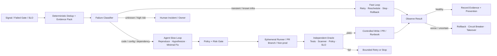

# CI/CD 问题自愈企业 Playbook

## 一、选择第一个试点

优先级用四个问题判断：失败是否可稳定复现、结果是否有独立 Oracle、动作是否可逆、Blast Radius 是否局部。

| 优先级 | 场景 | 建议上限 |
|---|---|---|
| P0 | Lint、Format、Type、确定性 Build Config、受控依赖升级 | SH3；选定 PR Task 可局部 SH4 Auto-apply |
| P1 | 已知瞬态网络、Runner 丢失、单任务 Flaky | 分类后有限自动重试；不改代码 |
| P1 | SAST/SCA 确定性发现 | Analyzer → Agent Patch → Analyzer/Test → PR |
| P2 | 多仓回归、E2E Flaky、平台差异、缓存污染 | SH1—SH2，人工确认后修复 |
| P2 | 非生产 GitOps 已知 Runbook | 批准执行 SH3；充分回放后局部 SH4 |
| P3 | 生产配置修改、数据迁移、关键发布、未知事故 | 只读调查和计划；动作保持人工批准 |

## 二、目标架构

### 必须存在的控制面

- **事件契约：** 固定源 Commit、Artifact、环境、失败 Step、时间窗口和 Incident Fingerprint；
- **证据包：** Log Slice、Exit Code、Runner Image、Dependency Lock、最近变更、历史同类故障；
- **分类器：** 先路由 Code/Flaky/Transient/Infra/External/Deployment/Unknown，再选择 Agent 或 Runbook；
- **策略引擎：** 对任务、文件、工具、参数、环境、次数、预算和 TTL 做显式允许/拒绝；
- **隔离执行：** 干净 Runner、短期凭据、网络 Allowlist、无生产 Secret 的修复环境；
- **独立 Oracle：** 原 Gate 由另一个身份运行，Agent 不得修改或解释为通过；
- **状态与回退：** 每个动作都要有超时、补偿、接管和旧计划失效规则；
- **审计与评测：** Prompt、Tool、Diff、Evidence、Policy Decision、Cost、Outcome 和复发可回放。

## 三、失败路由表

| 类别 | 识别信号 | 首选动作 | 自动停止条件 |
|---|---|---|---|
| Product Code | Head 新增稳定失败，Base 不失败 | 最小 Patch、单测、全量 Gate、PR | 修改超范围、无法复现、两次候选失败 |
| Test Flake | 同 Commit/环境结果不一致 | 重复采样、隔离/Owner Issue、提出稳定性修复 | 不允许删断言；超过采样预算 |
| Dependency/Security | Lock/Advisory/Scanner 命中 | 升级/替换、同 Scanner 与回归测试复验 | 需 Major Upgrade、API 破坏或 Waiver |
| Pipeline Config | Schema/Lint/Command/Permission 明确 | Dry-run、最小 YAML/Script Patch、PR | 涉及 Secret、Runner 权限或生产 Job |
| Runner/Cache | 多仓同环境失败、磁盘/镜像/缓存异常 | 换 Runner、清理本 Scope、隔离缓存 | 全局清理、重复出现或 Root Image 不可信 |
| Network/External | 503/Timeout/Rate Limit/Provider Incident | 指数退避、最多一次或两次重试、熔断 | 达到全局预算、持续失败或无幂等性 |
| Deployment Drift | Git/Live Diff、健康状态变化 | Reconcile/Runbook/Canary/回退 | Artifact 不匹配、跨 Scope、SLO 不确定 |
| Runtime Incident | SLO 告警、Topology 与近期变更 | 只读调查；已知 Runbook 可批准执行 | 未知根因、高爆炸半径、数据动作 |
| Unknown | 证据冲突或分类低置信度 | 收集证据、分派 Owner | 禁止自动修改和无限调查 |

## 四、权限与身份设计

使用至少四个分离身份：

1. `observer`：读取 CI、Repo、Telemetry；
2. `repairer`：只写临时 Workspace 或 PR Branch；
3. `validator`：运行不可变 Gate，无代码写权；
4. `executor`：只执行批准的 Runbook/Deployment，Token 绑定 Plan、Environment、Artifact 和 TTL。

批准对象必须是具体计划 Hash，而不是 Agent 会话。任何 Diff、目标、Artifact 或参数变化都使原批准失效。生产 Executor 不接收自由文本 Shell，也不继承 Observer 的全部读权限。

## 五、分阶段落地

### 第 0 阶段：建立基线（2—4 周）

- 统计最近 60—90 天失败并建立 Taxonomy；
- 识别 Top 3 高频、低风险、可复现类别；
- 补齐结构化 Log、Runner/Artifact Lineage 和 Incident Fingerprint；
- 建立历史回放集和 Gate 防篡改规则。

**退出条件：** 80% 以上失败可归类，Top 场景有明确 Owner、Oracle 和处置 Runbook。

### 第 1 阶段：SH1 只读诊断（2—4 周）

- Agent 自动收集证据、提出 Top-k 根因和复现命令；
- 与人类最终结论做盲评，不开放写权限；
- 测量首次有用假设时间、错误自信和人工 Steering。

**退出条件：** 目标类别持续达到组织定义的诊断准确率，且无敏感数据泄露/越界读取。

### 第 2 阶段：SH2 修复 PR（4—8 周）

- 只允许最小 Patch、Draft PR 和验证计划；
- 拒绝 Test Skip、Ignore、Threshold 下调和范围外重构；
- Required Checks、CODEOWNERS 和 Branch Protection 不变。

**退出条件：** 有效修复收益稳定，错误 PR 和审阅负担低于人工节省，缺陷逃逸不恶化。

### 第 3 阶段：SH3 自动验证与分支写回（4—8 周）

- 对白名单 Task 在干净 Runner 自动复现、修复和复验；
- 最多两轮候选，超时/预算/新 Commit 到来即停止；
- 只写 PR Branch，Merge 与 Deploy 权限不开放。

**退出条件：** 无 Gate 弱化、越权和错误 Lineage，回退演练全部通过。

### 第 4 阶段：局部 SH4

- 只选择已证明的单一“故障类别 × 环境 × 动作”；
- 例如 PR 分支 Lint Fix、非生产 Namespace 的已知 OOM Runbook；
- 配置 SLO、Circuit Breaker、Daily Budget、Kill Switch 和自动降级。

**退出条件：** 每个场景单独续期权限；指标漂移即退回 SH2/SH1。

## 六、指标体系

### 结果指标

- Verified Repair Yield = 被独立 Gate 验证且最终保留的修复 / Agent 尝试；
- First-fix Success、Time-to-Diagnosis、Time-to-Green；
- 7/30 日复发率、缺陷逃逸率、变更失败率；
- MTTR 与恢复后二次故障率。

### 安全指标

- Gate 弱化/测试篡改、越权 Tool Call、错误目标写入；
- 自动动作回退成功率、Kill Switch 响应时间；
- 人工接管率、错误高置信建议率、不可解释动作数。

### 经济指标

- 每个 Verified Repair 的模型、Runner 和审阅总成本；
- 无效重试和重复 Incident 比例；
- Agent 修复 PR 人工改动量；
- 队列时延、缓存命中变化和对普通 CI 的资源挤占。

不要用“生成 Patch 数”“Agent 调用数”或“CI 最终绿”作为主成功指标。

## 七、运行手册

### 每次动作前

- 证据是否绑定最新 Commit/Artifact/Environment？
- 故障类别是否在白名单，`unknown` 是否被正确拦截？
- Oracle、回退、最大尝试和总预算是否存在？
- 身份权限是否只覆盖目标文件/任务/环境？

### 每次动作后

- 原始失败是否在干净环境复现，修复后是否消失？
- 完整 Gate 是否运行，是否有检查被删除/降级？
- 实际动作是否与批准 Plan Hash 一致？
- 是否需要生成 Owner Issue、预防项或失效旧知识？

### 立即降级条件

- Agent 修改或绕过 Oracle；
- 目标 Commit/Artifact 已变化仍继续执行；
- 出现越权、递归触发、Retry Storm 或预算异常；
- 回退失败、指标恶化或人类无法重建动作链；
- 同类问题复发但 Agent 继续重复同一临时处置。
