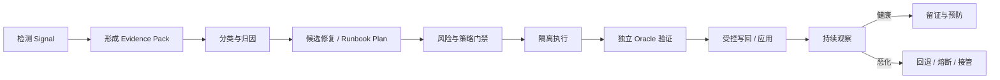
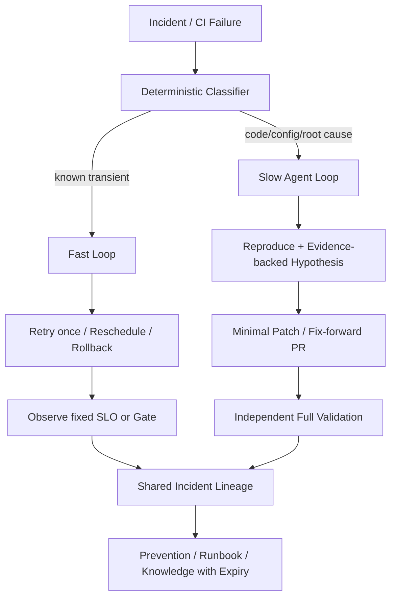
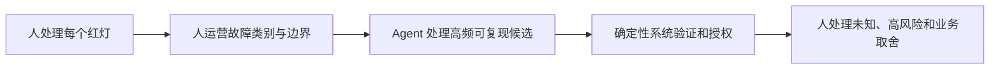

# CI/CD 问题自愈深度洞察报告

**观察日：** 2026-08-09 
**重点时间窗：** 2025 年下半年至 2026 年 
**覆盖阶段：** 测试/门禁、编译/构建、依赖与安全、部署/发布、发布后恢复 
**核心问题：** 如何让 CI/CD 故障从“自动发现”走向“可验证、可回退、有边界的恢复”

> [!summary] 一句话判断
> 2026 年 CI/CD 自愈已经从日志摘要进入“诊断—Patch/PR—局部复验”的实用阶段，但六家公司停在不同闭环终点，真正的生产闭环仍很稀缺。企业近期不应追求一个能处理所有红灯的 Agent，而应把自治批准到具体的“故障类别 × Task × 分支/环境 × 动作”，用独立 Oracle、短期身份、有限重试、Circuit Breaker 和回退把每个微闭环做实。

## 一、核心结论

1. **“自愈”是闭环完整度，不是产品名。** 自动调查是 SH1，生成 PR 是 SH2，在隔离区由原 Gate 复验是 SH3，自动动作后持续观察并能回退才是 SH4。
2. **当前产业主流是 SH1—SH3，但状态与闭环不能合并。** GitHub Agentic Workflows/Autofix 为 Public Preview，GitLab Fix Flow GA，CircleCI Chunk Beta，Harness/Nx/Buildkite 的相关能力需按子能力记录；产品阶段不自动决定 SH 等级。
3. **权限等级与自愈完整度正交。** 一个 Agent 可在临时分支完成 SH3，但对主分支仍只有 L2；自动启动生产调查不意味着拥有 L3/L4 处置权。
4. **失败分类比修复生成更关键。** 代码缺陷、Flaky、网络、Runner、缓存、外部依赖和部署漂移的正确动作完全不同；不分类会导致 Retry Storm、错误 Patch 和故障掩盖。
5. **Agent 不得控制自己的成功判据。** 测试、静态扫描、Policy、签名、Required Check 和 SLO 由独立身份运行；禁止通过 Skip、Ignore、阈值下调或更换测试集制造“伪绿灯”。
6. **最优架构是快慢双环。** 确定性快环处理已知瞬态和可逆恢复，Agent 慢环做跨源归因和根因修复；两者共享证据与 Lineage，但权限和预算分开。
7. **PR 是当前最有效的安全缓冲区，但不是质量证明。** Merge Rate、CI Green 和厂商 Demo 都不足以证明长期正确；还要看缺陷逃逸、复发、人工改动和每个 Verified Repair 的总成本。
8. **通用 CI 修复仍然很难。** 2026 年 [CI-Repair-Bench](https://arxiv.org/abs/2604.27148) 的 567 个真实故障中，最佳受测模型仅修复 18.9%；企业必须按失败类别白名单化，而不是设置一个跨场景“自愈率”。

## 二、先定义：什么才是 CI/CD 自愈

CI/CD 自愈是一个系统在出现失败或风险信号后，能够在明确边界内完成以下闭环：

少一个环节，能力性质就会改变：

| 级别 | 系统做了什么 | 典型交付 | 2026 代表案例 |
|---|---|---|---|
| SH0 感知 | 检测、聚合、告警 | 事件和证据包 | 传统 CI Event、SLO Alert |
| SH1 诊断 | 分类、根因假设、建议 | Diagnostic Issue/Report | GitHub CI Doctor 的调查、AWS DevOps Agent |
| SH2 候选修复 | 生成 Patch、Suggestion、PR 或 Plan | 可审查变更 | GitLab Fix Pipeline、Dependabot Agent、Harness Code Quality AutoFix |
| SH3 验证修复 | 隔离执行候选，由外部 Gate 复验并写回受限目标 | 已验证 PR Branch/Runbook Result | GitHub Agentic Autofix 安全微域、CircleCI Chunk、Nx Self-Healing、Harness Worker Autofix（按模板） |
| SH4 有界闭环 | 自动触发、执行预授权动作、观察并回退 | 自动恢复与完整审计 | Nx 白名单 Auto-apply 的 PR 微域、非生产 GitOps Runbook |

### SH 与 L 不能合并

本仓库统一的 `L0—L4` 描述 Agent 的行动权限；`SH0—SH4` 描述恢复链条完整度。两者必须分别记录：

- GitHub CI Doctor 是 SH1 的官方参考调查 Workflow；Agentic Autofix 在 Code Scanning 微域达到 SH3/L2，两者不能聚合为通用 CI 自愈；
- Nx 可以在 PR 分支生成修复、重跑失败 Task 并自动写回，因此是 SH3，白名单 Auto-apply 在 PR 微域可达到局部 SH4；但 Merge/Deploy 仍由外部系统决定，整体并非生产 L4；
- AWS DevOps Agent 会自动启动调查并生成 Mitigation Plan，但官方明确说明不替操作员执行 Remediation，因此是 SH1—SH2，而不是 L3/L4。

## 三、2026 年业界实践到了哪里

### 1. CI 调查与修复 PR：已成为主流产品形态

[GitHub CI Doctor](https://github.github.com/gh-aw/blog/2026-01-13-meet-the-workflows-quality-hygiene/) 读取失败 Workflow、日志和历史模式，主要创建诊断 Issue/建议。它是 Agentic Workflows Public Preview 框架中的官方参考 Workflow，不是 GitHub Actions 内建通用根因分类器；GitHub 自报的早期提案合并数字是接受度，不是修复正确率。Agentic Workflows 的核心边界，是让 Agent 只读分析，再通过 Safe Outputs 将 Issue/PR 写动作交给独立 Job。

[GitHub Agentic Autofix](https://github.blog/changelog/2026-07-10-agentic-autofix-for-code-scanning-alerts-in-public-preview/) 则是另一条更窄的安全修复链：Code Scanning Alert 作为确定性 Finding，Agent 生成补丁并使用 CodeQL 反馈迭代，最终创建 Draft PR。它可判为安全微域 SH3，但 Scanner 复验不等于完整 PR CI 或业务正确。

[GitLab Fix CI/CD Pipeline Flow](https://docs.gitlab.com/user/duo_agent_platform/flows/foundational_flows/fix_pipeline/) 会读取 Pipeline Log、Exit Code、MR Diff、仓库和脚本错误；对 MR 内文件给 Inline Suggestion，超出 Diff 时创建新 MR。Flow 在 18.8 GA、MR Suggestion 在 19.2 GA，但当前官方文档未直接证明候选变更前自动重跑原完整 Pipeline，因此仍判 SH2；最终应用、复验和合并不应被省略。

[CircleCI Chunk](https://circleci.com/docs/guides/toolkit/chunk-setup-and-overview/) 的差异化上下文是跨运行 Build History、Test Result、Configuration 和 Failure Pattern。官方 Changelog 已证明候选会推到分支并触发 Pipeline，失败后继续尝试；受保护分支创建 Draft PR，Validation Pipeline 失败则关闭。代码路径可判 SH3，但仍为 Beta，且 Validation Pipeline 是否覆盖全部 Required Checks 取决于客户配置。瞬态/基础设施重跑只有在 Prompt 预授权时自动执行，应与代码修复分别评测。

[Harness Code Quality Agents](https://developer.harness.io/3k-docs/platform/getting-started/agents/code-quality/) 把 Remediation Agent 与 Coding Agent 分开，读取失败日志、生成 Root Cause、修改代码并创建 `ai-autofix` PR；这条旧 Run Step/API 路径使用 PAT、模型密钥和 Git Connector。最新 Worker Autofix 则描述 PR Branch 写入、重触发 Build 和 Max Turns，并运行在 RBAC、OPA、Approval、Audit 与 Scoped Credential 约束下。两种执行面不能共享权限结论；本轮公开一手材料也未证明自动覆盖仓库全部 Required Checks。

[Buildkite](https://buildkite.com/docs/platform/ai-agents) 提供 Retry、Test Engine、失败分析插件、Model Provider 和 MCP，使 Agent 能读取 Build State/Log 并触发受 Token Scope 限制的 Run。[官方 PR Build Fixer 参考实现](https://buildkite.com/resources/blog/building-ai-powered-ci-workflows-three-practical-examples/)证明客户可以组合出 SH3 流程：人工标签触发、MCP 读日志、容器内修复、新建 PR、等待 Build 并在失败时迭代，最终由人合并。但平台当前内建能力更准确的定位仍是 Agent 的 CI 证据/执行底座；本轮公开一手材料未证明原生通用补丁、PR 与独立复验闭环。

### 2. 自动复验和分支写回：正在成为“真正可用”的分界线

[Nx Self-Healing CI](https://nx.dev/docs/features/ci-features/self-healing-ci) 是目前公开机制最完整的样本之一：

- 使用 Project Graph、Task Metadata 和 CI Run，而不是只读一段日志；
- `nx fix-ci` 在失败后仍运行，生成修复并重跑失败 Task；
- 用户可在 PR、编辑器或 Nx Cloud 中 Apply、Reject、Apply Locally、Revert；
- Protected Branch、Eligible/Never-fix Task Pattern 和 `SELF_HEALING.md` 限制可修范围；
- 对历史上表现安全的 Task，可配置 Auto-apply，Nx 还会根据实际记录提出候选。

这不是“全仓无人值守”，而是把自治缩小到某一类 Task 和 PR 分支。它提供了一个可复制原则：**先把行动权绑定 Task，再讨论 Auto-apply。**

Nx 官方称 Self-Healing CI 面向多个计划可用，但当前页面未给整套能力统一 GA/Preview 标签，因此本报告使用“已发布、官方未标统一阶段”，不补写 GA。

### 3. 安全与依赖：确定性发现 + Agent 适配 + 再扫描

[Snyk Agent Fix](https://snyk.io/blog/snyk-agent-fix-agentic-architecture/) 以已有安全发现为起点，用 Agentic Retry 生成修复，并从 Security Integrity、Functional Logic 和 Fix Quality 评估新架构；[GitHub Dependabot Agent Remediation](https://github.blog/changelog/2026-04-07-dependabot-alerts-are-now-assignable-to-ai-agents-for-remediation/) 则允许把告警分配给 Coding Agent 生成 Draft PR。

两者共同代表 `Analyzer → Agent → Analyzer/Test → PR`：

1. 由确定性工具指出具体问题；
2. Agent 处理跨版本、API 和上下文适配；
3. 同一 Analyzer 重新确认发现消失；
4. 业务测试确认没有功能回归；
5. 以 PR 而不是自动合并交付。

必须禁止 Agent 自动添加 Waiver、Ignore、Suppression，除非例外本身经过独立审批。

### 4. 测试自愈：要区分“修测试”与“修产品”

[BrowserStack Self-Heal](https://www.browserstack.com/docs/automate/selenium/self-healing) 在 Selenium Locator 失效时利用历史和页面信号寻找替代元素，可输出 Healed Locator、Report，并通过 MCP 或 PR 更新测试代码。这能降低因 UI 重构带来的假失败，但不等于应用缺陷被修复。

BrowserStack 文档明确把能力限定在 Locator，并说明元素真正不存在、系统或 WebDriver 故障等仍应失败。由于系统会自动选择替代元素，进一步存在把界面语义变化误判为定位变化的风险；后一点是基于机制的推断。因此实践中：

- Locator Healing 只能改变“怎样找到对象”，不能改变业务断言；
- Healed Step 应进入报告和 PR，不能静默永久生效；
- 关键交易路径、权限和支付元素的自动 Healing 应默认关闭或要求批准；
- 如果同一 Locator 连续 Healing，应创建维护项而不是长期吞掉漂移。

### 5. GitOps 与生产恢复：能力出现，自治边界分化

[Akuity Agents](https://akuity.io/blog/beyond-dashboards-ai-agents-for-gitops-operations) 结合 Argo CD/Kargo 实时状态、Deployment History、Audit 和 Runbook。其 Tool Policy 可按 Tool 名、Argument、Cluster、Namespace、Application、Project 和 Runbook 决定自动允许还是要求批准：开发环境可允许调 Resource Limit，生产可只生成调查并请求确认。这个机制比“让 Agent 有 kubectl”更接近可治理的 SH3/SH4。

[HolmesGPT](https://github.com/HolmesGPT/holmesgpt) 是 CNCF Sandbox 的开源 SRE Agent。Operator Mode 可后台检查、通知 Slack、开修复 PR；连接 Kubernetes Remediation MCP 后还能执行 Scale、Rollback 和资源修改。它的优势是实现可检查、数据源丰富；风险是实际自治水平完全取决于部署者开放的 MCP Tool、身份和 Policy，不能把仓库 Feature List 当成默认生产安全。

[AWS DevOps Agent Production Operations](https://docs.aws.amazon.com/devopsagent/latest/userguide/working-with-devops-agent-production-operations-index.html) 已 GA，可关联 Topology、Metric、Log、Trace、Code Change、Deployment 和 Incident History，自动启动调查并生成根因、Mitigation Plan、预防建议和 Agent-ready Spec。但 AWS 的 [Multi-agent Reasoning 说明](https://aws.amazon.com/blogs/devops/how-aws-devops-agent-uses-multi-agent-reasoning-to-find-root-causes/) 明确指出，它不代替 Operator 执行 Remediation，写能力限于 Ticket 和 Support Case。它是成熟的生产调查控制面，不是生产自动恢复引擎。

AWS 2026-07 的[组合参考架构](https://aws.amazon.com/blogs/devops/automated-incident-remediation-with-aws-devops-agent-and-kiro-cli/)展示了怎样安全补上慢环：EventBridge/Lambda/SQS 把 Mitigation Plan 交给 CodeBuild 中的 Kiro CLI，后者生成代码变更和 PR；人工审批 PR 后，既有 CI/CD 才负责发布。整个系统可判为 SH3，但 DevOps Agent 本体仍是 SH1—SH2。把产品能力和客户编排能力分开判级，是评估“自愈”营销主张的必要方法。

## 四、实践架构：先分类，再选择闭环

### 1. 事件和证据必须机器可用

自愈输入不应只是几千行 Log。最小 Event Contract 包括：

| 字段 | 目的 |
|---|---|
| Incident/Run ID 与 Fingerprint | 去重、关联重跑和跨系统 Trace |
| Source Commit、Base/Head、Artifact Digest | 防止对旧版本修复或部署错误对象 |
| Pipeline/Job/Step、Exit Code、Duration | 定位失败边界 |
| Runner Image、OS、Arch、Toolchain | 重现环境差异 |
| Dependency Lock、Cache Key、Artifact Provenance | 判断依赖和缓存污染 |
| Log Slice + 完整日志引用 | 降低上下文噪声，同时保留可追溯性 |
| Recent Change、Owner、Service Topology | 缩小因果范围和正确路由 |
| Retry History、Known Flake/Provider Incident | 避免重复错误处置 |

### 2. 使用失败路由，而不是让一个 Agent自由发挥

| 失败类别 | 处置路径 | 默认自治上限 |
|---|---|---|
| 稳定代码/类型/编译失败 | Base/Head 复现 → 最小 Patch → 完整 Gate → PR | SH3，L2 |
| Flaky Test | 重复采样 → 标记 Flake → 隔离建议/Owner Issue | 自动重跑有限；测试修改 L2 |
| 瞬态网络/外部 5xx | 指数退避、最多一次或两次、全局预算 | 执行级有界快环；不升级代码根因修复等级 |
| Runner/磁盘/镜像 | 重调度或换干净 Runner，清本 Run Scope 缓存 | 执行级有界快环；禁止全局清理，不计代码根因修复 |
| 依赖/安全 | Analyzer → Patch → Re-scan + Test → PR | SH3，L2 |
| Pipeline 配置 | Schema/Lint/Dry-run → 最小配置 PR | SH3，L2；Secret/Prod Job 人批 |
| GitOps 漂移/部署异常 | Diff → Policy → Canary/Runbook → SLO → 回退 | 非生产可 SH4；生产 L3 |
| 未知/冲突证据 | 只读调查、分派 Owner、保存证据 | SH1，禁止自动修复 |

`unknown` 是一个必要的成功输出。没有 Unknown 路径的系统会把不确定性伪装成行动。

公开基准支持这种分流。[CI-Repair-Bench](https://arxiv.org/abs/2604.27148) 覆盖 103 个仓库、12 类共 567 个真实 CI 故障，并通过原始完整 CI 重跑判定修复；最佳受测模型只修复 18.9%，环境、依赖和配置问题比格式/静态检查更难。该研究仍是预印本，不能直接外推企业内网，但足以校准厂商 Demo：先选类别和 Oracle，再测能力。

### 3. 快环与慢环

快环的目标是恢复可用性，不进行开放式代码推理；慢环的目标是消除根因，不允许无限尝试。一个 503 被重试成功后，慢环仍可在复发阈值达到时创建稳定性改进项；一个代码 Bug 不应因为第三次重跑碰巧通过而被关闭。

### 4. 四身份分离

| 身份 | 权限 | 明确禁止 |
|---|---|---|
| Observer | 读 CI、Repo、Telemetry、Topology | 代码/环境写入 |
| Repairer | 写临时 Workspace 或 PR Branch | Merge、改 Branch Protection、生产 Secret |
| Validator | 运行固定 Tests/Scans/Policy | 修改被验证代码和 Gate |
| Executor | 执行已批准的类型化 Runbook/Deployment | 自由 Shell、变更计划、跨环境扩权 |

Executor Token 应绑定 Plan Hash、Artifact、Environment、Action、TTL 和最大次数。任何 Patch、参数或目标变化都使批准失效。

### 5. 独立 Oracle

有效自愈至少要同时满足：

- 原始失败在固定环境可复现；
- 候选修复只改变允许范围；
- 原失败消失；
- 完整 Required Checks、Scanner、Policy 未被删除或降级；
- Base/Head 对照表明修复针对当前变更而非环境偶然；
- 需要时通过变异测试、Contract Test、Canary/SLO 或人工业务语义验收；
- 结果绑定同一个 Commit/Artifact，不能用另一个构建“证明”当前版本健康。

## 五、五类具体实践方案

### 场景 A：CI 编译/测试失败自愈

#### 推荐步骤

1. Pipeline 失败后，由确定性 Step 提取失败 Job、Exit Code、Log Slice、Base/Head、Runner 和依赖；
2. 去重同一 Commit/Root Signature 的重复事件；
3. 分类为 Code、Flaky、Transient、Infra、External 或 Unknown；
4. Code 类在干净 Runner 复现，Agent 只允许修改业务/构建白名单文件；
5. 先运行最小失败 Task，再运行完整 Required Checks；
6. 生成 Draft PR 或写回原 PR Branch，附复现命令、根因证据、Diff、验证范围和未覆盖风险；
7. 超过两轮、预算或新 Commit 到来立即停止。

#### 关键反模式

- 所有失败都先 Re-run；
- Agent 一边改代码、一边改测试/门禁；
- 使用 `GITHUB_TOKEN` 创建 PR 后假设会自动触发 CI。GitHub 文档指出默认 Token 创建的 PR 不会触发后续 Workflow，需要显式、安全地配置触发身份；
- Agent 修改完成后只跑曾失败的单个 Task；
- 多个 Agent 同时修同一 Commit，没有 Concurrency Key 和 Incident Dedup。

### 场景 B：安全与依赖修复

1. Scanner/Advisory 产生结构化 Finding 和可接受版本区间；
2. Agent 分析 Call Path、API 变化、Lockfile 和兼容性；
3. Patch 只允许改依赖声明、适配代码和必要测试；
4. 同一 Scanner 复验 Finding，完整 Test/License/SBOM/Policy 复验副作用；
5. Major Upgrade、Crypto/Auth、数据格式和 Public API 变化自动提升到人工专项评审；
6. 禁止自动 Suppress、Ignore、降低严重度或切换不可信包源。

### 场景 C：测试自愈

将失败拆为三类：

- **Locator/Fixture 维护：** 可自动建议或局部 Healing，但记录每次替换；
- **Flaky：** 通过重复样本、Seed、Timing 和环境证据确认，优先修稳定性，不以无限重跑解决；
- **产品行为变化：** 由业务 Owner 判断是预期变更还是缺陷，Agent 不自动更新 Expected Output。

测试自愈的 Oracle 不能只是“测试跑完了”，而应证明同一业务断言仍覆盖原意图。

### 场景 D：GitOps 与发布自愈

1. 所有行动绑定 Git Commit、Artifact Digest、Environment 和 Promotion ID；
2. Agent 只解释 Drift、Health 和近期变更，提出类型化 Plan；
3. Policy 按 Namespace/Application/Tool/Argument 判断自动允许或批准；
4. 在非生产执行，Canary 逐步扩大；
5. 使用外部 SLO/Metric 判定 Advance、Stop 或 Rollback；
6. Git 与 Live State 同步更新，避免只 Patch Cluster 形成新的 Drift；
7. 生产中默认只开放 Refresh、Sync 已批准 Commit、Scale 有界范围和 Rollback 已知版本等 Runbook。

### 场景 E：发布后生产恢复

生产恢复采用双目标：先恢复、再修根因。

| 环节 | 快环 | 慢环 |
|---|---|---|
| 输入 | SLO、告警、已知 Signature | Topology、Log/Trace、部署、代码、历史事故 |
| 动作 | 切流、停止发布、回退、有限扩缩容 | 根因调查、Fix-forward PR、预防 Spec |
| 权限 | 预授权 Runbook，参数和范围固定 | 广泛只读；写入走 PR/Change |
| 成功 | SLO 恢复且无次生影响 | 根因被验证、修复上线、复发下降 |
| 失败 | 自动回退/熔断/事件指挥官接管 | 保存证据，不继续猜测 |

不应让开放式 Agent 在事故中直接获得 Shell/Cluster Admin。AWS 的“自动调查但不代执行”和 Akuity 的“按环境/Tool Policy 决定批准”代表两种现实安全边界。

## 六、复杂场景实践

### 1. 多仓回归

使用 Orchestrator/Worker，而不是单一组织级 Agent：

1. Orchestrator 从 Service Catalog、Build Graph 和 Release Manifest 定位受影响仓库；
2. 每个 Worker 只读共享证据，只能写本仓 PR；
3. 先修兼容层/基础库，再按依赖波次触发下游；
4. 每仓独立 Gate，Orchestrator 只汇总状态，不替代合并；
5. 任一基础假设被推翻时，停止未开始 Worker，废止旧 Plan。

### 2. Agent 生成变更引发的 CI 洪峰

Agent 会显著提高尝试频率，自愈系统本身可能放大 Runner 消耗。控制项包括：

- 同 Commit、失败签名和修复策略去重；
- 单 PR 串行修复，跨 PR 按优先级配额；
- 修复前先做 Deterministic Pre-check，避免模型处理明显环境故障；
- 最大模型轮数、最大 Pipeline 重跑、每日预算和租户公平队列；
- Agent PR 与普通开发 PR 使用不同队列/资源池，避免挤占关键交付。

### 3. 递归触发和事件级联

Bot 评论、修复 PR、重跑和自动 Label 可能再次触发 Agent。必须：

- 给 Agent 写动作添加来源标签和 Correlation ID；
- Trigger 排除自身 Bot 或识别 Episode Lineage；
- 使用 Concurrency Key、Dedup Window 和 `stop-after`；
- PR 新 Commit 到来时取消旧 Agent，而不是把旧 Patch 继续套用；
- Safe Output 与 Agent Job 分离，防止 Agent 自己修改触发规则。

## 七、工具平台、人员和流程会怎样变化

### 工具平台

| 传统对象 | 自愈化后的新增能力 |
|---|---|
| CI 平台 | 结构化 Evidence API、失败 Taxonomy、Replay、Agent Queue、修复分支、成本配额 |
| 代码仓 | Bot Identity、Safe Output、Draft PR、Required Check 防篡改、Agent Diff Policy |
| 测试平台 | Flaky 证据、Locator Healing Report、不可变业务断言、变异/回归 Oracle |
| 安全平台 | Finding Schema、修复上下文、同 Scanner 复验、Waiver 独立审批 |
| 制品/版本 | Artifact Digest、Provenance、晋级证据和版本绑定 |
| 部署/GitOps | Tool Policy、Runbook Catalog、Canary/SLO Oracle、Live/Git 双向一致性 |
| 可观测平台 | Incident Timeline、Topology、变更关联、影子调查和事故回放 |

### 人员能力

- 开发者从阅读每次红灯转向编写可复现条件、业务 Oracle 和审查 Agent Diff；
- QA 从维护脚本转向管理测试意图、Flaky Taxonomy、断言完整性和防篡改规则；
- 平台工程师运营 Evidence Contract、Runner 隔离、Agent Runtime、Identity、Budget 和 Replay；
- 安全团队定义 Tool/Argument/Environment Policy，覆盖 Agent、MCP、Skill 和模型供应链；
- SRE 将经验沉淀为版本化 Runbook、SLO、回退和 Incident Replay，不再只写文字 Wiki；
- 管理者关注 Verified Repair、缺陷逃逸和认知负荷，而不是 Patch 数与“自动化率”。

### 工作流程

审批对象从一段自然语言建议变为具体的 Plan Hash、Diff、Artifact、环境、验证证据和 TTL；复盘对象从“谁手工修了”变为“分类、Oracle、Policy 或 Runbook 哪一层失效”。

## 八、企业落地路线

| 阶段 | 时间参考 | 能力 | 写权限 | 退出条件 |
|---|---|---|---|---|
| 0 基线 | 2—4 周 | 失败 Taxonomy、Evidence、Replay | 无 | Top 失败有 Owner/Oracle/Runbook |
| 1 影子诊断 | 2—4 周 | SH1 自动调查、Top-k 根因 | 只读 | 目标类别诊断持续达标，无越界 |
| 2 修复 PR | 4—8 周 | SH2 最小 Patch、Draft PR | PR Branch | 收益高于审阅噪声，缺陷逃逸不恶化 |
| 3 自动复验 | 4—8 周 | SH3 干净 Runner、完整 Gate、写回 | 白名单 PR Task | 无 Gate 弱化/越权，回退全通过 |
| 4 微域闭环 | 持续运营 | 单一故障类别的 SH4 | 预授权低风险动作 | 指标漂移即自动降级 |

建议第一批选择：

- 确定性 Lint/Type/Build Config；
- 已知 503、Runner 丢失等可证明瞬态故障；
- 低复杂度依赖与 SAST/SCA 修复；
- 非生产单 Namespace、已版本化的 OOM/Bad Image Runbook。

暂缓：

- Agent 自动修改测试断言、Policy 和 Branch Protection；
- 数据库迁移、证书/密钥、签名和关键制品晋级；
- 未知生产事故中的开放式 Shell；
- 跨组织、跨账号、无统一 Artifact/Identity 的自动发布；
- 不能回退或无法用外部 SLO 判定的动作。

## 九、怎样衡量“真自愈”

### 结果

- `Verified Repair Yield = 独立验证且最终保留的修复 / Agent 尝试`；
- First-fix Success、Time-to-Diagnosis、Time-to-Green；
- 7/30 日复发率、缺陷逃逸率、恢复后二次故障率；
- Agent PR 的人工改动比例和被拒原因。

### 安全

- Gate 弱化、测试篡改、越权 Tool Call、错误目标写入；
- 计划与实际执行一致率；
- 回退成功率、Kill Switch 响应和人工接管率；
- 错误高置信建议、无法重建 Lineage 的动作。

### 经济

- 每个 Verified Repair 的模型、Runner、存储和 Review 总成本；
- 无效重试、重复调查、重复 PR 和队列占用；
- 普通 CI 的等待时间是否因 Agent 流量恶化；
- 临时恢复与根因修复各自节省/新增的工程时间。

Time-to-Green 只能说明反馈速度，不能单独说明问题真正修好。

## 十、主要风险与对策

| 风险 | 典型表现 | 控制 |
|---|---|---|
| Reward Hacking | Skip Test、降阈值、吞异常 | Oracle 不可变、Diff Policy、全量 Gate |
| 错误分类 | 对网络问题改代码，对 Bug 无限重试 | 先分类、证据阈值、Unknown/接管 |
| 旧上下文 | 新 Commit 后继续应用旧 Patch | Commit/Plan Binding、计划失效 |
| 递归与风暴 | Bot 触发 Bot、重跑爆炸 | Dedup、Concurrency、Budget、Circuit Breaker |
| 权限汇聚 | 同一 Agent 读全域、改代码、部署、验收 | 四身份、短期 Token、Tool Policy |
| 隐藏真实测试问题 | Locator 自动换对象、Expected Output 更新 | Healing Report、关键路径禁用、业务断言独立 |
| 恢复不等于根治 | 回退成功后不再修根因 | 快慢双环、复发阈值、Fix-forward Owner |
| 学习污染 | 错误历史修复被当作标准做法 | 来源、版本、成功/失败、Owner、TTL |
| 经济失控 | 多轮 Agent × 多次 CI × 多仓并发 | 每 Verified Repair 成本、配额和优先队列 |

## 十一、最终建议

CI/CD 自愈的正确建设顺序是：

1. 先把故障、环境、Commit、Artifact 和历史处置结构化；
2. 再让 Agent 做只读分类与证据化诊断；
3. 只对可复现问题开放最小修复 PR；
4. 由 Agent 外部的完整 Gate 复验；
5. 将自动写回限制在白名单 Task、PR 分支或非生产 Runbook；
6. 在真实回放、故障注入和持续指标证明后，才为一个微域开放 SH4；
7. 永远保留 Unknown、Kill Switch、回退和人工接管。

近期的竞争焦点不会只是“哪个 Agent 更会修”，而是谁能提供更好的失败历史、Build Graph、Runner、Artifact Lineage、Policy、Oracle 和事故回放。模型能力会趋同，自愈系统的可信度最终由控制面决定。

## 专题附件

- [[50_deepdives/cicd-self-healing/20_evidence-map|Claim—Evidence—Gap 矩阵]]
- [[50_deepdives/cicd-self-healing/30_case-map|厂商与开源案例比较]]
- [[50_deepdives/cicd-self-healing/35_company-mechanism-audit|六家公司机制审计]]
- [[50_deepdives/cicd-self-healing/40_labs/README|验证实验设计]]
- [[50_deepdives/cicd-self-healing/50_findings|分析发现与置信度]]
- [[50_deepdives/cicd-self-healing/60_playbook|企业实施 Playbook]]
- [[50_deepdives/cicd-self-healing/research-evidence|一手研究底稿]]
- [[50_deepdives/cicd-self-healing/research-six-company-mechanisms-2026-08-09|六家公司机制核验底稿]]
- [[50_deepdives/cicd-self-healing/70_fact-audit|逐主张事实审计]]
