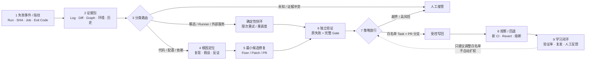

# CI 自愈单页汇报研究稿

> [!abstract] 推荐结论
> CI 自愈的分水岭不是 Agent 能否生成 Patch，而是系统能否先把失败正确分流，再由 Agent 外部的原 CI 独立复验，并把写回限制在白名单 Task 和 PR 分支。公开产品已经普遍覆盖诊断与 PR，少数产品进入“验证后写回”的局部闭环；没有证据支持把它表述为主干或生产环境的通用无人值守自愈。

## 1. 建议先校正“技术方案流”

初步思路中的“异常日志检测”建议改成“失败事件与指纹”。CI 的起点通常不是让模型从海量日志中猜测异常，而是由确定性的 Pipeline/Job/Step 失败事件触发，再把日志作为证据之一。这样能把“检测是否失败”与“解释为何失败”分离。

### 推荐方案流

### 各环节在 PPT 上应表达的技术点

| 环节 | 必须回答的问题 | 一页中建议保留的关键词 | 不能省略的控制边界 |
|---|---|---|---|
| 1. 失败事件 / 指纹 | 哪个 Commit 的哪个 Task 在什么环境失败？是否是重复事件？ | Run ID、SHA、Task、Exit Code、Fingerprint | 不以自然语言摘要代替原始事件；新 Commit 使旧修复计划失效 |
| 2. 上下文构筑 | 解释失败最少需要哪些可追溯证据？ | Log Slice + 完整日志引用、MR Diff、Project/Build Graph、Runner/Toolchain、历史运行 | 日志、代码和历史经验都属于不可信输入；上下文截断必须显式 |
| 3. 分类路由 | 这是代码、配置、Flaky、瞬态、基础设施、外部服务还是 Unknown？ | Code / Config / Flaky / Transient / Infra / External / Unknown | 分类先于修复；`Unknown` 是合法终态，不能强行行动 |
| 4. 根因定位 | 原失败能否在固定环境复现？哪条证据支持或反驳假设？ | Reproduce、Change Correlation、Competing Hypotheses | “最后一行报错”不等于根因；需要反证和责任域 |
| 5. 候选修复 | 能否用确定性 Fixer 或最小 Patch 消除根因？ | Deterministic Fixer First、Minimal Diff、Draft PR | 禁止修改测试、门禁、Ignore/Waiver 来制造绿灯 |
| 6. 独立验证 | 修复是否由同一个 Agent 无法改写的 Oracle 复验？ | Failed Task Re-run、Clean Runner、Full Required Checks | 只重跑曾失败 Task 不足；验证身份与修复身份分离 |
| 7. 策略放行 | 哪类 Task、分支、文件、动作可自动写回？ | Task Pattern、Protected Branch、Scoped Token、Approval | 自动化单位是“故障类别 × 环境 × 动作”，不是给某产品整体授权 |
| 8. 观察 / 回退 | 写回后完整 CI 是否通过？失败如何撤销和停止？ | Re-run、Revert、Max Turns、Circuit Breaker | CI 变绿只证明现有 Gate 通过，不证明长期业务正确 |
| 9. 学习闭环 | 哪些已验证记录能影响下一次候选排序或白名单建议？ | Verification Rate、Recurrence、Human Feedback、TTL | 历史成功只能建议扩围；权限变化必须经过独立批准 |

## 2. 公司 / 产品能力矩阵

图例：`●` 官方材料直接证明；`◐` 只覆盖一部分或需要额外编排；`—` 本次一手材料未证明。

| 公司 / 产品 | 产品状态（截至 2026-07-24） | 失败触发与上下文 | 分类 / 定位 | 修复 | 独立验证与写回 | 权限 / 学习闭环 | 单页中最值得强调的技术点 |
|---|---|---|---|---|---|---|---|
| [GitHub Agentic Workflows / CI Doctor](https://github.github.com/gh-aw/blog/2026-01-13-meet-the-workflows-quality-hygiene/) | [**Technical Preview**](https://github.github.com/gh-aw/slides/github-agentic-workflows.pdf)；CI Doctor 是可安装、可改写的官方参考 Workflow，不是独立 GA 产品 | ● Workflow 失败后读取日志、模式和相似历史问题 | ● 调查、识别模式、提出诊断和修复建议 | ◐ CI Doctor 默认产出诊断 Issue/建议；博客中的后续 PR 是人或其他流程承接，不能写成“模板自动修复” | ◐ Agentic Workflows 可用 Safe Outputs 创建 PR，但默认 `GITHUB_TOKEN` 创建的 PR [不会触发新 CI](https://github.github.com/gh-aw/reference/triggering-ci/)，需显式配置受控身份 | ● Safe Output 把 Agent 推理与 GitHub 写动作分离；学习效果数字只有 GitHub 内部早期自报 | **调查先行 + Safe Output 分权**；适合作为 SH1—SH2，而非完整闭环代表 |
| [GitLab Duo Fix CI/CD Pipeline Flow](https://docs.gitlab.com/user/duo_agent_platform/flows/foundational_flows/fix_pipeline/) | **GA**：18.8 GA；MR 内新输出方式在 19.2 GA | ● Pipeline Logs、Exit Code、失败 Job、MR Diff、Repository、Script Error | ● 诊断 Syntax/Lint/Import/Command/Permission 等问题；证据不足、安全敏感或不可行动时只给说明 | ● MR 内给 Inline Suggestion；超出当前 Diff 或无 MR 时创建新 MR | ◐ 输出可审阅建议/MR；官方未承诺 Flow 自动完成原完整 Pipeline 的再次验证与合并 | ● Ephemeral Workload Pipeline、Composite Identity、受限网络；但日志仅处理最后 150 KiB，沙箱中依赖安装不一定可验证 | **平台原生上下文 → Suggestion/MR**；最适合说明“自动修复”仍以人工应用和原 CI 为边界 |
| [CircleCI Chunk](https://circleci.com/docs/guides/toolkit/chunk-setup-and-overview/) | **Beta** | ● Fix Error/Job/Workflow 把失败上下文直接交给 Chunk；同时读取 Build History 与 Repo Code | ● 结合历史 Pipeline、测试、配置与依赖；能把瞬态/基础设施故障识别为另一条路径 | ● 生成代码修复、分支和 Draft PR；瞬态/基础设施失败可触发 Pipeline Rerun | ● 受保护分支上生成 Draft PR，并用 Validation Pipeline 决定保留或关闭；代码修复仍由人 Review | ◐ Prompt 可预授权瞬态重跑，否则询问；公开材料未证明学习会自动扩权 | **分类后分双路**：Infra/Transient 走限次 Rerun，Code 走 Patch/PR；这是快慢环的产品化样本 |
| [Snyk Agent Fix](https://snyk.io/blog/snyk-agent-fix-agentic-architecture/) | 官方产品文档持续可用；**官方未使用 GA / Beta 标签**；2026 新架构效果为厂商自评 | ● 由确定性 Snyk Code Finding 触发，并提取相关数据流和代码上下文 | ● 以 Analyzer 的漏洞路径和失败反馈收敛根因 | ● 生成多个候选并在失败后限次重试 | ● 静态引擎过滤/排序并复验漏洞；[官方要求始终人工审阅](https://docs.snyk.io/scan-with-snyk/snyk-code/manage-code-vulnerabilities/fix-code-vulnerabilities-automatically)，安全复验不能替代完整业务测试 | ◐ 输出候选修复，不自动发布；公开材料未证明权限自扩或长期学习效果 | **Analyzer → Agent → Analyzer**；专用 Oracle 夹住生成模型，而不是让模型自证修复成功 |
| [Harness Autonomous Worker Agents / CI Autofix](https://www.harness.io/blog/introducing-autonomous-worker-agents) | 2026-06-30 官方发布，称“所有 Harness 客户可用”；**官方未使用 GA / Beta 标签** | ● 失败 PR Build Log；Harness Knowledge Graph 可补服务、Pipeline、部署、事故和 Policy 上下文 | ● 识别 Root Cause | ● 直接提交到 PR Branch | ● 重触发 Build，失败后继续修，直到通过或触及 Max Turns | ● Pipeline Step、客户基础设施沙箱、短期 Scoped Token、OPA、Approval、Audit、Retry/Rollback；跨客户效果数据未公开 | **Agent 被嵌入既有 Pipeline 控制面**；最接近“有治理的迭代修复”样本 |
| [Nx Cloud Self-Healing CI](https://nx.dev/docs/features/ci-features/self-healing-ci) | 当前商业可用，官方称 Hobby / Team / Enterprise 均可用；**官方当前文档未使用 GA / Beta 标签** | ● 失败 Task、Nx Project Graph、Task Metadata、CI Run、仓库专用 `SELF_HEALING.md` | ● 按 Task 识别和分析；Flaky Task 另行自动重跑 | ● 生成建议，支持 Apply / Reject / Apply Locally / Revert | ● 重跑失败 Task 进行显式验证；只有 Task Pattern 匹配、Agent 高置信、建议已验证时才允许 Auto-apply 到 PR Branch | ● Protected Branch 永不生成 Fix；Eligible/Never-fix/Auto-apply Patterns；基于实际历史的验证率和置信度[建议哪些 Task 可 Auto-apply](https://nx.dev/blog/self-healing-ci-auto-apply-suggestions) | **白名单 Task 的局部闭环**；是“验证后写回 + 历史建议扩围”最完整的公开样本，但不是主干自动合并 |

### 矩阵读法

1. **GitHub 与 GitLab 更强在调查、平台上下文和可审阅输出。** 它们证明“诊断/PR 已产品化”，不证明端到端自动恢复。
2. **CircleCI 的关键差异是先识别故障类型，再选择 Rerun 或代码修复。** 这比“所有红灯交给 Coding Agent”更接近正确控制流。
3. **Snyk 把“独立 Oracle”具体化。** Analyzer 提供 Finding、过滤候选并复验；业务正确性仍交给原测试和人工评审。
4. **Harness 与 Nx 更接近 SH3。** 两者都把 Agent 接回原构建；Harness 强调沙箱、身份和 Policy，Nx 强调 Task 白名单、显式验证、PR 分支和可回退。
5. **Nx 是当前最适合展示“学习闭环”的案例。** 但历史数据只生成 Auto-apply 建议；是否扩大自动写回范围仍由管理员决定。

## 3. 三层成熟度

| 层级 | 能力终点 | 代表案例 | 汇报口径 |
|---|---|---|---|
| **M1 诊断层** | 触发、上下文、分类、根因建议 | GitHub CI Doctor；GitLab 在证据不足时止于说明 | 已成熟为平台原生能力，但不等于问题已修复 |
| **M2 人机修复层** | Patch / Suggestion / Draft PR，并由原 CI 与人复验 | GitLab、CircleCI、Snyk | 已广泛产品化；PR 是安全缓冲区，不是质量证明 |
| **M3 有界闭环层** | 隔离修复、独立验证、在白名单 PR Task 自动写回、失败可停止或回退 | Harness CI Autofix；Nx Verified Auto-apply | 只在 PR 分支和低风险 Task 成立；不能外推为主干或生产无人值守 |

成熟度沿方案流逐级收窄：**诊断覆盖最广，PR 修复次之，验证后自动写回只存在于白名单微域。** 本次核验没有发现通用主干自动合并或生产发布闭环的高可信证据。

## 4. 标题 / 启示候选

### 候选 A（推荐）：CI 自愈的分水岭，是独立复验后的有界写回

**页面标题：** `从红灯到受控写回：CI 自愈的分水岭不是 Patch，而是独立复验`

**页面主张：** GitHub、GitLab 和 CircleCI 已将失败调查与修复 PR 产品化；Harness 和 Nx 进一步把候选修复接回原 Build/Task 验证，但自动写回只发生在 PR 分支、白名单 Task 和受控身份内。因而“能生成修复”和“形成可信自愈”之间，仍隔着外部 Oracle 与权限边界。

**支撑来源：**

- [GitLab Fix CI/CD Pipeline Flow（GA；Suggestion / MR；已知验证限制）](https://docs.gitlab.com/user/duo_agent_platform/flows/foundational_flows/fix_pipeline/)
- [Harness CI Autofix（PR Branch → Re-trigger Build → Max Turns）](https://www.harness.io/blog/introducing-autonomous-worker-agents)
- [Nx Self-Healing CI（Verified + Task Pattern + High Confidence 才 Auto-apply）](https://nx.dev/docs/features/ci-features/self-healing-ci)
- [CircleCI Chunk（Beta；Draft PR 与 Validation Pipeline）](https://circleci.com/changelog/chunk-now-auto-creates-prs-on-protected-branches/)

### 候选 B：失败分类比修复 Agent 更决定自愈质量

**页面标题：** `先分流，再自愈：一个 Agent 不应该处理所有 CI 红灯`

**页面主张：** 稳定代码/配置失败需要复现与最小 Patch，瞬态/基础设施失败需要限次重试，Flaky 需要采样与治理，Unknown 必须退出。CircleCI 已把 Infra/Transient Rerun 与代码修复分成不同动作，Nx 也将 Flaky 自动重跑与代码 Fix 分开；分类错误才是 Retry Storm、错误 Patch 和“偶然变绿”的上游原因。

**支撑来源：**

- [CircleCI：Chunk 遇到瞬态或基础设施故障时可重跑；无预授权则先询问](https://circleci.com/changelog/)
- [Nx：Flaky Task 自动重跑与 Self-Healing Code Change 分属不同设置](https://nx.dev/docs/features/ci-features/self-healing-ci)
- [GitLab：证据不足、安全敏感或类别不可行动时只给说明，不强行修复](https://docs.gitlab.com/user/duo_agent_platform/flows/foundational_flows/fix_pipeline/)
- [CI-Repair-Bench：12 类 567 个真实失败；不同类别修复难度显著不同](https://arxiv.org/abs/2604.27148)

### 候选 C：CI 自愈的竞争优势来自“上下文 × 控制面”，而非单一模型

**页面标题：** `模型会趋同，CI 自愈的护城河是上下文与控制面`

**页面主张：** GitHub 使用失败日志与相似历史，CircleCI使用跨运行 Build History，Nx 使用 Project Graph/Task Metadata，Harness 使用组织 Knowledge Graph；但只有把这些上下文连接到原 CI、沙箱、Scoped Token、Policy、Approval 和 Audit，才能从“会给建议”进化到“可受控执行”。

**支撑来源：**

- [GitHub CI Doctor：日志、模式与相似历史问题](https://github.github.com/gh-aw/blog/2026-01-13-meet-the-workflows-quality-hygiene/)
- [CircleCI Chunk：Build History 与 Repository Code](https://circleci.com/docs/guides/toolkit/chunk-setup-and-overview/)
- [Nx Self-Healing CI：Project Graph 与 Metadata](https://nx.dev/docs/features/ci-features/self-healing-ci)
- [Harness Worker Agents：Knowledge Graph、Sandbox、Scoped Credentials、OPA、Approval、Audit](https://www.harness.io/blog/introducing-autonomous-worker-agents)

### 候选 D（架构推论）：学习闭环只能建议扩权，不能自动扩权

**页面标题：** `自愈可以自学习，但不能自授权`

**页面主张：** 历史验证率、人工接受和复发数据可以影响候选排序，也可以建议哪些 Task 进入 Auto-apply；但白名单和权限必须由独立管理员批准。否则一次偶然通过会被固化为更大的自动写权。

**证据与性质：**

- [Nx Auto-apply Suggestions](https://nx.dev/blog/self-healing-ci-auto-apply-suggestions) 证明系统会依据历史修复次数、验证率和置信度向管理员提出建议。
- [Nx Self-Healing CI](https://nx.dev/docs/features/ci-features/self-healing-ci) 证明最终 Auto-apply 仍受 Task Pattern、Protected Branch、Never-fix 和显式验证约束。
- “学习不能自动扩权”是基于上述机制和本专题控制模型的**架构推论**，不是 Nx 或其他厂商的效果结论。

## 5. 边界与来源校准

| 事项 | 核验结论 | 汇报时的写法 |
|---|---|---|
| GitHub CI Doctor 的“9/13 PR merged” | GitHub 官方博客的内部早期自报，样本仅 13；CI Doctor 参考 Workflow 的默认输出仍是诊断 Issue | 可写“GitHub 内部早期样本 9/13 提案后续合并”，不可写“自动修复成功率 69%” |
| GitLab “automatically fix” | Flow GA，能给 Suggestion/MR；但官方明确日志截断与沙箱依赖验证限制，应用、完整复验和合并仍是外部环节 | 写“GA 的诊断与候选修复 Flow”，不要写“GA 的无人值守闭环” |
| CircleCI Chunk | 官方文档明确为 Beta；瞬态重跑、Draft PR 和 Pipeline 验证均已文档化 | 能力可写，成熟度必须带 `Beta` |
| Snyk Agent Fix | Analyzer 复验只能证明目标 Finding 不再命中；新架构指标为厂商自评，官方仍要求人工审阅 | 写“Analyzer-Agent-Analyzer 安全修复”，不要写“业务正确性已自动证明” |
| Harness Worker Agents | 官方称所有客户可用，但没有用 GA/Beta 术语；CI Autofix、Max Turns 和治理均为发布方自述 | 状态写“已发布/可用，官方未标 GA/Beta”；效果不可外推 |
| Nx Self-Healing CI | 当前正式销售与文档可用，但官方当前页面未标 GA/Beta；Auto-apply 机制边界清晰 | 状态写“商业可用，官方未标 GA/Beta”；只称 PR Task 微域闭环 |
| 通用修复能力 | [CI-Repair-Bench](https://arxiv.org/abs/2604.27148) 是原始研究预印本：567 个失败、103 个仓库、完整 CI 复验，最佳受测模型 18.9% | 可作为外部校准；必须标 `Research / arXiv preprint`，不可直接外推企业私有仓 |
| 长期质量 | 所有公开产品都缺少可比的 30/90 天逃逸、复发和误修数据 | 不把 CI Green、PR 创建率或 Merge Rate 当长期修复正确率 |
