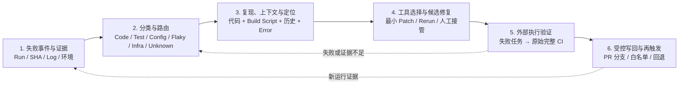

# 2023–2026 CI 自愈论文检索与流程依据

> [!abstract] 结论先行
> 有。2023–2026 年已经出现比 Repairnator（2018）更贴近现代 CI 的同行评审研究：**CARF（2026）**给出了最完整的 CI/CD 自动修复架构；**PhantomRun（MSR 2026）**给出了真实 GitHub Actions/GitLab CI 编译失败的重建、分类、LLM 修复和 CI 通过验证；**LogSage（ASE 2025 Industry Showcase）**给出了大规模 CI/CD 日志诊断与工具化缓解的工业实现。与此同时，**CI-Repair-Bench（2026，预印本）**首次把“原始完整 CI 工作流重执行”设为修复正确性的评估标准。
>
> 但截至本检索日，**没有发现一篇同行评审论文可被诚实地称为 CI 自愈的统一权威六阶段流程**：CARF 的端到端架构尚未整体实证；PhantomRun 只覆盖编译失败且没有受控写回；LogSage 未公开证明原始完整 CI 再运行、PR/主干写回权限与回退；CI-Repair-Bench 有完整复验、但仍是预印本且是评估基准，不是生产控制面。因此 PPT 不应写“业界标准流程”或“论文定义的唯一流程”。

## 1. 检索问题与口径

**问题。** 是否有 2023–2026 年、比 2018 Repairnator 更适合作为 CI 自愈上半部分流程依据的研究？是否已存在学术或行业统一流程？

**检索范围。** CI-native automated repair、CI failure diagnosis/repair、repository-level CI repair、agentic remediation、失败分类/复现/定位/修复/验证/写回。优先原始论文、作者公开 PDF、官方会议/期刊页和官方代码/数据页；预印本显式标注。未把博客、二手综述或厂商材料作为论文事实来源。

**判定原则。** “验证”只在论文明确使用 CI/构建/测试外部执行时记入；“写回”只在论文明确描述 commit/PR/branch 写入时记入。论文没有说的权限、分支保护、独立身份、策略门控和回退，均**不补推**。

## 2. 结论：没有统一流程，但存在可复用的研究证据链

### 2.1 为什么不能称为“统一权威流程”

1. **研究对象不一致。** UniLoc 解决定位；重试研究解决“是否应重跑”；PhantomRun 只解决嵌入式编译失败；CARF 描绘通用架构；CI-Repair-Bench 定义评估任务。它们不是对同一端到端系统的独立复现。
2. **验证 Oracle 不一致。** 有的只看编译/单类 lint，有的使用完整 GitHub Actions；有的只给修复建议或工具调用，未披露再运行的原始工作流。
3. **写回控制缺位。** 本检索未发现同行评审论文同时实证 PR 分支白名单、受限凭证、独立策略门、完整 CI 复验、自动写回和回退。该部分仍主要来自公开产品控制面，而非论文共识。
4. **最新“完整 CI 复验”证据尚非同行评审。** CI-Repair-Bench 是 2026 年 arXiv 预印本；它很适合校准验证标准，但不能被包装为已形成学术共识。

**可以严谨说：** “该图是以近期同行评审 CI 修复/诊断研究为主、以完整原生 CI 重执行的最新研究为验证约束而综合出的参考闭环。”

**不可以说：** “这是业界标准流程”“这是论文定义的唯一 CI 自愈流程”“论文已证明自动写回主干安全”。

## 3. 强相关论文与可支撑阶段

阶段缩写：`E` 失败事件/证据，`C` 分类/路由，`L` 定位与上下文，`R` 候选修复，`V` 外部验证，`W` 写回/再触发，`G` 策略与权限控制。`●` 为论文直接覆盖，`◐` 为局部或架构描述，`—` 为未覆盖。

| 论文（原始来源） | 年份、状态 | 样本 / 场景 | 论文直接给出的流程或机制 | E/C/L/R/V/W/G | 是否能单独充当“上方权威流程” | 限制 |
|---|---|---|---|---|---|---|
| [UniLoc: Unified Fault Localization of Continuous Integration Failures](https://people.cs.vt.edu/nm8247/publications/TOSEM2023.pdf) | 2023，**ACM TOSEM** 同行评审期刊，DOI [10.1145/3593799](https://doi.org/10.1145/3593799) | 72 个开源 Gradle 项目的 700 个 CI 失败修复 | CI log 作为查询；把源代码和 build script 同时作为候选文档，以领域启发式优化查询、搜索空间和排序，输出可能出错文件。 | ● / ◐ / ● / — / — / — / — | **否。** 是“日志到代码/构建脚本定位”的强依据。 | 不生成补丁、不重跑验证、不写回；数据集中只有 Gradle 项目。 |
| [GitBug-Actions: Building Reproducible Bug-Fix Benchmarks with GitHub Actions](https://arxiv.org/abs/2310.15642)；[官方代码](https://github.com/gitbugactions/gitbugactions) | 2024，**ICSE Companion Tool Demo** 同行评审 | 3,465 个可本地执行单测试 GHA 仓库中，1,626 个得到执行结果；识别 20 个仓库 33 个 bug-fix commit；最终 13 仓库 21 个完全可复现修复 | 本地执行 GHA → 收集 fail/pass commit 对 → 分离 source/test/non-code patch → 离线可复现环境中重复执行，剔除不一致/Flaky 样本。 | ◐ / — / ● / — / ● / — / — | **否。** 支撑“先重建原环境、再验证”的方法学，而非自愈器。 | 是基准构建工具；只覆盖可本地执行的单测试 GitHub Action，未生成或写回修复。 |
| [On the Diagnosis of Flaky Job Failures: Understanding and Prioritizing Failure Categories](https://conf.researchr.org/details/icse-2025/icse-2025-software-engineering-in-practice/42/On-the-Diagnosis-of-Flaky-Job-Failures-Understanding-and-Prioritizing-Failure-Catego) | 2025，**ICSE-SEIP** 同行评审行业实践论文 | TELUS 4,511 个 Flaky job failure；识别 46 类，并以 RFM 排出 14 个优先类别 | 对 flaky failure 聚类、分类和优先级排序，明确把分类作为后续自动诊断/修复研究的前置。 | ● / ● / ◐ / — / — / — / — | **否。** 强化“Flaky 不能直接交给 Patch Agent”的分类依据。 | 研究的是 Flaky job，不是通用 CI 修复闭环；没有自动修复实验。 |
| [Rechecking Recheck Requests in Continuous Integration: An Empirical Study of OpenStack](https://discovery.ucl.ac.uk/id/eprint/10225119/) | 2025，**ASE Research Papers** 同行评审，DOI [10.1109/ASE63991.2025.00121](https://doi.org/10.1109/ASE63991.2025.00121) | OpenStack 314,947 次 recheck request | 用历史 job、bot、user 行为预测 recheck 会成功还是再次失败；建议只对高概率成功的失败触发重跑。 | ● / ● / ◐ / — / ●（重跑结果） / ◐（重跑） / — | **否。** 强化“retry 是分类后的独立修复动作”。 | 只研究非确定性失败的 recheck 决策；没有代码/配置修复和写回。 |
| [LogSage: An LLM-Based Framework for CI/CD Failure Detection and Remediation with Industrial Validation](https://arxiv.org/abs/2506.03691)；[ASE 2025 官方条目](https://conf.researchr.org/details/ase-2025/ase-2025-industry-showcase/56/LogSage-An-LLM-Based-Framework-for-CI-CD-Failure-Detection-and-Remediation-with-Indu) | 2025，**ASE Industry Showcase**（同行评审行业展示）；论文同时公开为 arXiv | 367 个 GitHub CI/CD case；ByteDance 一年部署累计 1.07M+ execution（均为作者报告） | failed log + 同任务 recent success log 做 log diff/关键信息裁剪 → LLM 输出带行号的 JSON RCA → RAG 取历史知识 → LLM tool-calling 生成可执行缓解动作；作者报告在用户确认执行后会自动重触发流水线。 | ● / ● / ● / ● / ◐ / ◐ / — | **否。** 是当前最接近工业“诊断→知识→执行”链条的同行评审研究。 | 论文没有明确以“原始完整 CI 重执行”作为修复正确性 Oracle，也未公开 PR/主干写回、最小权限、策略门和回退；不能外推为可信代码写回闭环。 |
| [Just-in-time bug classifier: A step towards integrating Automated Program Repair in CI/CD pipelines](https://www.sciencedirect.com/science/article/pii/S0950584926000650) | 2026，**Information and Software Technology** 同行评审期刊，DOI [10.1016/j.infsof.2026.108076](https://doi.org/10.1016/j.infsof.2026.108076) | BugSwarm 的 67 个真实 Java 项目；654 fail-pass build，其中 326 program、244 test；可提取特征样本 499 | **CARF 六组件：**(1) failed-commit detection → (2) bug-type classification → (3) APR-tool ranking → (4) tool feasibility check → (5) automated repair → (6) recommit fix and re-trigger CI。实证的是基于 AST 差分的 program/test 分类器，最高 73% accuracy。 | ● / ● / ◐ / ◐ / ◐ / ◐ / — | **部分可以，且是目前最适合做“架构骨架”的近期同行评审论文。** | 六组件中的 tool ranking、feasibility、repair、recommit/retrigger 是框架设计；论文的端到端实证主体是分类器，**不是完整 CARF 的生产对照实验**。范围也排除了构建、依赖、环境等 domain-specific failure。 |
| [PhantomRun: Auto Repair of Compilation Errors in Embedded Open Source Software](https://arxiv.org/abs/2602.20284)；[MSR 2026 官方录用条目](https://2026.msrconf.org/track/msr-2026-technical-papers) | 2026，**MSR Technical Paper** 同行评审，DOI [10.1145/3793302.3793346](https://doi.org/10.1145/3793302.3793346) | 4 个嵌入式开源项目；10,000+ PR/MR；重建并复现 4,248 个编译错误 | 重建失败 PR/MR 的 CI 环境 → 从日志提取编译错误和文件/位置 → 按环境、语法、硬件依赖、非硬件依赖等类别处理 → 用 build log、代码、历史修复和 compiler error 构造 LLM 输入 → 生成补丁并以 CI 编译通过率验证。 | ● / ● / ● / ● / ◐（编译 CI） / — / — | **否。** 是近期最强的“真实 CI 重建→分类→补丁→执行验证”实证，但只覆盖编译失败。 | 验证主要是编译/CI pass，不等于原始完整多 job 工作流或业务语义；不证明分支写回、权限、人工审批、回退；仅 4 个嵌入式 C/C++ 项目。 |
| [Why Do GitHub Actions Workflows Fail? An Empirical Study](https://jiangnanpro.github.io/assets/pdf/3749371.pdf) | 2026，**ACM TOSEM** 同行评审期刊，DOI [10.1145/3749371](https://doi.org/10.1145/3749371) | 260 个开源 Java 项目中的 375 次失败 workflow execution；151 名开发者问卷验证分类 | 人工归纳 16 类 root cause，区分 project-related（源代码、依赖、配置）与 workflow-related（workflow 配置、平台/资源等）失败。 | ● / ● / ◐ / — / — / — / — | **否。** 是 GitHub Actions 失败分流/责任域的强分类证据。 | 解释失败，不提供复现、自动修复、验证或写回。 |
| [CI-Repair-Bench: A Repository-Aware Benchmark for Automated Patch Validation via CI Workflows](https://arxiv.org/abs/2604.27148)；[公开数据](https://huggingface.co/datasets/ci-benchmark-user/ci-repair-bench) | 2026，**arXiv preprint，未见同行评审发表信息** | 103 个 GitHub 仓库的 567 个 CI failure；12 类 CI error | 原始 workflow + execution log + repo metadata + fail-to-pass pair → log analysis/fault localization → candidate patch → **在原 GitHub Actions workflow 中完整 CI re-execution**判定正确性。 | ● / ● / ● / ● / ● / — / — | **不能单独称为权威流程；但它是“完整 CI 独立复验”最直接、最新的研究依据。** | 预印本、仅 Python/GitHub Actions 数据；是 benchmark/reference workflow，不是生产写回控制面；论文不证明 PR/主干自动提交的安全性。 |

## 4. 对“是否有比 CARF 更适合的近期同行评审端到端论文”的判断

**没有单篇更适合取代 CARF 作为“完整上方流程骨架”。** 原因不是 CARF 的实证最强，而是它是本检索中唯一明确把“失败检测 → 分类 → 工具选择 → 可行性检查 → 修复 → recommit/retrigger CI”完整连成一条 CI/CD 架构的近期同行评审论文。

但它也**不能单独定稿**，因为其论文实证重点是第 2 步的即时 program/test 分类器，而不是对六组件的端到端可用性、完整 CI Oracle 和安全写回进行实证。若将 CARF 画成最终事实，应在图注写明“架构框架；端到端其余环节为设计组合”。

**最好的替代不是换掉 CARF，而是将三种证据拆开使用：**

| 需要证明的事 | 最强近期论文依据 | 在 PPT 中的使用方式 |
|---|---|---|
| “失败应先分流，修复器应按故障类型/工具能力路由” | CARF（IST 2026）；GHA failure taxonomy（TOSEM 2026）；Flaky diagnosis（ICSE-SEIP 2025） | 把“分类路由”置于补丁生成之前；不要把它画成模型的可选 prompt。 |
| “CI 修复要从日志、代码、构建脚本和历史上下文定位” | UniLoc（TOSEM 2023）；LogSage（ASE 2025）；PhantomRun（MSR 2026） | 将“证据/定位”明确为源代码、构建脚本、log、环境、成功历史，而不只是 error line。 |
| “补丁必须由 CI 外部执行验证；最严格时应重跑原 workflow” | PhantomRun（MSR 2026，编译 CI 级）；CI-Repair-Bench（2026 preprint，原完整 workflow） | “独立验证”放在写回前；图注标明完整原 workflow 复验来自预印本，不能写成同行评审共识。 |
| “受控写回与权限门” | **本轮未找到充分的同行评审 CI 论文依据** | 必须以 Nx/Harness/GitLab 等产品一手资料另行论证；不要把它归因于 CARF、PhantomRun 或 CI-Repair-Bench。 |

## 5. 推荐用于 PPT 上半部分的“研究综合参考闭环”

### 5.1 建议图名与图注

**图名：** `CI 自愈研究综合参考闭环（非行业统一标准）`

**图注（可放图下 1 行）：** `流程骨架参考 CARF（IST 2026）；定位/编译修复参考 UniLoc（TOSEM 2023）与 PhantomRun（MSR 2026）；完整原 CI 复验标准参考 CI-Repair-Bench（2026 预印本）。写回策略另以产品控制面为准。`

这比“学术修复链 + 产品控制链”更精确：CARF 给出架构顺序，UniLoc/PhantomRun 证明关键技术环节，CI-Repair-Bench 只补强验证门槛，产品资料才证明写回的权限边界。

### 5.2 六阶段（**分析综合，不是任一论文的原文标题**）

### 5.3 各阶段的来源边界

| 综合阶段 | 可以归因于的论文事实 | 不应从论文推出的结论 |
|---|---|---|
| 1. 失败事件与证据 | CARF failed-commit detection；LogSage 的 failed/success log；PhantomRun 的失败 PR/MR 环境与 log | “任何 CI 平台均已有统一失败 schema”。 |
| 2. 分类与路由 | CARF 的 program/test classifier 与 tool ranking；GHA taxonomy 的 project/workflow 分类；Flaky/recheck 研究的重跑分流 | “分类已可对所有失败完全自动化”；CARF 只实证 program/test。 |
| 3. 复现、上下文与定位 | GitBug-Actions 的可复现环境；UniLoc 的 source/build-script 定位；PhantomRun 的 CI environment reconstruction | 每次失败都可在成本可接受的环境精确复现。 |
| 4. 工具选择与候选修复 | CARF 的 tool ranking/feasibility（架构）；LogSage RAG + tool call；PhantomRun LLM patch | 同一 Agent 能可靠处理所有错误类别。 |
| 5. 外部执行验证 | PhantomRun 的编译 CI pass；CI-Repair-Bench 的原 workflow 完整 CI re-execution | 当前所有论文都已证明“完整 CI = 业务语义正确”；CI-Repair-Bench 仍是预印本。 |
| 6. 受控写回与再触发 | CARF 架构中的 recommit/re-trigger CI | PR/主干白名单、最小权限、独立 approval、回退已经得到论文实证。此处必须引用产品控制面，不能仅靠论文。 |

## 6. 对当前页面三条启示的影响

1. **“失败分类比修复 Agent 更决定自愈质量”得到更强支撑。** CARF 以分类决定 APR tool，GHA taxonomy 显示源代码/依赖/配置与 workflow failure 并非同一行动域，Flaky recheck 研究也证明“重跑”应先经成功概率分流。表述时避免绝对化为“比所有模型能力都重要”；建议写“是决定可自动行动边界的上游变量”。
2. **“CI 自愈的分水岭，是独立复验后的有界写回”仍正确，但要拆分归因。** “独立复验”可由 CI-Repair-Bench 和 PhantomRun 支撑；“有界写回”应回到 Nx/Harness 等产品控制面，不能写成论文已证明的共同结论。
3. **“上下文 × 控制面”是合理洞察，但其中“控制面”主要是产品架构推论。** 论文强证据在日志、源码、构建脚本、历史修复和环境构成的上下文；权限、审批、分支保护和 scoped credential 的材料应保留产品来源。

## 7. 收口建议

若本页必须有一个单一“上方流程引用”，选 **CARF（IST 2026）**，但把图名写为：

> `基于 CARF 的 CI 自动修复架构，并以近期 CI 研究补强定位和验证门槛`

若目标是抵抗专家对“流程真实性”的追问，选**组合引用**，并保留图注：

> `研究综合参考闭环，非行业统一标准：CARF（IST 2026）定义检测—分类—工具选择—修复—再触发架构；UniLoc（TOSEM 2023）与 PhantomRun（MSR 2026）支撑 CI 定位/环境重建/编译修复；CI-Repair-Bench（2026 预印本）要求以原始完整 CI 重执行判定修复。`

这是本检索下证据强度最高、也最不容易被专家以“单一论文过度外推”质疑的表述。
