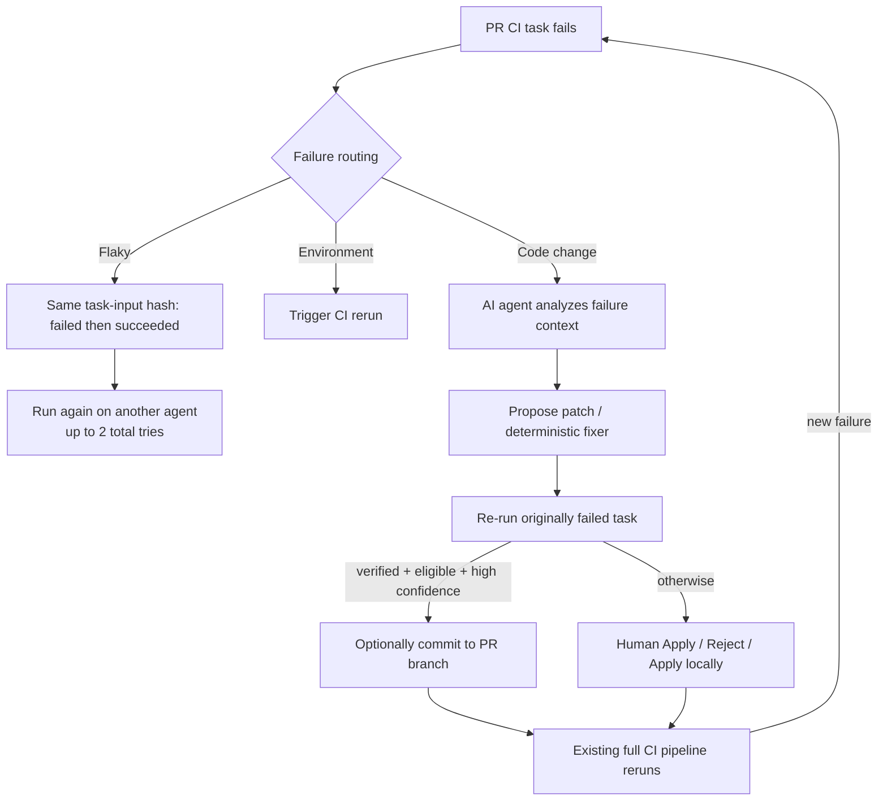

# Nx Self-Healing CI 的分类、定位、修复与验证闭环核验

**访问日：** 2026-08-10

**结论类型：** 官方文档、官方博客与官方 Enterprise Release Notes；未把未公开的模型实现补写为事实。

## 一句话结论

**有，但它不是一个已公开为“无限自主 Agent”的通用循环。** Nx 已经具备 `失败分流 → 上下文定位 → AI/确定性修复 → 原失败 Task 复验 → PR 写回 → 外层完整 CI` 的 PR 内闭环；其中 Flaky 路径有确定性哈希判据和最多两次总执行次数，环境路径会触发 CI 重跑，代码路径由 AI Agent 生成修复。公开材料**没有**说明代码修复失败后会自动生成多少轮候选、最大 Turn 数、采用何种模型或分类置信度算法，也没有把原失败 Task 复验等同于全部 Required Checks、合并或部署。

图中的 `K → A` 是现有 CI 触发新的 Self-Healing 机会，不应误读为 Nx 已公开承诺“同一个 Agent 会无限迭代到绿”。

## 已证实机制：按阶段拆解

| 阶段 | Nx 已公开的能力与技术 | 可安全写入架构图的表述 | 关键边界 |
|---|---|---|---|
| **分类 / 路由** | Nx 公开的 Self-Healing 状态分类包括 `code change`、`environment`、`flaky`；2026.01 Release Notes 明示更新“分类提示词”以改善环境与 Flaky 的区分，并使用 Affected Project 信息减少把持续失败误判为 Flaky。 | **失败分流：代码修复、环境重跑、Flaky 重试** | 公开材料没有披露分类 Prompt、特征权重、模型、阈值、混淆矩阵或 Unknown 策略；不能写成确定性通用根因分类器。 |
| **Flaky 判定与快环** | Nx Cloud 对每次任务运行计算输入哈希；同一组输入出现“先失败、后成功”时，官方称可确定该任务 Flaky。分布式执行下，会换一个 Agent 重跑，最多 **2 次总尝试**。 | **基于相同输入哈希的确定性 Flaky 判定；换 Agent 有界重跑** | 这是执行恢复，不是代码根因修复。当前 Release Notes 还说明限制连续 Flaky 重跑，但未公开该限制数值。 |
| **环境路径** | 2026.01 Release Notes：当 Self-Healing CI 判断失败由环境问题引起时，可触发 CI rerun。 | **环境故障：触发 CI 重跑** | Nx 没有公开环境问题的精确判据、重跑次数或是否会重调度到不同环境；不要表述为已完成环境 RCA。 |
| **定位 / 上下文装配** | 失败后，Agent 可读取实际运行的 Task 和 Error Log；Nx Project Graph 提供项目结构、依赖、配置与可运行 Task。当前文档还明确提到 workspace structure、project relationships、build configurations 与 metadata。`.nx/SELF_HEALING.md`、仓库根 `CLAUDE.md` 可补充 CI 专用规则、禁改范围、修复偏好和架构文档入口。 | **Task 级失败证据 + Project Graph/元数据 + 仓库规则上下文** | 官方说 Agent “identifies root cause”，但未公开其是否检索历史 Run、使用何种因果/排序算法，故不能画成已验证的知识图谱 RCA。 |
| **修复** | 默认由 AI Agent 为失败 Task 提出修复 Diff；格式、Sync、Conformance 检查有内建确定性预设，Agent 会调用对应的可写命令，例如 `nx format`。任务 Pattern 可限制可修范围，Never-fix Pattern 可排除 e2e 等任务。 | **AI 候选 Patch；确定性检查优先调用对应 Fixer** | 对一般代码/依赖/配置错误，官方没有披露模型、Agent 框架、工具调用序列、候选数量或最大修复轮数。 |
| **内层验证** | Agent 用候选变更重跑**原先失败的 Task**；Auto-apply 只有同时满足任务在白名单、Agent 高置信、候选已明确验证修复该 Task 才可提交到 PR Branch。 | **原失败 Task 复验是自动写回前的内层 Oracle** | 这不等于全仓回归、全部 Required Checks、性能/安全/业务语义均通过。 |
| **写回与外层验证** | 默认以 PR/MR Comment 或 Nx Console 呈现理由、Diff 和 Apply/Reject；Auto-apply 可直接提交 PR Branch；2025 产品说明称写回后现有完整 CI Pipeline 再运行。Protected Branch 与 `main/master/trunk/dev/stable/canary` 不生成修复，且可 Revert。 | **受限写回 PR 分支，随后由既有完整 CI 复跑** | Merge、分支保护、部署、生产观测与回退仍属于 Nx 之外的宿主 CI/CD 与治理控制面。 |

## “Loop”究竟到什么程度

### 1. 已证实的三个闭环

1. **Flaky 快环：** 同输入哈希的失败—成功证据 → 换 Agent 重跑 → 最多两次总尝试。它解决的是偶发执行阻塞，不修代码。
2. **代码修复微闭环：** 失败 Task → AI/确定性 Fix → 重跑原失败 Task → 人审或满足 Auto-apply 条件后写回 PR Branch。
3. **外层 PR 闭环：** 写回 Commit → 既有完整 CI Pipeline 再跑 → 若出现新的失败，`fix-ci` 仍会在 `always()`/等价条件下执行，从而开始新的处理机会。

### 2. 未被公开证实的“多轮 Agent 自主修复”

官方文档与 Release Notes 证明了重跑、修复提议、原 Task 复验、Auto-apply、超时/取消状态提示，以及对连续 Flaky rerun 的限制；但没有公开说明下列能力：

- 原失败 Task 复验失败后，是否自动让同一 Agent 再生成第二个 Patch；
- 每个 CI 失败的最大 Patch/Turn 数、总 Token/时间/成本预算；
- 环境 rerun 的最大次数和停止条件；
- 分类不确定或相互冲突时是否输出 `unknown` 并转人工；
- 完整 CI 失败后是否把新失败归并到原 Repair Case，还是作为新的处理事件。

因此，架构图可画“**受限的内层验证循环 + 外层 PR CI 循环**”，不可画成“Agent 自动反复修到绿”的确定事实。

## 分类技术：混合式，而非单一 LLM 分类器

Nx 的公开材料支持以下最严格的技术理解：

| 类别 | 判断技术 | 动作 | 证据强度 |
|---|---|---|---|
| Flaky | **确定性历史判据**：任务输入哈希相同，曾失败又成功；另有 Affected Project 信息避免持续失败被误判。 | 换 Agent 重跑，最多两次总尝试。 | 高 |
| Environment | Self-Healing 的**分类提示词**区分环境与 Flaky；失败被判环境问题后触发 CI rerun。 | CI rerun。 | 中：有动作和 Prompt 事实，但内部特征与阈值未公开。 |
| Code change | 非 Flaky/环境的需修代码、配置或依赖类失败由 AI Agent 分析任务日志和 Project Graph 后提出 Patch。 | AI Patch 或确定性 fixer；原失败 Task 复验。 | 中高：输入与动作公开，细粒度类别体系未公开。 |

这意味着此前讨论的“可插拔分类中枢”可以借鉴 Nx 的**三路结果**，但不要把 Nx 描述成支持按语言、产品问题类型、外部服务状态等任意企业 Taxonomy 的通用可插拔分类平台。官方可配置项主要是 Task Pattern、分支、禁改区域、置信度规则、预定义 Fix 和自由文本上下文，不是公开的分类器插件 API。

## 可用于 PPT 的精确表述

推荐主句：

> **Nx 将失败先分流为 Flaky 重跑、环境重跑与代码修复；代码路径以 Task 日志、Project Graph 和仓库规则生成候选，并重跑原失败 Task 后再受限写回 PR。**

脚注：

> **边界：Flaky 有确定性哈希证据；环境/代码分类的模型、提示词和阈值未公开。原 Task 复验不替代完整 PR 门禁、合并或部署。**

## 产品演进与状态

| 时间 | 官方变化 | 解读 |
|---|---|---|
| 2025-06-23 | 首次公告为 **Early Access**；提出失败发现、AI 分析、Patch、原任务重跑与 PR 写回流程。 | 该状态只适用于发布当时，不能延续写成当前状态。 |
| 2025-10-14 | 发布 Task Pattern 与 Auto-apply：后台验证通过后可推送 PR。 | 增加对自治范围的 Task 级约束。 |
| 2026-01 | 公开环境 rerun、Affected Project 防 Flaky 误判、环境/Flaky 分类 Prompt 更新、连续 Flaky rerun 限制，以及 code/environment/flaky 分类筛选。 | 分类和快环由“Flaky vs. 普通失败”扩展为三路操作控制。 |
| 2026-04-22 | 增加按 Task 展示历史修复次数、重跑验证率和置信度的 Auto-apply 建议。 | 历史数据用于**建议**扩大 Auto-apply，不自动扩权。 |
| 2026-08-10 | 当前文档以 `AI-Powered Self-Healing CI` 发布并支持 GitHub、GitLab、Azure DevOps、Bitbucket。 | 当前页面未给整套能力统一标为 GA/Preview/Beta；本专题记为“已发布，官方未标统一阶段”。 |

## 来源（完整 URL）

1. 当前功能与配置文档，访问 2026-08-10：

   https://nx.dev/docs/features/ci-features/self-healing-ci
2. Flaky 输入哈希判定、换 Agent 重跑和两次总尝试，访问 2026-08-10：

   https://nx.dev/docs/features/ci-features/flaky-tasks
3. 初始流程、Task Log/Project Graph 上下文、原任务复验、外层完整 CI，发布 2025-06-23，访问 2026-08-10：

   https://nx.dev/blog/nx-self-healing-ci
4. Task Pattern、Auto-apply 与后台验证，发布 2025-10-14，访问 2026-08-10：

   https://nx.dev/blog/whats-new-in-nx-self-healing-ci
5. 历史修复次数、重跑验证率、置信度与 Auto-apply 建议，发布 2026-04-22，访问 2026-08-10：

   https://nx.dev/blog/self-healing-ci-auto-apply-suggestions
6. 2026.01 分类、环境重跑、Affected Project、连续 Flaky rerun 限制与产品变化，访问 2026-08-10：

   https://nx.dev/docs/reference/nx-cloud/release-notes
7. `code change / environment / flaky` 分类筛选与 2026 年 Self-Healing 变更，访问 2026-08-10：

   https://nx.dev/changelog

## 与既有专题的关系

- 该核验更新了 [[50_deepdives/cicd-self-healing/35_company-mechanism-audit#Nx自治被缩小到Task--PR-Branch|Nx 机制审计]] 中“Flaky / 环境 / 代码”分流的技术细节。
- 不修改既有结论：Nx 的明确自动 Oracle 是原失败 Task；完整 Required Checks、Merge、Deploy 和生产回退仍为 `unverified` 或外置控制面。
