# 问题树：各公司智能化 CI/CD 演进趋势（2024—2026）

## 一、问题树结构

```mermaid
flowchart TD
  Q0["Q0 智能化 CI/CD 如何演进？"] --> Q1["Q1 能力形态演进"]
  Q0 --> Q2["Q2 环节扩散"]
  Q0 --> Q3["Q3 自治等级演进"]
  Q0 --> Q4["Q4 产品状态转正"]
  Q0 --> Q5["Q5 执行形态演进"]
  Q0 --> Q6["Q6 治理演进"]
  Q0 --> Q7["Q7 验证机制演进"]

  Q1 --> Q1a["AI 建议（评审/摘要）"]
  Q1 --> Q1b["Agent 执行（修复/PR/门禁）"]
  Q1 --> Q1c["自治编排（常驻/护送合并）"]

  Q2 --> Q2a["检查/评审"]
  Q2 --> Q2b["门禁/安全扫描"]
  Q2 --> Q2c["构建/CI 修复"]
  Q2 --> Q2d["发布准备/测试"]
  Q2 --> Q2e["发布/恢复"]

  Q3 --> Q3a["只读/调查"]
  Q3 --> Q3b["受控执行（沙箱+门禁）"]
  Q3 --> Q3c["受控合并/发布（边界内）"]

  Q4 --> Q4a["Research/Experimental"]
  Q4 --> Q4b["Preview/Beta"]
  Q4 --> Q4c["GA"]
  Q4 --> Q4d["下线/退役"]

  Q5 --> Q5a["终端 CLI 编码 Agent"]
  Q5 --> Q5b["编译进流水线（Actions/Step）"]
  Q5 --> Q5c["常驻编排器（issue 追踪器/Harness）"]

  Q6 --> Q6a["治理流程（分支保护/审批）"]
  Q6 --> Q6b["Agent 凭据与执行边界"]
  Q6 --> Q6c["Agent 持续行为/状态化授权"]

  Q7 --> Q7a["人工逐个审批/确定性 gate"]
  Q7 --> Q7b["Agent 产出接入 gate"]
  Q7 --> Q7c["模型分类器+eval 门禁"]
```

## 二、演进维度定义

| 维度 | 定义 | 观测方法 |
|---|---|---|
| 能力形态 | 智能化能力对 CI/CD 的介入深度 | 从"生成建议"到"执行动作"到"编排任务" |
| 环节扩散 | 智能化能力覆盖的 CI/CD 环节 | 检查/门禁/构建/制品/部署/发布/恢复 |
| 自治等级 | Agent 获得执行权的边界 | 只读 → 沙箱内执行 → 受控合并/发布 |
| 产品状态 | 官方生命周期 | Research/Experimental/Preview/Beta/GA/下线 |
| 执行形态 | 智能化能力如何接入流水线 | 终端 CLI → 编译进平台 → 常驻编排 |
| 治理演进 | 控制 Agent 的对象从流程变为 Agent 身份与行为 | 流程治理 → 凭据/边界治理 → 状态化行为治理 |
| 验证机制 | 谁验收 Agent 产出、最终放行权归谁 | 人工/确定性 gate → gate 接入 → 分类器+eval 门禁 |

## 三、假设与待验证

| 假设 | 预计证据来源 | 状态 |
|---|---|---|
| H1：智能化能力先覆盖"检查/评审"再扩散到"构建修复/门禁/发布"，环节扩散有先后 | 各研究底稿事实表 | 待复核（证据地图环节密度表支撑） |
| H2：自治等级从"只读/调查"向"受控执行"向"受控合并"演进，发布端始终被边界拦截 | GitHub/AWS/OpenAI/Anthropic 底稿 | 待复核（"PR 永不自动合并"、release readiness 边界等） |
| H3：产品状态转正轨迹为 Research/Experimental → Preview/Beta → GA，2026 密集转正 | 各底稿状态列 | 待复核（gh-aw、AgentCore、Worker Agents、auto mode 等） |
| H4：执行形态从"终端 CLI Agent"向"编译进流水线/常驻编排器"演进 | GitHub gh-aw、OpenAI Symphony、Harness Worker Agents | 待复核 |
| H5：不同公司演进起点与速度不同（平台厂商 vs AI 公司），但存在共性演进模式 | 跨公司对比 | 待复核 |
| H6：治理对象从"流程/权限"演进为"Agent 身份与持续行为"，状态化授权（temporal policies）是 2026 新原语 | AWS F14、Harness 事实表、gh-aw | 待复核（C19-C21） |
| H7：验证最终权威保持确定性，智能化演进的是"前置验收"（分类器/eval 门禁），且 Agent 不得自证 | Anthropic A4/A8、OpenAI O14、AWS F8 | 待复核（C22-C24） |

## 四、验收标准（每个问题）

| 问题 | 验收标准 |
|---|---|
| Q1 能力形态演进 | 每家至少 2 个时间点上的能力形态证据，能标出具形态演进 |
| Q2 环节扩散 | 能画出每家智能化能力覆盖环节随时间的变化 |
| Q3 自治等级演进 | 每家的自治边界有官方陈述（只读默认/沙箱/门禁/PR 永不合并） |
| Q4 产品状态转正 | 每个变化标注状态与时间；标识"状态更新"项；列出转正轨迹 |
| Q5 执行形态演进 | 能区分终端 CLI / 编译进流水线 / 常驻编排器三类，并给代表证据 |
| Q6 治理演进 | 每家至少 1 个"治理对象变化"证据（凭据模型/状态化授权/身份治理） |
| Q7 验证机制演进 | 能区分"权威保持确定性"与"前置验收智能化"两层，并给代表证据 |
| 跨公司 | 至少 3 条共性演进模式 + 3 条差异化路线 + 冲突证据显式保留 |
| 采用排序 | 按"演进成熟度"形成排序，并给出保持阻塞的项 |