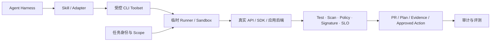

# CLI 在 Agentic CI/CD 中的能力、边界与趋势

## 执行摘要

CLI 的本质是进程级执行接口，而不是复古的人机界面。对 Agent 而言，CLI 可以用极低接入成本把仓库、构建、云、制品和部署能力放入本地工作区或隔离 Runner，并通过容器、进程权限、退出码和产物提供可重放边界。

但传统“人类可用 CLI”不自动等于“Agent-ready CLI”。后者必须把目标、状态、副作用、输出、错误、身份和版本从隐式环境变成可验证契约。JSON 只是必要条件之一；如果命令依赖当前登录态、默认 Region、交互提示或非幂等副作用，它仍然可能导致 Agent 对错误对象执行正确命令。

CLI 与 MCP 只在 Tool 调用面部分重叠。单一 Harness、本地执行和成熟 DevOps CLI 场景通常优先直接复用 CLI；跨多个 Agent 客户端、远程多租户、统一 Schema/发现、OAuth 与集中治理时，MCP 更具优势。最常见的长期结构将是：CLI/API 作为真实能力底座，MCP 作为可选互操作层，Skill 说明组织用法，Harness 负责规划，外部控制面负责授权和验证。

## 一、CLI 的能力模型

“CLI”在 Agent 讨论中实际有三种角色，不能混为一谈：

| 角色 | 典型形态 | 在 CI/CD 中的作用 |
|---|---|---|
| 能力 CLI | `git`、`gh`、`kubectl`、Terraform、AWS CLI、内部发布器 | 提供确定性查询和动作面 |
| Agent/Harness CLI | Claude Code、Codex CLI、Copilot CLI、OpenCode | 运行模型、上下文、工具循环和权限会话 |
| 治理/编译 CLI | `gh aw compile/validate/run/logs` 等 | 将 Agent Workflow 编译、锁定、验证和审计 |

后两者说明 CLI 不只“被 Agent 调用”，它也可以承载 Agent 主体，或把自然语言工作流转成固定依赖和可审计执行物。

### 1. 可发现的动作面

命令、子命令、参数、帮助和版本构成最小发现机制。相较 GUI 坐标和自然语言猜测，CLI 能把动作空间压缩成有限的语法；但普通 `--help` 仍是面向人类的文本，不等于标准化 Schema。

### 2. 确定性调用边界

每次调用是一个可观察进程，可以限定工作目录、环境变量、用户、文件系统、网络、CPU、内存和超时。容器/Runner 还能固定二进制及依赖版本。这是 CLI 在 CI/CD 中最实用的优势。

### 3. 结构化输入输出

[GitHub CLI](https://cli.github.com/manual/gh_help_formatting) 支持字段选择、JSON、`jq` 与 template，[kubectl](https://kubernetes.io/docs/reference/kubectl/) 支持 JSON/YAML/JSONPath，[AWS CLI](https://docs.aws.amazon.com/cli/latest/userguide/cli-usage-output-format.html) 提供 JSON、YAML、text、table 和 `off`。它们说明成熟 CLI 正同时服务人和机器。

机器接口至少要区分：业务结果写入 stdout、诊断写入 stderr、退出码表达失败类别、结构化字段有兼容承诺。大段彩色文本、进度动画和“失败但退出 0”都会提高 Agent 误判概率。

Agent CLI 又把机器契约推进到事件和预算层：Claude Code 提供非交互、JSON/stream JSON、最终 JSON Schema、turn/成本限制和 Tool allow/deny；`codex exec --json` 输出 JSONL 事件并支持最终输出 Schema；Gemini CLI headless 也定义 JSON/JSONL 和专用退出码。由此可见，2026 年的收敛点正在从“有 JSON”迁移到“事件、最终 Schema、资源上限、resume 和 sandbox”，但各厂商尚无统一 CLI 协议。详细一手证据见 [[50_deepdives/cli-agent-interface/research-evidence|研究笔记]]。

### 4. 状态与事务

CLI 可以无状态，也可以依赖工作区、配置、登录态和远程资源。Agent-ready 设计需要显式暴露当前目标、状态版本和并发冲突。[Terraform 自动化](https://developer.hashicorp.com/terraform/tutorials/automation/automate-terraform) 的保存 Plan、人工检查、应用同一 Plan，以及状态锁，是 Plan-and-Approval 的典型实现。

### 5. 组合与后端真实性

CLI 容易与 Shell、流水线和文件制品组合，也容易直接调用真实 API、SDK 或应用后端。因此它的结果通常比 GUI 自动化更接近真实状态。代价是进程串联可能丢失类型、把秘密写入参数/日志，并产生转义和注入风险。

## 二、Agent-ready CLI 的九项契约

| 契约 | 最低要求 | 常见反模式 |
|---|---|---|
| 发现 | 稳定帮助、版本、子命令与示例 | Agent 必须从文档猜参数 |
| 输入 | 非交互、显式参数或结构化 stdin、校验 | 隐式读取当前目录/默认账户 |
| 输出 | 稳定 JSON/事件/产物，stdout 与 stderr 分离 | 解析彩色表格和自然语言 |
| 错误 | 非零退出、错误码/类型、可重试标记 | 失败退出 0，错误只有一句话 |
| 状态 | 显式 session/plan/revision/target | 依赖共享全局配置和陈旧登录态 |
| 副作用 | dry-run、幂等键、并发保护、回滚说明 | 重试会重复发布或删除 |
| 安全 | 任务身份、最小权限、秘密不进输出 | 共享高权限机器人账号 |
| 版本 | CLI 与输出 Schema 版本、兼容策略 | 小版本静默改字段和语义 |
| 可观测 | 调用 ID、目标、身份、参数摘要、产物哈希 | 只能看到一段完整 Shell 文本 |

特别需要警惕“结构化即安全”的错觉。[Terraform 输出文档](https://developer.hashicorp.com/terraform/tutorials/configuration-language/outputs) 明确提醒 `-json` 会显示 sensitive 值。可解析性改善了自动化，也可能使秘密更容易被批量采集。

## 三、CLI 能替代什么

### 可替代部分 GUI 自动化

当 CLI 直接调用软件真实后端、能读写项目文件并产出可验证制品时，它通常比坐标、截图和交互时序更稳定。无法替代的部分包括主观视觉判断、没有可访问后端的闭源软件、浏览器真实会话和仅存在于交互界面的状态。

### 可替代部分 SDK/API 集成

对于跨语言、低频、运维型任务，CLI 可以把 SDK 依赖收敛成子进程和文件/JSON 契约，降低客户端集成量。高吞吐、低延迟、强类型事务、流式双向交互和库内回调仍更适合 SDK/API。

### 可替代部分 MCP Tool

满足以下条件时，直接 CLI 通常足够：

- 只有一个或少数 Harness；
- 工具运行在本机、开发容器或 CI Runner；
- CLI 已有稳定帮助、JSON、退出码和非交互模式；
- 身份可由任务环境注入；
- 不需要远程多租户、动态 Tool Catalog、Resource/Prompt 或协议级通知；
- 团队能接受每个 Harness 用 Skill/Adapter 描述调用方式。

不能自然替代的部分是跨客户端标准化发现和 Schema 协商、统一远程 OAuth、资源订阅、Prompt、Sampling/Elicitation、Registry/Allowlist 和标准长任务扩展。强行补齐这些能力，最终会重新发明一个协议和控制面。

## 四、CLI 在八个 CI/CD 阶段的用法

| 阶段 | 合适能力 | 推荐边界 | 不宜默认开放 |
|---|---|---|---|
| 代码评审 | PR/差异/检查查询、评论、Draft PR | PR-bound | 自动合并和改保护规则 |
| 静态与安全 | 扫描、发现解释、修复、复验 | 产物与扫描 Oracle | 接受例外、关闭策略 |
| 测试与门禁 | 选择/运行测试、收集证据 | Pipeline-bound | 改测试或 Gate 后自证成功 |
| 构建出包 | 依赖诊断、构建、缓存查询 | 临时 Runner、固定工具链 | 读取无关密钥、任意网络出口 |
| 制品与版本 | 查询版本/SBOM/签名、生成候选包 | 只读/写 Toolset 分离 | 自动签名、删除、生产晋级 |
| IaC 与部署 | Validate/Plan、非生产执行 | Plan-and-Approval | 使用共享生产管理员身份 |
| 发布与审批 | 证据包、状态查询、渐进计划 | 批准绑定哈希与环境 | Agent 批准自己的发布 |
| 发布后 | 日志/状态/拓扑查询、低风险 Runbook | Runbook-bound | 无验证和回滚的生产恢复 |

## 五、2025H2—2026 的行业趋势

### 趋势 1：终端成为 Agent 工作台

Claude Code、Codex CLI、OpenCode 等项目与产品扩展，说明 CLI 不只被 Agent 调用，还是 Agent Harness 的主要交互界面。GitHub Copilot CLI 产品本身于 [2026-02 GA](https://github.blog/changelog/2026-02-25-github-copilot-cli-is-now-generally-available/)，其[新终端界面](https://github.blog/changelog/2026-06-23-copilot-cli-new-terminal-interface-is-generally-available/) 于 2026-06 GA，并把 MCP 搜索/安装、Skills 和 Plugins 纳入同一终端工作台。这是“CLI 容纳 MCP”，而不是一个淘汰另一个。

### 趋势 2：机器契约压过人类文本

成熟 CLI 持续补充 JSON、字段选择、流式输出和关闭渲染的模式。Agent 会进一步推动 Schema、错误类型、事件流和稳定产物，而不是依赖自然语言屏幕文本。

### 趋势 3：CLI 成为 MCP 的常见后端

已有稳定 CLI 时，MCP Server 最经济的实现路径往往是包装 CLI 或共用其业务库；这样跨客户端暴露统一 Tool，同时保留命令行可调试、可重放的执行面。

### 趋势 4：行业开始反思“默认 MCP”

Thoughtworks 在 2026-04 将 [“MCP by default”](https://www.thoughtworks.com/en-us/radar/techniques/mcp-by-default) 放入 Caution：MCP 的结构化契约和治理有价值，但也会增加抽象成本和能力保真损失；设计良好的 CLI 对许多任务已经足够。这是行业观点，不是标准组织结论，但说明选型讨论正从“是否支持 MCP”转向成本收益。

### 趋势 5：供应链和任务身份成为瓶颈

Agent 能自主安装或发现 CLI 后，二进制、包管理器、Skill、配置和依赖都成为供应链入口。企业真正需要的不是开放系统 PATH，而是带 Owner、签名、版本、权限、风险级别和撤回状态的内部 Tool Catalog。

### 趋势 6：CLI 进入 Agent Workflow 的编译与治理面

GitHub `gh aw compile` 会解析和校验 Workflow、固定 Action 依赖并生成 Lock 文件，`validate --json` 可供自动化使用；其安全架构又把 Agent、网络、防火墙、MCP Gateway 与 Safe Outputs 分层。这表明 CLI 还在承担“把概率性工作流编译成可审计执行物”的新角色。该能力仍处 Agentic Workflows Public Preview，不能当作稳定行业标准。

## 六、推荐架构

当复用半径扩大到多个 Harness 或远程服务时，可在受控 CLI 前增加 MCP Adapter；但身份、Policy、审批和 Oracle 仍不能只依赖 Adapter。

## 七、企业落地顺序

1. 盘点 Agent 当前实际调用的命令，按 Observe、Propose、Verify、Change 分组；
2. 把 Account/Region/Environment 等隐式目标改为显式参数并写入审计；
3. 为高频命令增加 JSON、稳定错误、超时、dry-run 和幂等；
4. 在临时 Runner 建立任务身份、网络和秘密边界；
5. 用真实任务集验证直接 CLI，再验证 Skill 或 MCP 是否产生增量收益；
6. 只有在多客户端、远程服务和集中治理需求成立时，才把 CLI 包装成 MCP；
7. 对生产写动作采用 Plan-and-Approval 或 Runbook-bound，不把整个 CLI 二进制整体授权。

## 八、最终判断

CLI 在 Agentic CI/CD 中的战略地位不是“遗留兼容层”，而是最低成本的确定性执行底座。它最适合局部、可重放、工具已成熟的自动化；它的边界是标准化发现、远程多租户和跨客户端治理。企业应先把 CLI 做成可靠产品，再决定是否增加 MCP，而不是用协议包装掩盖不稳定的底层语义。

进一步比较见 [[50_deepdives/cli-vs-mcp-decision-guide|CLI 与 MCP 决策指南]]；MCP 的协议能力见 [[50_deepdives/mcp-protocol/90_report|MCP 深度报告]]。
