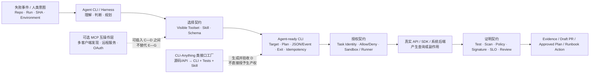

# CLI 单页汇报研究稿

> [!abstract] 推荐结论
> CLI 在 Agent 时代的战略价值，不是让模型“像人一样敲命令”，而是把概率性判断压缩为可发现、可重放、可审计的行动契约。真正的自治上限不由 CLI、JSON 或 MCP 单独决定，而由四种契约共同决定：模型能选择什么、命令明确承诺什么、任务身份获准执行什么、外部 Oracle 接受什么结果。

## 1. 研究提纲

本稿为后续单页 PPT 收敛五个问题：

1. CLI 在 Agentic CI/CD 中究竟是哪一层，不与 Agent CLI、MCP 或 API 混写；
2. 人类可用 CLI 到 Agent-ready CLI 之间缺少哪些契约；
3. 为什么 Tool Discovery、结构化输出和执行授权必须分开；
4. CLI 如何进入 CI/CD，又在哪里停止自治；
5. 哪一句页面主张能够同时被机制图、证据和边界直接证明。

## 2. 先拆开三种 CLI

| 角色 | 定义 | 典型形态 | 单页中的位置 |
|---|---|---|---|
| **能力 CLI** | 通过进程、参数、标准流和退出状态暴露真实系统能力 | `git`、`gh`、`kubectl`、Terraform、AWS CLI、内部发布器 | 本页主角：Agent 到后端的行动契约 |
| **Agent CLI / Harness** | 在终端中运行模型、上下文、工具循环、会话与权限 | Codex CLI、Claude Code、Copilot CLI | 作业流上游：负责理解、判断和选择工具 |
| **治理 / 编译 CLI** | 验证、固定、运行或审计 Agent Workflow | Workflow compiler、validator、runner | 控制面案例，不等于能力 CLI |

**事实：** Codex、Claude Code 和 Copilot CLI 的当前官方文档都把非交互运行、结构化输出或 Tool 权限作为独立能力暴露；这证明 Agent CLI 本身也在产品化机器契约，而不只是提供终端聊天界面。

**分析：** 单页不应把三个角色画成同一层。最重要的责任边界是：Agent CLI 负责概率性规划，能力 CLI 负责把一个选择变成显式调用，Runner 与后端承担真实副作用。

**边界：** “CLI”不是统一协议。不同 CLI 的参数、Schema、错误、状态和兼容承诺各不相同；进程可启动不等于接口可安全复用。

## 3. CLI 的核心价值：从终端界面变成进程契约

CLI 对 Agent 的价值来自五个进程级事实：

1. 命令、参数、stdin、stdout、stderr 和退出状态构成有限调用面；
2. 二进制、容器和依赖可以固定版本；
3. 工作目录、文件、用户、网络、CPU、内存和超时可以在 Runner 中约束；
4. 同一调用可以在开发者本地和 CI 中复现；
5. 结果可以落成 JSON、事件流、Plan、Diff、报告或制品，再交给外部系统验证。

[Codex 非交互模式](https://developers.openai.com/codex/noninteractive)明确把运行进度写入 stderr、最终结果写入 stdout，并支持 JSONL 事件流、最终输出 JSON Schema、只读或可写 Sandbox。它是“Agent CLI 也遵循机器组合契约”的当前一手样本。

[kubectl 可复用脚本约定](https://kubernetes.io/docs/reference/kubectl/conventions/)要求使用面向机器的输出、完整限定 API 版本，并明确要求不要依赖 context、preference 等隐式状态。它直接支持本专题最重要的风险判断：Agent 最容易犯的错误不是命令语法错误，而是对错误目标成功执行。

> [!important] 用词校正
> 单页宜写“可重放、可审计的执行契约”，不宜笼统写“确定性执行”。CLI 调用可以固定，远端状态、并发、网络、Provider 和业务系统仍可能漂移；同一命令不保证每次产生相同结果。

## 4. 四种契约共同决定可信度

### 4.1 选择契约：模型能看见并选择什么

选择契约回答：

- Tool 名称、用途、参数和版本是否可发现；
- 模型本次任务能看到哪些命令；
- 只读、提案、验证和写动作是否分开；
- Toolset 是否按阶段、环境和身份裁剪。

[GitHub Copilot CLI Tool 权限文档](https://docs.github.com/en/copilot/how-tos/copilot-cli/use-copilot-cli/allowing-tools)明确分开两层：

1. `available-tools` / `excluded-tools` 控制哪些工具对模型可见；
2. `allow-tool` / `deny-tool` 控制哪些工具获准执行，且 deny 优先。

**分析：** Tool Visibility 和 Execution Permission 是正交控制。只做执行拦截，模型仍可能反复选择最终会被拒绝的工具；只做可见性裁剪，不能证明当前身份真的有执行权。

### 4.2 命令契约：CLI 明确承诺什么

Agent-ready CLI 至少要把以下内容从隐式环境变成显式契约：

| 契约项 | 最低要求 | 典型反模式 |
|---|---|---|
| 发现 | 稳定帮助、版本、子命令和示例 | Agent 从长文档猜参数 |
| 输入 | 非交互、显式 target、结构化 stdin 或参数校验 | 依赖当前目录、默认账户、默认 Region |
| 输出 | 稳定字段、stdout/stderr 分离、结果产物 | 解析彩色表格、进度动画和自然语言 |
| 错误 | 非零退出、错误类型、重试与不可重试语义 | 业务失败仍退出 0 |
| 状态 | 显式 session、revision、plan、target | 复用共享登录态和全局配置 |
| 副作用 | dry-run、幂等键、并发保护、取消和回滚说明 | 重试会重复发布、重复创建或删除 |
| 版本 | CLI 与输出 Schema 的兼容策略 | 小版本静默改字段和语义 |
| 可观测 | 调用 ID、身份、目标、参数摘要、产物哈希 | 审计只留下一段 Shell 文本 |

**事实：** Codex 和 Claude Code 当前都支持 JSON/JSONL 与最终输出 Schema；kubectl、GitHub CLI、AWS CLI 等成熟 DevOps CLI 也提供面向机器的输出。

**边界：** JSON 只提高可解析性。它不证明 target 正确、副作用幂等、凭据最小化或业务结果正确；结构化输出甚至可能更稳定地泄露敏感字段。

### 4.3 授权契约：任务身份在什么边界内执行

授权契约回答：

- 当前运行使用谁的身份；
- 身份能访问哪个 Account、Region、Cluster、Namespace、Repository、Environment；
- 哪些命令、参数、文件和 URL 被允许；
- 凭据何时注入、何时失效；
- 运行是否位于临时 Runner / Sandbox，网络和秘密是否隔离。

[Codex 非交互模式](https://developers.openai.com/codex/noninteractive)默认使用只读 Sandbox，要求自动化按最小权限选择可写范围，并警告不要把 API Key 作为会运行仓库不可信代码的 Job 级环境变量。

[GitHub Copilot CLI Tool 权限文档](https://docs.github.com/en/copilot/how-tos/copilot-cli/use-copilot-cli/allowing-tools)明确提醒：Shell 命令可以执行当前用户账户能够执行的动作，因此“允许 Shell”本质上是在委托当前 OS 身份的能力。

**分析：** 企业采用单位不应是整个 `aws`、`kubectl` 或内部发布 CLI，而应是：

`某任务身份 × 某环境 × 某命令/参数约束 × 某有效期 × 某外部 Oracle`

### 4.4 证明契约：谁决定行动是否成功

证明契约回答：

- 命令退出 0 之外，什么证据证明业务结果成立；
- Agent 能否修改成功标准；
- Plan、Diff、制品、环境和批准是否绑定同一哈希；
- Test、Scan、Policy、Signature、SLO 或人工 Review 是否独立于生成者。

[Terraform 自动化指南](https://developer.hashicorp.com/terraform/tutorials/automation/automate-terraform)把自动化流程分成生成 Plan、人工检查、应用同一 Plan，并要求非交互执行；这是“行动提案与执行批准分离”的典型 CLI 模式。

**分析：** CLI 能把 Agent 判断变成行动，不能把行动变成证明。命令返回成功只证明调用链认为它成功；CI/CD 的自治上限取决于 Agent 无法自行改写的外部 Oracle。

## 5. 推荐因果链



### 因果链的读法

1. **Agent 负责判断。** 输入可以是失败事件、人类意图或流水线状态。
2. **选择契约缩小行动空间。** 模型只看到任务需要的工具，而不是整个系统 PATH。
3. **CLI 固化调用。** 目标、输入、状态、副作用和输出进入可重放命令。
4. **授权契约限制爆炸半径。** 任务身份与 Sandbox 决定命令能影响什么。
5. **真实后端执行。** CLI、MCP 或 API 都只是进入后端的接口，不是成功证明。
6. **外部 Oracle 放行。** 结果只有通过独立验证，才成为 PR、批准后的 Plan 或 Runbook 动作。

## 6. Claim—Evidence—Boundary 矩阵

| ID | 页面可用主张 | 一手证据 | 边界 / 不能外推 | 置信度 |
|---|---|---|---|---|
| PPT-CLI-01 | CLI 的核心价值是进程契约，不是终端 UI | [Codex non-interactive](https://developers.openai.com/codex/noninteractive)、[POSIX Shell Command Language](https://pubs.opengroup.org/onlinepubs/9799919799/utilities/V3_chap02.html) | POSIX 不定义业务 Schema、安全或幂等 | high |
| PPT-CLI-02 | Agent-ready 高于 machine-readable | [kubectl Usage Conventions](https://kubernetes.io/docs/reference/kubectl/conventions/)要求机器输出、完整版本和避免隐式状态 | kubectl 是高成熟 CLI 样本，不代表所有 CLI 已具备该能力 | high |
| PPT-CLI-03 | Tool Visibility 与 Execution Permission 必须分开 | [GitHub Copilot CLI allow/deny](https://docs.github.com/en/copilot/how-tos/copilot-cli/use-copilot-cli/allowing-tools) | 当前配置粒度是 GitHub 实现；分层原则是分析归纳 | high |
| PPT-CLI-04 | JSONL/Schema 提高组合性，不自动提高授权强度 | [Codex non-interactive](https://developers.openai.com/codex/noninteractive)、[Claude Code CLI reference](https://code.claude.com/docs/en/cli-reference) | 文档能证明能力存在，不能证明任务效果或安全结果 | high |
| PPT-CLI-05 | CLI 适合 Plan-and-Approval | [Terraform automation](https://developer.hashicorp.com/terraform/tutorials/automation/automate-terraform) | Provider、远端状态和并发仍可能漂移；Apply 有真实副作用 | high |
| PPT-CLI-06 | MCP 与 CLI 是互操作层和执行层的关系，不是代际替换 | [MCP architecture](https://modelcontextprotocol.io/docs/learn/architecture)定义 capability negotiation、Tools、Resources、Prompts 与通知 | MCP Server 可以直连 API/库，不一定包装 CLI | high |
| PPT-CLI-07 | MCP Authorization 也不能替代业务授权 | [MCP Authorization](https://modelcontextprotocol.io/specification/2025-11-25/basic/authorization)明确 Authorization 可选，HTTP 与 stdio 的凭据路径不同 | 协议级 OAuth 提供治理挂点，但不证明某业务动作获准 | high |
| PPT-CLI-08 | CLI-Anything 证明“接口工厂”形态存在 | [CLI-Anything 官方仓库](https://github.com/HKUDS/CLI-Anything)、[原始论文](https://arxiv.org/abs/2606.03854) | 生成、测试和发布流程不等于企业生产验收，也不提供任务身份或 Oracle | medium-high |

## 7. CLI 与相邻接口的替代边界

| 选择 | 最适合 | 优势 | 主要缺口 |
|---|---|---|---|
| **直接 CLI** | 单 Harness、本地/Runner、已有成熟工具、重放优先 | 适配少、可版本锁定、易调试、贴近执行层 | Schema 不统一，远程 OAuth、多客户端目录和通知弱 |
| **MCP 包装 CLI** | 多个 Agent 客户端复用同一成熟 CLI | 标准发现、Schema、Tool Catalog 和远程治理挂点 | 多一层适配；不能修复底层语义、权限或验证问题 |
| **MCP 直连 API/库** | 共享远程服务、低延迟、强类型业务能力 | 避免子进程损耗，便于集中升级 | 本地重放与人工调试不如 CLI 直接 |
| **SDK/API** | 高吞吐、低延迟、强类型事务或流式回调 | 类型和控制力最强 | 多语言集成与客户端维护成本较高 |
| **GUI / Computer Use** | 没有可访问后端、必须依赖真实交互/视觉状态 | 覆盖最后一公里 | 坐标、布局、时序和会话脆弱，不适合作为默认 CI 执行面 |

一句话选型：

- 单 Harness + 本地/Runner + 成熟 CLI：优先直接 CLI；
- 多 Harness + 共享远程服务 + 统一发现/授权/目录：优先 MCP；
- 底层没有可靠接口：先建设或生成并验收 API/CLI，再考虑互操作层；
- 高风险生产动作：选 CLI 或 MCP 都必须额外具备身份、Policy、Approval、Sandbox 和 Oracle。

## 8. CI/CD 中的自治梯度

| 任务类型 | 推荐输出 | 典型自治 | 必须保留的边界 |
|---|---|---|---|
| Observe：状态、日志、拓扑、历史查询 | 结构化 Evidence | L1—L2 | 只读身份、显式 target、输出脱敏 |
| Propose：Patch、Plan、配置、候选命令 | Draft PR / Plan | L2 | Agent 不批准自己的提案 |
| Verify：测试、扫描、策略、签名校验 | 独立报告与 Gate | 沙箱内 L3 | Oracle 与生成者分离，不允许改 Gate 自证 |
| Change-nonprod：测试环境写入 | 批准后的变更 | 有界 L3 | 幂等、可回滚、短期身份、目标绑定 |
| Change-prod：发布、晋级、恢复 | 预批准 Runbook 动作 | 极少数 L3/L4 | 白名单命令、Blast Radius、SLO、熔断与人工接管 |

**关键判断：** 自治不是对整个 CLI 产品授予一个等级，而是对“身份 × 环境 × 命令 × 参数 × Oracle”这一个任务单元授予。

## 9. 对 CLI-Anything 的正确定位

CLI-Anything 的官方仓库给出七阶段方法：分析源码、设计命令与状态、实现 CLI、规划测试、编写测试、记录结果、发布；生成物可包含 JSON 输出、测试和 `SKILL.md`。

它对本页的价值是证明以下模式可行：

```text
软件源码 / 后端 API
  → 生成并迭代 CLI + Tests + Skill
  → 固定版本并进入内部 Tool Catalog
  → 在任务身份和 Sandbox 中使用
  → 由外部 Oracle 验收
```

但不能写成：

- “任何软件都能一次生成生产级 CLI”；
- “生成测试通过就证明业务语义完整”；
- “CLI-Hub 可直接作为生产 Runner 的信任根”；
- “生成 CLI 自动获得 L3/L4 行动权”。

## 10. 单页内容收敛

### 10.1 四句话

| 决策 | 建议表达 |
|---|---|
| Audience outcome | CTO / 平台负责人理解：是否采用 CLI 不是新旧技术选择，而是执行契约与治理半径选择 |
| Differentiated mechanism | Agent 负责判断，CLI 将选择固化为可重放命令，Runner 限定行动范围，Oracle 决定结果是否成立 |
| Boundary | JSON、Tool Discovery、MCP 或命令退出 0 都不等于获得生产授权或证明业务成功 |
| Enterprise implication | 平台团队应运营命令级 Tool Catalog，而不是向 Agent 开放整个 PATH 或整个云管理员身份 |

### 10.2 标题候选

#### 候选 A（推荐）

**CLI 把 Agent 判断变成可重放行动，身份、沙箱与 Oracle 决定自治上限**

优点：标题同时包含机制、控制边界和企业决策，左侧因果链可以逐词证明。

#### 候选 B

**从终端工具到执行契约：CLI 是 Agent 连接真实系统的最短路径**

优点：传播性强；缺点：如果不同时展示授权和验证，容易被理解为“直接开放 Shell”。

#### 候选 C

**Agent-ready CLI 不止是 JSON：选择、命令、授权与证明必须四契约闭合**

优点：技术区分最强；缺点：更像方法论页，对 CTO 的战略冲击略弱。

### 10.3 推荐版式

左侧保留一条自上而下或自左向右的因果链：

1. 人类意图 / CI 事件；
2. Agent CLI / Harness；
3. Visible Toolset；
4. Agent-ready CLI；
5. Task Identity + Sandbox / Runner；
6. Backend；
7. External Oracle；
8. Evidence / Draft PR / Approved Action。

右侧按同一阅读顺序放四个说明块：

1. **选择契约：** 模型看见什么，不等于获准执行什么；
2. **命令契约：** 显式 target、结构化结果、错误、状态与副作用；
3. **授权契约：** 命令级 Allow/Deny、短期任务身份、Sandbox 和网络边界；
4. **证明契约：** Test/Scan/Policy/Signature/SLO/Review 决定能否继续。

页底企业启示：

> 企业要运营的不是“CLI 列表”，而是带 Owner、版本、风险级别、身份、命令范围、Oracle 和撤回状态的受控 Tool Catalog。

### 10.4 页面证据脚注建议

单页只保留四个短来源入口：

1. kubectl：机器输出、完整版本、避免隐式 context；
2. GitHub Copilot CLI：Tool Visibility 与 Execution Permission 分层；
3. Codex non-interactive：JSONL/Schema、Sandbox 与 CI 凭据边界；
4. Terraform automation：Plan、Review、Apply 分离。

MCP 规范与 CLI-Anything 放入 Source Map，不在主画面抢占视觉空间。

## 11. 不能写入正式页面的更强结论

- 不能写“CLI 是确定性的”，只能写“调用契约可显式、可固定、可重放”；
- 不能写“CLI 比 MCP 更安全”或“MCP 会替代 CLI”；
- 不能写“JSON/Schema 让 Agent 可以安全执行”；
- 不能把 Agent CLI、能力 CLI 和治理 CLI 画成同一执行层；
- 不能把 Tool 可见、Tool 被允许、当前身份有后端权限视为同一件事；
- 不能把退出 0、Tool 返回 success、CI 变绿外推为长期业务正确；
- 不能用 CLI-Anything 的生成测试或开源热度证明企业生产成熟度；
- 不能给整个产品统一授予 L3/L4，自主权必须按任务单元判断。

## 12. 仍需通过 Lab 验证的事项

1. 同一 20—50 个只读/提案任务比较直接 CLI、CLI+Skill、MCP Wrapper 的首次成功率、Token、调用次数、P50/P95 延迟和维护工时；
2. 对目标 CLI 固定版本做无 TTY、无 pager/ANSI、stdout/stderr、JSON Schema、退出码、超时、认证失败、权限失败和并发冲突 Contract Test；
3. 对 Plan-and-Approval 刻意改变 target、Plan Hash 和远端状态，验证过期计划和错误环境能否被阻断；
4. 在隔离 Runner 用假凭据和 canary secret 测试不可信日志、仓库指令与依赖脚本的泄露路径；
5. 记录误目标率、无效命令率、人工接管、回滚和单位成功成本，不用“命令调用成功率”替代任务效果。

## 13. 一手来源

### 进程与机器契约

- [The Open Group：POSIX.1-2024 Shell Command Language](https://pubs.opengroup.org/onlinepubs/9799919799/utilities/V3_chap02.html)
- [Kubernetes：kubectl Usage Conventions](https://kubernetes.io/docs/reference/kubectl/conventions/)
- [HashiCorp：Running Terraform in automation](https://developer.hashicorp.com/terraform/tutorials/automation/automate-terraform)
- [GitHub CLI：Formatting JSON, jq and templates](https://cli.github.com/manual/gh_help_formatting)
- [AWS CLI：Controlling command output](https://docs.aws.amazon.com/cli/latest/userguide/cli-usage-output.html)
- [AWS CLI：Command line return codes](https://docs.aws.amazon.com/cli/latest/userguide/cli-usage-returncodes.html)

### Agent CLI 与权限

- [OpenAI：Codex non-interactive mode](https://developers.openai.com/codex/noninteractive)
- [Anthropic：Claude Code CLI reference](https://code.claude.com/docs/en/cli-reference)
- [GitHub：Allowing and denying tool use in Copilot CLI](https://docs.github.com/en/copilot/how-tos/copilot-cli/use-copilot-cli/allowing-tools)

### MCP 与接口生成

- [Model Context Protocol：Architecture overview](https://modelcontextprotocol.io/docs/learn/architecture)
- [Model Context Protocol 2025-11-25：Authorization](https://modelcontextprotocol.io/specification/2025-11-25/basic/authorization)
- [HKUDS：CLI-Anything 官方仓库](https://github.com/HKUDS/CLI-Anything)
- [CLI-Anything: Towards Agent-Native Computer Use](https://arxiv.org/abs/2606.03854)

## 14. Presentation-ready 判断

- **结论：** 保持 `presentation_ready: true`；
- **推荐主张：** CLI 把 Agent 判断变成可重放行动，身份、沙箱与 Oracle 决定自治上限；
- **机制可视化：** 四契约沿单一因果链一一映射，没有第二套 taxonomy；
- **关键边界：** 已区分 Tool Visibility、Execution Permission、后端权限与外部成功验证；
- **事实状态：** 当前主张不依赖单一 Preview 产品，也不把官方能力材料外推为企业效果数据；
- **正式制图前仍需对齐：** 受众结论优先级、CLI/MCP 对照在页内的视觉权重、是否展示 CLI-Anything 侧入口。
