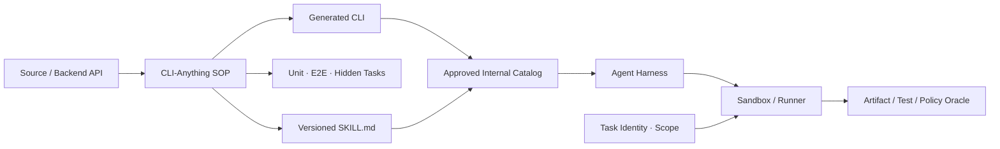

# CLI-Anything 企业试点 Playbook

## 一、选题评分

优先选择：有源码/稳定后端、每月高频人工操作、当前 GUI/脚本脆弱、结果可用测试或产物验证、风险可限制在只读/非生产、且有明确 Owner 的工具。

暂缓：闭源黑盒、生产高权限、无法回滚、强主观视觉、源码不能进入批准的模型环境、接口需求仍频繁变化的工具。

## 二、试点阶段

| 周期 | 目标 | 放行出口 |
|---|---|---|
| 第 1—2 周 | 建任务集、风险模型、Baseline | 只读源代码分析 |
| 第 3—4 周 | 生成、Owner Review、refine | 本地沙箱 |
| 第 5—6 周 | 单元/E2E/隐藏任务、供应链扫描 | CI 非生产 Runner |
| 第 7—8 周 | Agent+Skill 对照测试 | Observe/Propose Toolset |
| 第 9—12 周 | 小范围真实任务、成本和维护评估 | Draft PR 或测试环境 L2/L3 |

## 三、生成物 Gate

- 命令域按 Observe、Propose、Verify、Change 分离；
- 所有目标 Scope 显式，默认不读取个人全局配置；
- JSON Schema、退出码、错误、超时、取消和状态版本固定；
- 写动作有 dry-run、幂等、并发保护和真实产物校验；
- Skill 与 CLI 同版本，命令变更触发 Skill 回归；
- 生成代码和依赖有扫描、SBOM、签名、Owner 和撤回；
- CLI-Hub/内部 Registry 的“可发现”与“获准生产使用”分离。

## 四、架构建议

需要多个 Agent 客户端共享时，可在通过验收的 CLI 前增加 MCP Adapter；不要先包装再验证底层语义。

## 五、停止条件

若两轮 refine 后关键任务仍依赖大量人工修补、后端无法稳定验证、维护成本超过人工包装、或必须暴露不成比例的源码/权限，应停止自动生成路线，改用人工 API/CLI 设计或保留人工流程。
