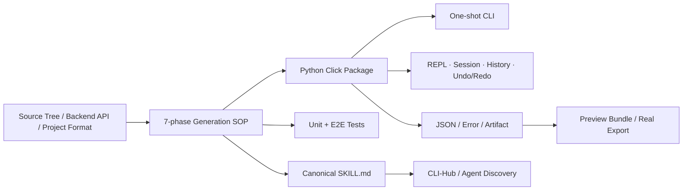

# CLI-Anything 能力、适用场景与企业实践

## 执行摘要

CLI-Anything 试图解决一个被主流 Agent 平台忽略的长尾问题：许多专业桌面、创意、科学和企业内部软件拥有真实能力，却只有 GUI、历史脚本或难以被 Agent 稳定调用的内部后端。项目让宿主 Coding Agent 按固定 SOP 分析源码和后端，生成结构化 CLI、测试、`SKILL.md`，再通过 CLI-Hub 发现和分发。它不是接收源码后按固定算法输出 CLI 的确定性编译器，结果仍取决于宿主模型、代码理解、Prompt 和 refine 迭代。

它的合理定位是 Interface Factory，而不是 Agent、MCP Server 或 CI/CD 平台。CLI-Anything 可以为长尾软件建立确定性动作面，Skill 说明如何调用，MCP 可在需要多客户端互操作时包装该 CLI，Sandbox/任务身份/Policy/Approval/Oracle 则必须由企业平台提供。

项目已证明方法可运行并覆盖较多软件类别，但证据主要来自仓库、论文、Demo、Catalog 和项目自报遥测。论文没有给出足以证明企业 CI/CD 生产成功率的受控长期评测。因此当前适合度是“方法与原型较强、企业生产证据中等偏弱”：建议从只读诊断、测试/构建辅助、制品查询、非生产和 Draft PR 开始，不应直接把生成接口用于关键发布、签名或生产恢复。

## 一、项目定位与版本

| 项目 | 判断 |
|---|---|
| 组织 / 项目 | HKUDS / [CLI-Anything](https://github.com/HKUDS/CLI-Anything) |
| 当前版本 | 项目 [v0.4.0](https://github.com/HKUDS/CLI-Anything/releases/tag/v0.4.0)，2026-06-25；CLI-Hub 0.4.1，2026-07-09 |
| 论文 | [CLI-Anything: Towards Agent-Native Computer Use](https://arxiv.org/html/2606.03854) |
| License | 仓库根为 Apache-2.0；CLI-Hub 元数据为 MIT；各 Harness 与上游依赖需逐项审计 |
| 核心输出 | Python CLI/REPL、Tests、`SKILL.md`、CLI-Hub package metadata、可选 Preview |
| 最佳输入 | 可访问源码、稳定后端/API、项目格式和真实导出/渲染能力 |
| 非核心能力 | 企业身份、集中 Policy、Sandbox、发布批准、业务 Oracle |

Star/Fork 与仓库测试数变化快，本专题不使用精确 Star 快照推导成熟度。项目热度能证明社区关注，不能证明企业支持、安全或 CI/CD 自治能力。

## 二、七阶段 Harness Generation SOP

[官方 HARNESS](https://raw.githubusercontent.com/HKUDS/CLI-Anything/main/cli-anything-plugin/HARNESS.md) 是供宿主 Coding Agent 执行的方法规范，将生成过程分成七阶段：

1. **Analyze：** 理解源码结构、后端 API、项目格式和可执行入口；
2. **Design：** 定义命令组、参数、输出、状态和错误；
3. **Implement：** 用 Python Click 实现 CLI，按需提供 REPL、JSON、session、history、undo/redo；
4. **Plan Tests：** 将能力和边界转成测试计划；
5. **Test：** 编写单元和端到端测试，验证真实后端与制品；
6. **Document：** 记录命令、实现、结果和限制；
7. **Publish/Install：** 使 CLI 可执行、可发现、可被 Agent 加载。

项目还提供 `refine` 做 gap analysis 和增量扩展，`test`、`validate`、`list` 管理生成结果。重要之处不是模型能一次写出很多代码，而是把分析、状态设计、真实后端、测试和分发放入同一生产流程。

## 三、生成物架构



### 双模式 CLI 与状态

一次性命令适合 CI 和脚本；REPL、session、status、history 与 undo/redo 适合复杂、多步、需要持续上下文的软件。显式状态可以减少 Agent 在多个命令之间丢失项目上下文。

### Backend Execution Wrapper

论文强调调用真实应用后端、项目文件、渲染或导出，而不是只模拟界面。真实后端是“结果可信”的必要基础：进程退出 0 仍可能生成空白、损坏或语义错误的制品，所以 E2E 必须检查最终产物。

### Preview Protocol

论文描述的 Preview Bundle 可包含 `manifest.json`、`summary.json` 和 artifacts；Live 模式还可包含 session/trajectory。它试图让 Agent 不依赖完整 GUI 也能检查状态和产物。Preview 是很有价值的方向，但论文也承认覆盖尚不完整，且主观美学和交互质量仍需人类判断。

### Skill 与 CLI-Hub

每个 Harness 有规范化 `SKILL.md`，CLI-Hub 提供 list/search/info/install/update/uninstall/launch，Meta-skill 帮助 Agent 发现能力。v0.3.0 启动 CLI-Hub；[v0.4.0](https://github.com/HKUDS/CLI-Anything/releases/tag/v0.4.0) 增加 CLI-Matrix、30 个新 CLI、17 项修复和 4 类安全加固；CLI-Hub 0.4.1 随后独立发布。

CLI-Matrix 将任务拆成 capability 并关联 harness CLI、公共 CLI、Python package、native binary、cloud API 或 Agent Skill，支持 list/search/can、preflight、doctor、dry-run 和批量安装。它不会执行 DAG、调度工作流、验证凭据有效或运行真实后端 E2E，因此应被定位为能力策展与安装层，而不是 CI/CD Workflow Engine。

项目列出 Claude Code、Pi、OpenCode、Codex、OpenClaw、GitHub Copilot CLI 等目标，其中部分明确为 Experimental 或 Community。应分别验收，不能把“列入适配列表”理解为正式支持和同等成熟。

## 四、项目证据与成熟度

2026-07-09 主分支快照登记 79 个生成/整理的 Harness CLI、22 个公共第三方 CLI 和 5 个 CLI Matrix。论文更早快照报告 65 个 Harness、18 个公共 CLI、合计 83 个条目/32 类、61 个 companion skills、5 个 Preview integrations，并引用 CLI-Hub 项目遥测中的 Agent 使用占比和 Agent/人调用比。二者是不同时间点，不能混成同一组数据。

这些数据适合支撑三项判断：项目确实形成 Catalog、方法能跨类别扩展、Agent 能发现并调用。它们不能支撑：生成 CLI 在隐藏任务上正确、企业使用规模、生产安全、CI/CD 成功率或相比人工封装更便宜。调用多也可能是重试多，并不等于结果好。

CLI-Hub 的“Agent 调用”识别依赖环境变量、父进程和 TTY；非 TTY 脚本/CI 也可能被归入 Agent。Analytics 默认启用，并可能上报截断后的 Matrix 查询，虽然可用 `CLI_HUB_NO_ANALYTICS=1` 关闭。因此论文中的 Agent Share 更准确地表示“被系统识别为 Agent/脚本的调用份额”，不等于真实 AI Agent 用户或成功任务。

仓库当前还自报多个 Demo 和大量 passing tests。测试存在是积极信号，但主分支 README 的聚合总数、分项加总和逐 Harness 表并不一致；仓库也没有对所有 Harness 执行 unit + real-backend E2E 的统一 CI。贡献流程很大程度依赖 PR checklist 与贡献者粘贴的 pytest 结果。因此不能把“100% pass”外推为全 Harness、全平台和真实后端的可复现结论。

| 维度 | 评价 | 理由 |
|---|---|---|
| 方法完整性 | 中高 | 有固定 SOP、状态、测试、Skill、分发和 refine |
| 软件覆盖 | 中高 | Catalog 跨多类别，但质量不均 |
| Agent 适配 | 中 | 多目标，部分 Experimental/Community |
| 结果验证 | 中低 | 真实后端/E2E/Preview 思路好，但没有覆盖全部 Harness 的统一真实后端 CI，汇总数不一致 |
| 企业 CI/CD 证据 | 低 | 缺少公开长期企业场景和对照评测 |
| 安全治理 | 低中 | 有 SECURITY 威胁模型和持续修复，但公共 Hub 供应链及企业控制面不足 |
| 综合成熟度 | 中 | 适合原型和受控试点，不宜整体授予生产自治 |

## 五、适用场景

### 高适合

- 开源或企业可访问源码，存在稳定后端/API/项目文件；
- 软件能力复杂、人工 CLI 封装成本高，但结果可以用状态或制品验证；
- 专业桌面、创意、科学、测试、仿真、构建和内部平台工具；
- 需要同时支持人、脚本和 Agent 的 one-shot CLI + REPL；
- 有 Owner 愿意维护接口、任务集和版本。

### 中等适合

- 后端仅部分可访问，需要少量人工 Adapter；
- 需要视觉 Preview，但最终结果有可解析产物；
- 使用频率尚未证明，先做成本对照；
- 计划用 MCP 包装，但底层 CLI 仍需先独立验收。

### 低适合或不适合

- 闭源黑盒、移动端或只有屏幕坐标可操作；
- 任务关键质量是主观视觉/交互感受且没有可验证代理指标；
- 需要高频实时控制、强事务或低延迟流式交互；
- 生产发布、删除、签名、密钥轮换等不可逆高风险动作；
- 源码或数据不能进入获批的 frontier-class 模型环境；
- 希望一次生成后无人维护。

## 六、CLI-Anything 对 CI/CD 的价值

### 1. 治理接口债务

企业交付链中常有“主流平台之外”的工具：内部构建器、许可证工具、专业测试软件、制品处理器、桌面诊断器和历史运维应用。它们不是能力缺失，而是缺少 Agent-ready Interface。CLI-Anything 可以把接口建设从临时脚本提升为带测试和 Skill 的可审查资产。

### 2. 让接口进入 CI

生成代码、依赖、Schema、Skill 和 E2E 测试都可版本化；当应用后端变化时，回归测试能发现接口漂移。相比屏幕自动化，这更容易重放、定位和撤回。

### 3. 建立内部 Tool Catalog

借鉴 CLI-Hub 但增加企业治理：Owner、版本、来源、风险、Toolset、支持环境、任务身份、签名/SBOM、评测、撤回。必须把“Agent 能发现”与“Agent 获准在生产使用”分开。

### 4. 形成组合栈

```text
Source / Backend
  → CLI-Anything 生成并测试 CLI
  → Skill 说明组织使用方式
  → 可选 MCP Adapter 服务多个 Agent 客户端
  → Sandbox / Runner 以任务身份执行
  → Test / Policy / Signature / SLO 验证
  → PR / Plan / Approved Action
```

这个组合说明 CLI-Anything 既不替代 MCP，也不替代 Harness 或控制面。

## 七、四个实践案例

### 内部构建诊断器：L2

只开放配置、依赖图、失败解释和证据导出。Agent 调用后生成诊断与 Draft PR，由原构建/测试 Gate 复验。优先指标：失败归因、首次修复、人工修改、Runner 成本。

### 制品元数据工具：Observe → 受控写

先查询版本、SBOM、签名和依赖；写域仅上传测试仓候选制品，并绑定哈希、幂等键和环境。生产签名、删除和晋级继续由外部平台控制。

### 发布后只读调查：L1—L2

为传统运维工具生成状态查询、历史导出和诊断包，不开放恢复。Agent 在事故回放中收集证据并生成时间线，达到质量阈值后再考虑少量 Runbook-bound 动作。

### 专业测试软件进入 Pipeline：沙箱 L3

生成项目创建、参数配置、运行和结果导出命令，以真实报告/产物作为 Oracle。CI Runner 固定版本、许可证和网络，失败时保留项目与日志供人工接管。

## 八、风险与控制

公共安装链是当前最具体的生产阻断项。在项目核验快照中，79 个 Harness Registry 条目有 66 个从未固定 Commit 的默认分支安装，0 个固定到 40 位 Commit；[安装器](https://github.com/HKUDS/CLI-Anything/blob/main/cli-hub/cli_hub/installer.py)还会对部分 Registry 命令使用 Shell，公共目录中存在 `curl | bash` 类型入口。CLI-Hub 0.4.1 本身的 PyPI Attestation 只能证明 Hub 包来源，不能为它随后安装的每个 Harness 提供同等 Provenance。

| 风险 | 表现 | 最低控制 |
|---|---|---|
| 生成语义错误 | 命令可运行但状态或产物错误 | Owner Review、固定/隐藏任务、真实 E2E |
| 覆盖不完整 | 漏掉边界、异常、导出或状态 | refine、Gap Matrix、版本化验收 |
| 高风险动作过度暴露 | 删除、发布、签名进入默认命令 | 默认只读、Toolset 分离、批准和 Scope |
| Skill 漂移 | Agent 按旧说明调用新语义 | CLI/Skill 同版本、变更联动回归 |
| 供应链投毒 | 生成代码、依赖、Hub 包或 Skill 被替换 | 来源、锁定、扫描、SBOM、签名、撤回 |
| 自主安装 | 公共 Registry 可变；大量 Harness 追踪默认分支；安装器可执行 Registry 提供的 Shell 命令 | 内部 Catalog、固定 Commit/Wheel Hash、禁止任意 Shell、Sandbox、人工批准 |
| 源码边界 | 敏感源码进入外部模型 | 获批模型/私有执行、数据分类和审计 |
| 虚假成功 | 退出 0、Preview 好看但产物无效 | 外部 Oracle、Artifact Hash、后端状态复核 |

## 九、90 天试点建议

1. 选一个月度高频、可离线、可验证、无生产凭据的内部工具；
2. 建 20 个固定任务、10 个隐藏任务、人工 Baseline 和风险模型；
3. 生成后由工具 Owner 评审，再运行 refine，不直接安装到所有 Agent；
4. 对生成代码、依赖、Skill、Preview 和 Hub 元数据做供应链检查；公共 Hub 仅用于发现，试点使用内部镜像与不可变制品；
5. 在 Sandbox 比较人工封装、GUI 自动化和 CLI-Anything 的任务成功、工时、维护和成本；
6. 先放行 Observe/Propose，输出限制为证据或 Draft PR；
7. 只有所有写任务目标正确、幂等、可验证且无越权，才允许测试环境逐次批准执行；
8. 以季度维护成本和后端漂移决定扩展或停止。

## 十、最终判断

CLI-Anything 是值得持续跟踪和受控试点的接口工程项目。它最有价值的地方是把“让 Agent 操作软件”从脆弱 GUI 模拟转成真实后端、结构化 CLI、测试、Skill 和可分发资产；最需要警惕的是把生成速度、Catalog 数量和开源热度误认为生产正确性。

对 Agentic CI/CD 的建议是：把它用于补齐内部长尾接口，并把生成物当作新供应链软件逐项验收；不要用于绕过已有发布、制品、安全和生产控制面。
