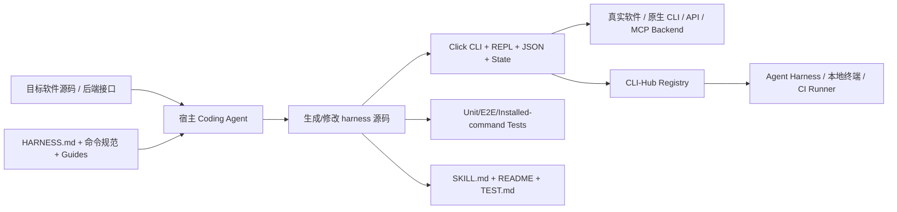

# CLI-Anything 深研证据

> [!summary] 结论先行
> CLI-Anything 是一个由宿主 Coding Agent 执行的“接口生成方法 + 参考实现 + 分发目录”，不是确定性代码生成器、通用 Agent Harness、CI/CD 平台或企业工具控制面。它最有价值的贡献是把源码、原生项目格式、现有后端 CLI/API/MCP 和真实渲染器组织成一套 Agent 友好的 CLI 合约：Click 子命令、REPL、JSON、显式状态、undo/redo、真实后端 E2E、`SKILL.md` 与可安装目录。它适合把有源码或稳定后端、任务可程序化验证的长尾软件转成可在终端和 Runner 中调用的能力面。
>
> 项目截至 2026-07-15 的生态扩张很快：项目 Release 最新为 `v0.4.0`，CLI-Hub 的 PyPI 包已到 `0.4.1`；当前主分支登记 79 个生成/整理的 harness CLI、22 个公共第三方 CLI 和 5 个 CLI Matrix。但这些是“接口广度、活跃度和包装能力”信号，不是企业生产可靠性证明。统一 harness CI、独立任务成功率 Benchmark、版本锁定、签名/SBOM、集中身份授权、沙箱、审计与生产审批仍是明显缺口。

## 1. 研究口径、快照与排重

本页在 [[00_sources/agentic-cicd-source-landscape#S81. CLI-Anything Agent-native interface generator|S81]]、[[00_sources/briefs/2026-cli-anything|既有 Brief]] 和 [[05_case_library/2026-cli-anything-interface-factory|案例页]] 的基础上继续下钻，不重复把 README 宣传语当结论。核验优先级如下：

1. [官方仓库](https://github.com/HKUDS/CLI-Anything)及 2026-07-09 主分支快照 [`bc536c9`](https://github.com/HKUDS/CLI-Anything/commit/bc536c9bebb7c3d9f7bb2736a732609139c1acdb)；
2. [HARNESS.md 方法规范](https://github.com/HKUDS/CLI-Anything/blob/main/cli-anything-plugin/HARNESS.md)、命令定义、CLI-Hub 源码、注册表、GitHub Actions；
3. [v0.4.0 Release](https://github.com/HKUDS/CLI-Anything/releases/tag/v0.4.0)与 [PyPI `cli-anything-hub` 0.4.1](https://pypi.org/project/cli-anything-hub/0.4.1/)；
4. 原始论文/技术报告 [CLI-Anything: Towards Agent-Native Computer Use](https://arxiv.org/abs/2606.03854)。

证据标签：

- **[源码可核验]**：可以从代码、注册表、工作流或包元数据直接确认；
- **[项目自述]**：来自 README、Release 或作者论文，未被独立复现；
- **[分析判断]**：基于上述一手证据推导，不能冒充项目承诺；
- **[独立包装信号]**：例如 PyPI 的发布来源与 Attestation，可证明制品来源，不能证明业务效果。

> [!warning] 版本纠正
> 既有 S81/Brief 曾把 `v0.3.0` 记为 Latest。官方 Releases 当前已显示 [2026-06-25 发布的 `v0.4.0`](https://github.com/HKUDS/CLI-Anything/releases/tag/v0.4.0) 为 Latest；同时 CLI-Hub 包在 2026-07-09 独立发布了 [`0.4.1`](https://pypi.org/project/cli-anything-hub/0.4.1/)。项目 Release 与包版本是两个不同层次，不能混写。

## 2. 它到底是什么，不是什么

### 2.1 产品边界

**[源码可核验]** `/cli-anything` 本身是 [Markdown 命令规范](https://github.com/HKUDS/CLI-Anything/blob/main/cli-anything-plugin/commands/cli-anything.md)，要求 Claude Code、Codex、Pi、OpenCode 等宿主 Agent 读取 [HARNESS.md](https://github.com/HKUDS/CLI-Anything/blob/main/cli-anything-plugin/HARNESS.md)，再自行分析源码、设计接口、编写 Python/测试/文档并安装。仓库没有一个接收代码后以固定算法输出 CLI 的中央“编译器”或模型服务。

因此更准确的定位是：



它不是：

- 通用 Agent 的规划、记忆和工具循环运行时；这些由 Claude Code、Codex、Pi 等宿主承担；
- MCP Server 生成器或 MCP Gateway；项目甚至允许把已有 MCP Server 包在 CLI 后面；
- 软件本体的替代实现；规范要求最终渲染/导出必须调用真实软件；
- 企业身份、授权、审批、审计、沙箱或发布 Gate；生成 CLI 继承运行环境已有权限；
- 保证“一次生成即可覆盖全部能力”的低代码产品；官方明确承认依赖强模型、源码可见性与多轮 `/refine`。

### 2.2 核心设计主张

**[项目自述]** 作者论文认为 GUI 的像素定位、焦点与时序依赖对 Agent 较脆弱，应把操作边界提升为结构化命令、显式状态、确定性反馈和机器可读协议。[论文摘要](https://arxiv.org/abs/2606.03854)与[方法章节](https://arxiv.org/pdf/2606.03854)均围绕这一主张展开。

**[源码可核验]** 这套主张在 HARNESS 规范中落为：

- 同时提供一次性子命令和默认 REPL；
- 每个命令支持 `--json`；
- 用 JSON session 保存项目、当前选择、历史、undo/redo；
- 先提供 `info/list/status` 等只读探针，再提供 mutation；
- 直接操作原生项目格式，并调用真实 backend/renderer；
- 不能只信退出码，必须验证 magic bytes、ZIP/OOXML、像素、时长、音频 RMS 等产物；
- 视觉/检查类软件可输出 `preview-bundle/v1`、live session 和 trajectory；
- 生成 CLI、测试、README、`TEST.md` 和 `SKILL.md`，再进入注册表与安装路径。

直接证据见 [HARNESS Phase 1—7 与 Principles](https://github.com/HKUDS/CLI-Anything/blob/main/cli-anything-plugin/HARNESS.md)。

## 3. 七阶段生成流程与实际生成物

### 3.1 流程

| 阶段 | 规范动作 | 关键输出 | 需要人工/宿主判断的部分 |
|---|---|---|---|
| 0 | 获取本地源码或 clone GitHub repo | 可分析源码树 | 来源授权、分支/Commit、敏感代码边界 |
| 1 Analyze | 找真实 backend、原生格式、已有 CLI/API、GUI→API 映射、undo 模型 | 架构事实清单 | 大型项目的完整性与错误理解风险 |
| 2 Design | 设计 command groups、state、REPL/one-shot、JSON | 软件专属 SOP 与接口草图 | 命令粒度、危险能力、幂等语义 |
| 3 Implement | 写 data/core/backend adapter、Click CLI、session、REPL、preview | 可运行 harness | 真实后端映射、跨平台与安全校验 |
| 4 Plan tests | 先写 `TEST.md` | 测试清单与真实工作流 | 任务代表性、边界条件与 Oracle |
| 5 Implement tests | unit、原生文件、真实 backend、已安装命令、round-trip、Agent test | `test_core.py`、`test_full_e2e.py` | 环境准备、不可跳过的 backend 验证 |
| 6 Document tests | 运行并把结果追加进 `TEST.md` | 测试记录 | 结果是否新鲜、是否可复现 |
| 6.5 Skill | 从 CLI/README/setup 抽取元数据 | 根目录与包内两份 `SKILL.md` | 生成文档完整性、权限说明是否准确 |
| 7 Package/install | PEP 420 namespace、`setup.py`、console script、本地 `pip install -e .` | `cli-anything-<software>` | 真正发布 PyPI/内部 Registry 仍需单独流程 |

来源：[主命令规范](https://github.com/HKUDS/CLI-Anything/blob/main/cli-anything-plugin/commands/cli-anything.md)与[方法规范](https://github.com/HKUDS/CLI-Anything/blob/main/cli-anything-plugin/HARNESS.md)。

> [!note] “Publish”不等于自动上传 PyPI
> Phase 7 的主命令实际要求创建包、执行本地 editable install 并验证 PATH；真正上传 PyPI 是另一份[发布指南](https://github.com/HKUDS/CLI-Anything/blob/main/cli-anything-plugin/PUBLISHING.md)中的人工流程。报告不应把“创建 `setup.py`”写成“已获得可信发布链”。

### 3.2 生成代码的标准架构

**[源码可核验]** 推荐结构是每个软件一个独立包，通过 PEP 420 共享 `cli_anything` namespace：

```text
<software>/agent-harness/
├── <SOFTWARE>.md
├── setup.py
└── cli_anything/<software>/
    ├── __main__.py
    ├── <software>_cli.py
    ├── core/           # project/session/export/领域逻辑
    ├── utils/          # real backend adapter + ReplSkin
    ├── tests/          # TEST.md + unit + full E2E
    ├── README.md
    └── skills/SKILL.md # 安装包兼容副本
skills/cli-anything-<software>/SKILL.md # 仓库 canonical copy
```

这种拆分的优点是多个 CLI 包可并存、命令可单独版本化，且 backend adapter 与 CLI 合约有明确 seam；缺点是 monorepo 中每个 harness 都有自己的 `setup.py`、依赖、测试风格和维护者，横向一致性很难仅靠文档规范保证。

### 3.3 `SKILL.md` 生成机制

**[源码可核验]** [`skill_generator.py`](https://github.com/HKUDS/CLI-Anything/blob/main/cli-anything-plugin/skill_generator.py)读取 README、`setup.py` 和 `<software>_cli.py`，用正则抽取版本与 Click decorator，再用 Jinja2 模板生成根目录 canonical Skill 和包内兼容副本。它不会执行 CLI 源码，这是较安全的选择；但正则抽取不是完整 Python/Click 语义解析，动态注册、复杂 decorator 或跨文件命令树可能遗漏。因此 `SKILL.md` 是可审查的生成文档，不应成为权限面的唯一事实源。

## 4. 真实后端模式、Preview 与 MCP 关系

### 4.1 真实软件优先

**[源码可核验]** HARNESS 的首要规则是“不重写真实软件”：生成有效 ODF/MLT/SVG/bpy 等中间状态，再调用 LibreOffice、Blender、GIMP、melt/ffmpeg、Inkscape、SoX 等真实 backend，最后检查用户实际会打开的产物。[架构规则与软件映射表](https://github.com/HKUDS/CLI-Anything/blob/main/cli-anything-plugin/HARNESS.md#use-the-real-software--dont-reimplement-it)支持这一结论。

这意味着 CLI-Anything 主要替代的是脆弱的 GUI 操作面，不替代软件内核，也不减少上游软件安装、许可证、版本兼容和资源成本。

### 4.2 Preview 是执行证据，不是第二个 renderer

**[源码可核验]** Preview-capable harness 是 producer：调用真实 backend 创建 immutable bundle；CLI-Hub 的 `previews inspect/html/watch/open` 是只读 consumer。Live preview 分为 mutable `session.json` head、immutable bundles 和 append-only `trajectory.json`。规范强调不把 GUI 截图或玩具 renderer 当作真相。[Preview 规范](https://github.com/HKUDS/CLI-Anything/blob/main/cli-anything-plugin/HARNESS.md#preview--live-preview-norms)和 [CLI-Hub README](https://github.com/HKUDS/CLI-Anything/blob/main/cli-hub/README.md#preview-viewer)可直接核验。

对 Agentic CI/CD 的价值是把“命令执行过”提升为“命令—状态—产物可关联”；但它仍不是通用业务 Oracle，语义正确性需要领域断言、Golden artifact 或外部验收。

### 4.3 CLI 与 MCP 在本项目内是可叠加层

**[源码可核验]** 项目的 [MCP backend guide](https://github.com/HKUDS/CLI-Anything/blob/main/cli-anything-plugin/guides/mcp-backend.md)允许 CLI adapter 通过 MCP SDK/stdio 调用已有 MCP Server，Browser/DOMShell 是参考实现。默认每个 CLI 命令重启 MCP Server，可选 daemon 复用连接。

因此：

- CLI-Anything 不生成 MCP Server；
- 已有 MCP 能作为 CLI 的 backend；
- CLI 在外层统一 one-shot/REPL/JSON/session/install 体验；
- 若多个远程 Agent 需要标准发现、会话协商和集中授权，仍可在 CLI 外增加 MCP Server/Gateway；
- “CLI 替代 MCP”不是该项目源码支持的结论。

## 5. CLI-Hub：发现、安装与预览消费层

### 5.1 能力

**[源码可核验]** CLI-Hub 是 Python 3.10+ 包，主要依赖 Click 与 Requests；源码版本为 `0.4.1`。它提供：

- `list/search/info`：跨 harness registry 与 public registry 发现；
- `install/update/uninstall/launch`：按 pip、npm、uv、bundled 或 command 策略分发；
- `--json`：列表/搜索等机器输出；
- `previews inspect/html/watch/open`：读取已有 preview bundle/live session；
- `matrix ...` 和 `can`：CLI Matrix 发现、预检与批量安装。

来源：[CLI-Hub 源码](https://github.com/HKUDS/CLI-Anything/tree/main/cli-hub)、[`setup.py`](https://github.com/HKUDS/CLI-Anything/blob/main/cli-hub/setup.py)及 [CLI command tree](https://github.com/HKUDS/CLI-Anything/blob/main/cli-hub/cli_hub/cli.py)。

### 5.2 当前目录快照

在主分支 `bc536c9` 快照中直接读取注册表得到：

| 目录面 | 当前数 | 证据 |
|---|---:|---|
| 生成/整理 harness CLI | 79 | [`registry.json`](https://github.com/HKUDS/CLI-Anything/blob/bc536c9bebb7c3d9f7bb2736a732609139c1acdb/registry.json) |
| 公共第三方 CLI | 22 | [`public_registry.json`](https://github.com/HKUDS/CLI-Anything/blob/bc536c9bebb7c3d9f7bb2736a732609139c1acdb/public_registry.json) |
| CLI Matrix | 5 | [`matrix_registry.json`](https://github.com/HKUDS/CLI-Anything/blob/bc536c9bebb7c3d9f7bb2736a732609139c1acdb/matrix_registry.json) |
| 仓库内 `agent-harness` 目录 | 69 | [主分支目录树](https://github.com/HKUDS/CLI-Anything/tree/bc536c9bebb7c3d9f7bb2736a732609139c1acdb) |
| 根 `skills/` 子目录 | 70（含 CLI-Hub meta-skill） | [`skills/`](https://github.com/HKUDS/CLI-Anything/tree/bc536c9bebb7c3d9f7bb2736a732609139c1acdb/skills) |

79 与 69 不矛盾：registry 还收录独立外部仓库或单独 PyPI 包。所有数字只是覆盖面快照，不能外推任务成功率。

### 5.3 安装与运行示例

```bash
# 只安装 Hub
python -m pip install cli-anything-hub==0.4.1

# 发现并检查
cli-hub search blender --json
cli-hub info blender

# 安装后端 harness；生产环境不建议直接使用未固定 main 的默认安装命令
cli-hub install blender
cli-anything-blender --help

# 生成新 harness：由宿主 Agent 执行项目 Skill/Plugin
/cli-anything /path/to/target-source
```

**[分析判断]** 企业用法应把默认 `cli-hub install` 替换为内部 fork、固定 Commit/Tag/Wheel hash 和受控 Registry；公共 Hub 更适合发现与实验，不适合直接成为生产 Runner 的信任根。

## 6. CLI-Matrix：能力目录，不是工作流引擎

### 6.1 已有能力

`v0.4.0` 引入 `cli-hub matrix`。当前有 video creation、knowledge research、3D/CAD、game development、image design 五个矩阵。[Release Highlights](https://github.com/HKUDS/CLI-Anything/releases/tag/v0.4.0)与[矩阵注册表](https://github.com/HKUDS/CLI-Anything/blob/main/matrix_registry.json)直接支持这一点。

每个矩阵将任务拆成 `capability`，每个 capability 可列出多类 provider：

- `harness-cli`、`public-cli`；
- Python package、native binary；
- cloud API 与所需环境变量；
- `agent-skill`、agent-native planning、web search；
- recipe、cost/quality/offline 标签、known gaps。

主要命令：

| 命令 | 实际作用 | 不做什么 |
|---|---|---|
| `cli-hub can <task>` | 关键词匹配 capability/provider | 不做语义规划或可靠性排名 |
| `matrix list/search/info/recipes` | 浏览元数据 | 不验证 provider 行为 |
| `matrix preflight` | 检查 env 是否存在、binary 是否在 PATH、Python package 是否可发现 | 不验证凭据有效、版本兼容、API 权限和业务功能 |
| `matrix install` | 安装映射进 `clis[]` 的 harness/public CLI，可按 capability/recipe/only 限定，支持 dry-run/resume | 不安装所有 Python/native/API/skill provider，也不执行 workflow |
| `matrix doctor` | 检查 CLI-Hub 记录与 entry point 是否存在 | 不运行真实后端 E2E |
| `--skill-only` | 在本地渲染矩阵 Skill/参考文件 | 不授予生产权限 |

来源：[矩阵实现](https://github.com/HKUDS/CLI-Anything/blob/main/cli-hub/cli_hub/matrix.py)、[安装实现](https://github.com/HKUDS/CLI-Anything/blob/main/cli-hub/cli_hub/installer.py)与 [3D/CAD Matrix Skill](https://github.com/HKUDS/CLI-Anything/blob/main/cli-hub-matrix/3d-cad/SKILL.md)。

### 6.2 正确解读

**[分析判断]** CLI-Matrix 是“能力—候选 provider—安装提示—Skill 指导”的策展层，接近 Agent Tool Catalog/Playbook，而不是 DAG、Pipeline Runner、MCP Gateway 或 optimizer。它的价值是让 Agent 先按意图找能力，再选择具体 CLI；它的风险是把大量第三方可执行依赖和云凭据聚合到一次任务中。

项目 meta-skill 已要求“先 preflight、按 capability/recipe 缩小安装、先 dry-run、不要为单一能力装完整 14-CLI Matrix”，这是合理的最低防线。[CLI-Hub Meta-Skill](https://github.com/HKUDS/CLI-Anything/blob/main/cli-hub-meta-skill/SKILL.md)可核验。

## 7. 宿主 Agent / Harness 集成

### 7.1 生成器入口与成熟度标识

| 宿主 | 接入形态 | 官方 README 状态 | 关键事实 |
|---|---|---|---|
| Claude Code | GitHub marketplace plugin | 主路径 | Slash commands + canonical HARNESS；不是独立模型服务 |
| Pi Coding Agent | `.pi-extension` installer | 可用 | 安装时复制 methodology、commands、guides、templates |
| OpenCode | 复制 Markdown commands | Experimental | 依赖命令目录约定与同目录 HARNESS |
| Goose | 通过 CLI provider 复用命令 | Experimental / Community | 不是原生 adapter，能力取决于 provider |
| Qodercli | setup script 注册 plugin | Community | 复用同一方法 |
| OpenClaw | `SKILL.md` | Community | 用自然语言触发 build |
| Codex | 自包含 Skill + installer | Experimental / Community | vendored HARNESS/guides/scripts；生成包格式不变 |
| Hermes | Skill adapter | Experimental / Community | 映射 Hermes terminal/file/delegate tools |
| Reasonix | Skill adapter | Experimental / Community | 映射 bash/file/optional codegraph tools |
| GitHub Copilot CLI | 本地 plugin install | Community | 复用 slash commands |
| Cursor / Windsurf | 规划 | Coming soon | 不应写成当前支持 |

证据集中在[官方 README 的平台安装章节](https://github.com/HKUDS/CLI-Anything#pick-your-agent-platform)，Codex 的自包含结构可进一步从 [`codex-skill/SKILL.md`](https://github.com/HKUDS/CLI-Anything/blob/main/codex-skill/SKILL.md)核验。

### 7.2 可迁移性真正来自哪里

生成过程依赖宿主 Agent，但生成后的 `cli-anything-<software>` 是普通本地 CLI，所以 Claude Code、Codex、OpenCode、CI Runner 甚至人类脚本都能调用。跨 Harness 可迁移性来自：

1. OS process/stdio 这一稳定最低公分母；
2. 相同命令命名、JSON 与退出状态约定；
3. 同版本 `SKILL.md` 帮 Agent 发现与学习；
4. CLI-Hub/Matrix 负责目录与安装。

它不来自一个统一远程协议、集中会话或组织级授权层。

## 8. 版本、Release 与许可证

### 8.1 发布状态

| 层 | 当前版本/日期 | 可核验证据 | 判断 |
|---|---|---|---|
| 项目 Release | `v0.4.0`, 2026-06-25 | [GitHub Release](https://github.com/HKUDS/CLI-Anything/releases/tag/v0.4.0) | 引入 CLI-Matrix；仍为 0.x |
| CLI-Hub PyPI | `0.4.1`, 2026-07-09 | [PyPI release](https://pypi.org/project/cli-anything-hub/0.4.1/) | 包元数据标为 Beta |
| 主分支快照 | `bc536c9`, 2026-07-09 | [Commit](https://github.com/HKUDS/CLI-Anything/commit/bc536c9bebb7c3d9f7bb2736a732609139c1acdb) | Release 后仍有修复 |

**[独立包装信号]** PyPI 显示 0.4.1 通过 GitHub Actions Trusted Publishing 上传，并附带指向 `HKUDS/CLI-Anything@b04a4e...` 的 Attestation、SHA256 和 Sigstore transparency entry。它能证明 CLI-Hub wheel/sdist 的发布来源，不能证明 Hub 从注册表安装的每个 harness 都有同等 provenance。

### 8.2 许可证不是单一答案

- 仓库根 [LICENSE](https://github.com/HKUDS/CLI-Anything/blob/main/LICENSE)与 README 声明 Apache-2.0；
- CLI-Hub 的 [`setup.py`](https://github.com/HKUDS/CLI-Anything/blob/main/cli-hub/setup.py)和 PyPI 元数据声明 MIT；
- 不同 harness 包元数据还出现 MIT、Apache-2.0、GPLv3 等差异，并依赖各自上游软件、CLI/API/MCP 与媒体格式库。

**[分析判断]** “CLI-Anything 使用 Apache-2.0”只适用于仓库整体的顶层声明，不能替代逐组件、逐上游和逐生成物的许可证审计。生成内部工具时还需确认源码许可证是否允许派生包装与再分发。

## 9. 测试、论文评估与证据边界

### 9.1 方法规范强，但仓库自动化覆盖不等于规范

**[项目自述/规范]** HARNESS 要求：unit、原生文件 E2E、真实软件 backend E2E、已安装命令 subprocess、round-trip 和 Agent task；真实软件缺失时原则上应 fail 而非 skip；最终产物要程序化验证。[测试章节](https://github.com/HKUDS/CLI-Anything/blob/main/cli-anything-plugin/HARNESS.md#phase-5-test-implementation)是很有价值的工程检查表。

**[源码可核验]** 当前仓库的 GitHub Actions 只有 root skill mirror、Codex installer、PR labeler、Pages 部署和 CLI-Hub 发布等工作流，没有一个对全部 harness 执行 unit + real-backend E2E 的统一 matrix。[`.github/workflows`](https://github.com/HKUDS/CLI-Anything/tree/main/.github/workflows)可直接核验。贡献流程主要依赖 PR checklist 和贡献者粘贴 pytest 输出。[PR Template](https://github.com/HKUDS/CLI-Anything/blob/main/.github/PULL_REQUEST_TEMPLATE.md)明确体现这一做法。

**[源码可核验]** 当前 README 的 aggregate test claim 内部不一致：它写“2,461 tests = 1,732 unit + 579 E2E + 19 Node”，后三项相加为 2,330；下面逐 harness 表中的 30 个 passed 数相加又是 2,619，而且 Wavetone、Eth2、Unreal Insights 明示有 backend-gated E2E skipped。[README Test Results](https://github.com/HKUDS/CLI-Anything/blob/main/README.md#-test-results)是原始证据。因此不能把“100% pass rate”视为当前主分支全部 harness、全部真实 backend、全部平台的可复现结论。

### 9.2 论文到底评估了什么

作者技术报告的 Evaluation 主要评估“接口系统覆盖面与生态信号”，包括：

- 三个 recorded manipulation demo 的中间帧：Slay the Spire II、Blender、FreeCAD；
- 论文快照的 65 个 harness/curated CLI、18 个 public CLI、83 combined、32 categories；
- 61 个 companion skills、5 个 preview integrations；
- CLI-Hub 自采 telemetry：129,916 calls、87.8% agent share、7.19× agent/human、+694.1% observed growth。

来源：[论文 Evaluation](https://arxiv.org/pdf/2606.03854)。

它没有给出：

- 统一任务集上的 Agent task completion rate；
- CLI vs GUI/MCP 的受控对照实验；
- 不同模型的一次生成成功率、人工修正量、成本和耗时；
- 企业 CI/CD 中的变更失败率、误操作率、MTTR 或长期维护成本；
- 独立第三方复现或安全审计。

论文自己把“benchmarkable artifact construction”列为下一步，README Roadmap 也保留 task-completion Benchmark 待办。因此论文证明的是方法存在、覆盖面扩大和项目自采使用信号，不是通用效果定论。

### 9.3 Telemetry 指标需要降权

**[源码可核验]** CLI-Hub 的 [`analytics.py`](https://github.com/HKUDS/CLI-Anything/blob/main/cli-hub/cli_hub/analytics.py)通过环境变量、Linux 父进程命令和 TTY 推断 Agent；只要 stdin 不是 TTY，就被归为 `agent/scripted_client`。因此普通脚本、CI job 和重定向调用也可能进入 Agent 份额。它还默认启用 PostHog、为安装生成持久匿名 UUID，并在 Matrix search/can 等事件中上报截断后的 query；用户可用 `CLI_HUB_NO_ANALYTICS=1` opt out。[CLI-Hub Analytics 文档](https://github.com/HKUDS/CLI-Anything/blob/main/cli-hub/README.md#analytics)确认默认上报。

**[分析判断]** 87.8% 更准确地描述“非交互/被识别为 Agent 的 CLI-Hub 调用份额”，不能直接等同真实 AI Agent 用户、成功任务或生产采用率。企业还应评估 query 是否可能包含敏感任务信息，并默认关闭或代理 telemetry。

## 10. 安全、权限与供应链风险

### 10.1 项目已经认识到的风险

**[源码可核验]** 官方 [SECURITY.md](https://github.com/HKUDS/CLI-Anything/blob/main/SECURITY.md)明确把“Agent 根据不可信 prompt/文件/其他 Agent 输出自主构造命令”纳入威胁模型，并要求：

- subprocess 使用参数数组，避免 `shell=True`；
- 对 codec、filter、path 等做 allowlist/escaping；
- Script-Fu/XML/SVG/HTML 等嵌入点转义；
- 凭据文件 `0600`，错误/JSON 不泄露 key；
- 敏感写操作考虑 `realpath` 与更严格路径处理。

`v0.4.0` Release 还列出 `defusedxml`、owner-only token/config、限制 token-file 任意路径等四类安全加固；更早 Release 修复过 GIMP Script-Fu path injection。安全修复速度是正面信号，也说明包装真实软件会持续暴露新的命令注入、解析器和文件权限面。

### 10.2 CLI-Hub 安装链是当前最高风险面

**[源码可核验]** CLI-Hub 每小时从 GitHub Pages 拉取可变 registry，不验证 registry 签名或内容 hash；安装器信任 registry 中的 `install_cmd`。对含 `|`、`&&`、`;`、`$(` 或反引号的命令，[`_run_command`](https://github.com/HKUDS/CLI-Anything/blob/main/cli-hub/cli_hub/installer.py)会主动使用 `shell=True`，public registry 当前存在 `curl ... | bash` 安装项。[registry fetch/cache](https://github.com/HKUDS/CLI-Anything/blob/main/cli-hub/cli_hub/registry.py)和[公共注册表](https://github.com/HKUDS/CLI-Anything/blob/main/public_registry.json)提供直接证据。

在 `bc536c9` 快照中，79 个 harness registry 项里有 66 个通过未固定 tag/commit 的 `pip install git+https://github.com/HKUDS/CLI-Anything.git#subdirectory=...` 从默认分支安装，0 个固定到 40 位 Commit。该路径绕过了“审核某个 immutable wheel/hash”的常规供应链边界。

此外，`sketch` registry 的 `cd ... && npm install && npm link` 与 harness 默认 `pip` strategy 存在实现不一致，显示注册表条目与安装器并非都有端到端验证。[`sketch` registry entry](https://github.com/HKUDS/CLI-Anything/blob/main/registry.json)和[安装策略](https://github.com/HKUDS/CLI-Anything/blob/main/cli-hub/cli_hub/installer.py)可核验。

### 10.3 权限与运行时风险

生成/安装成功只建立了调用面，没有建立权限边界：

- Harness 可能控制文件系统、浏览器、Zoom、n8n、JumpServer、对象存储、邮件营销或 Ethereum 节点；
- CLI 默认继承 Agent 进程的环境变量、登录会话、API key、文件权限与网络；
- `--json`、REPL、undo/redo、dry-run 只改善可操作性，不等于最小权限；
- undo 通常只能撤销本地 session/项目状态，不能保证撤销外部 API 副作用；
- MCP backend、npm/npx、真实软件 plugin 又引入各自的进程与依赖链；
- `abspath` 只做路径正规化，不自动证明写入仍在允许目录内；仍需 containment check、symlink policy 与沙箱。

### 10.4 生成阶段风险

- 宿主模型需要读取目标源码；私有代码可能离开企业边界，取决于 Claude Code/Codex 等宿主配置，而非 CLI-Anything 自身；
- 不可信仓库中的注释、文档和测试数据可能对生成 Agent 形成 prompt injection；当前项目的 SECURITY 重点在“生成后命令参数”，对“源码分析阶段指令污染”没有完整隔离方案；
- Agent 会生成可执行 Python、setup 脚本、Skill 和安装命令，必须把生成 diff 视为第三方代码变更审查；
- 自动生成的 Skill 可能遗漏危险命令或把不安全示例放进 Agent 上下文，应与 CLI contract 同版本审查。

## 11. 适用与不适用场景

### 11.1 高适配场景

| 场景 | 为什么适合 | 建议起步方式 |
|---|---|---|
| 有源码、原生格式和 headless backend 的 GUI 工具 | 可把 GUI action 映射为稳定 API/CLI，并让真实 renderer 提供 Oracle | 先覆盖 inspect/export，再加低风险 mutation |
| 内部构建、测试、制品分析工具 | Runner 已擅长执行 CLI，JSON/exit/artifact 可进入现有 Gate | 只读诊断 CLI + Draft PR/报告输出 |
| Office/media/CAD 等 artifact construction | 输出可用 magic bytes、结构、像素、时长、几何属性验证 | 固定 Golden tasks 与真实 backend container |
| 多个 Agent Harness 需共享本地执行接口 | CLI 是跨客户端最低公分母，Skill 可补充使用方法 | CLI 与 Skill 同版本、内部 Catalog 分发 |
| 评估 GUI 自动化能否降维为语义操作 | 可以快速验证 backend seam、命令树与任务可检验性 | 把生成物当 POC，测人工修正量而非只看 demo |
| 长尾软件的 Tool Catalog 建设 | CLI-Hub/Matrix 提供 registry、capability、prerequisite 的参考模型 | 内部 fork，增加 Owner、风险级别、签名和撤回状态 |

### 11.2 低适配或不应直接使用的场景

- 只有 opaque compiled binary、无 accessibility/backend API、状态只存在 GUI 内；
- 主要价值来自审美、空间感或实时视觉反馈，且无法生成 truthful preview/程序化 Oracle；
- 要求一次生成即完整覆盖大型软件，不能接受高能力模型和多轮修正；
- 需要跨组织远程工具发现、标准会话、集中 OAuth/Policy/Audit，却没有额外 MCP/Gateway/控制面；
- 直接让公共 CLI-Hub 在生产 Runner 中自主安装可变 main/第三方脚本；
- 高风险写操作、生产发布、账户权限、删除、密钥轮换等没有外部审批与 task identity；
- 强监管场景要求完整 SBOM、可复现构建、签名、漏洞 SLA、商业支持和独立验证；
- 目标上游许可证不允许所需的源码处理、派生包装或再分发；
- 极低延迟实时控制；尤其默认每条命令重启 MCP backend 时开销更明显。

## 12. 在 CI/CD 中的推荐实践方案

### 12.1 受控引入流程

```mermaid
flowchart LR
  I["1. 目标能力与风险分级"] --> F["2. 固定源码/模型/方法版本"]
  F --> G["3. 隔离环境生成"]
  G --> R["4. Tool Owner + Security Review"]
  R --> T["5. Contract + Real Backend + Security Tests"]
  T --> P["6. Lock/SBOM/Sign/Provenance"]
  P --> C["7. 内部 CLI/Skill Catalog"]
  C --> E["8. 最小权限 Runner 执行"]
  E --> O["9. 外部 Policy/Approval/Oracle"]
  O --> M["10. Telemetry/Canary/Rollback"]
```



具体要求：

1. **目标分级**：把 command 分成 read、workspace-write、external-write、privileged；第一期只做 read 与可丢弃 workspace。
2. **固定输入**：记录目标源码 commit、CLI-Anything/HARNESS commit、宿主 Agent/模型、prompt 与生成日志；禁止直接追 main。
3. **隔离生成**：私有源码使用企业批准的模型边界；生成环境无生产凭据、限制网络和写目录。
4. **Owner 评审**：由目标软件 Owner 核对 capability map、危险动作、状态语义、幂等、dry-run、退出码、JSON Schema 和错误 redaction。
5. **测试金字塔**：
   - unit 与 property/fuzz；
   - contract tests：JSON Schema、exit code、help、idempotency；
   - real backend E2E：固定真实版本与产物 Oracle；
   - installed-command/container tests：不从源码 import；
   - concurrency/session locking、timeout、crash recovery；
   - path traversal、command/script injection、secret leakage；
   - 代表性 Agent tasks：记录成功率、调用数、人工修正、成本与时间。
6. **制品化**：构建 immutable wheel/container，锁定 transitive dependencies，生成 SBOM，扫描并签名，保存 provenance；Skill/README/Schema 与 CLI 同版本。
7. **内部 Catalog**：登记 Owner、版本、来源 commit、hash、支持 OS/backend、权限级别、数据分类、测试证据、到期/撤回状态；CLI Matrix 只引用已批准制品。
8. **最小权限执行**：临时用户/容器、只挂载任务目录、默认无生产网络、短期 task credential、命令 allowlist、资源与时间限制；关闭或代理公共 telemetry。
9. **外部控制面**：写操作绑定环境、资源、制品 hash 和过期时间；生产部署/制品晋级/删除必须经过既有 Policy、Approval 和可确定验证的 Oracle。
10. **渐进上线**：先 shadow/read-only，再 non-prod mutation，再有限 production；记录 command/event/artifact lineage，保留一键回滚到旧 CLI/Skill。

### 12.2 推荐验收指标

- Capability coverage：目标任务中已审查命令覆盖率，而不是软件菜单覆盖率；
- Contract correctness：合法/非法输入下 JSON、退出码与错误分类准确率；
- Task success：固定 Agent 任务成功率与首次成功率；
- Safety：越权/越目录/危险动作拦截率，secret leakage 为 0；
- Reproducibility：同一输入与版本能否得到等价 artifact；
- Maintenance：上游升级后的修复时长、Skill/CLI drift 次数；
- Efficiency：调用次数、token/时间、Runner 成本和人工修正量；
- Outcome：Draft PR 接受率、诊断准确率、构建恢复时间等具体 CI/CD 指标。

## 13. 成熟度判断与业界趋势信号

### 13.1 成熟度分层

| 维度 | 判断 | 证据 |
|---|---|---|
| 方法完整性 | 中高 | SOP 已覆盖架构、真实 backend、测试、Skill、preview 和安装 |
| 参考实现广度 | 高但异质 | 79 harness registry + 22 public registry；不同维护者/语言/后端 |
| CLI-Hub 包装成熟度 | 早期 Beta | PyPI 0.4.1、Trusted Publishing；0.x、可变 registry 与安装风险 |
| 自动测试可信度 | 中低 | 局部测试多；无全仓 real-backend CI；aggregate 数字不一致 |
| 安全成熟度 | 早期但有意识 | 有 SECURITY/threat model 与多次修复；供应链/权限控制仍缺 |
| 企业 CI/CD 证据 | 低 | 没有独立企业 outcome、长期运行或受控 Benchmark |
| 社区/生态信号 | 快速增长 | 频繁 Release、42 名 v0.4 新贡献者、更多 Agent adapter；不等于 SLA |

综合建议：把 CLI-Anything 评为**值得跟踪和试点的 Agent-native interface factory/reference architecture**，而不是可直接授予生产执行权的成熟平台。单个 harness 必须单独评级，不能继承项目整体声誉。

### 13.2 它反映的业界趋势

1. **从“工具接入”走向“接口生成”**：长尾软件不再等待厂商逐个提供 Agent API，Coding Agent 可以生成适配层；真正瓶颈转向验收、维护和治理。
2. **Agent 接口从命令调用升级为状态/产物合约**：JSON、session、preview、trajectory 和 artifact Oracle 比“能运行命令”更重要。
3. **CLI、Skill、Registry 形成分层**：CLI 负责执行，Skill 负责任务时说明，Hub/Matrix 负责发现与安装；三者生命周期需要绑定。
4. **多 Harness adapter 共享同一方法**：Claude plugin、Codex/Hermes/Reasonix Skill 等说明生态正把方法与宿主解耦；但生成质量仍由宿主 Agent 决定。
5. **MCP 与 CLI 互相包装**：DOMShell 案例表明 MCP 可做 backend，CLI 可做本地统一面；协议选择将更多由部署、授权和互操作需求决定，而非二选一。
6. **Tool Catalog 正转成 capability catalog**：CLI-Matrix 从包名搜索转向意图、provider、cost/offline/credentials；当前仍是静态策展，未来竞争点会是策略、评测与可信供应链。
7. **公共 Agent 可自主安装工具带来新的信任根问题**：安装便利与供应链攻击面同时扩大，企业会需要内部 registry、签名、Policy 与短期身份。

## 14. 最终判断与不可外推结论

### 可以确认

- 项目已形成可操作的七阶段方法、较大的参考 harness 目录、CLI-Hub、Skill 生成、Preview 与 CLI-Matrix；
- 真实 backend、产物验证、JSON、session 与 installed-command testing 是其最有价值的工程原则；
- 生成后 CLI 可被多个 Agent/Harness、本地脚本与 Runner 复用；
- `v0.4.0`/Hub `0.4.1`、PyPI Attestation 与持续安全修复说明项目活跃且包装链在进步。

### 不能确认或不应外推

- 不能确认所有 79 个 registry harness 都满足 HARNESS 的全部 MUST；
- 不能把 README 的测试总数或“100% pass”外推为全平台真实 backend 可靠性；
- 不能把论文 telemetry 的 Agent share 当作真实 Agent 用户或任务成功；
- 不能证明 CLI-Anything 相比 GUI/MCP 在统一任务集上具有确定性胜率；
- 不能证明公共 CLI-Hub 安装链满足企业供应链要求；
- 不能把 CLI 可调用等同于生产授权、审批、审计、回滚和成功 Oracle；
- 不能用 Star/Fork 数量判断成熟度，本页未使用其作为可靠性证据。

## 15. 主要一手证据索引

- [官方仓库 README](https://github.com/HKUDS/CLI-Anything)
- [HARNESS.md](https://github.com/HKUDS/CLI-Anything/blob/main/cli-anything-plugin/HARNESS.md)
- [`/cli-anything` command spec](https://github.com/HKUDS/CLI-Anything/blob/main/cli-anything-plugin/commands/cli-anything.md)
- [`/refine` command spec](https://github.com/HKUDS/CLI-Anything/blob/main/cli-anything-plugin/commands/refine.md)
- [`skill_generator.py`](https://github.com/HKUDS/CLI-Anything/blob/main/cli-anything-plugin/skill_generator.py)
- [MCP backend guide](https://github.com/HKUDS/CLI-Anything/blob/main/cli-anything-plugin/guides/mcp-backend.md)
- [CLI-Hub source](https://github.com/HKUDS/CLI-Anything/tree/main/cli-hub)
- [CLI-Hub installer](https://github.com/HKUDS/CLI-Anything/blob/main/cli-hub/cli_hub/installer.py)
- [CLI-Hub analytics](https://github.com/HKUDS/CLI-Anything/blob/main/cli-hub/cli_hub/analytics.py)
- [Harness registry](https://github.com/HKUDS/CLI-Anything/blob/main/registry.json)
- [Public CLI registry](https://github.com/HKUDS/CLI-Anything/blob/main/public_registry.json)
- [CLI Matrix registry](https://github.com/HKUDS/CLI-Anything/blob/main/matrix_registry.json)
- [CLI-Hub meta-skill](https://github.com/HKUDS/CLI-Anything/blob/main/cli-hub-meta-skill/SKILL.md)
- [GitHub Actions workflows](https://github.com/HKUDS/CLI-Anything/tree/main/.github/workflows)
- [Security policy](https://github.com/HKUDS/CLI-Anything/blob/main/SECURITY.md)
- [v0.4.0 Release](https://github.com/HKUDS/CLI-Anything/releases/tag/v0.4.0)
- [PyPI cli-anything-hub 0.4.1 + Attestation](https://pypi.org/project/cli-anything-hub/0.4.1/)
- [原始论文/技术报告](https://arxiv.org/abs/2606.03854)
