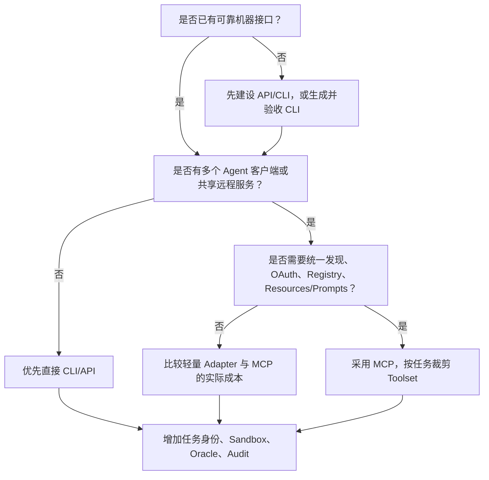

# CLI 与 MCP 可替代性决策指南

> [!important] 使用边界
> 这是一份跨专题选型指南，不把 CLI 和 MCP 合并成同一研究维度。CLI 是进程级确定性执行接口，MCP 是 Host 与外部能力之间的互操作协议；只有在“Agent 如何调用 Tool”这个交叉面上讨论替代。

## 一句话决策

- **单 Harness + 本地/Runner + 成熟 CLI：** 直接 CLI 优先。
- **多 Harness + 共享远程服务 + 统一发现/授权/目录：** MCP 优先。
- **已有 CLI，但需要多客户端复用：** 用 MCP 包装或复用 CLI 的业务库。
- **底层没有可靠机器接口：** 先建设 API/CLI 或用 CLI-Anything 一类方法生成并验收，再考虑 MCP。
- **高风险生产动作：** 选 CLI 或 MCP 都不能替代任务身份、Policy、Approval、Sandbox 和 Oracle。

## 能力对照

| 维度 | 直接 CLI | MCP | 替代性判断 |
|---|---|---|---|
| 基本调用 | 启动进程、传参数、读 stdout/stderr | `tools/list`/`tools/call` + JSON-RPC | 高度重叠 |
| 能力发现 | `--help`、文档、版本 | 标准 List + Schema + capability negotiation | MCP 更标准 |
| 输入/输出类型 | 由各 CLI 自定义，常用 JSON | JSON Schema、结构化/非结构化 Content | MCP 更统一，但不保证业务语义 |
| 本地执行 | 原生、简单、易容器化 | stdio 仍启动本地 Server 进程 | CLI 通常更低成本 |
| 远程服务 | 需自建 HTTP/Auth/API | Streamable HTTP + Authorization 框架 | MCP 更有优势 |
| 多客户端复用 | 各 Harness 需 Skill/Adapter | 同一 Server 可被多 Host 使用 | MCP 明显更强 |
| Resources/Prompts | 需约定命令或文件 | 一等 Primitive | CLI 不能标准等价替代 |
| Sampling/Elicitation | 需自建回调/交互协议 | 当前规范有客户端 Capability | CLI 难以等价；未来规范有弃用变化 |
| 流式/长任务 | 进程流、文件、Job ID，自定义 | 通知/进度；Tasks 当前实验 | 两者都需具体实现 |
| 版本锁定与重放 | 二进制/容器/命令天然直观 | 需锁定 Server、Schema 和远程行为 | CLI 通常更强 |
| 集中 Registry/Allowlist | 需内部 Catalog | 生态已形成 Registry/企业控制面 | MCP 更标准，但仍在成熟 |
| OAuth/多租户 | 每个 CLI 自定义 | 规范化远程 Authorization | MCP 更强 |
| OS 隔离 | 用户/进程/容器/Runner | 本地依赖 Host；远程依赖服务隔离 | CLI 更贴近执行层 |
| 调试 | 人可直接复现命令 | 需 Inspector/Client/Server 联合调试 | CLI 更直接 |
| 上下文成本 | Skill/help 按需加载 | Tool Schema 进入 Host 上下文，可能爆炸 | 取决于 Toolset 裁剪 |
| 安全 | 继承 OS/环境凭据，可能共享高权 | Auth 更统一，但 Server/Tool 仍可越权 | 都不是安全边界 |
| 业务成功验证 | 外部 Test/Artifact/Policy | 同样需要外部 Oracle | 完全相同的缺口 |

## CLI 可以代替 MCP 的条件

满足以下大部分条件时，不应为了“协议一致”强行增加 MCP：

1. 工具只被一个 Agent Harness 或一条固定流水线使用；
2. 运行位置是本地、开发容器或隔离 CI Runner；
3. CLI 有稳定 `--help`、JSON、退出码、非交互和版本策略；
4. 任务上下文可以通过参数、工作区和文件明确提供；
5. 凭据可按任务注入，目标 Account/Region/Environment 显式；
6. 不需要动态 Tool Discovery、Resources/Prompts、订阅或远程多租户；
7. 调试和重放比跨客户端复用更重要。

典型场景：`gh` 查询检查并创建 Draft PR、Terraform Validate/Plan、构建器在 Runner 中生成包、测试 CLI 输出报告、只读 `kubectl`/云 CLI 调查。

## MCP 可以代替直接 CLI 适配的条件

MCP 的替代对象通常是“客户端适配代码”，不是底层能力。以下情况收益明显：

1. 多个 Harness 要使用同一仓库、制品、云或可观测服务；
2. 服务集中托管、需要远程升级、SLO、速率与多租户隔离；
3. 客户端需要统一发现 Tool Schema、Resources 和 Prompts；
4. 企业要集中 OAuth、Registry、Allowlist、审计和 Kill Switch；
5. Toolset 需要根据任务身份和阶段动态裁剪；
6. 服务能力更新频繁，不希望每个客户端安装和升级二进制。

典型场景：GitHub Remote MCP、企业制品查询服务、集中 Pipeline/Telemetry Context Server、面向多个 Agent 的内部 Platform MCP Gateway。

## 都不能替代的情况

- **真实能力缺失：** MCP 不能凭空生成后端；CLI 也不能修复错误业务语义。
- **业务授权：** OAuth Scope/OS 凭据都不能自动证明 Agent 可改生产环境。
- **确定性验证：** Tool/命令返回成功不能替代 Test、Scan、Policy、Signature 或 SLO。
- **高风险批准：** Agent 不能批准自己的 Plan、修改 Gate 后自证成功。
- **视觉与人类判断：** 主观设计质量、复杂事故指挥和业务取舍仍需人类。

## 四类推荐架构

### A. 直接 CLI

```text
Harness + Skill → CLI → Sandbox/Runner → Backend → Oracle
```

适合单团队、本地或 Pipeline-bound、高可重放场景。

### B. MCP 包装 CLI

```text
Multiple Hosts → MCP Server → Versioned CLI → Backend → Oracle
```

适合已有稳定 CLI、但需要跨客户端共享发现、授权和结果结构。

### C. MCP 直连业务库/API

```text
Multiple Hosts → Remote MCP Service → Business Library/API → Oracle
```

适合共享远程服务、需要更低延迟或更强类型语义，不要求保留人工命令行。

### D. 先生成接口再互操作

```text
Source/Backend → CLI-Anything → Tested CLI + Skill → Optional MCP → Harness
```

适合缺少机器接口的长尾工具。生成 CLI 必须先独立通过任务和供应链验收，MCP 不能掩盖底层错误。

## 决策流程



## 选型实验

对同一 20—50 个真实任务同时做直接 CLI 和 MCP Wrapper 版本，测量：首次成功、错误 Tool/命令、上下文 Token、P50/P95 延迟、接入与维护工时、身份/审计完整率、人工接管和每成功任务成本。没有对照数据时，选架构复杂度最低且满足当前复用半径的一种。

## 最终判断

CLI 与 MCP 的关系不是代际替换，而是执行契约与互操作协议的分层。CLI 在局部执行、重放和调试上占优；MCP 在跨客户端、远程服务和治理挂点上占优。企业应允许两者共存，并把决定自治上限的安全与验证能力放在二者之外。

完整研究：[[50_deepdives/cli-agent-interface/90_report|CLI 报告]]、[[50_deepdives/mcp-protocol/90_report|MCP 报告]]、[[50_deepdives/cli-anything/90_report|CLI-Anything 报告]]。
