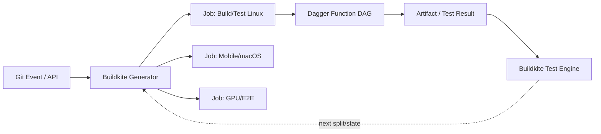

# Dagger 与 Buildkite 分层选型指南

> [!summary] 核心判断
> Dagger 和 Buildkite 都在把静态 YAML 变成程序，但它们选择了不同的架构接缝：Dagger 把一个交付任务编译成类型化、内容驱动的执行图；Buildkite 把一次 CI 编译成可在运行时生成、可映射到异构算力的 Job 图。二者不是同层替代品，也不应默认同时引入。

## 一、两家公司真正改变了什么

| 维度 | Dagger | Buildkite |
|---|---|---|
| 最小产品单元 | Module / Function / Typed Object | Pipeline / Step / Job / Queue |
| 核心图 | Job 内的内容与数据依赖 DAG | 跨 Job 的运行时任务 DAG |
| 主要问题 | 一个构建/测试动作怎样被组合、缓存、在本地与 CI 复用 | 本次需要哪些 Job、Job 应落到哪类算力 |
| 缓存位置 | Layer、Volume、Function Call，由 Engine 执行语义驱动 | Hosted/Self-hosted Cache、Artifact、Test History，强依赖 Queue/Agent 拓扑 |
| 可移植性 | 相同 Function 可由不同 CI/本地调用 | 相同 Control Plane 可连接不同 Hosted/Self-hosted Agent Fleet |
| 平台产品 | 内部交付能力 API 目录 | 内部 CI Generator、Queue 与 Agent Portfolio |
| 主要代价 | Engine/Module/SDK/Cache 合同与容器边界 | Generator/Fleet/Capacity/Cache/Queue 与运行成本 |

## 二、最深层共同趋势：CI 从配置系统变成编译系统

传统 Pipeline 直接写最终步骤。两者都引入一个中间表示：

```text
Dagger:
业务 Function / Typed Inputs
            ↓ compile/evaluate
内容 DAG → Container / Service / Artifact

Buildkite:
代码变化 / Dependency / Test History / Resource Policy
            ↓ generate/upload
Job DAG → Queue → Agent / Stack
```

因此未来平台团队的核心能力不再只是维护 YAML 模板，而是维护两类编译器：

1. 将交付意图编译为可缓存执行图；
2. 将仓库变化和资源策略编译为本次最小 Job 图。

## 三、组合时必须规定“两张 DAG 的所有权”

推荐边界：



- **Buildkite 拥有：** Git/定时/API 触发、跨 Job 依赖、并发、Queue、硬件/网络选择、跨团队状态和测试结果汇总；
- **Dagger 拥有：** 一个 Job 内的工具链、容器/服务、文件输入、构建/测试函数、细粒度内容缓存和本地复现；
- **外部 Build System 拥有：** 若使用 Bazel/Nix，源文件到 Build Target 的依赖、Hermetic Action 和远程执行；
- **业务 Test/Policy 拥有：** 成功标准，而不是由任一编排器自行判断。

### 不推荐的双重编排

- Buildkite 已按 100 个测试分片生成 Job，Dagger 再对同一测试集独立分片；
- Buildkite Cache、Dagger Cache、Bazel Remote Cache 同时缓存同一大对象，却没有 Owner 和命中观测；
- Buildkite Generator 和 Dagger Function 都决定受影响服务，出现漏跑时无法判断哪层负责；
- Dagger Cloud Checks 与 Buildkite Git Trigger 同时成为 Required Check 入口，却没有一致的重试和取消语义。

组合原则是：**粗粒度资源并行留给 Buildkite，细粒度内容增量留给 Dagger/Build System。**

## 四、选择决策

### 优先 Dagger

- 本地与 CI 执行逻辑漂移；
- 多 CI Provider 或准备迁移 Provider；
- 构建/测试/制品脚本在多仓库大量重复；
- 集成测试需要可组合临时 Service；
- 平台团队希望提供类型化交付 API；
- 痛点主要在 Job 内执行和缓存，而非全局排队/算力。

### 优先 Buildkite

- macOS、Linux、Windows、GPU、ARM、私网等异构执行资源复杂；
- Monorepo 或测试矩阵需要动态生成跨 Job 图；
- 已有 AWS/Kubernetes 平台能力，希望保留算力控制；
- 排队、Agent Warm-up、容量和测试分片是主要瓶颈；
- 希望用 SaaS Control Plane 替代自管 Jenkins Controller。

### 两者都不优先

- 少量静态 Job，SCM 原生 CI 已稳定；
- 没有可复用交付逻辑，也没有异构算力/规模问题；
- 团队缺少维护 Module API、Generator 和 Agent Fleet 的平台能力；
- 真正问题是测试设计、Build Target 依赖或生产发布流程，而不是执行/编排基础设施。

### 分阶段组合

1. 先选最主要痛点的一层；
2. 保留原 CI/执行方式作为对照与回退；
3. 用单位成功变更成本、P95 关键路径、漏跑率、Infra Failure 和平台人工验证；
4. 只有另一层痛点仍显著且边界能清楚定义时，再引入第二个产品；
5. 不在一次迁移中同时更换 CI Control Plane、Build System、Dagger Runtime 和 Agent Infrastructure。

## 五、与 GitHub Agentic Workflows、Harness CI 的分层

| 对象 | 主要编程对象 | 最适合讲的价值 |
|---|---|---|
| GitHub Agentic Workflows | Agent Task 与仓库事件上下文 | Agent 根据 Issue/PR/Repo 状态推理并执行任务 |
| Harness CI | Pipeline/Stage/Step 与更宽交付平台 | 一体化 CI/CD 平台、CI Intelligence 和交付流程管理 |
| Buildkite | Runtime Job Graph 与 Agent Fleet | 根据变化和资源特征生成、调度本次 CI |
| Dagger | Typed Function 与 Content DAG | 让交付动作成为可组合、可缓存、可移植的执行 API |

该分层不是严格产品栈：四者都有功能扩张和重叠。它用于说明每页应该证明什么，避免用“都支持 Agent/Runner/YAML”抹平真正的架构差异。

## 六、最终洞察

> **Dagger 和 Buildkite 代表的不是“下一代 CI 厂商”，而是 CI 软件化的两个方向：交付动作 API 化，执行资源与任务图可编程化。真正的企业能力不是购买两件工具，而是明确意图、任务、内容和算力四层的编译边界。**

主要事实入口：[[50_deepdives/dagger/README|Dagger Deep Dive]]、[[50_deepdives/buildkite/README|Buildkite Deep Dive]]。公开资料未证明同一外部客户同时采用二者，组合部分属于基于机制的架构推断，不作为客户事实。
