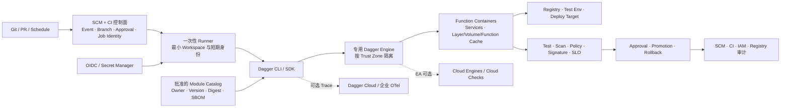

# Dagger 企业采用与治理 Playbook

## 1. 先判断是否值得采用

每项按 `0=不成立`、`1=部分成立`、`2=明显成立` 评分。分数不是行业标准，只用于避免因技术新颖而跳过需求判断。

| 维度 | 0 分 | 1 分 | 2 分 |
|---|---|---|---|
| CI 执行逻辑重复 | 单仓、少量稳定 Step | 同类仓库有部分复制 | 多 CI/多仓/多语言大量重复 |
| 本地复现痛点 | 很少发生 | 个别复杂任务 | 频繁 Push-and-Pray |
| 集成测试复杂度 | 无临时服务 | 单个数据库/队列 | 多服务、多版本、多架构 |
| Cache 价值 | 构建短、下载少 | 个别依赖耗时 | 大型构建/测试、重复运行多 |
| 平台维护能力 | 无专职 Owner | 兼职维护 | 有内部平台产品团队 |
| 可容器化程度 | 依赖专用宿主/硬件 | 部分可容器化 | 核心流程已容器化 |
| CI 控制面稳定性 | 只用一个且无迁移计划 | Runner 会变化 | 多 Provider 或迁移频繁 |
| 安全部署条件 | 必须 Rootless/强多租户 | 可用 VM/专用节点 | 可提供独立高信任 Engine |

**解释方式：**

- **12—16：** 值得进入 Hybrid PoC；
- **7—11：** 只选一个 Check/Build 验证，不做平台化承诺；
- **0—6：** 优先改进原生 CI、Task Runner 或 Build System；
- 无论总分多高，只要“必须 Rootless 且不能额外隔离”成立，生产自管 Engine 先保持阻塞。

## 2. 选择正确入口

| 主要痛点 | 首选入口 | 暂不进入 |
|---|---|---|
| Pipeline 本地无法复现 | 一个无 Secret 的 `dagger check` | Deploy、Cloud Checks |
| 多仓重复构建测试逻辑 | 内部 Module + Hybrid CI | 组织级第三方 Module 自助安装 |
| 临时数据库/服务难维护 | Service + Integration Check | 生产网络与 Host Socket |
| CI 热点耗时高 | Layer/Volume/Function Cache 基准 | 直接采购 Cloud Cache 而无 Cold/Hot 基线 |
| Runner 运维与 Cache 分布复杂 | 专用远程 Engine 或 Cloud Engines EA 对照 | 把 EA 变成关键发布单点 |
| 想替代现有 CI | 先 Hybrid，再评估 Cloud Checks EA | 一次性迁走 Branch/Environment Gate |
| Agent 失败诊断/修复 | 只读 Function、Changeset/Draft PR、原 CI 复验 | 自动 Merge、生产 Deploy |

## 3. 推荐参考架构

### 不可省略的职责分离

| 职责 | 推荐所有者 | Dagger 的角色 |
|---|---|---|
| Git Event、PR、Branch 与 Environment Gate | SCM/CI 平台 | 接收获准调用，不自授触发权 |
| Runner 与 Engine Trust Zone | 平台基础设施 | 执行已授权 Function |
| Module API、版本与依赖 | 平台产品团队 | 提供类型化共享能力 |
| Secret 与工作负载身份 | IAM/安全团队 | 只消费短期、窄 Scope 的输入 |
| Artifact Provenance、签名与 Policy | Build/Artifact 控制面 | 调用生成/验证工具，但不自证 |
| Deploy、Promotion 与 Rollback | CD/变更管理 | 执行批准后的动作 |
| Trace 与效果评测 | 平台运营 | 提供执行证据，不替代合规审计 |

## 4. 四阶段试点

### Phase 0：基线与威胁建模（1 周）

- 选择一个高频、耗时、纯构建/测试类任务；
- 记录现有本地与 CI 命令、触发、Token、Runner、Cache 和产物；
- 收集至少一个完整版本周期的 Cold/Hot 时长、失败原因、重跑和人工调试时间；
- 画出 Workspace、Secret、Socket、Network、Registry 和 Target 权限；
- 确定原实现保留方式与一键回退。

**退出条件：** 任务有清晰 Owner、成功 Oracle、基线与回退，不含生产写权限。

### Phase 1：单 Check Hybrid（1—2 周）

- 用与应用团队匹配的稳定 SDK 创建一个 Module；
- 输入仅传入所需 Directory/File，不传整个宿主环境；
- 在本地和原 CI 内运行同一 `dagger check`；
- 固定 CLI、Engine、SDK、Base Image 与 Module 版本；
- 测量 Cold/Hot Cache、错误可复现性、日志与 Trace 数据。

**退出条件：** 本地/CI 的业务结果一致，运行时间和诊断体验达到内部阈值，原 CI Required Check 仍是准入入口。

### Phase 2：共享 Module 与专用 Engine（2—4 周）

- 把 2—3 个重复任务沉淀为小而稳定的 Module API；
- 建 Owner、Semantic Version、变更日志、兼容测试与弃用规则；
- 对第三方 Module 使用允许清单、不可变 Ref 和源码审查；
- 若采用远程 Engine，将不可信 PR、受密构建和生产发布分到不同 Trust Zone；
- 对 Cache 设置 Repo/环境边界、容量、GC 与清理责任。

**退出条件：** 至少两个仓库复用且总维护成本下降；没有跨 Repo Cache、Secret、Socket 或网络越界。

### Phase 3：Cloud 或 Agent 条件试点

二者必须分开评估：

- **Cloud Engines/Checks：** 只用于非关键 Check，验证区域、SLA、数据、OIDC、故障降级、Cache 出口与成本；
- **LLM/Agent：** 只读分析或输出 Changeset/Draft PR，原 CI、Scanner 与 Policy 全量复验；
- 不允许 EA Cloud 与未稳定 LLM 同时成为同一生产路径的必需依赖；
- 任一 SaaS/模型不可用时，能回到 Hybrid CI + 自管 Engine 或原实现。

**退出条件：** 经过版本升级、Cloud 故障、Cache 清空、模型漂移和越权测试，仍满足内部质量、安全与成本门槛。

## 5. Engine 与运行时安全基线

1. Engine 使用专用节点、VM 或 Runner Group，不与不可信租户和生产业务容器混布；
2. 评估并关闭 `insecureRootCapabilities`，将不兼容 Module 作为显式例外；
3. 不向第三方或不可信 Module 传 Docker Socket、SSH Agent、宿主 Socket 或生产内部服务；
4. Remote Engine 只通过受控 Unix Socket、TLS/VPN/Service Mesh 路径连接，不暴露明文 TCP；
5. Runner Workspace 最小化，使用 Include/Exclude 与 Secret Scan；
6. Egress 默认收敛到 Git、Registry、Package、Secret Manager 与批准 API；
7. Fork/外部 PR 不获得写 Secret 和生产网络；
8. Cache 按 Trust Zone、Repo、环境和敏感度分离，禁止用户把 Secret 明文写入普通 File；
9. CLI、Engine Image、SDK、Action、Module 与 Base Image 固定到审查过的版本或 Digest；
10. Engine 升级先跑 Module Contract、Cache、网络、并发和回滚测试。

## 6. Module 作为内部产品

每个共享 Module 至少维护：

- 单一明确职责与最小 Public API；
- Owner、Support Channel、版本、兼容范围和弃用日期；
- 类型化输入输出，避免魔法环境变量和宽目录；
- Check、示例、错误语义与 Trace 属性；
- 依赖 Module、Base Image、外部 Tool 与 License 清单；
- 源码审查、SBOM、漏洞扫描、签名或内部 Provenance；
- 副作用声明与 Function Cache Policy；
- Secret、Socket、Service、Network 和 Host Capability 清单；
- 回滚到前一版本或原 CI 实现的方法。

> [!warning] Daggerverse 边界
> Daggerverse 是公开 Module 索引，不是企业批准目录。能被发现、安装或调用，不代表已经通过供应链、权限、License 和维护状态审查。

## 7. Cache 验证矩阵

| 运行组 | 必测条件 | 目的 |
|---|---|---|
| Cold local | 清空 Engine/Volume Cache | 识别首次安装与镜像拉取成本 |
| Hot local | 输入不变重复运行 | 测 Layer/Volume/Function 命中 |
| Narrow change | 只改一个文件 | 验证受影响子图是否精确重跑 |
| Cold CI | 一次性 Runner/新 Engine | 测真实 SaaS Runner 下限 |
| Persistent Engine | 固定 Engine 重复运行 | 测本地 Cache 的平台收益 |
| Distributed Cache | 新 Engine + 远程 Cache | 测传输是否优于重新计算 |
| Cache pressure | 接近 GC 阈值 | 测清理抖动、磁盘与恢复 |
| Side effect | Publish/Notify/Remote Read | 验证 TTL/Session/`never` 正确性 |
| Concurrent | 多 PR/多 Check | 测 CPU、内存、CNI、Registry 和队列 |

每组至少记录 P50/P95 总时长、CPU/内存、网络字节、Cache 命中、Engine 启动、失败率与单位成功运行成本；禁止只展示最佳热缓存结果。

## 8. Agent 采用边界

### 可先开放

- Read-only Repo/Trace/Log/Check Result；
- 生成测试、修复候选和 Changeset；
- 在临时 Container 内反复运行 Check；
- 输出 Draft PR、诊断报告和证据链接；
- 固定模型、Provider、Module、Prompt 与 Toolset 的离线评测。

### 默认禁止

- 读取整个宿主 Home、SSH Agent 或 Docker Socket；
- 使用共享生产管理员 Secret；
- 修改 Check、Scanner、Policy 或成功阈值后自证通过；
- 直接 Push Main、Merge、Sign、Promote、Deploy 或 Rollback；
- 自主安装未批准 Module/MCP Server；
- 将 Agent Trace 当作 Artifact Provenance 或 Approval。

## 9. 统一指标

| 维度 | 指标 |
|---|---|
| 可移植性 | Local/CI Result Parity、环境专属分支数量、复现成功率 |
| 开发体验 | Pipeline 修改到本地验证时间、CI 失败复现时间、调试轮次 |
| 性能 | Cold/Hot P50/P95、Cache Hit、Engine Startup、Network Transfer |
| 可靠性 | Infra Failure、Flaky Rate、Cache Corruption、Upgrade Regression |
| 复用 | 使用 Module 的仓库/团队数、重复代码减少、Breaking Change |
| 安全 | Denied Capability、Secret Exposure、Socket/Egress 违规、跨租户事件 |
| 供应链 | 不可变引用覆盖率、SBOM/签名覆盖、依赖升级时延 |
| 成本 | Runner/Engine/Cloud/存储/网络成本、每成功 Check 成本、维护人时 |
| Agent | Verified Fix、False Pass、Regression、Human Intervention、单位成功成本 |

## 10. 停止条件

- Rootless/特权限制与目标环境合规要求冲突且没有独立 VM/节点边界；
- Module 需要 Docker/SSH Socket 或生产 Secret 才能完成普通 Build/Test；
- Local/CI 结果持续因网络、架构或外部状态漂移，且无法显式建模；
- Cold Cache 与传输成本长期抵消热缓存收益；
- 共享 Engine 出现跨 Repo/Tenant Cache、网络、文件或资源串扰；
- 升级导致 Module/SDK/Engine 合同频繁破坏，维护成本高于原 CI；
- Cloud EA 无 SLA/区域/退出方案却成为发布关键路径；
- Agent 请求扩大权限、修改 Gate、直接写 Main 或无法由外部 Oracle 复验；
- 每成功任务成本与质量连续两个版本周期不优于基线。

## 11. Cloud 采购问题

- Cloud Engines 与 Cloud Checks 在目标区域和套餐中的准确状态、SLA 与 Support 是什么？
- Git Provider、事件、Fork、Branch、Environment、Approval 和 Deploy 能力覆盖到哪一层？
- Engine 的租户隔离、特权能力、网络 Egress 和底层 Runtime 是什么？
- Trace、Log、Module、Git Metadata、Cache 与 Workspace 分别上传什么、存多久、存在哪个区域？
- Cache 和 Trace 是否可导出，退出后如何删除与迁移？
- GitHub App、Cloud Token、Admin/Member 与 Repository 权限是否支持企业最小权限？
- OIDC Subject 能否限定到 Organization、Repository、Branch、Environment 和 Check？
- Cloud/Region 故障时能否自动或手工回退到 Hybrid CI 与自管 Engine？
- 计费是否包含 Compute、Cache Storage、Egress、Trace、Module 和并发？
- 是否提供当前版本的第三方安全测试、合规报告和数据处理协议？
