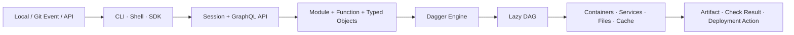
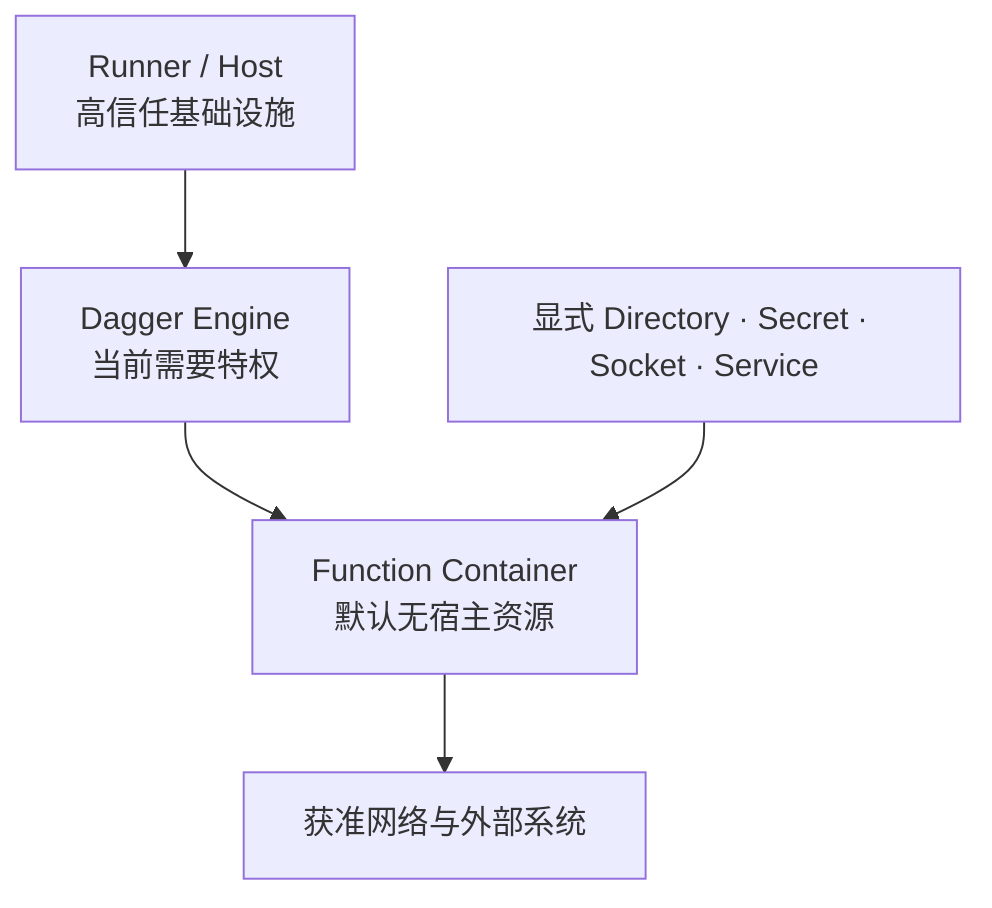

# Dagger：可编程软件交付执行层的价值、边界与企业采用

## 执行摘要

Dagger 的本质不是“用 Go、Python 或 TypeScript 代替 CI YAML”，而是把软件交付逻辑变成由类型化输入输出、可组合 Function 和内容寻址对象构成的执行图。CLI、Shell 和多语言 SDK 只是调用面；Dagger Engine 负责加载 Module、扩展 API、把调用转换成惰性求值 DAG，并执行容器、服务、文件、Secret 与多层缓存。详见 [[00_sources/briefs/2026-dagger-engine-modules-execution|Engine、Module 与增量执行]]。

这使 Dagger 在两类问题上具有明显价值：

1. **执行逻辑可移植：** 相同 Module/Function 可以在开发机、GitHub Actions、GitLab、Jenkins、自管 Engine 或 Dagger 托管计算中调用；
2. **平台能力可产品化：** 构建、测试、制品和发布逻辑可以从重复脚本变成带类型、版本、Owner 和组合关系的内部 Module API。

但五个边界必须同时成立：

- 可移植的是程序合同，不是身份、网络、Cache、CPU 架构、审批和外部状态；
- 自动缓存会改变执行语义，带副作用的 Function 必须显式控制；
- Function 默认宿主盲，不代表承载它的 Engine 已被低权限强化；
- Dagger Cloud 增加 Trace、Cache、托管计算与 CI 触发，也成为主要数据和商业锁定面；
- LLM Primitive 把 Agent 接入同一执行图，却不能替代独立授权和业务 Oracle。

截至 2026-08-02，GitHub Latest Release 为 `v0.21.8`（2026-07-29），开源 Engine/CLI 可作为持续发布的执行底座；Dagger Cloud 的 Cloud Engines 和 Cloud Checks 仍按官方明确状态证据标记为 **Early Access**，LLM/Env 应按 **Experimental / 未稳定** 对待。正式选型因此应优先 Hybrid CI，Cloud 与 Agent 作为可回退的条件试点。

## 一、Dagger 究竟是哪一层

### 1. 不是一个简单 DSL

传统 Pipeline-as-Code 往往把工作表示成 Provider 专属的 Job/Step 列表。Dagger 则通过统一类型系统表达 `Container`、`Directory`、`File`、`Service`、`Secret` 等对象；Function 可以返回这些对象，调用方继续组合，而不是只能读取日志或退出码。



Engine 将请求转换为 DAG。一个操作只有在最终结果需要它时才被物化；没有依赖边的节点可以并发。这意味着源码中的链式调用表达业务关系，实际执行次序由数据依赖和求值需求决定。见 [[50_deepdives/dagger/20_evidence-map#核心 Claim|DAG-C01—C02]]。

### 2. 与 CI 平台的关系是“两层半”

| 形态 | 事件与身份 | 执行 | 状态 |
|---|---|---|---|
| 本地 | 开发者会话 | 本地 Engine | 本地 TUI/Trace |
| Hybrid CI | GitHub/GitLab/Jenkins 等 | Runner 内 CLI → Dagger Engine | 原 CI Check/Log |
| Cloud Trace/Cache | 原 CI 不变 | 自管 Engine | Dagger Cloud 增强观察/Cache |
| Cloud Engines EA | 本地或 CI Client | Dagger 托管 Engine | Cloud Trace |
| Cloud Checks EA | Dagger Cloud GitHub App | 托管 Engine 自动运行 Check | GitHub Commit Status |

因此，“Dagger 不取代 GitHub Actions/Jenkins”只适用于 Hybrid 模式；“Dagger 是完整 CI 平台”又只适用于仍在 Early Access 的 Cloud Checks 路径，而且当前公开能力不能等价外推到完整的环境审批、发布编排与企业 CD 控制面。正确结论是：**Dagger 已形成成熟执行层与早期托管控制面并存的双路径产品。**

## 二、可移植性的真实含义

### 1. 为什么执行逻辑可以复用

- Module 把 Function 与依赖封装成版本化源码；
- Engine 在不同环境中提供相同核心类型与求值模型；
- 宿主目录、Secret、Socket 与 Service 通过显式参数进入；
- Check 以统一命令返回结果，可被本地、CI 或 Agent 调用；
- Container 化固定大部分工具链与文件系统。

### 2. 为什么环境仍不相同

| 变量 | 本地与 CI 可能不同 | 后果 |
|---|---|---|
| 身份 | 开发者登录态、CI OIDC、Production Role | 同一 Deploy Function 的真实权限不同 |
| 架构 | ARM/AMD64、Kernel、Runtime Driver | 镜像、依赖和性能可能漂移 |
| 网络 | VPN、DNS、Proxy、证书、Egress | 外部依赖和内部 API 行为不同 |
| Cache | 本地持久、一次性 Runner、远程分布式 | 命中与成本不同 |
| Secret | 本地 Vault、CI Variable、Cloud Provider | 可用性、Scope 与轮换不同 |
| 控制 | PR Event、Branch Rule、Environment Approval | 相同函数不能自带组织准入语义 |
| 外部状态 | Registry、Package、Cloud、Deployment Target | 结果随时间与并发变化 |

“Write once, run anywhere”应解释为**同一 Dagger 程序可被不同宿主调用**，而不是字节级结果、性能和授权天然一致。该限定不是削弱 Dagger，而是把其价值放回可验证的边界。

## 三、性能：四层机制，一条约束

### 1. 执行性能来自组合

1. **DAG 与惰性求值：** 只执行被结果需求牵引的子图；
2. **依赖就绪并发：** 无依赖节点可以同时运行；
3. **Layer Cache：** 复用构建与文件操作层；
4. **Volume/Function Cache：** 跨 Session 保存指定目录或复用完整调用结果。

真正的性能模型是：

```text
输入边界 × 图切分 × Cache 命中 × Engine 生命周期 × 网络/存储拓扑 × 并发资源
```

### 2. Function Cache 是合同

当前文档说明 Module Function 可按输入缓存；Cache Key 包括 Module 源码、参数和父对象状态。默认最大 TTL、Session 和 `never` 会决定 Function Body 是否重新执行。

因此必须把函数分成三类：

| 类型 | 示例 | 推荐 Cache |
|---|---|---|
| 纯转换 | 编译、Lint、确定性测试、打包 | 默认/长 TTL，输入必须完整 |
| 外部读取 | 拉取远程状态、查询 Registry/API | 有限 TTL 或 Session |
| 副作用 | Publish、Deploy、Notify、Rotate | `never` 或单独幂等/事务控制 |

即使 `cache="never"`，Function 内部的 Container Layer 仍可能命中。平台团队必须测试整体业务语义，而不是只看函数是否“执行过”。

### 3. 客户数字的正确用法

Airbyte 案例称 CI 平均快 2—5 倍、部分时段成本约为过去四分之一；但架构同时改变了 Dagger 执行逻辑、Cloud 分布式缓存、Kubernetes Engine Fleet 与 Karpenter 自动扩缩。Discern、Flipt 的热缓存数字同样缺少独立对照。详见 [[50_deepdives/dagger/30_case-map|案例地图]]。

这些材料证明“存在值得验证的收益路径”，不能证明 Dagger 本身的普遍加速倍数。企业 PoC 必须同时测 Cold、Hot、窄变更、跨 Engine Cache、并发和 GC。

## 四、安全：Function 沙箱与 Engine 特权同时为真

### 1. Function 级能力输入

官方 Sandboxed Runtime 文档明确：Function 默认不能直接访问宿主环境、文件系统、服务或 SSH Agent；调用者必须显式传入 `Directory`、`Socket`、`Service` 或 `Secret`。Secret 类型还会从日志和输出中清除，并避免直接进入普通构建文件系统与 Cache。

这比传统脚本依赖 `$HOME`、当前账户、全局 Docker Socket 和环境变量更可审计。但它不是完整安全体系：

- 传入整个 Workspace 仍可能包含无关敏感文件；
- Docker/SSH Socket 是强能力委托；
- Secret 获准使用后，恶意代码仍可能通过网络或制品外泄；
- 顶层 Module 可把资源传给依赖 Module；
- 用户把明文写入普通 File 后仍可能进入 Cache。

### 2. Engine 级高权限

官方 Engine Configuration 同时明确：

- 自定义 Engine 示例使用 `--privileged`；
- 默认安全策略允许 `insecureRootCapabilities`；
- 该选项可以关闭；
- 当前 Engine 不能以 Rootless 容器运行。

所以 Dagger 的安全模型不是一个沙箱，而是至少三层：



Function 的默认隔离改善了 Module 权限传播；Engine 的特权决定基础设施 Blast Radius。Puzzle 因此把 Engine 放入 KubeVirt VM，以 VM 隔离替代 OpenShift 中的特权 Pod 与跨团队 SCC 运维。见 [[00_sources/briefs/2025-dagger-puzzle-kubevirt-ci|Puzzle Case]]。

### 3. 企业控制结论

- 不可信 PR、受密 Build 和 Production Deploy 使用不同 Engine Trust Zone；
- 不把 Docker/SSH Socket 与生产 Secret 交给第三方 Module；
- Egress、IAM、Secret Scope 和 Target Policy 由底层基础设施强制；
- Cache、Trace 与 Workspace 都按数据资产治理；
- Dagger 成功结果必须关联 Commit、Artifact Digest、Policy 和目标系统审计；
- Function/Trace 不能替代 Artifact Provenance、Signature、SLO 或 Approval。

## 五、Module：从复用机制到平台产品

Dagger Module 的战略价值是把构建测试知识从“复制模板”升级为内部 API：

- 调用方看到名称、类型、文档和错误；
- 作者控制实现语言、容器与依赖；
- 不同语言 Module 可以组合；
- Git 与版本 Ref 可以成为分发入口；
- Engine 根据输入图自动执行与缓存。

但 Module 同时带来新的供应链：

- Git Source、Tag/Commit 与传递依赖；
- Base Image、Package、SDK 与 Engine Version；
- Daggerverse 公共索引；
- Function Cache Policy 与副作用；
- Secret、Socket、Service 和 Network Capability。

因此平台化成功的前提不是“Module 数量多”，而是有 Owner、最小 API、不可变版本、兼容测试、SBOM/签名、能力清单和退出路径。Daggerverse 只能作为发现入口，不能充当企业准入目录。

## 六、Dagger Cloud：价值与锁定来自同一处

### 1. 当前能力分层

| 能力 | 价值 | 状态与边界 |
|---|---|---|
| Traces | 本地/CI 统一执行可见性 | 当前可用；不是不可篡改审计 |
| Modules | 组织 Module、依赖与版本可见性 | 当前可用；Git Source 扫描与角色较粗 |
| Distributed Cache | 跨 Engine 复用结果 | 客户案例与 Cloud 能力支持；保留/隔离/出口需核验 |
| Cloud Engines | 托管计算、扩缩与 Cache | Early Access |
| Cloud Checks | Git 触发、托管 Check、Commit Status | Early Access；当前重点是 GitHub Check |

Cloud 文档还显示两个重要治理点：

- 来自 CI 且属于 Public Repository 的 Trace 可能默认公开，组织可关闭；
- 当前组织角色主要是 Admin 与 Member，且 Admin 不是 Member 的超集。

### 2. 锁定判断

开源 Engine 和 Hybrid 模式使核心 Module 能留在 Git 并迁回自管 CI，这是实际的退出基础。但 Cloud Trace、Cache、Managed Engine、GitHub App 与 Check History 的数据/操作可迁移性没有得到同等公开证明。

因此采购应问的不是“Dagger 是否开源”，而是：

- 哪些运行可以在 Cloud 故障时回到自管 Engine；
- Cache/Trace 能否导出与删除；
- Cloud Token、GitHub App、OIDC 和角色能否最小化；
- 区域、租户隔离、SLA、Egress 与计费如何；
- EA 升级和接口变化如何回滚。

## 七、LLM Primitive：适合承载 Agent，不适合证明 Agent

Dagger 的 `LLM` 类型可以绑定 Env，让模型发现和调用 Dagger Functions；Module 可以暴露为 MCP Server，也能把外部 MCP Server 作为 Service 接入。模型循环与底层操作可以进入 Trace。

这个结构对 Agentic CI/CD 的价值在于：

- Agent 与确定性 Build/Test 使用相同 Container 和 Function；
- Tool 输入输出比任意 Shell 更类型化；
- 失败可以在同一执行图内重跑；
- Prompt、Tool Call、Container Operation 可以关联观察；
- Module 可以成为多 Agent Client 共享的执行能力。

但稳定性和自治不能被高估：

- 2025 发布将 LLM Primitive 标记为 Experimental；
- Next API 仍称 LLM/Env 未稳定；
- 模型与 MCP Provider 带来新的数据和供应链；
- Function Tool 可见不等于任务身份获准执行；
- Trace 证明“发生了什么”，不证明结论正确；
- 没有独立公开数据证明正确率、越权率、MTTR 或单位成功成本。

因此当前推荐上限是：**只读调查 → Changeset/Draft PR → 原 CI/Scanner/Policy 复验 → 人工合并**。自动生产发布仍保持阻塞。

## 八、何时采用，何时不采用

### 强适配

- 多语言 Monorepo；
- 多 CI Provider 或 Runner 迁移频繁；
- 复杂集成测试、临时数据库与服务；
- 构建测试重复多、Cache 价值高；
- 平台团队愿意维护内部 Module 产品；
- 本地复现 CI 是高频痛点；
- 能为 Engine 提供独立节点/VM 与网络边界。

### 弱适配或阻塞

- 单仓、少量稳定原生 CI Step；
- 引入 Engine/SDK/Module 的成本大于重复脚本；
- 工作负载难容器化或高度依赖宿主专用能力；
- 目标环境必须 Rootless，且不能提供额外 VM/节点隔离；
- 主要需求是审批、Release Control 和企业门户，而不是执行逻辑；
- 试图立即以 Cloud Checks EA 替代完整 CI/CD；
- 试图让未稳定 LLM 直接获得生产写权限。

### 与相邻工具的关系

Dagger 通常位于 Build System 与 CI Control Plane 之间：

- 向下调用 Dockerfile/BuildKit、Bazel、Nix、Scanner 和 Package Tool；
- 向上被 GitHub Actions、Jenkins、GitLab、Tekton 或 Cloud Checks 触发；
- 横向通过 Module 复用平台能力；
- 在 Agent 场景中成为 Harness 的受控执行底座；
- 最终由 IAM、Policy、Signature、Approval 和 SLO 决定结果能否晋级。

## 九、推荐采用路径

1. 先选一个无生产 Secret、可确定验证的 Check；
2. 保留原 CI 触发、Required Check、Runner 与身份；
3. 在本地与 CI 运行相同 Module，建立 Result Parity；
4. 分别测 Cold/Hot/窄变更/并发/GC，不引用厂商案例代替基线；
5. 复用到第二个仓库后再建设 Module Catalog 与远程 Engine；
6. Engine 按 Trust Zone 隔离，审计特权、Socket、Egress、Secret 和 Cache；
7. Cloud Engines/Checks 与 LLM 分开试点，不形成叠加 EA 单点；
8. 每次扩大权限前，先证明外部 Oracle、回滚和原实现降级路径。

完整控制、指标、停止条件和采购问题见 [[50_deepdives/dagger/60_playbook|企业采用 Playbook]]。

## 十、最终判断

Dagger 值得关注，不是因为“代码一定比 YAML 好”，而是它把软件交付中的构建、测试、服务、制品与部分发布逻辑放进了一个类型化、内容寻址、可在多种宿主运行的执行图。对复用半径大、容器化程度高、CI 反馈慢且有平台团队的组织，它可以成为比 Provider 模板更深的内部交付底座。

它也不是默认答案。Engine 特权、Cache 语义、Module 供应链、Cloud 数据边界和未稳定 LLM 都把治理成本从 YAML 文件转移到平台产品。若组织没有能力维护这些边界，Dagger 可能只会把简单 CI 变成一套更复杂的新平台。

> [!success] 可用于汇报的核心主张
> **Dagger 把 CI/CD 的可移植单位从平台专属 Workflow 提升为类型化、内容寻址的软件交付函数图；但 Git 事件、任务身份、Engine 信任边界与最终准入仍必须由独立控制面负责。**

这个主张能够同时解释 Dagger 的真实价值、Cloud Checks 的产品扩张以及 Function 沙箱与特权 Engine 的安全边界，不依赖厂商 ROI 数字，也不因 Early Access 功能变化而失效。
