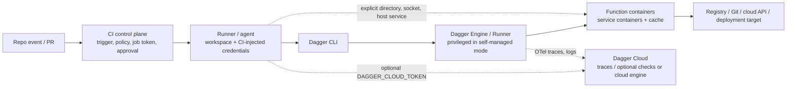

# Dagger 的 CI 集成、企业治理与安全边界

> [!abstract] 核心判断
> **Dagger 是交付工作负载的可编程执行层，不天然取代既有 CI 的事件触发、身份发放、分支/环境保护、Runner 调度与结果准入控制面。**在 GitHub Actions、GitLab CI、Jenkins 的混合模式中，这些平台仍先接收事件、分配 Job/Runner、注入其授权的凭据并接收结果；Dagger CLI 再连接或启动 Engine 来执行函数。[S01][S02][S03] 这带来“同一模块可在本地与 CI 执行”的可移植性，但**不自动带来相同的权限、网络、内核能力、缓存隔离或审计保留策略**。尤其是自管 Dagger Engine 目前需要 root capabilities，且默认允许 `security.insecure`；把主机 socket、内部服务或秘密显式交给函数时，边界会从容器隔离扩展到对应的主机/网络权限。[S04][S05][S06]

## 1. 研究范围、方法与状态词

- **问题**：Dagger 与传统 CI 控制面的职责如何划分？Runner、Engine、容器运行时、网络、秘密、服务、缓存与 Dagger Cloud telemetry 的信任边界在哪里？哪些可移植性与安全结论能被一手资料支持？
- **范围**：Dagger 官方当前文档、官方开源仓库入口与官方安全/配置文档；GitHub Actions、GitLab CI、Jenkins 官方文档。访问日期均为 **2026-07-28**。
- **时间信息**：多数 Dagger、GitHub、GitLab 与 Jenkins 活文档不显示发布日期或更新时间，来源表如实标为“未显示”；不以抓取时间替代发布日期。
- **状态词**：`Available` 指当前官方文档可配置/可调用，**不等同于 GA、企业支持承诺或合规认证**；`Experimental` 保留官方措辞；“推断/建议”是本研究基于事实给出的治理判断，不是厂商功能承诺。

## 2. 控制面与执行面：谁负责什么

| 层 | 一手证据可确认的职责 | 不能据此推出的职责 | 企业应保留的控制 |
|---|---|---|---|
| CI 控制面（GitHub Actions / GitLab CI / Jenkins） | 在 Dagger 的 GitHub、GitLab、Jenkins 集成流程中，CI 分别先处理 repo 事件、workflow/job/stage 或 Jenkinsfile，然后运行 Dagger CLI；完成状态与常规日志仍回到 CI 平台。[S01][S02][S03] | Dagger 函数执行并不替代平台的 PR 触发语义、分支保护、环境审批、Runner 选址、token 权限或 merge/deploy gate。 | 继续在 CI 平台定义触发范围、受保护分支/环境、最小 `GITHUB_TOKEN` 或 CI 变量权限、Runner group 与结果必须通过的门禁。 |
| Dagger CLI 与 Engine | CLI 会寻找现有 Engine 或在 CI Runner 内启动 Engine；Engine/Runner 负责执行函数指定的容器、拉取镜像/Git/source、推送镜像及管理执行缓存。[S01][S02][S03][S07] | 该职责说明执行与缓存位置，**没有证明** Engine 自带企业级审批、职责分离、变更管理或跨租户授权模型。 | 把 Engine 视为可执行不可信构建代码的高价值计算边界；按信任域部署、最小化其可见的凭据/网络/主机能力。 |
| Dagger Cloud（可选） | 设定 `DAGGER_CLOUD_TOKEN` 时，集成会把 telemetry 发送到 Dagger Cloud；Cloud Traces 是包含操作细节与日志的浏览器界面。[S01][S02][S03][S08] Cloud Checks 可作为托管触发路径，监视 repo 并以 commit status 报告检查结果。[S09] | 不应把 trace 视为不可篡改合规审计，也不应把“Cloud 有 trace”推导成私有数据默认不外发。官方明确：来自 CI 且属于 public repo 的 trace 默认可公开访问，组织可调整该设置。[S10] | 对 telemetry 设数据分类、组织访问控制、public-trace 设置和留存/删除责任；对 production deploy 的授权与审计仍以 CI/云身份/IAM/变更系统为准。 |

### 2.1 两种集成模式，不能混为一谈

1. **混合模式（常见起点）**：CI 仍是触发及 Job 外壳，步骤中调用 `dagger check` / `dagger call`。Dagger 官方将其称为不替换既有 CI 的迁移桥。[S09] GitHub、GitLab、Jenkins 集成页面都显示这一流程。[S01][S02][S03]
2. **Cloud Checks（另一控制面）**：官方触发文档称其可监视 repo，在 push 上运行 `dagger check` 并写回 commit status，无需 CI 配置文件、webhook 或 Runner。[S09] 这并不表示原有代码托管、分支规则、环境/IAM 和外部部署控制失效；它只是把检查触发/执行的一个环节托管给 Dagger Cloud。

**推断**：生产架构应先指定“谁拥有触发、身份、执行、准入、发布与恢复”的 RACI，再选择混合或 Cloud Checks；不要把 Dagger 模块中的 `deploy()` 函数当作审批本身。

## 3. 主张—证据—边界矩阵

| ID | 可核验主张 | 一手证据与产品状态 | 工程含义 / 不可外推边界 | 置信度 |
|---|---|---|---|---|
| C1 | GitHub Actions 集成中，GitHub 先触发和处理 workflow，Action 调 CLI，CLI 在 Runner 内寻找或启动 Engine；最终 status/log 仍由 GitHub 工作流呈现。 | Dagger GitHub 集成步骤 1–7 明列该链路；`DAGGER_CLOUD_TOKEN` 存在时发送 telemetry。[S01] **Available，页面未标 GA。** | Dagger 可重用执行逻辑，不能替换 GitHub 对事件、Job token、runner、branch protection 的治理。 | 高 |
| C2 | GitLab CI 与 Jenkins 的官方集成同样把 Dagger 置于既有 CI Job/agent 内，而非取代其 Job 调度。 | GitLab：GitLab 处理 `.gitlab-ci.yml` 后下载 CLI，CLI 在 Runner 内连接/启动 Engine。[S02] Jenkins：Jenkins 收 trigger、解析 Jenkinsfile、Agent 上执行 CLI 与 Engine。[S03] **Available，未标 GA。** | 相同 Dagger 函数可跨 CI 复用；每个平台的变量、Runner 隔离、审批与凭据语义仍不同。 | 高 |
| C3 | 默认本地/CI CLI 通过主机 OCI runtime 拉取匹配版本 Engine 镜像并启动它；Docker、Podman、nerdctl/Finch、Apple container 被列为兼容 runtime。 | 官方 container runtime 参考说明 CLI 自动探测 runtime、拉 Engine image、启动并连接。[S11] **Available。** | “只要有 Linux container runtime”是执行前提，不是相同安全/性能/网络策略的保证。runtime daemon 权限、镜像源和宿主隔离都属于部署方责任。 | 高 |
| C4 | 自管 custom Runner 当前需 root capabilities（含 `CAP_SYS_ADMIN`）；官方 Engine 配置称默认安全策略开放，允许 `security.insecure`，且 Engine 暂不能 rootless。 | Custom Runner execution requirements 与 Engine Configuration 的 Security / Rootless mode。[S04][S05] **Available；rootless 不可用是当前限制。** | 容器内函数隔离不等于 Engine 对宿主具有最小权限。自管生产 Engine 应是独立、高信任节点/节点池，而不是与不可信任务或通用生产工作负载混用。 | 高 |
| C5 | Dagger Functions 默认不能直接读取调用 CLI 主机的文件；主机文件/目录须显式传入。 | Directory 文档把显式传递列为安全机制，降低第三方函数访问主机数据的风险。[S06] **Available。** | 这是能力边界而非完整数据防泄露证明：一旦把 workspace、目录或 file 作为输入，所选内容会传给 Engine；应使用 include/exclude、最小 workspace 与机密扫描。 | 高 |
| C6 | Host TCP/UDP 服务和 Unix socket 可以作为参数传给函数；官方示例包括 `/var/run/docker.sock`。 | Dagger Arguments/Host API 明确支持 host service、socket 和 tunnel。[S12][S13] **Available。** | **推断**：socket 与可达的内部服务应被视为能力委托；Docker socket 尤其不应交给来自不可信 repo/module 的函数。容器沙箱不能抵消被显式委托的主机控制能力。 | 高 |
| C7 | Service containers 支持 container↔container、container→host 及 host→container 网络；服务按 session 去重，以避免不同 session 的 service cross-talk。 | Dagger Services 文档的连接模型与 session 去重说明。[S14] **Available。** | 服务生命周期隔离不等于 egress policy。公开一手文档未给出“默认出网允许/拒绝”、NetworkPolicy 集成或跨租户网络隔离的完整保证；敏感环境仍应由 Runner/Kubernetes/云网络强制 egress allowlist、私有 DNS 和分段。 | 高（事实）/中（治理推断） |
| C8 | Dagger Secret 类型会 scrub logs/output；官方称不会将 secret plaintext 写入所构建容器文件系统或 cache，并默认在模块范围内作用域化。 | Secrets 文档与 Security considerations。[S15] **Available。** | 这防止典型日志/cache 泄漏，**不证明**有 secret 的不可信代码不能经被允许的网络、制品输出或显式文件写入而泄漏；官方也警告不要把 plaintext 写进文件。Secret source、权限和 egress 必须外部约束。 | 高 |
| C9 | Cache volume 可跨 Engine session 持久化；Engine 管理 cache，GC 依 policy 清理。 | Built-In Caching 与 Engine Configuration。[S16][S05] **Available。** | cache 是性能资产也是数据边界。资料未公开证明跨 repo/tenant/cache-key 的隔离模型或敏感数据清理 SLA；不要在共享 Engine 上把 cache 当作无风险共享层，且不得写入 secret/plaintext 或未审查产物。 | 高（事实）/中（缺口判断） |
| C10 | Dagger Cloud Trace 包含每个 Function invocation 的操作详情，并可搜索 trace log；Dagger 使用 OpenTelemetry。 | Observability 文档。[S08] **Available。** | 可观测性提升调试与证据关联，但日志可能包含业务输入/命令输出。对 public repository + CI 的 trace 默认公开的设置尤其需要评审。[S10] | 高 |
| C11 | Dagger 的 GitHub 示例以 `dagger/dagger-for-github@v8.3.0`（tag）引用 Action；GitHub 官方建议第三方 Action 固定到完整 commit SHA，并显式最小化 workflow permissions。 | Dagger GitHub 示例与 GitHub 安全加固指南。[S01][S17] | **推断**：生产应固定 Dagger Action、CLI/Engine image、远程 module 与基础镜像到审查过的不可变版本/digest；tag 或 `latest` 不足以形成可复现的供应链控制。 | 高 |
| C12 | GitHub、GitLab、Jenkins 都提供各自的 secret / credential 模型，但掩码不是权限隔离。 | GitHub secrets 需显式注入，建议最小权限；GitLab 文档称 fork 项目 pipeline 默认不能取父项目变量、但在父项目运行 fork MR 时变量会可用；Jenkins 明说能配置 job/pipeline 的人被假定可信，masking 可被规避。[S18][S19][S20] | Dagger 不应把 `DAGGER_CLOUD_TOKEN`、registry/deploy credential 当普通环境变量的替代物；应沿用 CI 原生 protected secret、fork/MR 策略、短期 OIDC 和分环境身份。 | 高 |

## 4. 信任边界图与治理含义

| 边界 | 所有者 | 必须问的问题 | 最低治理动作 |
|---|---|---|---|
| **事件 → CI 控制面** | SCM/CI 管理员 | 哪些 event、fork/MR、分支能获得哪类 token、触发 production？ | 审查 workflow/Jenkinsfile/.gitlab-ci.yml；受保护分支与 environment；默认 read-only；显式 `permissions`。[S18][S17] |
| **CI 控制面 → Runner** | CI 平台与基础设施团队 | 哪个 repo 能落到哪个 Runner？Runner 是否会残留 workspace、Docker daemon、cache、环境变量？ | 不可信 PR 用一次性/隔离 Runner；生产发布专用 Runner group/node pool；不允许同一节点运行持密任务与不可信任务。GitHub self-hosted Runner 需自行满足网络与 Docker 等要求。[S21] |
| **Runner → Engine/runtime** | 平台工程团队 | Engine 是否 privileged？runtime socket/daemon 可被谁控制？remote Engine 通道是否加密？ | 版本对齐 CLI/Engine；以 dedicated node/pod 部署 Engine；关闭 `security.insecure`（经兼容性验证）；不将 remote `tcp://` 裸露。官方称 Dagger 不为 wire data 自行加密，须由连接层提供。[S04][S05] |
| **Engine → 函数容器/服务** | Dagger module owner | 函数可见哪些目录、cache、服务、socket、网络出口？ | 默认零 host input；目录白名单；禁止 untrusted module 获得 Docker/SSH socket 或生产服务；服务只为 session/test 环境开启；网络由底层网络策略限制。[S06][S12][S14] |
| **函数 → 外部系统** | 目标系统/IAM owner | 谁能 pull/push image、读 secret、改 registry、部署、销毁或访问生产 API？ | 任务专用短期身份；read/build/publish/promote/rollback 分离；用 OIDC/workload identity 代替长效 token；对目标系统强制 policy 和审批。GitHub OIDC 要显式 `id-token: write` 并由目标信任策略限定。[S22] |
| **Engine/CLI → Cloud telemetry** | Dagger Cloud org admin / data governance | 哪些 trace/log 会外送？谁可读？public repo trace 默认是否合适？可否删除？ | 明确是否启用 token；组织成员最小化；关闭或审查 public traces；禁止输出 secret/客户数据；把 Cloud trace 与合规审计分开管理。[S08][S10] |

## 5. 可移植性：成立的条件与不成立的条件

### 5.1 可以成立的“可移植”

- Dagger 官方承诺函数运行在支持的系统上，要求 Linux container runtime；官方 API 的 `Container`、`Directory`、`Secret`、`Service` 等类型使工作流可由 CLI 或 SDK 调用。[S07][S11]
- GitHub、GitLab 与 Jenkins 的集成均把相同的 Dagger module/function 放进不同 CI 外壳执行。[S01][S02][S03]
- 内容寻址和输入驱动缓存有助于相同输入复用结果；服务在 session 维度隔离实例，避免跨 session service cross-talk。[S16][S14]

### 5.2 不能自动成立的“可移植”

| 不可移植的变量 | 为什么不能由 Dagger 抹平 | 设计要求 |
|---|---|---|
| 身份与权限 | GitHub `GITHUB_TOKEN`、GitLab CI variables、Jenkins credentials 的注入与 fork/protected 语义不同。[S18][S19][S20] | 在 Dagger 函数接口中显式声明 secret/identity；将发行/部署授权留在平台或目标 IAM。 |
| Engine 特权与 runtime | 自管 Engine rootless 不可用，default policy 允许 insecure root capabilities。[S05] | 在所有环境使用可审计、隔离的 Engine 部署基线；不把开发机的 Docker 信任模型带入生产。 |
| 网络与本地依赖 | Host service/socket 可显式传入；Dagger 文档没有给出统一默认 egress policy。[S12][S14] | 建立每环境 egress allowlist、代理/证书、private registry 和禁止 socket forwarding 的 policy。 |
| 缓存与性能 | 持久 cache 的位置、保留、GC、共享范围由 Engine/Cloud 部署决定。[S16][S05] | 以 cache scope、敏感性和清理要求作为平台配置，不以“同一模块”假定结果可复用。 |
| 可观测性与数据驻留 | Dagger Cloud trace/log 是可选外部服务，public trace 有默认开放条件。[S08][S10] | 明确 telemetry 数据分类与地域/留存要求；无批准时关闭 Cloud telemetry 或仅采用企业批准的 OTel backend。 |
| CI gate 与审批 | CI 平台决定 PR status、environment approval、branch protection 及 job identity；Dagger 只返回函数成功/失败。[S01][S02][S03] | 把 Dagger result 接入既有 required check、部署环境和 change-management gate；不要把函数内部布尔值视作唯一生产准入。 |

## 6. 生产采用风险与治理建议

下表的“建议”均为本研究的工程判断；每项均由相邻事实支撑，但不声称 Dagger 自动提供该控制。

| 风险 | 证据 | 建议 |
|---|---|---|
| **特权 Engine 成为共享攻击面** | custom Runner 需要 root capabilities；默认 open policy 可允许 insecure root capabilities，且 rootless 未支持。[S04][S05] | 按 trust zone 部署 dedicated Engine；production、受密 CI、fork/PR 分离；禁用 `security.insecure` 后先做 module compatibility test；对 runtime/Engine image 做漏洞与版本治理。 |
| **主机能力被模块间接取得** | directory、socket、host service 均能显式传递；Docker socket 是官方示例。[S06][S12] | 建立 module capability review：输入目录最小化、禁 host socket 默认、禁止把 `SSH_AUTH_SOCK`/Docker socket 与生产凭据暴露给第三方模块；远程 module 只允许批准 registry 与 immutable ref。 |
| **秘密被视为“已安全”而发生外泄** | Dagger 会 scrub logs/cache，但官方仍警告 plaintext 写文件会进入 cache；GitLab/Jenkins 同时说明 mask 非防恶意执行代码。[S15][S19][S20] | 仅将 `Secret` 用于短生命周期受控动作；不在可信边界外运行有 secret 的 PR；网络 egress 限制、secret scanning、轮转与目标侧最小权限共同实施。 |
| **CI Action/module/image 的供应链漂移** | Dagger 示例存在 tag；GitHub 建议完整 SHA pinning，标签可以移动。[S01][S17] | 固定 Action 到 full SHA，固定 CLI/Engine/module/base image 到已审查版本或 digest；升级走 PR、SBOM/签名验证与回归测试。 |
| **cache/trace 形成数据泄露或错误复用面** | cache 跨 Engine session 持久；Traces 可搜日志，public repo+CI 可使 trace 默认公开。[S16][S08][S10] | cache 按 repo/环境/敏感级别分离；不缓存密文/凭据；配置 GC、销毁、访问权；为 trace 定义 redact 规范和公开前检查。 |
| **“本地可跑”被误作“生产已获授权”** | Dagger 的价值是让相同函数本地和 CI 运行；但 host input、identity、network 和 Engine 隔离由环境决定。[S07][S06][S18] | 为 deploy/publish 函数要求独立 environment、OIDC subject、审批和目标系统 policy；开发者本地只运行无生产权限的 dry-run/plan。 |
| **以可观测性代替审计或门禁** | Dagger Traces 主要用于可视化与调试；官方未声明其为不可篡改审计系统。[S08] | 将 trace 关联到 CI run、commit、artifact digest、policy decision 和 change approval；用 CI/registry/IAM 的审计日志与签名/attestation 做独立证据。 |

## 7. 生产基线（建议性控制清单）

1. **职责分离**：CI/SCM 控制事件、PR 与环境 gate；Dagger 只执行已授权的构建/测试/部署步骤；目标云/registry 的 IAM 强制最终权限。
2. **四类身份分离**：`read/test`、`build/push`、`promote/deploy`、`rollback/delete` 用不同短期 principal；fork/PR 默认没有后两类身份。
3. **Engine 隔离**：Engine 置于专用节点池/Runner group；不与不可信 PR、交互式开发或常驻生产工作负载共用特权 runtime/cache。
4. **能力默认拒绝**：第三方 module 不得自动看到 host directory、Unix socket、SSH agent、内部 service；对 directory 使用 allowlist 和 ignore 规则。
5. **网络强制而非约定**：registry/Git/secret manager/deploy endpoint 采用 egress allowlist；测试 service 不能默认触达生产网络；remote Engine 仅走 TLS/VPN/受控 socket。
6. **供应链不可变引用**：Action full SHA、module release/version、CLI/Engine image、基础镜像与发布 artifact 使用可验证的不可变引用；升级经审查。
7. **数据治理**：将 cache、workspace 上传物与 trace/log 统一纳入数据分类；默认关闭 public trace，只有经批准的无敏感数据项目可开启。
8. **独立准入证据**：Dagger 测试成功只是输入；production promotion 仍验证 artifact digest、签名/attestation、policy、环境审批、目标侧 deployment SLO/health check 与可回滚性。

## 8. 公开证据缺口、冲突与不可作出的结论

1. **共享 Engine 的多租户隔离**：本次 Dagger 官方公开文档说明 service 以 session 防 cross-talk、cache 可以跨 session 持久，但未找到对 shared Engine 在跨 repo/tenant cache、filesystem、网络或执行资源隔离的完整安全保证。因此不能把“有 session”写成“多租户安全”。[S14][S16]
2. **默认网络策略**：公开文档证明 host↔container/service↔container 连接能力，却未找到 Dagger Engine 默认 egress 行为、NetworkPolicy 生成或零信任网络控制的完整产品承诺。不能写“Dagger 默认阻断网络外泄”。[S12][S14]
3. **Cloud 安全/合规断言**：本次检索到 Dagger Cloud 可收集 telemetry、保存 trace 并支持 public trace 设置，也检索到一般隐私政策；未找到面向当前 Dagger Cloud 的一手公开材料来证实特定 SOC 2、数据驻留、加密细节、trace 留存期限或企业隔离 SLA。此类要求应保持 `unverified`，不能由开源 Engine 或隐私页推导。[S08][S10][S23]
4. **Cloud 计算形态存在文档口径变化/并存**：Dagger 的 Cloud 页面称 Cloud 是 bring-your-own-compute；当前 GitHub/GitLab 集成页则提供 `--cloud` 连接“managed Dagger Engine”的路径。[S24][S01][S02] 这可能反映产品演进或不同功能层，公开材料不足以精确界定所有套餐、区域、隔离和 SLA；部署前须按目标合同与当前产品文档核验。
5. **无独立生产成效数据**：官方文档可证明功能、配置与限制，不能证明 Dagger 在所有企业中降低事故率、缩短 lead time 或等价替代 Jenkins/GitHub/GitLab。厂商文档中“run anywhere/identical”应理解为 API/容器执行目标，而不是治理结果等价。[S07]

## 9. 结论

可进入 Deep Dive 的结论是：**Dagger 的价值在于把交付工作定义为可组合、可容器化、可本地复现的执行图；企业仍必须把授权与最终控制保留在 CI/SCM、Runner 基础设施、secret manager、网络、registry、云 IAM 与部署准入系统。**Dagger 并不会天然消除这些控制面，反而因 Engine 的特权需求、可委托主机 socket/服务、持久 cache 与可外送 trace，使平台团队必须把能力、数据和身份的边界显式化。

不得进入正式结论的表述包括：“Dagger 取代 CI 控制面”“容器隔离自动保证生产安全”“Dagger Secret 能阻止恶意代码外泄”“Dagger Cloud trace 是合规审计”“有 session 就是多租户隔离”“Dagger 默认拒绝所有出网”以及“同一 Dagger module 在本地与 CI 就拥有相同权限/治理”。

## 10. 来源清单（均于 2026-07-28 访问）

| ID | 一手来源 | 发布/更新时间 | 状态与用途 |
|---|---|---|---|
| S01 | [Dagger Docs — GitHub Actions](https://docs.dagger.io/getting-started/ci-integrations/github-actions/) | 页面未显示 | GitHub 的 event→Action→CLI→Engine→status/log 及 Cloud Engine 路径。 |
| S02 | [Dagger Docs — GitLab CI](https://docs.dagger.io/next/adopting/triggers/gitlab/) | 页面未显示 | GitLab Runner 内 CLI/Engine、DIND/Kubernetes 示例与 `--cloud`。 |
| S03 | [Dagger Docs — Jenkins](https://docs.dagger.io/getting-started/ci-integrations/jenkins/) | 页面未显示 | Jenkins trigger/Jenkinsfile/agent/CLI/Engine 边界。 |
| S04 | [Dagger Docs — Custom Runner](https://docs.dagger.io/next/reference/configuration/custom-runner/) | 页面未显示 | Runner 职责、root capabilities、remote `tcp://` 未内建加密。 |
| S05 | [Dagger Docs — Engine Configuration](https://docs.dagger.io/reference/configuration/engine/) | 页面未显示 | 默认 open security policy、`security.insecure`、rootless 限制、GC。 |
| S06 | [Dagger Docs — Directory](https://docs.dagger.io/next/extending/types/directory/) | 页面未显示 | Host filesystem 须显式输入及安全含义。 |
| S07 | [Dagger Docs — Overview](https://docs.dagger.io/) | 页面未显示 | 平台定位、Linux runtime、内容寻址、local/CI、OTel、Cloud 组件。 |
| S08 | [Dagger Docs — Observability](https://docs.dagger.io/features/observability/) | 页面未显示 | OTel、TUI、Cloud Trace 内容与日志检索。 |
| S09 | [Dagger Docs — Triggers](https://docs.dagger.io/next/adopting/triggers/) | 页面未显示 | Cloud Checks 与 hybrid mode 的分界。 |
| S10 | [Dagger Docs — Dagger Cloud Configuration](https://docs.dagger.io/reference/configuration/cloud/) | 页面未显示 | telemetry token、fork PR secret 行为、public traces 与删除。 |
| S11 | [Dagger Docs — Container runtimes](https://docs.dagger.io/reference/container-runtimes/) | 页面未显示 | OCI runtime 探测及 Engine image 启动。 |
| S12 | [Dagger Docs — Arguments](https://docs.dagger.io/extending/arguments/) | 页面未显示 | Host TCP/UDP service 与 Unix socket 授权。 |
| S13 | [Dagger Docs — Host API](https://docs.dagger.io/next/extending/types/host/) | 页面未显示 | Host service、tunnel 与 Unix socket API。 |
| S14 | [Dagger Docs — Services](https://docs.dagger.io/extending/services/) | 页面未显示 | 服务容器、网络方向、session 去重和 cross-talk 边界。 |
| S15 | [Dagger Docs — Secrets](https://docs.dagger.io/extending/secrets/) | 页面未显示 | Secret scrubbing、cache、模块 scope 与 plaintext 风险。 |
| S16 | [Dagger Docs — Built-In Caching](https://docs.dagger.io/features/caching/) | 页面未显示 | layer/volume/function cache 与跨 Engine session 的 volume。 |
| S17 | [GitHub Docs — Protecting against security threats](https://docs.github.com/en/code-security/tutorials/secure-your-organization/protect-against-threats) | 页面未显示 | Action full SHA pinning、显式最小 permissions。 |
| S18 | [GitHub Docs — Actions secrets](https://docs.github.com/en/actions/concepts/security/secrets) | 页面未显示 | 显式 secret 注入、最小权限、redaction 限制。 |
| S19 | [GitLab Docs — CI/CD variables](https://docs.gitlab.com/ci/variables/) | 页面未显示 | masked/protected variables、fork MR 和 parent project 风险。 |
| S20 | [Jenkins Docs — Credentials Binding](https://www.jenkins.io/doc/pipeline/steps/credentials-binding/) | 页面未显示 | mask 可被规避、job configuration 被视为可信、同节点风险。 |
| S21 | [GitHub Docs — Self-hosted runners reference](https://docs.github.com/en/actions/reference/runners/self-hosted-runners) | 页面未显示 | self-hosted Runner 的网络、Docker 与自行管理责任。 |
| S22 | [GitHub Docs — OIDC reference](https://docs.github.com/en/actions/reference/security/oidc) | 页面未显示 | `id-token: write` 与 OIDC token 获取边界。 |
| S23 | [Dagger Privacy Policy](https://dagger.io/legal_pages/privacy-policy/) | 页面未显示 | 一般服务隐私处理口径；不能代替 Cloud 安全/合规证明。 |
| S24 | [Dagger Cloud product page](https://dagger.io/cloud/) | 页面未显示 | Cloud 的 BYOC 产品口径，作为与当前 Cloud Engine 集成文档的需核验差异。 |
