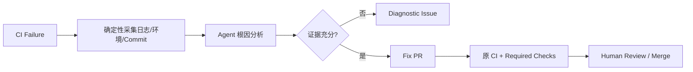

# GitHub Agentic Workflows 企业采用 Playbook

## 一、从正确任务开始

首批任务应同时满足：需要语义判断、已有结构化上下文、输出可经 PR/Issue 审查、存在确定性验证、失败可回滚。

推荐顺序：

1. 周期性状态报告、Issue Triage、CI Failure 诊断；
2. 文档/Test/Build 配置修复 PR；
3. 依赖、安全和组织治理建议；
4. 多仓变更编排与 Release Readiness；
5. 不直接试点生产 Deploy、Sign、Promote、Delete 或修改 Gate。

## 二、最短使用路径

```bash
gh auth login --scopes repo,workflow
gh extension install github/gh-aw
gh aw init
gh aw add-wizard githubnext/agentics/ci-doctor
gh aw validate --strict
gh aw compile --strict --actionlint --zizmor --poutine
gh aw run ci-doctor
```

企业环境应固定扩展版本，而不是长期追踪 `latest`。仓库中提交：

- `.github/workflows/<name>.md`；
- `.github/workflows/<name>.lock.yml`；
- `.github/aw/actions-lock.json`；
- 共享 Imports 的固定版本和缓存；
- 组织约定的 Owner、风险、预算和评测元数据。

## 三、Workflow 设计顺序

1. **Trigger：** 谁、什么事件、多久一次；先配置 `roles`、Fork/Label/Bot 过滤和 Rate Limit；
2. **Read Permission：** 只给完成任务所需的 Repository Scope；
3. **Tools：** 选择最小 GitHub Toolset、具体 `allowed` Tool、Repo Allowlist 和 Timeout；
4. **Network：** 从 `defaults` 起步，逐域增加，不开放任意出口；
5. **Safe Outputs：** 明确允许的副作用、目标仓库、最大数量、标题前缀和 Staged Mode；
6. **Budget：** 设置 Run/Daily Credits、Timeout、Max Turns、Concurrency；
7. **Instructions：** 写目标、输入事实、步骤、禁止项、成功条件、无法完成时的升级方式；
8. **Oracle：** 写明哪个 Test、Scan、Policy、Required Check 或人类批准判定成功。

## 四、Prompt 模板

自然语言正文至少包含：

```markdown
# 目标
说明这次运行唯一要改善的结果。

## 可使用的事实
列出事件、仓库文件、日志、工具与时间范围。

## 工作步骤
先收集证据，再形成假设；只在证据支持时提出变更。

## 禁止项
不得修改测试来掩盖失败，不得降低门禁，不得猜测缺失数据。

## 输出契约
使用声明的 Safe Output；包含证据、剩余不确定性和复验方法。

## 完成标准
由指定 Test/Scan/Policy/Required Check 判定；无法满足时创建诊断 Issue。
```

## 五、安全基线

| 控制 | 企业最低要求 |
|---|---|
| Engine Identity | Copilot 优先组织计费 Token；第三方 Engine 使用独立、可轮换 Secret/WIF |
| Agent Job | Read-only；不把生产 Secret 注入 Agent Container |
| GitHub Tools | 明确 Toolset、Allowed Tool、Allowed Repo 与调用上限 |
| MCP | 固定镜像/包、Tool Allowlist、隔离容器、Server Owner 与撤回 |
| Network | Allowlist + Firewall Audit；禁止宽泛通配符 |
| Safe Outputs | Staged 首跑；类型、目标、`max`、Prefix 和 Allowed Repos 收窄 |
| Threat Detection | 保持启用，并叠加 Secrets/SAST/Policy Scanner |
| PR | Draft/Review、Required Checks、Branch Protection，不自动 Merge |
| Actions Supply Chain | Compiler/Action/Import 固定版本与 SHA，Lock Diff 必审 |
| Cost | Run/Daily Budget、Timeout、Rate Limit、Concurrency、Kill Switch |

## 六、复杂场景拆分模板

### CI Failure Doctor



禁止 Agent 为通过 CI 而删除测试、扩大重试、修改 Gate 或直接重跑无限次。先把日志裁剪成结构化 Artifact，再给 Agent，避免上下文和成本失控。

### 多仓升级

- 中央 Orchestrator 只读取 Repo Catalog、风险和兼容矩阵；
- 按语言/依赖/团队分 Wave，每次 Fan-out 有 `max`；
- Worker 每次只修改一个 Repo，并只允许 `create-pull-request`；
- Project/Issue 保存 Correlation ID、状态和失败原因；
- 可重复失败进入人工队列，不让 Orchestrator 无限重派。

### Release Readiness

- Deterministic Job 收集 Commit、Artifact Digest、SBOM、Test、Scan、Deploy History；
- Agent 输出风险摘要、缺失证据、验证顺序和回滚方案；
- Safe Output 仅创建 Readiness Issue/Discussion；
- 原 Release Workflow 绑定 Artifact、Environment Protection 和 Approver；
- Agent 不直接持有 Production Credential，也不宣布“已验证”未实际执行的检查。

## 七、共享与升级

建立中央 `agentic-workflows` 仓库：

- `workflows/` 放完整模板；
- `shared/` 放 Tools、Network、Safe Output 和 Prompt Fragment；
- Production Consumer 固定 Tag/SHA，Development Consumer 可跟 Branch；
- `gh aw update --create-pull-request` 更新内容，`gh aw upgrade --create-pull-request` 更新 Compiler/Infrastructure；
- Lock File、Import Manifest、Action Pin 和权限变化作为高风险 Review 项。

## 八、运行与评测

每个 Workflow 建立 Dashboard：

- 触发次数、Activation Skip、成功/失败/超时；
- Agent Turn、AI Credits、Actions Minutes、P50/P95 时延；
- Tool/MCP 调用错误、Network Deny、Threat Detection Block；
- Safe Output 数量、PR 创建率、CI 首次通过率、合并率；
- 人工修改量、回归、误报、重复 Issue 和人工介入；
- 单位成功任务成本和相对人工基线的净收益。

用 `gh aw logs` 查看运行与 Artifact，用 `gh aw audit` 分析 Firewall、Tool 和策略行为。重要 Workflow 每次 Model、Compiler、Prompt、Tool 或 Policy 升级都要跑回归集。

## 九、退出条件

出现以下任一情况应暂停自动运行：

- Threat Detection、Network 或 Safe Output 出现绕过；
- 连续失败/重复输出超过预算阈值；
- Agent 修改测试、门禁或安全配置以制造绿灯；
- Lock File 版本被 Block 或升级无法稳定复现；
- PR 首次通过率、合并率或节省时间长期低于设定基线；
- 输出无法追溯到 Trigger、Prompt、Model、Tool、Policy 和 Human Decision。
