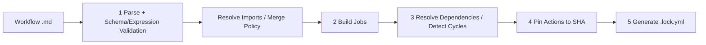
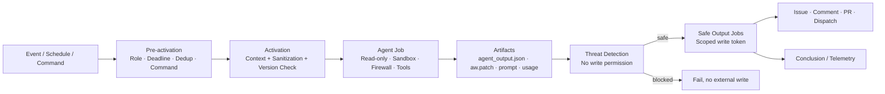
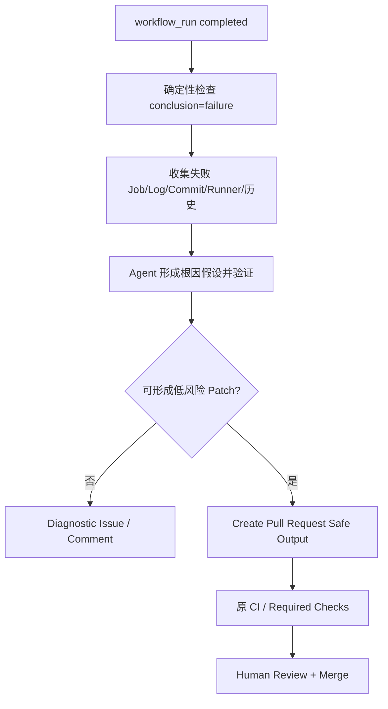
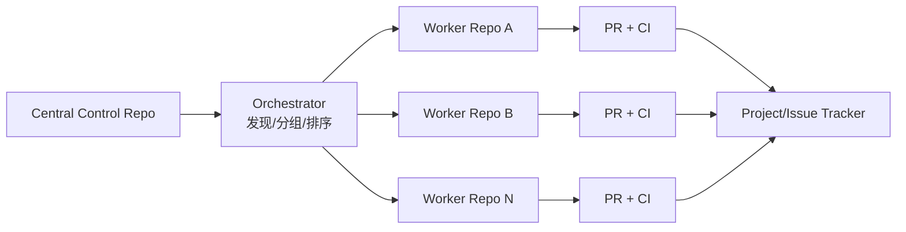
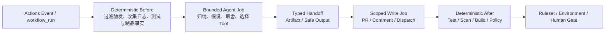

# GitHub Agentic Workflows 深度洞察报告

**观察日：** 2026-07-15<br>
**产品状态：** Public Preview<br>
**开源实现：** [github/gh-aw](https://github.com/github/gh-aw)，MIT License<br>
**观察日 Latest Release：** [v0.81.6](https://github.com/github/gh-aw/releases/tag/v0.81.6)，发布于 2026-06-27<br>
**核心定位：** 在 GitHub Actions 上运行受约束的 Coding Agent，为传统 CI/CD 增加 Continuous AI 推理层

> [!summary] 一句话判断
> GitHub Agentic Workflows 的价值不在“用 Markdown 取代 YAML”，而在于把不确定的 Agent 推理编译进一个可审查的 Actions 执行计划：Agent 在只读隔离区内分析，写动作先缓冲为类型化 Artifact，再由 Threat Detection 和独立权限 Job 外化。它适合调查、维护、修复 PR 和跨仓协调，不应直接替代 Build/Test/Policy/Deployment Gate。

## 一、产品定位与成熟度

[GitHub 2026-06-11 公告](https://github.blog/changelog/2026-06-11-github-agentic-workflows-is-now-in-public-preview/) 将 Agentic Workflows 从 Technical Preview 推进到 Public Preview。它允许在 GitHub Actions 中运行 Copilot、Claude、Codex、Gemini 等 Coding Agent，用自然语言处理 Issue Triage、CI Failure Analysis、Documentation Update 等需要上下文判断的任务。

它与相邻能力的区别：

| 能力 | 主体 | 典型触发 | 主要输出 | 边界 |
|---|---|---|---|---|
| 普通 GitHub Actions | 确定性 Step/Job | Push、PR、Schedule | Build/Test/Deploy/Artifact | 不擅长开放式判断 |
| GitHub Agentic Workflows | 事件驱动 Coding Agent + Actions | Actions Event、Command、Schedule | Issue/Comment/PR/Worker Dispatch | Public Preview；需 Safe Output |
| GitHub Copilot Coding Agent | 任务型远程 Coding Agent | Issue Assignment/Delegation | Implementation PR | 更专注一次性开发任务 |
| Copilot Code Review | PR Reviewer | PR Update/Request | Review Comment | 更专注评审，不是通用 Workflow 编排 |
| GitHub MCP Server | Tool Protocol Server | Host Runtime Tool Call | GitHub Read/Write Capability | 不是 Agent、Scheduler 或 Pipeline |

因此它不是 CI/CD 的替代品，而是 Actions 上的一类新 Job：能理解上下文、选择工具、提出变更，再把结果交回确定性系统验证。

### 当前采用风险

- Public Preview，Schema、CLI、计费和行为仍可能变化；
- `gh-aw` 按周或双周发布 Minor，版本号不代表变更规模；
- 官方仓库曾宣布 0.68.4—0.71.3 因计费 Bug 被退役，说明版本运营不是理论风险；
- 编译后的 Workflow 会在 Activation 阶段检查 Blocked、Minimum 和 Recommended Version，问题版本可被阻断；
- 官方案例和指标以 GitHub/GitHub Next 自身实践为主，缺少独立大规模对照。

生产使用必须固定 Compiler、Action、Import、Workflow Source 和 Engine/Model，并把升级做成 PR 与回归流程。

## 二、如何使用

### 1. 前置条件

[GitHub 创建指南](https://docs.github.com/en/copilot/how-tos/github-agentic-workflows/creating-github-agentic-workflows) 要求：

- 有写权限的 GitHub Repository；
- 已启用 GitHub Actions；
- 已安装并登录 GitHub CLI；
- 安装 `github/gh-aw` CLI Extension；
- 配置一种 Agent Engine 的认证。

认证选择：

| Engine | 推荐认证 | 说明 |
|---|---|---|
| Copilot | 组织仓使用 `copilot-requests: write` + Actions Token | 组织需允许 Copilot CLI Billing；无需个人 PAT |
| Claude | `ANTHROPIC_API_KEY` 或 Anthropic WIF | WIF 可避免长期静态密钥 |
| Codex | `OPENAI_API_KEY` / `CODEX_API_KEY` | 运行时按文档回退选择 |
| Gemini | `GEMINI_API_KEY` | Google AI Studio Key |

额外的跨仓读取、Projects、Remote GitHub Tools、创建跨仓 PR、触发 CI 或分配 Coding Agent 仍需要更强的 GitHub App/PAT。Engine Token 与 GitHub 写 Token 是两个不同能力面。

`copilot`、`claude`、`codex`、`gemini` 是当前正式列出的 Engine；`opencode`、`pi` 仍属于实验路径。Engine 功能并不完全对齐，例如 Codex Web Search 需显式启用。默认安装 Engine CLI 的 Latest 也会引入漂移，企业应同时固定 gh-aw、Engine CLI 和 Model。

### 2. 初始化和安装

```bash
gh auth login --scopes repo,workflow
gh extension install github/gh-aw
gh aw init
```

`gh aw init` 会加入用于 Agentic Workflow Authoring 的 Skill、Instructions、Custom Agent 和 `.gitattributes`。默认还会配置 `gh-aw` 自身的 MCP Integration；不需要时可使用 `gh aw init --no-mcp`。这项 MCP 让 Authoring Agent 调用 Compile、Audit、Logs、Status 等管理能力，不等于运行中的业务 MCP Toolset。之后可选择：

```bash
# 从官方示例交互式安装
gh aw add-wizard githubnext/agentics/ci-doctor

# 非交互安装，并固定来源版本
gh aw add githubnext/agentics/ci-doctor@v1.0.0

# 从零创建
gh aw new ci-health-review
```

安装后仓库通常出现：

```text
.github/
  workflows/
    ci-doctor.md
    ci-doctor.lock.yml
  aw/
    actions-lock.json
    imports/
```

`.md` 是源文件，`.lock.yml` 是 Actions 实际执行文件。两者都提交；Lock File 不手工编辑。

### 3. Workflow 结构

> [!tip] 配置速查
> 如需直接查看可复制的 Frontmatter、逐字段含义和验证命令，见 [[60_tutorials/github-agentic-workflows-config|GitHub Agentic Workflows 配置速查]]。

一个 Workflow 有两部分：

```markdown
---
on: weekly on monday

permissions:
  contents: read
  issues: read
  actions: read
  copilot-requests: write

network: defaults

tools:
  github:
    toolsets: [repos, issues, actions]

safe-outputs:
  create-issue:
    title-prefix: "[ci-health] "
    labels: [automation, ci]
    close-older-issues: true

max-ai-credits: 500
timeout-minutes: 15
---

# Weekly CI Health Review

Analyze failed and slow workflow runs from the last seven days.
Create one issue with evidence, recurring causes, prioritized actions,
and checks maintainers should run before accepting a proposed change.
```

Frontmatter 是机器约束：Trigger、Permission、Engine、Tools、Network、Safe Outputs、Budget、Steps/Jobs。Markdown Body 是 Agent Task：目标、证据、工作法、禁止项、输出和成功条件。

> [!important] 编译边界
> 修改 Frontmatter 必须重新 `compile`。自然语言正文运行时从 `.md` 加载，正文修改通常不需要重新编译；但企业仍应让正文变更经过 PR Review 和 Prompt 回归。

### 4. 编译、验证、运行和调试

```bash
gh aw validate --strict
gh aw compile --strict --actionlint --zizmor --poutine
gh aw run ci-doctor
gh aw logs ci-doctor
gh aw audit <run-id>
```

推荐 CI 检查：

1. `gh aw validate --json` 输出机器可读验证结果；
2. `compile --strict` 拒绝过宽/危险配置；
3. Actionlint、Zizmor、Poutine 检查生成 Actions；
4. Review `.md`、`.lock.yml`、Action Pin、权限、Network 和 Safe Output Diff；
5. 首次启用 `safe-outputs.staged: true`，只预览副作用；
6. 人工触发少量运行，检查 `logs`、`audit`、Artifact、Token 和 Network；
7. 再开放 Schedule/Event Trigger。

## 三、技术原理：从 Markdown 到受约束 Actions

### 1. 编译阶段

[Compilation Process](https://github.github.com/gh-aw/reference/compilation-process/) 将流程分为五步：



编译器构造的 Job 包括 Pre-activation、Activation、Agent、Detection、Safe Outputs、Custom Jobs 和 Conclusion；生成依赖拓扑和 Mermaid 图，将 GitHub Actions 依赖固定到 Commit SHA，并缓存到 `actions-lock.json`。

Lock 中的 Frontmatter Hash 用于发现过期编译产物，不是防篡改边界：拥有仓库写权限的人可以同时修改 `.md` 并重编译。因此仍需 Branch Protection、CODEOWNERS 和 Lock Diff Review。已有 Lock 上新增 Secret 或 Custom Action 时，Safe-update 模式会要求显式批准，用于阻止配置面静默扩张。

远程 Import 也在编译期解析并记录 Commit。共享配置的合并不是简单文本拼接：Tools、Network、Permissions、Safe Outputs 和 Runtime 有不同 Merge Rule，Compiler 还会检测循环 Import 与依赖。

### 2. 运行时 Job 图



Pre-activation 可以在花费模型成本前检查 Actor Role、`stop-after`、重复项和 Slash Command 位置。Activation 准备上下文、清理事件文本，并验证编译版本仍被允许。

Agent Job 完成 Checkout、Runtime/Cache、MCP 初始化、Prompt 生成和 Engine 执行。它将安全输出 JSON、Git Patch、Prompt、Usage 和 Firewall Log 上传为 Artifact，而不是直接写 GitHub。

### 3. 三层信任模型

[Security Architecture](https://github.github.com/gh-aw/introduction/architecture/) 把信任分为：

| 层 | 信任对象 | 负责控制 | 失效后果 |
|---|---|---|---|
| Substrate | Runner VM、Kernel、Container Runtime、Firewall、API Proxy、MCP Gateway | 内存/进程/网络隔离 | 整体安全保证可能失效 |
| Configuration | Actions、Network Policy、MCP Config、Tool Allowlist、Token 分配 | 加载什么、如何连接、权限是什么 | 过宽或错误配置扩大能力 |
| Plan | Compiler 生成的 Stage 与 Artifact Flow | 哪个阶段能做什么、何时外化副作用 | 写入检查不完整或阶段越权 |

因此“有 Sandbox”并非全部安全。企业还要审查底层 Runner、Compiler、Configuration、Token 和阶段转换。

### 4. Agent Workflow Firewall 与 MCP

Agent 运行在容器中，HTTP/HTTPS 经 Squid Proxy 和 Domain Allowlist；Firewall 记录允许/拒绝、请求量和策略来源。`gh aw audit` 可查看域名访问和 Policy Attribution。未声明 `sandbox` 时 Agent 默认使用 AWF；`network: {}` 可阻断全部网络，`blocked` 优先于 `allowed`。若显式关闭 Agent Sandbox，Network 配置只能继续参与输出清理，不能阻止 Agent 直接出网，因此这类配置应由组织 Policy 禁止。

MCP Gateway 可启动隔离的 MCP Server Container：

- 本地 Server 通过自动生成 Dockerfile 和 stdio 连接；
- HTTP Server 直接连接 URL/Header；
- `allowed:` 决定暴露给 Agent 的 Tool；
- Server Container 相互隔离；
- Network Allowlist 继续限制 MCP 对外访问。

Gateway Key 不应被视为 Agent Container 内的强安全边界；官方架构明确要求依赖底层隔离、网络策略和分阶段写权限。`registry:` 当前只是来源元数据，不强制验证或准入。还要区分“配置和运行 MCP Server”与 `sandbox.mcp` 统一 Gateway：后者截至观察日仍标为 Experimental。

### 5. GitHub Tools

默认 GitHub Tools 提供 Context、Repos、Issues、Pull Requests、Users。Actions、Code Security、Dependabot、Projects 等需要显式加入 Toolset，部分还需额外认证。

企业至少同时收窄：

- `toolsets`：开放哪些 API 组；
- `allowed`：具体 Tool 和单 Tool 调用上限；
- `allowed-repos`：能读取哪些仓库；
- `mode`：Local MCP、Remote MCP 或 `gh-proxy`；
- `tools.timeout`/`startup-timeout`：调用与 Server 启动上限。

Tool 可读不等于 Safe Output 可写。读 Token、Agent Engine Token 和写 Token 应拆开。

## 四、Safe Outputs：为什么 Agent 不直接写

Safe Outputs 将副作用变为类型化、可限制的能力。常见类型包括创建 Issue/Discussion/PR、添加评论/标签、更新 Release、推送 PR Branch、上传 Asset、调用/派发其他 Workflow。

每种能力可以配置：

- 目标仓库和 Allowed Repos；
- 最大调用次数；
- Title Prefix、Label、Branch 等结构限制；
- 独立 GitHub Token 或 GitHub App；
- Environment Protection；
- Staged Mode；
- Text/URL/GitHub Reference Sanitization。

Agent 只把“想做什么”写入 `agent_output.json` 或 Patch Artifact。Safe Output Job 下载 Artifact、Schema 校验、清理文本、应用 Policy，再用最小写权限调用 API。

一个反直觉默认是：如果完全不写 `safe-outputs:`，或只声明 System Output，Compiler 会加入一个保守的 `create-issue`（通常 `max: 1`）。希望做到绝对无外部写入时不能依赖“省略配置”，必须检查实际 Lock 与当前版本行为。

### Threat Detection 的真实边界

当配置 Safe Outputs 时，Threat Detection 默认加入 Agent 与写 Job 之间，检查 Prompt Injection、Secret Leak、Malicious Patch 和 Policy Violation。它没有写权限，只有 Pass/Fail Verdict；还可加入 Semgrep、TruffleHog 等确定性 Scanner。

但默认 Detection 仍使用 AI Engine，因此应视为额外防线而非安全证明。关键仓库至少叠加：

- Secret Scan、SAST、Dependency/License Policy；
- 禁止修改 `.github/workflows`、Agent Instructions、Package Script、安全配置等敏感路径，除非专门审批；
- Branch Protection、Required Review、CODEOWNERS；
- Production Environment Approval。

Integrity Filtering 与 Safe Outputs 解决不同问题：前者控制哪些不可信内容进入 Agent Context，后者控制哪些副作用可以外化。公共仓的 GitHub MCP 内容默认应用 `min-integrity: approved`；私有/内部仓默认没有相同 Guard Policy，企业不能误以为两类仓库有完全一致的默认防护。

## 五、复杂场景实践

### 场景 1：CI Failure Diagnosis 与 Fix PR

#### 推荐流程



#### 实践要点

- Actions Toolset 只读 Workflow Run、Job 和 Artifact；
- 确定性 Step 先裁剪日志、提取错误码、失败测试和环境差异；
- Prompt 明确禁止删除测试、跳过 Gate、无界重试和修改 Branch Protection；
- 找不到证据时输出 Diagnostic Issue，不猜测修复；
- PR 必须重新进入原 CI。gh-aw 文档称默认 Actions Token 创建的 PR 不触发 CI；当前 Actions 文档对 PR `opened`/`synchronize`/`reopened` 增加“生成待批准 Run”的例外。若要求无需批准地运行，应配置最小 GitHub App/PAT 或专用 CI Trigger Token，并按仓库实测；
- 统计 Root Cause 准确率、首次通过率、人工修改量、重复失败和单位成功成本。

GitHub Next [CI Doctor](https://github.github.com/gh-aw/blog/2026-01-13-meet-the-workflows-quality-hygiene/) 自报 13 个候选修复 PR 中 9 个被合并，证明该团队内部获得实用价值；这不是跨仓基准。

### 场景 2：复杂 PR Gate 与多 Agent Review

一个 Workflow 不应同时承担架构、安全、测试和性能的所有判断。可由 Orchestrator 读取 PR 风险信号，选择多个 Worker：

- Security Worker：只读 Code Security/SARIF/Dependency；
- Test Worker：读取 Coverage/Test Result，允许补测试 PR；
- Performance Worker：读取 Benchmark Artifact，产生分析 Issue；
- Judge/Aggregator：去重并形成最终 Review Summary。

每个 Worker 有独立 Toolset、Budget、Timeout 和 Safe Output；最终 Merge Gate 仍由 Required Check、Policy 和 Reviewer 决定。模型可以解释 Gate，不应改写 Gate。

### 场景 3：组织级多仓依赖升级

采用 CentralRepoOps + OrchestratorOps：



控制原则：

1. Orchestrator 只决定批次和派发，不持有每个 Repo 写权限；
2. 先用 Repo Metadata、语言、Owner、风险和测试可用性做 Wave；
3. Worker 每次只处理一个 Repo，PR 数量受 `max` 限制；
4. 私有仓读取与跨仓写优先用 GitHub App，按 Repository/Permission Mint Token；
5. 用 Correlation ID 和 Project 记录 Parent/Worker/PR/CI；
6. Partial Failure 不回滚已合并 Repo，而是暂停下一 Wave 并升级人工；
7. 共享 Workflow 从中央仓按 Tag/SHA 安装，Import/Action/Lock 版本可追溯。

Orchestrator 的 Frontmatter 可以只声明允许派发的 Worker 和最大次数：

```yaml
safe-outputs:
  dispatch-workflow:
    workflows: [dependency-audit-worker, dependency-fix-worker]
    max: 10
```

Compiler 会校验同仓目标 Workflow 存在且支持 `workflow_dispatch`。需要同步完成并保留 Actor/Billing Attribution 时使用 `call-workflow`；需要异步、可独立续跑时使用 `dispatch-workflow`。跨仓则使用 `dispatch-repository` 或 Cross-repo Safe Output，但前者仍为 Experimental，应优先让目标仓 Worker 自己持有写权限。

### 场景 4：Release Readiness，而不是 Autonomous Release

将 Agent 放在发布决策之前：

1. Deterministic Steps 收集 Release Candidate Commit、Artifact Digest、SBOM、Signature、Test、SAST/SCA、Known Issue、Dependency 和近期 Incident；
2. Agent 检查证据完整性、解释残余风险、提出验证序列和回滚计划；
3. Safe Output 只更新 Release Draft 或创建 Readiness Issue；
4. 人类批准绑定 Artifact Digest、Environment、Plan 和有效期；
5. 传统 Reusable Deployment Workflow 执行 Deploy/Canary；
6. SLO/Telemetry Gate 决定继续、停止或调用预批准 Rollback。

确定性证据可先写入 Agent Artifact 目录，再让 Agent 读取：

```yaml
steps:
  - name: Collect release evidence
    run: |
      ./scripts/export-release-evidence \
        --format json \
        --output /tmp/gh-aw/agent/release-evidence.json

safe-outputs:
  create-issue:
    title-prefix: "[release-readiness] "
    labels: [release, needs-review]
    max: 1
```

这里的 Script/Scanner 产生事实，Agent 只解释事实并指出缺失项；若证据收集 Job 失败，应直接阻止 Agent 宣布 Ready。

Agentic Workflow 不应获得 Production Secret，也不应在缺失 Oracle 时通过自然语言宣布 Ready。

### 场景 5：Research → Plan → Assign → Merge

[ResearchPlanAssignOps](https://github.github.com/gh-aw/patterns/research-plan-assign-ops/) 将长周期改善拆成四个有 Artifact 的阶段：

- Research：周期性分析，写 Discussion；
- Plan：把建议拆成有验收标准的 Issue/Sub-issue；
- Assign：人选择 Issue，再分配给 Coding Agent；
- Merge：原 CI 和人类评审决定合并。

这比一个常驻 Agent 直接不断修改代码更适合架构债、安全改造和测试改善，因为每次阶段转换都是检查点。

### 场景 6：Side Repo 与中央治理

不希望在主仓直接安装 Preview Agent 时，可在私有 Side Repo 运行：读取目标仓、创建目标仓 Issue/PR，主仓只保留必要的 Command Bridge。它隔离 Workflow Source、Secret、Run History 和实验噪声，适合早期试点和跨多个遗留仓的只读治理。

缺点是跨仓 Token、Checkout Layout、Slash Command Relay、审计归属和 Network 配置更复杂。Side Repo 不是自动安全，仍需 Target/Allowed Repo 和最小 App Permission。

## 六、与固定 GitHub Actions CI/CD 流程的关系

> [!abstract] 核心洞察（2026-07-21 补充核验）
> GitHub Agentic Workflows 与固定 Actions 不是并列的两套 Pipeline，也不是用自然语言替换 YAML。它把开放式判断封装进编译后的 Actions Job，由固定 Actions 继续承担执行骨架、数据通道、权限边界和结果 Oracle。最准确的概括是：**流程拓扑固定，局部判断动态，最终放行确定。**

GitHub 官方把它定义为对既有确定性 CI/CD 的增强；`gh aw compile` 最终生成可执行的传统 Actions `.lock.yml`。因此两者存在三层关系，而不只是“Agent 跑在 Actions Runner 上”。

### 6.1 编译层：Agentic Workflow 从属于 Actions 执行模型

`.md` 是更适合人和 Agent 维护的源文件，Compiler 把 Frontmatter 中的 Trigger、Permission、Engine、Tool、MCP、Skill、Step/Job 和 Safe Output 编译为 `.lock.yml`。生成物继续沿用 Actions 的核心语义：

- `on` / `workflow_run` / `workflow_dispatch` 等 Event 决定何时启动；
- Runner、Job、Step、`needs`、`if` 和 Artifact 决定在哪里运行、如何传递数据；
- `permissions`、Secret、Environment 和 Token 决定每个 Job 能做什么；
- `concurrency`、Timeout、Reusable Workflow 和日志体系继续承担运行控制。

Compiler 固定外层 Job 图和权限阶段，Agent Engine 只在 Agent Job 内动态理解上下文、选择 Tool 并产生候选行动。换言之，**动态的是 Job 内的推理路径，不是整条 CI/CD 拓扑在运行时任意自我改写。** [Compilation Process](https://github.github.com/gh-aw/reference/compilation-process/)

### 6.2 运行层：确定性流程包住概率决策

GitHub 官方的 DeterministicOps 模式允许在同一 Agentic Workflow 中组合 `steps:`、`jobs:` 与 AI 推理。企业应把它设计成“确定性—Agent—确定性”的夹心结构：



| 位置 | 固定 Actions 的职责 | Agentic Workflow 的职责 |
|---|---|---|
| Agent 之前 | 去重、角色/路径过滤、日志裁剪、查询 Check、生成 SBOM/测试/制品事实 | 读取已经结构化、范围受限的上下文 |
| Agent Job | 提供 Runner、Artifact、Permission、Timeout、Sandbox 与网络控制 | 对无法预先枚举的证据做解释，形成假设并选择允许的 Tool |
| Agent 之后 | Threat Detection、Schema/Policy 检查、最小权限写入、原 Test/Scan/Build 复验 | 只提交类型化候选结果，不自行宣布成功 |

一个重要边界是：官方明确说明自定义 `steps:` 和 `jobs:` 在 Agent Firewall 沙箱之外、按标准 GitHub Actions 安全模型运行。它们可安全地承担确定性计算，但必须单独审查 Action Pin、Shell、Secret、Permission 和 Runner；不能因为写在 Agentic Workflow 中，就假设自动继承 Agent Job 的隔离。 [Custom Steps and Jobs](https://github.github.com/gh-aw/reference/steps-jobs/)

### 6.3 流程间：固定 CI 与 Agentic Workflow 形成受控反馈环

两者还可以拆成相互接力的独立 Workflow：

1. 原固定 CI 先运行 Build/Test/Scan，并用 `workflow_run` 在完成、失败或取消后触发 Agentic Workflow；
2. Agent 读取 Run、Job、Artifact 和日志，输出诊断、Comment、修复 PR 或受控 `dispatch-workflow` 请求；
3. 原固定 CI 对新 Commit、PR 或 Dispatch 输入重新执行，不接受 Agent 的“已修复”自我判断；
4. Required Checks、Ruleset、CODEOWNERS、Environment Protection 和人工批准决定是否合并、部署或晋级。

这里有一个实际接口需要显式设计：gh-aw 的 Triggering CI 文档称默认 `GITHUB_TOKEN` 创建或更新的 PR 不触发 CI；当前 GitHub Actions `GITHUB_TOKEN` 文档则增加了例外——PR `opened`、`synchronize`、`reopened` 可以产生等待人工批准的 Workflow Run，其他事件仍受防递归限制。因两份官方文档口径存在差异，PR 创建既不能画成“CI 必然自动运行”，也不能一概写成“完全不触发”。若要求无需人工批准地闭环，应把收窄 Repo 权限的 GitHub App 或 PAT 配置给 PR Safe Output Job，并按 Token 身份、事件类型和仓库策略做实测；不要因此把广泛写 Token 交给主 Agent。[Triggers](https://github.github.com/gh-aw/reference/triggers/)、[Triggering CI](https://github.github.com/gh-aw/reference/triggering-ci/)、[GitHub Actions `GITHUB_TOKEN`](https://docs.github.com/en/actions/concepts/security/github_token#when-github_token-triggers-workflow-runs)

### 6.4 能力分工：已知路径交给 Actions，未知路径交给 Agent

| 对比维度 | 固定 GitHub Actions CI/CD | GitHub Agentic Workflow | 组合方式 |
|---|---|---|---|
| 任务形态 | 输入、步骤、分支和成功条件可预先编码 | 证据不完整、路径难枚举、需要语义判断 | Actions 准备事实，Agent 选择候选路径 |
| 执行特性 | 同输入和版本下应可重复、易审计 | 模型输出具有概率性，需预算与停止条件 | 把概率性限制在 Agent Job 内 |
| 典型工作 | Lint、Test、Build、Scan、Package、Deploy | 归因、风险解释、Triage、修复建议、证据综合 | Agent 产 PR/计划，原工作流复验 |
| 权限与副作用 | Job Token、Environment、Ruleset 明确授权 | 主 Agent 默认只读，只提出候选行动 | Safe Output 独立 Job 持有最小写权限 |
| 成功证明 | Exit Code、Test、Policy、Artifact Identity、Approval | 置信度、证据和建议，不构成最终证明 | 固定 Actions 和人类继续担任 Oracle |

### 6.5 沿 CI/CD 阶段的落位

| 阶段 | Agentic Workflow 适合 | 应保留为确定性控制 |
|---|---|---|
| 代码检查 | 语义 Review、Issue/PR 归类、修复建议 | Linter、Type Check、Required Review |
| 静态/安全 | 解释告警、可达性假设、修复 PR | SAST/SCA/Secret/License Gate |
| 测试/门禁 | 补测试、分析 Flaky/Failure、风险摘要 | Test Runner、Coverage Policy、Merge Gate |
| 构建 | 日志诊断、Build Config PR、优化建议 | Compiler、Builder、Reproducibility、Artifact |
| 制品/版本 | Release Note、升级 PR、证据归纳 | SBOM、Signature、Immutable Artifact、Promotion |
| 部署 | Plan 解释、依赖/风险与 Runbook 准备 | Environment Approval、Deploy Job、Credential |
| 发布 | Readiness Report、Canary 观察建议 | Change Policy、Artifact Binding、Rollout Controller |
| 恢复 | Incident 归因、受限 Runbook 建议 | SLO Trigger、Pre-approved Action、Break-glass |

这意味着企业不需要先改写整条 Pipeline。最低风险的采用路径，是在既有固定 Workflow 的前后插入一个有清晰输入、类型化输出和原门禁复验的 Agent 岛：**Actions 负责可重复执行和证明，Agent 负责处理原来难以编码的不规则信息。**

## 七、成本、可观测和运营

规范性 [AI Credits Specification](https://github.github.com/gh-aw/specs/ai-credits-specification/) 将 1 AIC 定义为 0.01 USD 的厂商归一化单位；它不是 Provider 最终账单或独立成本审计。规范默认包括约 20 分钟 Agent Step Timeout、每次 1000 AIC、每 Workflow 滚动 24 小时 5000 AIC，可通过 `timeout-minutes`、`max-ai-credits` 和 `max-daily-ai-credits` 调整。Threat Detection 有独立预算，不能只估算主 Agent。

当前官方文档存在一个必须保留的矛盾：Cost Management/Frontmatter 的部分段落称未设置日限额时默认禁用，而 AIC Specification、Rate Limiting 和生成表达式使用 5000 Fallback。本报告以规范和实际固定版本生成的 Lock 为核验准绳，不把日限额默认值当作跨版本稳定契约。手动/命令触发及部分 Dispatch/Workflow Call 路径还可能绕过日限额，企业应在 Actions、Provider 和组织预算层再设外部上限。

还应配置：

- `user-rate-limit` 防 Comment/Command 滥用；
- Actions `concurrency` 避免重复运行堆积；
- `stop-after` 让临时 Automation 自动过期；
- `skip-if-match` 避免重复 Issue/PR；
- `max` 限制 Safe Output 和 Worker Fan-out；
- Cache/Repo Memory 只在明确数据生命周期后启用。

`gh aw logs` 可聚合 Engine/Model/CLI、Prompt、Turn、Token、MCP Health、Safe Output、Job 和 Artifact；`gh aw audit` 可审计 Firewall Domain Allow/Deny 与策略。OpenTelemetry 可进入企业观测系统，但 Resource Attribute 不能放 Secret。

### 运营指标

| 维度 | 指标 |
|---|---|
| 价值 | 节省人工时间、首次解决率、PR 合并率、Issue 关闭率 |
| 质量 | CI 首次通过率、人工改动量、回归、错误 Root Cause |
| 安全 | Threat Block、Network Deny、越权 Tool、Secret Leak、敏感路径修改 |
| 可靠性 | Activation Skip、Timeout、MCP Error、重复运行、版本阻止 |
| 经济性 | AI Credits、Actions Minutes、每成功任务成本、P50/P95 时延 |
| 自治 | Safe Output 采纳率、人工批准/拒绝、自动动作后的回滚率 |

## 八、企业规模化与版本治理

推荐建立一个中央 Agentic Workflow Repository：

```text
agentic-workflows/
  workflows/
    ci-doctor.md
    release-readiness.md
  shared/
    tools-readonly.md
    network-policy.md
    safe-output-pr.md
    threat-detection.md
  tests/
    trigger-fixtures/
    prompt-injection/
    expected-tools/
```

消费者使用 `gh aw add org/agentic-workflows/ci-doctor@v1`；共享 Fragment 用固定 Tag/SHA Import。生产 Consumer 不直接跟 `main`。平台团队分开管理：

- `gh aw upgrade`：更新 CLI/Compiler、Codemod、Action Pin 和 Lock；
- `gh aw update`：更新有 `source:` 的 Workflow Content；
- Model/Prompt/Tool/Policy 升级：运行企业任务回归；
- Blocked Version：停止 Schedule，统一重编译并分批恢复。

Lock Diff 中最重要的是 Permission、Job Graph、Network、MCP、Safe Output、Secret Flow、Action SHA 和 Runtime 变化，而不是生成 YAML 的格式噪声。

## 九、限制与不适用场景

不适合或不应优先采用：

- 能用 20 行确定性 Script 完成的固定任务；
- 没有可靠 Test/Scan/Policy Oracle 的高风险变更；
- 需要亚秒级、强实时或严格 Exactly-once 的流程；
- 需要处理大规模原始日志但没有预聚合/分页的任务；
- 必须直接持有生产管理员权限的操作；
- 无法承担 Preview 升级、回归和成本运营的平台团队；
- 不能把代码、Issue、日志或工具元数据交给所选模型 Provider 的环境。

主要失败模式：

- Prompt 写得像愿望，缺少输入、禁止项和完成标准；
- Toolset/Repo/Network 过宽，Safe Output 仅靠名称约束；
- Agent 生成 PR 后未触发原 CI；
- 一个 Workflow 同时做研究、修改、发布和恢复；
- 共享 Template 跟踪 Branch，Lock/Import/Model 漂移无回归；
- 只看 Actions 成功，不看 Agent 输出是否正确；
- Threat Detection 使用同类模型，却被误认为独立确定性 Oracle；
- 多仓 Fan-out 没有 Batch、Correlation、Rate Limit 和 Partial Failure 策略。

## 十、最终判断与建议

GitHub Agentic Workflows 是 2026 年最值得关注的 Agentic CI/CD 架构样本之一，因为它公开展示了如何把自然语言任务、Coding Agent、MCP、Actions 和安全控制组合成可检查实现。其真正可复用的设计原则有四个：

1. **编译约束：** 人类友好源文件必须生成可审计执行物；
2. **权限分阶段：** 推理组件不直接持有外部写权限；
3. **类型化出口：** 副作用通过受限 Schema、Token 和独立 Job；
4. **混合执行：** Agent 处理不规则判断，CI/CD Oracle 保持确定性。

企业可以开始试点，但应把 Public Preview 当作需要平台运营的组件，而不是一次性安装的 SaaS Feature。近期最优场景是 CI 调查、维护、修复 PR、多仓准备和发布就绪；生产发布仍应由已验证的 Actions Workflow、Environment Protection、Policy、Artifact Identity 和人类批准执行。

实施细则见 [[50_deepdives/github-agentic-workflows/60_playbook|企业采用 Playbook]]，证据与限制见 [[50_deepdives/github-agentic-workflows/20_evidence-map|Evidence Map]]。
