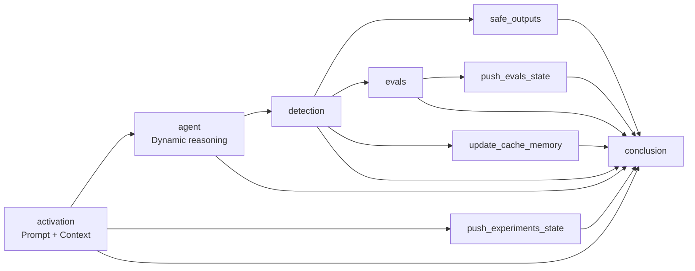
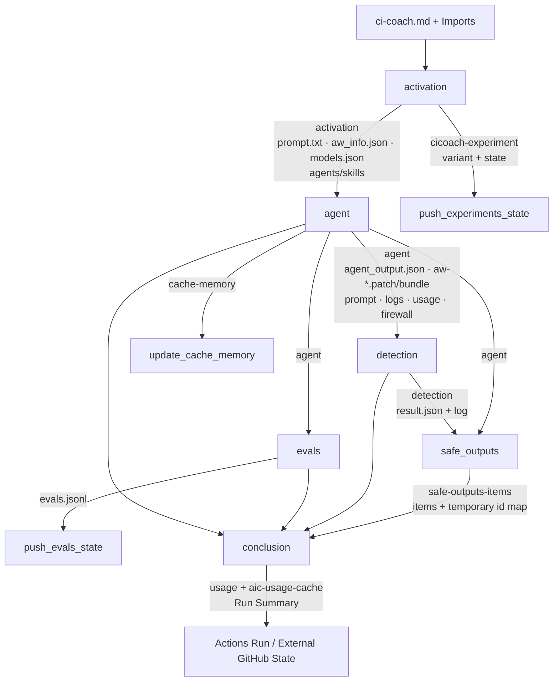

# GitHub Agentic Workflows 复杂案例：CI Optimization Coach

> [!abstract] 案例结论
> GitHub 自己运行的 `CI Optimization Coach` 不是“一个 Agent Step”，而是一张由 **9 个 Actions Job、162 个编译期显式 Step** 组成的控制图。Agent 只在 `agent` Job 内动态分析和生成候选结果；Prompt 装配、实验分流、威胁检测、评估、PR/Issue 外化、缓存记忆和最终汇总均由独立 Job 承担，并通过 Artifact 和 Job Output 跨越权限边界。

## 一、观察范围与版本基线

| 项目 | 本文固定值 |
|---|---|
| 官方仓库 | [`github/gh-aw`](https://github.com/github/gh-aw) |
| 当前 `main` 观察时间 | 2026-07-21 20:14（Asia/Shanghai） |
| 当前 `main` commit | [`220fab3ab2bab1411e6790f2f301c3623b723157`](https://github.com/github/gh-aw/commit/220fab3ab2bab1411e6790f2f301c3623b723157) |
| 源文件 | [`ci-coach.md` @ `220fab3`](https://github.com/github/gh-aw/blob/220fab3ab2bab1411e6790f2f301c3623b723157/.github/workflows/ci-coach.md) |
| 编译文件 | [`ci-coach.lock.yml` @ `220fab3`](https://github.com/github/gh-aw/blob/220fab3ab2bab1411e6790f2f301c3623b723157/.github/workflows/ci-coach.lock.yml) |
| 真实运行 | [Run #192 / ID `28871338128`](https://github.com/github/gh-aw/actions/runs/28871338128) |
| Run head SHA | [`70040a5f5092e7598ba77f00e9c963ca185bfdd4`](https://github.com/github/gh-aw/commit/70040a5f5092e7598ba77f00e9c963ca185bfdd4) |
| Run 时间 | 2026-07-07 13:49:46Z—14:09:17Z，约 19 分 31 秒 |
| Run 结果 | `success`；Agent、Detection、Safe Outputs 与 Conclusion 全链路完成 |

> [!important] 静态结构与动态运行的对齐方式
> 本文用当前 `main` 的源文件和 Lock File 解释最新静态结构，用 Run #192 自己的 [`ci-coach.md`](https://github.com/github/gh-aw/blob/70040a5f5092e7598ba77f00e9c963ca185bfdd4/.github/workflows/ci-coach.md) 与 [`ci-coach.lock.yml`](https://github.com/github/gh-aw/blob/70040a5f5092e7598ba77f00e9c963ca185bfdd4/.github/workflows/ci-coach.lock.yml) 解释真实运行。Run #192 当时是 **7 Job / 134 个显式 Step**；当前 `main` 已增加 Evals 支路，扩展为 **9 Job / 162 个显式 Step**。两套数字不混用。

## 二、为什么这是一个“复杂”案例

这条工作流每天分析 `ci.yml`、`cgo.yml` 和 `cjs.yml` 的历史运行、制品、测试与 Fuzz 结果：先执行非致命的 Build/Lint/Test 预检，再让 Agent 判断应修复预检失败、提出 CI 优化，还是调用 `noop`。如果形成代码改动，候选 Patch 必须先经过威胁检测，再由独立的 Safe Outputs Job 创建 PR；同时它还维护跨 Run 缓存记忆、A/B Prompt 实验和两个 BinEval 评估项。[完整任务正文](https://github.com/github/gh-aw/blob/220fab3ab2bab1411e6790f2f301c3623b723157/.github/workflows/ci-coach.md#ci-optimization-coach)

复杂性来自五类机制叠加：

1. **声明合成：** 主文件显式导入 4 个共享模块；`ci-data-analysis.md` 又传递引入 `jqschema` Skill，并贡献 Bash、Cache Memory 和确定性预处理 Steps。[共享数据模块](https://github.com/github/gh-aw/blob/220fab3ab2bab1411e6790f2f301c3623b723157/.github/workflows/shared/ci-data-analysis.md)
2. **混合执行：** 下载 Actions 历史、汇总指标、安装 Node/Go 和七项预检是固定 Step；解释失败原因、权衡优化方案和撰写 PR 是 Agent 动态任务。
3. **权限分段：** 顶层 `permissions: {}`；只读 Agent Job 与能够写 `contents/issues/pull-requests` 的 Safe Outputs Job 分开。
4. **多路审查：** Agent 输出同时送入 `detection`、`evals` 和 `safe_outputs`，并最终汇入 `conclusion`。
5. **跨 Run 状态：** Prompt 实验、Evals、Cache Memory 和每日 AI Credits 分别持久化，不与主 Agent 上下文混成一个文件。

## 三、源 Markdown 如何定义

### 1. Frontmatter：能力与控制边界

下面是当前 `main` 文件的结构性节选；省略的是实验说明文字和评估问题全文，字段和值保持与官方源文件一致：[源 Markdown](https://github.com/github/gh-aw/blob/220fab3ab2bab1411e6790f2f301c3623b723157/.github/workflows/ci-coach.md)。

```yaml
---
description: Daily CI optimization coach that analyzes workflow runs for efficiency improvements and cost reduction opportunities
on:
  schedule:
    - cron: "daily around 13:00 on weekdays"
  workflow_dispatch:

permissions:
  contents: read
  actions: read
  pull-requests: read
  issues: read
  copilot-requests: write

max-ai-credits: 50000
tracker-id: ci-coach-daily
engine:
  id: copilot
  copilot-sdk: true

tools:
  cli-proxy: true
  github:
    mode: gh-proxy
    toolsets: [issues, pull_requests]
  edit:

safe-outputs:
  create-pull-request:
    expires: 2d
    title-prefix: "[ci-coach] "
    protected-files: fallback-to-issue

timeout-minutes: 30
imports:
  - shared/ci-data-analysis.md
  - shared/ci-optimization-strategies.md
  - shared/reporting.md
  - shared/otlp.md

experiments:
  prompt_style:
    variants: [detailed, concise]
    metric: token_count_per_run
    min_samples: 20
    weight: [50, 50]
    analysis_type: mann_whitney

features:
  gh-aw-detection: true
sandbox:
  agent:
    sudo: false

evals:
  - id: repair-or-optimization-path
    question: Did the workflow check validation-status first and then follow the correct repair or optimization path for this run?
  - id: pr-created-or-noop
    question: Was a focused CI improvement pull request created when actionable work was found, or was noop called when CI was already healthy?
---
```

这些字段不会一一变成同名 YAML 字段，而是共同影响编译结果：

| Markdown 声明 | 编译/运行时结果 |
|---|---|
| 自然语言 Schedule | 编译为当前固定 Cron：`7 13 * * 1-5` |
| `permissions` | 顶层清空权限，再按 Job 重新分配最小权限 |
| `engine: copilot` + SDK | Agent、Detection 与 Evals 安装 Copilot CLI/SDK，并在隔离运行时执行 |
| `tools.github`、`edit`、`cli-proxy` | 生成 GitHub Proxy、编辑能力、CLI Proxy 与 MCP Gateway 装配步骤 |
| `create-pull-request` | 生成 Safe Outputs 工具、Patch 收集、Detection 和有写权限的 `safe_outputs` Job |
| 4 个 `imports` | 合并共享 Frontmatter、固定 Steps 与运行时 Prompt；解析后 Manifest 中共有 5 个 Import，包括传递引入的 `jqschema` Skill |
| `experiments` | 增加实验恢复、分流、Artifact 上传和状态分支写回 |
| `evals` | 增加 `evals` 与 `push_evals_state` 两个 Job |
| `sandbox.agent.sudo: false` | Agent 隔离环境不开放 `sudo` |

### 2. Import：Skill 与确定性 Step 怎样进入工作流

主文件没有显式 `skills:` 字段。`shared/ci-data-analysis.md` 的 Frontmatter 通过 `imports: ../skills/jqschema/SKILL.md` 引入 Skill，同时加入 4 个固定预处理 Step：[共享模块原文](https://github.com/github/gh-aw/blob/220fab3ab2bab1411e6790f2f301c3623b723157/.github/workflows/shared/ci-data-analysis.md)。

```yaml
imports:
  - ../skills/jqschema/SKILL.md

tools:
  cache-memory: true
  bash: ["*"]

steps:
  - name: Download CI workflow runs from last 7 days
  - name: Build CI summary for optimization analysis
  - name: Setup Node.js
  - name: Setup Go
  - name: Pre-flight validation (non-fatal)
```

这里能看到三类能力不是同一个概念：

- `jqschema/SKILL.md` 给 Agent JSON/Schema 处理方法；
- `tools` 决定 Agent 能使用 Bash、Cache Memory 等能力；
- `steps` 是在 Agent 推理前确定执行的 Actions 步骤，负责把 CI 历史、摘要和预检结果放入 `/tmp/gh-aw/agent/`。

### 3. Markdown Body：任务、路径与成功条件

Body 不只是“一句话 Prompt”，而是明确了 Agent 的决策树：[任务正文](https://github.com/github/gh-aw/blob/220fab3ab2bab1411e6790f2f301c3623b723157/.github/workflows/ci-coach.md#mission)。

```text
先读取 validation-status.json
├─ 任一预检失败
│  ├─ 阅读对应 .log.tail
│  ├─ 做最小修复
│  ├─ 只复跑受影响的验证
│  └─ 验证成功后请求创建 PR，然后停止
└─ 预检通过
   ├─ 分析最近 60 次 CI 运行、制品与 CI 配置
   ├─ 只选择 1—3 个高价值优化
   ├─ 修改后执行 lint/build/test/recompile
   ├─ 验证成功后请求创建 PR
   └─ 没有高价值动作则调用 noop
```

Body 还声明禁止通过修改测试来隐藏失败、PR 描述格式、Token 目标和“PR/noop 后立即停止”。因此动态区仍有可审查的目标、禁止项和结束条件。

## 四、编译后的 `.lock.yml` 是什么样子

### 1. 文件头把声明编译成可审计清单

当前 `.lock.yml` 共 **2,239 行、142,414 字节**。首行 metadata 记录 Schema v4、Frontmatter/Body Hash、Strict 模式、Agent ID 和 Engine 版本；Manifest 固定列出 **9 个 Secret 名称、8 个外部 Action SHA、7 个容器镜像 Digest**。[完整 Lock File](https://github.com/github/gh-aw/blob/220fab3ab2bab1411e6790f2f301c3623b723157/.github/workflows/ci-coach.lock.yml)

```yaml
# gh-aw-metadata: {
#   "schema_version":"v4",
#   "frontmatter_hash":"d6de...f9208",
#   "body_hash":"41a1...e2e9a",
#   "strict":true,
#   "agent_id":"copilot",
#   "engine_versions":{"copilot":"1.0.71","copilot-sdk":"1.0.7"}
# }

name: "CI Optimization Coach"
on:
  schedule:
    - cron: "7 13 * * 1-5"
  workflow_dispatch: { ... }

permissions: {}
jobs: { ... }
```

`permissions: {}` 是重要控制点：源 Markdown 中的权限需求没有直接变成全局 Token 权限，而是被编译器重新分配到各 Job。

### 2. 编译后 Job Graph

下面是按真实 `.lock.yml` 提炼的等价骨架；Step 数、依赖、Runner 和权限来自固定 commit，省略的是每个 Job 的内部环境变量与 Step 实现。

```yaml
permissions: {}

jobs:
  activation:                       # 21 steps
    runs-on: ubuntu-slim
    permissions: {actions: read, contents: read}

  agent:                            # 54 steps
    needs: activation
    runs-on: ubuntu-latest
    permissions:
      {actions: read, contents: read, copilot-requests: write,
       issues: read, pull-requests: read}

  detection:                        # 20 steps
    needs: [activation, agent]
    runs-on: ubuntu-latest
    permissions: {contents: read, copilot-requests: write}

  safe_outputs:                     # 12 steps
    needs: [activation, agent, detection]
    runs-on: ubuntu-slim
    permissions: {contents: write, issues: write, pull-requests: write}

  evals:                            # 19 steps
    needs: [activation, agent, detection]
    runs-on: ubuntu-latest
    permissions: {contents: read, copilot-requests: write}

  update_cache_memory:              # 5 steps
    needs: [activation, agent, detection]
    runs-on: ubuntu-slim
    permissions: {contents: read}

  push_experiments_state:           # 7 steps
    needs: activation
    runs-on: ubuntu-slim
    permissions: {contents: write}

  push_evals_state:                 # 7 steps
    needs: [activation, evals]
    runs-on: ubuntu-slim
    permissions: {contents: write}

  conclusion:                       # 17 steps
    needs: [activation, agent, detection, evals, push_evals_state,
            push_experiments_state, safe_outputs, update_cache_memory]
    runs-on: ubuntu-slim
    permissions: {contents: write, issues: write, pull-requests: write}
```



### 3. 精确 Job/Step/权限清单

| Job | `needs` | Runner | 编译期显式 Step | Job 权限 | 主要职责 |
|---|---|---:|---:|---|---|
| `activation` | — | `ubuntu-slim` | 21 | `actions: read`、`contents: read` | 准入检查、实验分流、拼装 Prompt/Import/Skill、上传 Activation Artifact |
| `agent` | `activation` | `ubuntu-latest` | 54 | Actions/Contents/Issues/PR 只读，`copilot-requests: write` | 下载上下文、预处理 CI 数据、安装 Agent/MCP/Firewall、动态执行、收集候选输出 |
| `detection` | `activation, agent` | `ubuntu-latest` | 20 | `contents: read`、`copilot-requests: write` | 检查 Prompt、`agent_output.json` 与 Patch，产生 Detection 结论 |
| `safe_outputs` | `activation, agent, detection` | `ubuntu-slim` | 12 | `contents/issues/pull-requests: write` | 校验并外化 PR/Issue/noop 等类型化请求 |
| `evals` | `activation, agent, detection` | `ubuntu-latest` | 19 | `contents: read`、`copilot-requests: write` | 对决策路径和 PR/noop 结果做 BinEval |
| `update_cache_memory` | `activation, agent, detection` | `ubuntu-slim` | 5 | `contents: read` | 下载 Cache Memory Artifact 并保存到 Actions Cache |
| `push_experiments_state` | `activation` | `ubuntu-slim` | 7 | `contents: write` | 把实验分流状态写入 `experiments/cicoach` |
| `push_evals_state` | `activation, evals` | `ubuntu-slim` | 7 | `contents: write` | 把评估结果写入 `evals/cicoach` |
| `conclusion` | 其余 8 个 Job | `ubuntu-slim` | 17 | `contents/issues/pull-requests: write` | 汇总实际结果、Usage、Detection、失败/noop 和外化对象 |
| **合计** | — | — | **162** | — | — |

## 五、在 GitHub Actions 中实际执行成什么样

### 1. Run #192 的版本结构

Run #192 由 Schedule 触发，运行在 SHA `70040a5`。它当时的 Lock File 共 **1,937 行、7 个 Job、134 个编译期显式 Step**，尚未包含后来加入的 `evals` 与 `push_evals_state`。公开 Actions API 返回 7 个 Job，全部成功：[Run API](https://api.github.com/repos/github/gh-aw/actions/runs/28871338128)、[Jobs API](https://api.github.com/repos/github/gh-aw/actions/runs/28871338128/jobs?per_page=100&filter=all)。

| 实际顺序 | Job | 当时 Lock File Step | API 可见 Step 记录 | 结果 | 关键运行事实 |
|---:|---|---:|---:|---|---|
| 1 | `activation` | 20 | 25 | Success | 完成准入、实验分流和 Prompt 装配，上传 Activation Artifact |
| 2a | `push_experiments_state` | 7 | 13 | Success | 下载实验 Artifact 并写回实验状态分支 |
| 2b | `agent` | 54 | 61 | Success | 数据预处理、Copilot 执行、Safe Output 收集和 Agent Artifact 上传全部成功 |
| 3 | `detection` | 20 | 25 | Success | 下载 Patch Context，准备文件、执行 Threat Detection 并上传 Detection Artifact |
| 4a | `update_cache_memory` | 5 | 9 | Success | 下载 Cache Memory Artifact 并保存跨 Run 缓存 |
| 4b | `safe_outputs` | 12 | 18 | Success | 下载 Agent Output/Patch，Checkout Repository，处理 Safe Outputs 并上传 Items Manifest |
| 5 | `conclusion` | 16 | 20 | Success | 下载 Agent/Safe Output 交付件，汇总 Usage、Detection 与外化结果 |
| **合计** | **7 Jobs** | **134** | **171** | **Success** | Agent → Patch → Detection → Safe Output → Conclusion 全链路完成 |

> [!note] 为什么 API Step 数大于 `.lock.yml` Step 数
> `.lock.yml` 的 134 个是作者/编译器声明的 `steps:`。Jobs API 还列出 `Set up job`、Action 的 `Post ...` 清理和 `Complete job`，因此 Run #192 显示 171 条 Step 记录。判断“几个 Step”时必须先说明统计口径。

### 2. Safe Output 成功不等于 PR 一定创建成功

Run #192 真正走完了 Agent、Patch、Detection 和 Safe Outputs，但候选 Patch 涉及 **258 个文件**，超过编译策略的 **100 文件上限**。同一工作流和 Safe Outputs 时间窗口内，`github-actions[bot]` 创建了 [`[ci-coach] fix: recompile lock files after #44022 workflow update` Issue #44048](https://github.com/github/gh-aw/issues/44048)，正文记录错误 `E003`、收到 258 个文件并建议提高 `max-patch-files`。

> [!warning] 归因强度
> Issue 标题前缀、创建者、创建时间、258/100 限制和本次 Safe Outputs 路径完全吻合，因此“它是 Run #192 的 Protected/Safety Fallback”属于高置信度推断；但公开 Artifact ZIP 匿名下载返回 `401`，Issue 正文又未直接写入 Run ID，所以不把这项归因标为可由公开 Artifact 内容直接证明的硬事实。

这个结果展示了完整的输出边界：Agent 成功生成大 Patch，Detection 成功放行安全检查，Safe Outputs 仍可因确定性的数量策略拒绝 PR，并把可审查的失败说明外化为 Issue。Job `success` 表示处理器按规则完成，不表示最初期望的 PR 一定被创建。

## 六、中间交付件如何流转

GitHub Actions Artifact 原生用于跨 Job 持久化和共享文件；gh-aw 在此基础上把不可信的 Agent 候选输出变成权限边界两侧的交接对象。[GitHub Artifact 说明](https://docs.github.com/en/actions/concepts/workflows-and-actions/workflow-artifacts)、[gh-aw Artifact Reference](https://github.github.com/gh-aw/reference/artifacts/)



### 1. Activation → Agent

`activation` 生成并上传：

- `aw_info.json`、`models.json`；
- 完整渲染后的 `prompt.txt`、Prompt Template、Import Tree；
- `.github/agents`、`.github/skills` 和 Base Branch 配置快照；
- GitHub Rate Limit 记录。

`agent` 下载这个 Artifact 后才恢复 Agent/Skill 配置并启动 Copilot。它不是通过 Job Output 传递大段 Prompt；Job Output 主要传递 Experiment、Model、Trace ID 等小型控制数据。

### 2. Agent → Detection / Safe Outputs / Evals / Conclusion

`agent` 统一上传名为 `agent` 的 Artifact，关键交付件包括：

| 文件 | 含义 | 下游消费者 |
|---|---|---|
| `agent_output.json` | 类型化 Safe Output 请求；缺失时写入 `{"items":[]}` | Detection、Safe Outputs、Evals、Conclusion |
| `aw-*.patch` | 候选代码差异 | Detection、Safe Outputs |
| `aw-*.bundle` | 用于 PR 分支/提交的 Git Bundle | Safe Outputs |
| `prompt.txt` | Agent 实际接收的完整 Prompt | Detection、Evals、审计 |
| `agent_usage.json`、MCP/Firewall Log | Token、工具与网络审计 | Conclusion、Usage Artifact |
| `/tmp/gh-aw/agent/` | CI 历史、摘要、制品和预检结果 | Agent 调查、运行后审计 |

官方 Threat Detection 的执行顺序是“下载 Artifact → 准备 Prompt/`agent_output.json`/Patch → AI/自定义检查 → 上传 Detection Log”；该 Job 的安全结论是 `safe_outputs` 的启动条件。[Threat Detection](https://github.github.com/gh-aw/reference/threat-detection/)

### 3. Detection → Safe Outputs

`detection` 不修改外部 GitHub 状态。它读取 Agent Artifact，在存在输出类型或 Patch 时检查：

- 实际 Prompt；
- `agent_output.json` 中的类型化请求；
- `aw-*.patch` 候选代码变更；
- 可插入的额外扫描结果。

只有 `needs.detection.result == 'success'` 时，`safe_outputs` 才进入处理。Run #192 的 Checkout Patch Context、Prepare Threat Detection Files、Execute Threat Detection 与 Upload Detection Artifact 均成功，证明该样本实际走过扫描路径，而不只是因无候选输出跳过 Detection。

### 4. Safe Outputs → PR/Issue/Manifest

`safe_outputs` 下载统一 Agent Artifact，以 `GH_AW_AGENT_OUTPUT` 指向 `agent_output.json`，再用一个独立写权限 Job 执行外部动作。该案例的编译配置将 PR 数量限制为 1、限制 Patch 文件数和大小，并对依赖清单、Lock File、`CODEOWNERS`、`README`、`SECURITY.md`、`AGENTS.md` 等 Protected Files 使用 `fallback-to-issue`。[Safe Outputs](https://github.github.com/gh-aw/reference/safe-outputs/)、[PR Safe Output](https://github.github.com/gh-aw/reference/safe-outputs-pull-requests/)

处理后输出两类结果：

- Job Output：`created_pr_number`、`created_pr_url`、处理数量和错误计数；
- `safe-outputs-items` Artifact：`safe-output-items.jsonl` 和 Temporary ID Map，供 `conclusion` 汇总实际执行对象。

所以 PR/Issue 的职责分工是：

```text
Agent：生成标题、正文、候选 Patch 和“希望创建 PR”的类型化请求
Detection：判断候选 Prompt/内容/Patch 是否可继续
Safe Outputs：Schema/策略校验，使用受限写 Token 创建 PR 或回退 Issue
Conclusion：汇总最终创建了什么、失败在哪里、消耗了多少
```

### 5. Evals、Experiment 与 Cache Memory

- `cicoach-experiment` 保存本次 Prompt Variant 和实验状态；`push_experiments_state` 写入专用状态分支。
- `evals` 读取实际 Prompt 与 Agent Output，回答“是否先检查预检状态”和“是否正确选择 PR/noop”，再由 `push_evals_state` 写入另一状态分支。
- `cache-memory` 保存 Agent 跨 Run 的分析记忆；只有 Agent 成功时，`update_cache_memory` 才把它写入 Actions Cache。
- `usage` 与 `aic-usage-cache` 由 `conclusion` 生成，用于本次审计和每日 AI Credit Guardrail。

这些旁路说明“结果总结”不只是 Agent 撰写的一段自然语言，而包含确定性的 Artifact 清单、Job 结果、Token/AI Credit、Detection 和外部对象 ID。

## 七、Run #192 实际发布了哪些 Artifact

截至观察时间，[Artifacts API](https://api.github.com/repos/github/gh-aw/actions/runs/28871338128/artifacts?per_page=100) 返回 8 个 Artifact：

| Artifact | 大小 | 产生方 | 本次含义 |
|---|---:|---|---|
| `cicoach-experiment` | 1,115 B | Activation | Prompt 实验状态 |
| `activation` | 7,737,146 B | Activation | Prompt、模型、Skill/Agent 配置与运行上下文；观察时已过期 |
| `agent` | 773,862 B | Agent | Agent Output、Patch/Bundle、日志、Usage 和审计材料 |
| `cache-memory` | 21,428 B | Agent | 跨 Run 分析记忆 |
| `detection` | 2,848 B | Detection | Detection Result 与 Log |
| `safe-outputs-items` | 417 B | Safe Outputs | 处理后的 Safe Output Items Manifest |
| `usage` | 4,940 B | Conclusion | 汇总后的 Usage 数据 |
| `aic-usage-cache` | 296 B | Conclusion | 每日 AI Credit 记账缓存；观察时已过期 |

Artifact 名称、大小与过期状态来自公开 API。下载 ZIP 的 API 在无认证请求下返回 `401`，因此本文不声称直接读取了包内文件；包内预期路径来自该 Run 固定 SHA 的 `.lock.yml`，真实阶段执行则由 Jobs API 中 Download/Prepare/Execute/Upload Step 的 Success 状态交叉验证。

## 八、对 PPT 作业流表达的直接启示

这个案例适合被压缩成下面四段，而不是画成“Markdown → Agent → PR”三步：

| PPT 阶段 | CI Coach 中的实际机制 | 主要交付件 |
|---|---|---|
| 工作流声明 | Frontmatter + Markdown Body + 4 个共享 Import；传递引入 1 个 Skill | `ci-coach.md` |
| 编译与加固 | 解析 Import、固定 Cron/Action SHA/镜像 Digest、拆分 9 Job 权限图 | `ci-coach.lock.yml` |
| Actions 执行 | Activation 装配；固定预处理；Agent + MCP/Tools 动态分析；实验/评估旁路 | Activation、Experiment、Agent、Cache Memory Artifacts |
| 输出审查与外化 | Detection → Safe Outputs → Conclusion；PR/Issue 写入与 Agent 分离 | Detection、Safe Output Items、Usage、Run Conclusion |

颜色可以按“智能判断发生在哪里”标注：

- **Agent 主导：** `agent` 中的理解、方案选择、工具调用、候选内容/Patch；
- **AI 参与：** `detection` 与 `evals`；
- **确定性控制：** Activation、Import/Prompt 装配、固定预处理、Artifact 上传下载、Safe Output 策略执行、权限写入、状态分支更新和 Conclusion 汇总。

> [!summary] 一句话洞察
> 真实的 GitHub Agentic Workflow 是“动态 Agent 核心 + 多个确定性 Actions 控制 Job”：复杂度主要不在 Prompt，而在如何把上下文、候选结果、安全结论、外部写入和审计结果拆成可失败、可跳过、可追踪的交付件。

## 九、证据与动态边界

### 一手来源

- [官方源 Markdown @ `220fab3`](https://github.com/github/gh-aw/blob/220fab3ab2bab1411e6790f2f301c3623b723157/.github/workflows/ci-coach.md)
- [官方生成 Lock File @ `220fab3`](https://github.com/github/gh-aw/blob/220fab3ab2bab1411e6790f2f301c3623b723157/.github/workflows/ci-coach.lock.yml)
- [Run #192](https://github.com/github/gh-aw/actions/runs/28871338128)
- [Run #192 时的源 Markdown](https://github.com/github/gh-aw/blob/70040a5f5092e7598ba77f00e9c963ca185bfdd4/.github/workflows/ci-coach.md)
- [Run #192 时的 Lock File](https://github.com/github/gh-aw/blob/70040a5f5092e7598ba77f00e9c963ca185bfdd4/.github/workflows/ci-coach.lock.yml)
- [Run #192 REST 元数据](https://api.github.com/repos/github/gh-aw/actions/runs/28871338128)
- [Run #192 Jobs/Steps REST 数据](https://api.github.com/repos/github/gh-aw/actions/runs/28871338128/jobs?per_page=100&filter=all)
- [Run #192 Artifacts REST 数据](https://api.github.com/repos/github/gh-aw/actions/runs/28871338128/artifacts?per_page=100)
- [Safe Output Fallback Issue #44048](https://github.com/github/gh-aw/issues/44048)
- [Compilation Process](https://github.github.com/gh-aw/reference/compilation-process/)
- [Artifact Reference](https://github.github.com/gh-aw/reference/artifacts/)
- [Threat Detection](https://github.github.com/gh-aw/reference/threat-detection/)
- [Safe Outputs](https://github.github.com/gh-aw/reference/safe-outputs/)
- [Safe Outputs for Pull Requests](https://github.github.com/gh-aw/reference/safe-outputs-pull-requests/)
- [GitHub Actions Workflow Artifacts](https://docs.github.com/en/actions/concepts/workflows-and-actions/workflow-artifacts)

### 动态数据边界

- `main`、`.lock.yml`、Engine/Action/Container 版本和 Job Graph 会继续变化；复核时必须使用本文记录的 commit。
- Actions Run 状态不会变化，但 Artifact 的 `expired`、下载可用性和保留时间会变化。
- Jobs API 的 Step 数包含 GitHub Runner 自动生成的 Setup/Post/Complete 记录，不能替代 `.lock.yml` 的显式 Step 计数。
- Artifact 名称和大小证明某个交付包被发布，不证明包内每个可选文件存在，也不证明 Safe Output 已改变外部状态。
- Run #192 是一个真实成功 Run，但“Issue #44048 来自该 Run”仍是高置信度归因，不是由可匿名下载的 Artifact 内容直接证明。

## 相关专题

- [[50_deepdives/github-agentic-workflows/README|GitHub Agentic Workflows 专题入口]]
- [[50_deepdives/github-agentic-workflows/research-evidence|一手证据底稿]]
- [[50_deepdives/github-agentic-workflows/fixed-actions-relationship-research|Agentic Workflow 与固定 Actions 的关系]]
- [[60_tutorials/github-agentic-workflows-config|GitHub Agentic Workflows 配置与 Lock File 教程]]
