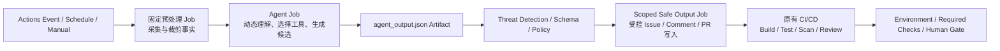

# GitHub Agentic Workflows 与固定 GitHub Actions CI/CD 的关系

> [!abstract] 核心洞察
> GitHub Agentic Workflows 不是固定 GitHub Actions CI/CD 的替代者，而是**编译并运行在 Actions 之上的动态决策层**：`gh aw` 把 Markdown 中的能力声明编译成标准 `.lock.yml`，Actions 继续固定触发器、Job 图、Runner、权限和写入门禁；只有 Agent Job 内部的理解、工具选择与候选结果是运行时动态的。更准确的架构表达是：**确定性 Actions 外壳包裹动态 Agent 决策岛，再把结果交回确定性 CI/CD 验证和执行。**

本底稿只使用 GitHub Docs 与 `github/gh-aw` 官方仓库/官方文档，补充 [[50_deepdives/github-agentic-workflows/90_report|GitHub Agentic Workflows 深度洞察报告]] 中“增强 Actions，而非替代 Actions”的机制证据。

## 一、两者不是两套平行流水线，而是“源语言—编译产物—执行底座”的关系

### 1.1 Agentic Workflow 最终仍是一个 GitHub Actions Workflow

GitHub 官方首页直接将 Agentic Workflows 定义为对现有确定性 CI/CD 的增强，并说明 `gh aw` 会将 Agentic Workflow 加固为传统 GitHub Actions `.lock.yml`。官方编译文档进一步说明：`gh aw compile` 经历解析、校验、Job 构造、依赖解析和 YAML 生成五个阶段，将 Markdown Workflow 转换为可执行的 Actions YAML。

因此两者的关系不是：

```text
GitHub Actions  ↔  另一套 Agentic Pipeline Engine
```

而是：

```text
Workflow.md（人类可维护的声明与指令）
    ↓ gh aw compile
Workflow.lock.yml（经过加固的标准 Actions 执行计划）
    ↓ GitHub Actions
Runner / Jobs / Steps / Permissions / Artifacts / Environments
```

证据：

- [GitHub Agentic Workflows 首页：在 Actions 中运行，并增强既有确定性 CI/CD](https://github.github.com/gh-aw/)
- [How They Work：`.md` 是可编辑源，`.lock.yml` 是编译后的 Actions Workflow，二者都应提交](https://github.github.com/gh-aw/introduction/how-they-work/)
- [Compilation Process：Markdown 经五阶段编译为完整 `.lock.yml`](https://github.github.com/gh-aw/reference/compilation-process/)
- [GitHub Actions Workflow Syntax：Actions 只执行存放在 `.github/workflows` 下的 YAML Workflow](https://docs.github.com/en/actions/reference/workflows-and-actions/workflow-syntax)

### 1.2 `.lock.yml` 固定控制平面，但不把 Agent 行为变成确定性程序

编译器固定的是 **Actions 执行边界**：Frontmatter Schema、允许的 Actions 表达式、Action SHA、Job 类型、Job 依赖和最终 YAML。Markdown 正文会在运行时加载；官方文档明确指出，仅修改自然语言正文通常不需要重新编译，而修改 Frontmatter 配置需要重新编译。

所以 `.lock.yml` 的含义是“固定可用能力和运行拓扑”，不是“固定模型每一步会怎么做”。同一份执行计划内，Agent 仍会根据事件上下文选择允许的工具、调整步骤和生成不同候选结果。

证据：

- [Compilation Process：编译期校验、Job Construction、Dependency Resolution、Action Pinning 与 YAML Generation](https://github.github.com/gh-aw/reference/compilation-process/)
- [Security Architecture：编译器约束组件及连接方式，但不约束运行时行为](https://github.github.com/gh-aw/introduction/architecture/#compilation-time-security)

## 二、两者共享哪些 Actions 执行与治理能力

| Actions 能力 | 固定 GitHub Actions CI/CD | Agentic Workflows 如何复用 | 关系判断 |
|---|---|---|---|
| **触发器** | `push`、`pull_request`、`schedule`、`workflow_dispatch`、`workflow_call` 等 | Frontmatter 的 `on:` 使用标准 Actions 触发语法，编译后进入 `.lock.yml`；gh-aw 额外提供角色、命令、截止期等预激活过滤 | Agent 没有自建 Scheduler，仍由 Actions 事件系统唤起 |
| **Runner** | `runs-on` 选择 GitHub-hosted 或 self-hosted Runner | 编译后的 Activation、Agent、Detection、Safe Output 等 Job 运行在 Actions Runner；Agent 再被放入容器/防火墙边界 | Agent Runtime 是 Runner 内的一类受约束工作负载 |
| **Job 图** | `jobs`、`needs`、`if`、`concurrency` 控制拓扑和并发 | Compiler 生成 `pre_activation → activation → agent → detection → safe outputs → conclusion` 等 Job，并对依赖排序和检测环 | 推理过程动态，但跨 Job 控制流仍是静态 DAG |
| **确定性 Steps/Jobs** | Script、Action、Reusable Workflow 完成 Build/Test/Scan/Deploy | `steps:`、`jobs:`、`pre-agent-steps:` 和自定义 Safe Output Job 可与 Agent Job 混合 | 不是“全部交给 Agent”，而是把 Agent 嵌入原有 Job 体系 |
| **权限** | Workflow 或 Job 级 `permissions` 限定 `GITHUB_TOKEN` | Agent Job 默认使用只读权限；每类 Safe Output 由独立 Job 获得完成该操作所需的窄写权限 | 权限仍由 Actions Job 边界授予，不由 Prompt 或 MCP 决定 |
| **跨 Job 数据** | Job Output 和 Artifact 在不同 Job 之间传递数据 | Agent Job 上传 `agent_output.json` 等 Artifact，Detection 与 Safe Output Job 下载后审查和执行 | Artifact 成为“不可信推理结果”跨越权限边界的缓冲区 |
| **Environment / Approval** | Environment 可限制分支、Secret，并要求 Reviewer 或 Protection Rule | gh-aw 可把 Environment 传播到编译器生成的 Safe Output Job；触发配置也支持基于 Environment Protection 的手工批准 | 可复用 Actions 审批，但应放在高风险写入/发布边界，而不是假设模型自治等同批准 |
| **日志与审计** | Run、Job、Step 日志、Summary、Artifact | Agent Prompt、输出、Patch、Token/Firewall 日志进入 Actions Run 与 Artifact | 复用 Actions 可观测性，但模型语义正确性仍需单独评测 |
| **既有 CI/CD Gate** | Required Checks、Ruleset、Environment 与部署 Workflow 判断是否合入/发布 | Agent 生成 Issue、Comment 或 PR 后，原有 Build/Test/Scan/Review 继续作为 Oracle | Agent 提出候选动作，既有 Pipeline 负责证明和放行 |

逐项证据：

- [Triggers：`on:` 使用标准 GitHub Actions 语法，支持全部标准触发器并增加过滤控制](https://github.github.com/gh-aw/reference/triggers/)
- [Compilation Process：编译器生成专用 Job、依赖拓扑与 Artifact](https://github.github.com/gh-aw/reference/compilation-process/)
- [Custom Steps and Jobs：确定性 computation 与 agentic execution 可混合](https://github.github.com/gh-aw/reference/steps-jobs/)
- [DeterministicOps：确定性预处理、触发过滤、后处理与 AI 推理的组合模式](https://github.github.com/gh-aw/patterns/deterministic-ops/)
- [Permissions：Agent 部分默认只读，写操作交给 Safe Outputs](https://github.github.com/gh-aw/reference/permissions/)
- [Safe Outputs：Agent 只请求结构化动作，独立权限 Job 执行写入](https://github.github.com/gh-aw/reference/safe-outputs/)
- [Security Architecture：Agent 输出 Artifact、Detection 和最小权限写 Job 的隔离](https://github.github.com/gh-aw/introduction/architecture/)
- [GitHub Actions Workflow Syntax：Job、`needs`、Runner 与 Job 级 Permission](https://docs.github.com/en/actions/reference/workflows-and-actions/workflow-syntax)
- [GitHub Actions Artifacts：Artifact 用于跨 Job 传递数据并保留运行结果](https://docs.github.com/en/actions/tutorials/store-and-share-data)
- [GitHub Actions Environments：审批、分支限制、Protection Rule 与 Secret Gate](https://docs.github.com/en/actions/how-tos/deploy/configure-and-manage-deployments/control-deployments)

## 三、动态推理与确定性 CI/CD 如何分工

### 3.1 适合 Agent 的工作：处理“下一步不容易预先枚举”的部分

Agent Job 适合承担：

- 理解 Issue、PR、日志和仓库上下文；
- 在 Tool Allowlist 内选择查询或分析工具；
- 形成根因假设、优先级、摘要、修复候选或编排选择；
- 输出结构化 Safe Output 请求，而不是直接改变外部状态。

这些工作共同特点是：输入开放、路径难以穷举、需要语义判断，但结果可以被审查或由下游验证。

### 3.2 适合固定 Actions 的工作：处理“必须可重复证明和受控执行”的部分

确定性 Steps、Jobs 或 Reusable Workflows 应继续承担：

- 结构化数据采集、日志裁剪、依赖安装和缓存；
- Build、Test、Lint、SAST、SCA、制品生成与签名；
- Policy/Ruleset/Required Check 计算；
- Environment 审批后的 Deploy、Promote 与 Rollback；
- 对 Agent 输出的格式化、限制、Threat Detection 和实际 API 写入。

官方 DeterministicOps 文档也采用这一组合：确定性 Steps 先抓取 Release/PR 数据，Agent 再综合生成说明；确定性 Steps 还可在推理前完成复杂 Trigger Filtering，自定义 Safe Output Job 则可负责确定性后处理。

### 3.3 推荐的控制闭环



这条链路的要点是：**模型可以决定候选方案，不能自行定义验证标准，也不应自行取消门禁。**

## 四、Agentic Workflow 与固定 CI/CD 的三种组合方式

### 模式 A：旁路洞察层

Agentic Workflow 由 Schedule、Issue/PR 事件或现有 Workflow 的结果触发，生成报告、Issue 或 Comment；原 Pipeline 完全不变。

- 适合：质量趋势、Release Readiness、依赖风险、CI 诊断；
- 优点：低耦合，失败不阻断主交付流；
- 控制点：只读 Agent + 非代码 Safe Output。

### 模式 B：Pipeline 中的混合 Job

确定性 Job 先收集事实，Agent Job 处理开放式判断，Safe Output/后处理 Job 将结果转成结构化输出；后续普通 Job 继续测试或审批。

- 适合：Release Highlights、变更分类、测试建议、复杂事件过滤；
- 优点：上下文明确，Agent 不必重新发现所有事实；
- 控制点：`needs`、Job Output、Artifact、明确的成功/失败 Oracle。

### 模式 C：PR 作为两套能力的契约面

Agent 生成修复 PR，固定 CI/CD 对 PR 运行 Build/Test/Scan，Ruleset/Review 决定是否合并和发布。

- 适合：文档、测试、配置和低风险代码维护；
- 优点：复用团队最熟悉的评审与回滚对象；
- 控制点：Protected Files、Safe Output 上限、Required Checks、Review、Branch Protection。

> [!warning] 触发身份是必须显式设计的接口
> gh-aw 官方文档指出，使用默认 `GITHUB_TOKEN` 创建 PR 或向 PR Branch 推送时，默认不会触发 CI Workflow Run；当前 GitHub Actions 文档则对 PR `opened`、`synchronize`、`reopened` 增加了“产生待人工批准 Run”的例外。两份官方口径存在差异，因此不能在架构图上直接画成“创建 PR → CI 必然自动运行”，也不能一概写成“完全不触发”。如果需要无需人工批准地进入原 CI，应使用收窄权限的 GitHub App 或 PAT，并按 Token 身份、事件类型和仓库策略实测。

证据：[Triggering CI：gh-aw 的默认行为与显式 Token/App 方案](https://github.github.com/gh-aw/reference/triggering-ci/)、[GitHub Actions `GITHUB_TOKEN`：PR 事件的待批准 Run 例外](https://docs.github.com/en/actions/concepts/security/github_token#when-github_token-triggers-workflow-runs)

## 五、哪些能力被编译固定，哪些仍是运行时动态

| 类型 | 编译/Actions 固定 | 运行时动态 |
|---|---|---|
| 触发与准入 | Event、Branch/Path、Role、Fork、Deadline、Manual Approval | 事件中实际出现的文本与仓库状态 |
| 执行拓扑 | Job 类型、`needs`、Runner、Timeout、Concurrency | Agent 内部采取多少轮推理、先调用哪个允许的 Tool |
| 能力边界 | Permission、Tool/MCP Allowlist、Network Allowlist、Sandbox、Safe Output 类型和数量 | Tool 返回的内容、Agent 是否调用某项允许能力 |
| 供应链 | Actions SHA、Compiler 生成的 Setup 与 Job Graph | 外部 API/MCP 返回和模型服务响应 |
| 输出外化 | Artifact 传递、Schema、Threat Detection、写 Job 权限、Environment | 报告正文、Patch、Issue/PR 内容和候选动作 |
| 最终判定 | Build/Test/Scan/Policy/Review/Deployment Gate | Agent 对原因、优先级和下一步的建议 |

由此可形成一个更精确的成熟度判断：Agentic Workflow 并没有让 CI/CD 从“确定性”整体迁移为“非确定性”；它只在 Actions 可观察、可限权的执行计划中，增加了一段受控的不确定性。

## 六、不应如何表述

| 不准确表述 | 问题 | 建议表述 |
|---|---|---|
| “Agentic Workflows 取代 GitHub Actions” | 实际执行物就是标准 Actions `.lock.yml`，Runner、Job、权限仍来自 Actions | “它把 Agent 编译进 GitHub Actions” |
| “Markdown 直接作为 Pipeline 运行” | Actions 执行的是编译后的 `.lock.yml`；Markdown 正文在运行时被加载 | “Markdown 是源文件，`.lock.yml` 是 Actions 执行计划” |
| “Agentic Workflow 是动态 CI/CD” | 触发、Job DAG、Runner、权限和写出口仍是确定性的；动态只发生在 Agent 决策区 | “确定性 Actions 外壳中的动态决策层” |
| “Lock File 让 Agent 结果可重复” | Lock 固定依赖与边界，不保证模型输出一致或正确 | “Lock 固定可执行拓扑和能力边界，结果仍需 Oracle 验证” |
| “MCP 能调用 GitHub，所以 Agent 有写权限” | MCP 描述工具可达性；实际授权来自 Token/Job Permission，推荐写入经 Safe Output Job | “MCP 提供工具面，Actions 权限和 Safe Output 决定副作用” |
| “Agent 创建 PR 后会自动进入原 CI” | 默认 Token 的事件递归规则与 PR 待批准 Run 例外并存，且受仓库策略影响 | “需显式设计 Token 身份、事件、审批和 Gate，并验证事件链” |
| “Safe Output 等于自动合并或自动发布” | Safe Output 是类型化写操作，不等于通过 Required Checks、Review 或 Environment Gate | “Safe Output 外化候选结果，原门禁决定合入和发布” |
| “复用 Actions 就代表与固定 CI/CD 同等成熟” | Agentic Workflows 仍为 Public Preview，模型、MCP、Compiler 与网络增加新故障面 | “执行底座复用成熟 Actions，但 Agent 层需独立评测和渐进授权” |

## 七、对洞察页的影响

> [!tip] 建议进入 Presentation 的内容
> 这项关系应进入 GitHub 单页的主图，而不只是脚注。可将页面作业流从“组件装配链”升级为上下两层：上层是 `Workflow.md → Compiler → .lock.yml` 的**设计时装配**，下层是 `Actions Trigger → Deterministic Context Job → Agent → Artifact/Detection → Scoped Write Job → Existing CI/CD Gate` 的**运行时闭环**。核心页底洞察建议为：**GitHub 不是用 Agent 替换固定 Pipeline，而是在固定 Actions 控制面内嵌入一个受约束的动态决策区。**

适合在页内高亮的五个功能点：

1. **同一执行底座：** Event、Runner、Job DAG、Log、Artifact 均复用 Actions；
2. **编译式装配：** Markdown 能力声明被加固为标准 `.lock.yml`；
3. **混合执行：** 确定性 Steps/Jobs 与 Agent 推理前后串联；
4. **分权限写入：** Agent 只读，Artifact 跨 Job，Safe Output 按类型获得写权限；
5. **原 Gate 继续生效：** PR、Required Checks、Environment 与 Review 承担最终 Oracle。

## 八、来源清单

### GitHub Agentic Workflows 官方文档与仓库

- [`github/gh-aw` 官方仓库](https://github.com/github/gh-aw)
- [GitHub Agentic Workflows 首页](https://github.github.com/gh-aw/)
- [How They Work](https://github.github.com/gh-aw/introduction/how-they-work/)
- [Compilation Process](https://github.github.com/gh-aw/reference/compilation-process/)
- [Security Architecture](https://github.github.com/gh-aw/introduction/architecture/)
- [Frontmatter Reference](https://github.github.com/gh-aw/reference/frontmatter/)
- [Triggers](https://github.github.com/gh-aw/reference/triggers/)
- [Permissions](https://github.github.com/gh-aw/reference/permissions/)
- [Custom Steps and Jobs](https://github.github.com/gh-aw/reference/steps-jobs/)
- [DeterministicOps](https://github.github.com/gh-aw/patterns/deterministic-ops/)
- [Safe Outputs](https://github.github.com/gh-aw/reference/safe-outputs/)
- [Triggering CI](https://github.github.com/gh-aw/reference/triggering-ci/)

### GitHub Actions 官方文档

- [Workflow Syntax for GitHub Actions](https://docs.github.com/en/actions/reference/workflows-and-actions/workflow-syntax)
- [`GITHUB_TOKEN` 触发 Workflow Run 的规则](https://docs.github.com/en/actions/concepts/security/github_token#when-github_token-triggers-workflow-runs)
- [Store and Share Data with Workflow Artifacts](https://docs.github.com/en/actions/tutorials/store-and-share-data)
- [Control Deployments with Environments](https://docs.github.com/en/actions/how-tos/deploy/configure-and-manage-deployments/control-deployments)
